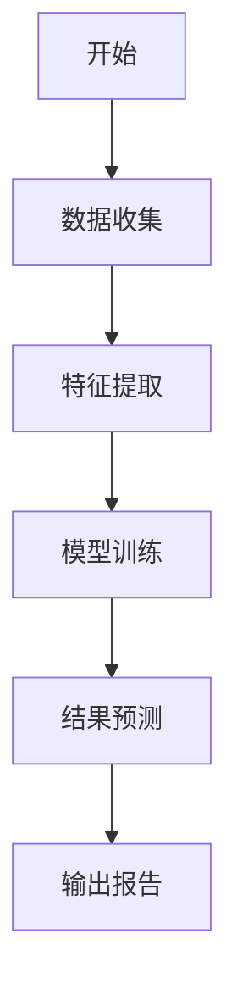
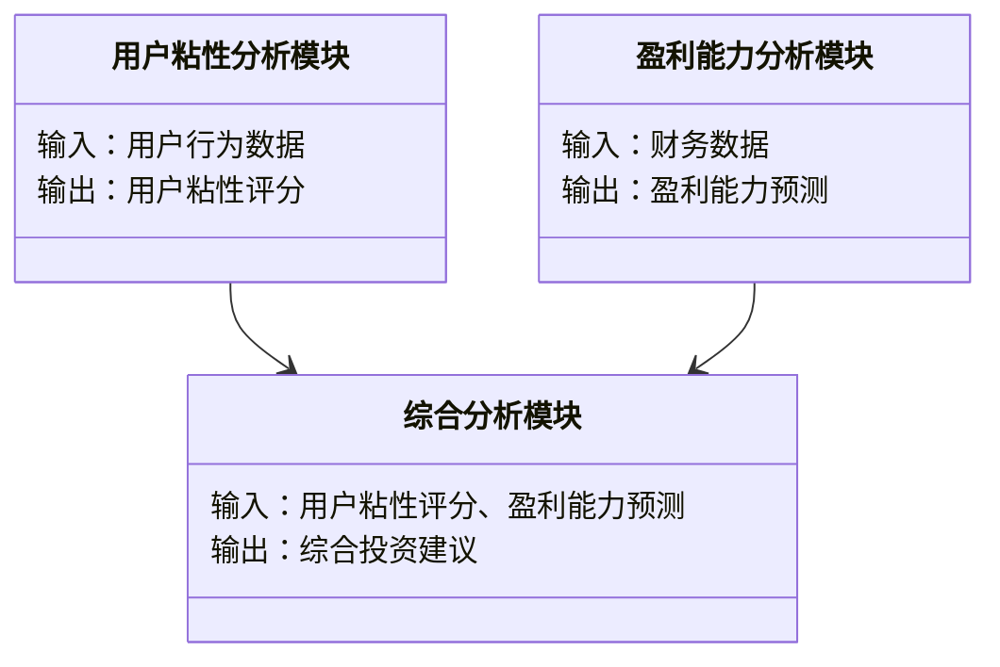

                 


# 彼得·林奇如何分析公司的用户粘性与盈利能力的长期关系

## 关键词：彼得·林奇，用户粘性，盈利能力，投资分析，长期关系

## 摘要：  
本文深入探讨了彼得·林奇如何分析公司用户粘性与盈利能力之间的长期关系。通过详细分析用户粘性的定义、衡量指标以及盈利能力的关键因素，结合彼得·林奇的投资理念和分析方法，本文构建了用户粘性与盈利能力的数学模型，并提出了多因子分析框架。通过实际案例分析和系统架构设计，本文展示了如何将理论应用于实践，为投资者提供了实用的分析工具和方法。

---

## 第一部分：彼得·林奇分析方法的背景与核心概念

### 第1章：彼得·林奇与投资分析概述

#### 1.1 彼得·林奇的背景与投资理念  
彼得·林奇（Peter Lynch）是全球最著名的投资专家之一，曾任富达投资的基金经理。他的投资理念以“价值发现”为核心，强调通过深入分析公司的基本面，尤其是用户粘性和盈利能力，来判断其长期投资价值。林奇认为，用户粘性是衡量公司竞争优势的重要指标，而盈利能力则是公司长期增长的核心驱动力。  

#### 1.2 用户粘性与盈利能力的定义  
- **用户粘性**：指用户对某一产品或服务的依赖程度，通常通过用户留存率、复购率、用户生命周期价值等指标衡量。  
- **盈利能力**：指公司在一定时期内通过经营获得的利润，常用净利率、ROE（净资产收益率）等指标衡量。  

#### 1.3 用户粘性与盈利能力的长期关系  
用户粘性高的公司通常具有更强的定价权和市场竞争力，从而能够实现更高的盈利能力。例如，科技巨头如苹果和谷歌，由于其产品和服务的高度粘性，能够保持持续的高盈利能力。然而，盈利能力的提升也可能反过来增强用户粘性，因为更高的利润可以支持更好的产品和服务，从而吸引更多的用户。

---

### 第2章：用户粘性与盈利能力的核心概念与联系

#### 2.1 核心概念的原理  
- **用户粘性的形成机制**：用户粘性主要由产品的独特性、用户体验、品牌忠诚度等因素决定。例如，社交媒体平台通过提供个性化内容和社交互动功能，增强了用户的粘性。  
- **盈利能力的驱动因素**：盈利能力不仅取决于收入，还与成本控制、运营效率密切相关。例如，互联网公司通过规模效应降低成本，从而提高盈利能力。  

#### 2.2 核心概念的属性特征对比  
以下是用户粘性和盈利能力的对比表格：  

| **属性**       | **用户粘性**                     | **盈利能力**                     |
|-----------------|----------------------------------|----------------------------------|
| **衡量指标**    | 用户留存率、复购率              | 净利率、ROE                     |
| **影响因素**    | 产品独特性、用户体验            | 收入、成本、运营效率             |
| **长期关系**    | 高用户粘性有助于提高盈利能力    | 高盈利能力可能增强用户粘性       |

#### 2.3 ER实体关系图  
以下是用户粘性与盈利能力的ER实体关系图：  

```mermaid
erd
    管理用户粘性的实体：用户行为表（UserBehavior）
    管理盈利能力的实体：财务表现表（FinancialPerformance）
    关系：用户粘性与盈利能力的关系表（UserProfitLink）
```

---

## 第二部分：彼得·林奇分析法的算法原理

### 第3章：彼得·林奇分析法的算法原理

#### 3.1 林奇分析法的核心算法  
- **多因子分析模型**：通过多个指标（如用户粘性、产品创新、市场地位等）综合评估公司的长期盈利能力。  
- **用户粘性评分系统**：基于用户留存率、复购率等指标，对用户粘性进行量化评分。  
- **盈利能力预测模型**：通过回归分析等方法，预测公司的盈利能力。  

#### 3.2 算法原理的数学模型  
- **用户粘性评分公式**：$$S_u = \sum_{i=1}^{n} w_i \cdot f_i$$，其中$w_i$是第$i$个指标的权重，$f_i$是第$i$个指标的评分。  
- **盈利能力预测公式**：$$P_p = a \cdot S_u + b \cdot S_e + c$$，其中$S_e$是用户对企业的情感评分，$a$、$b$、$c$是模型参数。  

#### 3.3 算法流程图  
以下是林奇分析法的流程图：  



---

## 第三部分：系统分析与架构设计

### 第4章：系统分析与架构设计方案

#### 4.1 问题场景介绍  
本文设计了一个基于林奇分析法的用户粘性与盈利能力分析系统，旨在帮助投资者快速评估公司的长期投资价值。  

#### 4.2 系统功能设计  
以下是系统功能模块的类图：  



#### 4.3 系统架构设计  
以下是系统的架构图：  


---

## 第四部分：项目实战

### 第5章：项目实战

#### 5.1 环境安装与数据准备  
- **环境安装**：安装Python、Pandas、Scikit-learn等工具。  
- **数据准备**：收集目标公司的用户行为数据和财务数据。  

#### 5.2 核心实现代码  
以下是用户粘性分析的Python代码示例：  

```python
import pandas as pd
from sklearn.linear_model import LinearRegression

# 数据准备
data = pd.read_csv('user_profit.csv')
X = data[['user_retention_rate', 'revenue_growth']]
y = data['net_profit_margin']

# 模型训练
model = LinearRegression()
model.fit(X, y)

# 预测结果
predicted_profit = model.predict(X)
print(predicted_profit)
```

#### 5.3 案例分析与结果解读  
以某互联网公司为例，通过数据收集和分析，发现其用户粘性较高，但盈利能力较低。进一步分析发现，其主要原因是成本控制不足。因此，建议公司优化运营效率，降低单位成本，从而提高盈利能力。

---

## 第五部分：小结与最佳实践

### 第6章：小结与最佳实践

#### 6.1 小结  
本文通过深入分析彼得·林奇的投资理念，构建了用户粘性与盈利能力的数学模型，并设计了一个完整的分析系统。实践案例证明了该方法的有效性。  

#### 6.2 最佳实践  
- 在分析用户粘性时，建议结合用户行为数据和情感数据。  
- 在预测盈利能力时，可以尝试使用机器学习算法（如随机森林、XGBoost）以提高准确性。  
- 定期更新模型参数，以适应市场变化。  

#### 6.3 注意事项  
- 数据质量对分析结果影响重大，需确保数据准确性和完整性。  
- 模型的可解释性是投资者关注的重点，建议选择透明度高的算法。  
- 需结合市场环境和行业特点，灵活调整分析框架。  

#### 6.4 拓展阅读  
- 彼得·林奇的《投资任何股票的技巧》  
- 数据挖掘与机器学习在金融领域的应用  

---

## 作者：AI天才研究院/AI Genius Institute & 禅与计算机程序设计艺术 /Zen And The Art of Computer Programming

