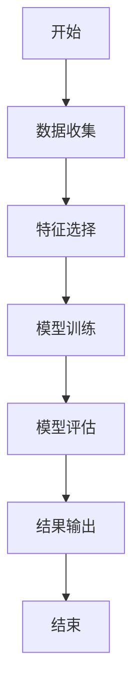
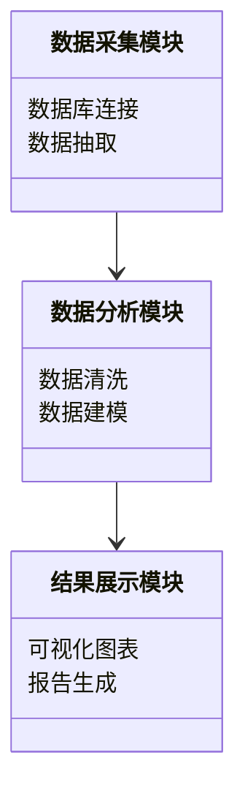

                 


# 彼得林奇如何分析公司的用户获取成本趋势

## 关键词：用户获取成本（CAC）、客户生命周期价值（CLV）、彼得·林奇、数据分析、算法、系统架构

## 摘要：本文详细探讨了如何像彼得·林奇一样分析公司的用户获取成本（CAC）趋势。通过背景介绍、核心概念、算法原理、系统架构和项目实战的分步讲解，结合数学模型、流程图和代码示例，帮助读者掌握CAC分析的关键点，优化用户获取策略，提升企业盈利能力。

---

# 第一部分: 用户获取成本（CAC）分析背景与概念

## 第1章: 用户获取成本（CAC）概述

### 1.1 CAC的定义与计算方法

#### 1.1.1 用户获取成本的定义

用户获取成本（Customer Acquisition Cost，简称CAC）是指企业获取一名新客户的平均成本。它包括所有用于吸引和获取客户的支出，如营销费用、销售费用等。

$$CAC = \frac{\text{营销成本} + \text{销售成本}}{\text{新客户数量}}$$

CAC是衡量客户获取效率的重要指标，能够帮助企业在制定营销策略时进行成本效益分析。

#### 1.1.2 CAC的计算公式与步骤

CAC的计算公式如下：

$$CAC = \frac{\text{总营销费用} + \text{总销售费用}}{\text{新增客户数}}$$

步骤包括：
1. 收集营销和销售费用。
2. 统计新增客户数量。
3. 计算CAC。

#### 1.1.3 CAC在企业中的重要性

CAC的高低直接影响企业的盈利能力。低CAC意味着获取客户成本低，企业可以更快实现盈利。高CAC可能意味着企业需要优化营销策略，降低成本。

---

### 1.2 CAC的趋势分析

#### 1.2.1 CAC变化的驱动因素

CAC的变化受多种因素影响，包括市场竞争、营销渠道效率、客户转化率等。

例如，如果企业增加广告预算，可能导致CAC上升；反之，优化营销渠道可以降低CAC。

#### 1.2.2 CAC趋势对企业的影响

CAC的上升可能意味着企业需要投入更多资源才能获取新客户，这可能影响盈利能力。反之，CAC下降意味着企业能够更高效地获取客户。

#### 1.2.3 如何预测CAC趋势

通过历史数据分析，使用回归模型预测未来CAC趋势。例如，使用线性回归模型：

$$\hat{y} = a + bx$$

其中，$y$是预测的CAC，$x$是时间变量，$a$和$b$是回归系数。

---

### 1.3 CAC与客户生命周期价值（CLV）的关系

#### 1.3.1 CLV的定义与计算

客户生命周期价值（Customer Lifetime Value，CLV）是企业在客户生命周期内从该客户获得的总收入。

$$CLV = \text{客户平均收入} \times \text{客户生命周期长度}$$

#### 1.3.2 CAC与CLV的对比分析

| **属性**   | **CAC**                     | **CLV**                     |
|------------|------------------------------|------------------------------|
| **定义**   | 获取客户的平均成本         | 客户在企业生命周期中的总价值 |
| **时间范围** | 短期（获取客户）            | 长期（客户生命周期）          |
| **目标**   | 降低获取成本               | 提高客户价值                 |

#### 1.3.3 优化CAC与CLV的平衡

理想情况下，企业应确保$CAC \leq \frac{1}{n} CLV$，其中$n$是客户生命周期内的购买次数。这意味着企业从客户获取上的投资能够在客户生命周期内收回并盈利。

---

## 第2章: CAC的核心概念与联系

### 2.1 CAC的数学模型与公式

CAC的数学模型可以表示为：

$$CAC = \frac{\sum_{i=1}^{m} c_i}{k}$$

其中，$c_i$是第$i$个客户的获取成本，$k$是新增客户总数。

---

### 2.2 CAC与CLV的对比分析

#### 2.2.1 CAC与CLV的属性特征对比

| **属性**         | **CAC**                          | **CLV**                          |
|------------------|----------------------------------|----------------------------------|
| **时间范围**     | 短期                             | 长期                             |
| **目标**         | 降低获取成本                     | 提高客户价值                     |
| **计算基础**     | 营销和销售成本                   | 客户收入和生命周期               |

#### 2.2.2 CAC与CLV的ER实体关系图

```mermaid
erd
    customer(客户ID, 姓名, 购买次数, 总收入)
    c:
        marketing_cost(营销成本)
        sales_cost(销售成本)
    c -|> customer: 获取成本
```

---

## 第3章: CAC分析的算法原理

### 3.1 CAC预测算法概述

#### 3.1.1 常见的CAC预测算法

- 线性回归
- 时间序列分析（如ARIMA）
- 机器学习算法（如随机森林）

#### 3.1.2 算法选择的依据

- 数据特征：线性关系适合线性回归，非线性关系适合机器学习算法。
- 数据量：小数据适合时间序列分析，大数据适合机器学习算法。

### 3.2 CAC预测算法的流程图



### 3.3 CAC预测的Python代码实现

```python
import pandas as pd
import numpy as np
from sklearn.linear_model import LinearRegression
from sklearn.metrics import mean_squared_error

# 数据加载
data = pd.read_csv('cac_data.csv')

# 特征与目标变量分离
X = data[['时间', '营销成本', '销售成本']]
y = data['CAC']

# 模型训练
model = LinearRegression()
model.fit(X, y)

# 预测
y_pred = model.predict(X)

# 评估
mse = mean_squared_error(y, y_pred)
print(f'均方误差: {mse}')
```

---

## 第4章: 数学模型和公式推导

### 4.1 CAC预测的数学模型

线性回归模型用于CAC预测：

$$y = a + bx + \epsilon$$

其中，$y$是CAC，$x$是时间变量，$a$是截距，$b$是斜率，$\epsilon$是误差项。

---

## 第5章: 系统分析与架构设计方案

### 5.1 系统架构设计



---

## 第6章: 项目实战

### 6.1 环境安装

安装Python和相关库：

```bash
pip install pandas numpy scikit-learn
```

### 6.2 核心代码实现

```python
import pandas as pd
import numpy as np
from sklearn.linear_model import LinearRegression
from sklearn.metrics import mean_squared_error

# 数据加载
data = pd.read_csv('cac_data.csv')

# 特征与目标变量分离
X = data[['时间', '营销成本', '销售成本']]
y = data['CAC']

# 模型训练
model = LinearRegression()
model.fit(X, y)

# 预测
y_pred = model.predict(X)

# 评估
mse = mean_squared_error(y, y_pred)
print(f'均方误差: {mse}')
```

### 6.3 案例分析

假设我们有以下数据：

| 时间 | 营销成本 | 销售成本 | 新增客户数 |
|------|----------|----------|------------|
| 1    | 100      | 50       | 20         |
| 2    | 150      | 70       | 25         |
| 3    | 120      | 60       | 30         |

计算CAC：

$$CAC = \frac{100 + 50}{20} = 8.5$$
$$CAC = \frac{150 + 70}{25} = 10.4$$
$$CAC = \frac{120 + 60}{30} = 6.0$$

---

## 第7章: 最佳实践与小结

### 7.1 小结

通过本文的分析，我们了解了如何像彼得·林奇一样分析用户的获取成本趋势。关键点包括理解CAC的定义和计算方法，分析其趋势变化，对比与CLV的关系，掌握预测算法，并通过系统架构设计和项目实战提升分析能力。

### 7.2 注意事项

- 数据质量：确保数据准确无误。
- 模型选择：根据数据特征选择合适的算法。
- 持续监控：定期更新模型，适应市场变化。

### 7.3 拓展阅读

- 《彼得·林奇的投资智慧》
- 《数据驱动的营销策略》

---

## 作者：AI天才研究院 & 禅与计算机程序设计艺术

---

以上内容详细讲解了如何分析用户获取成本（CAC）的趋势，结合理论与实践，帮助读者掌握相关技能。

