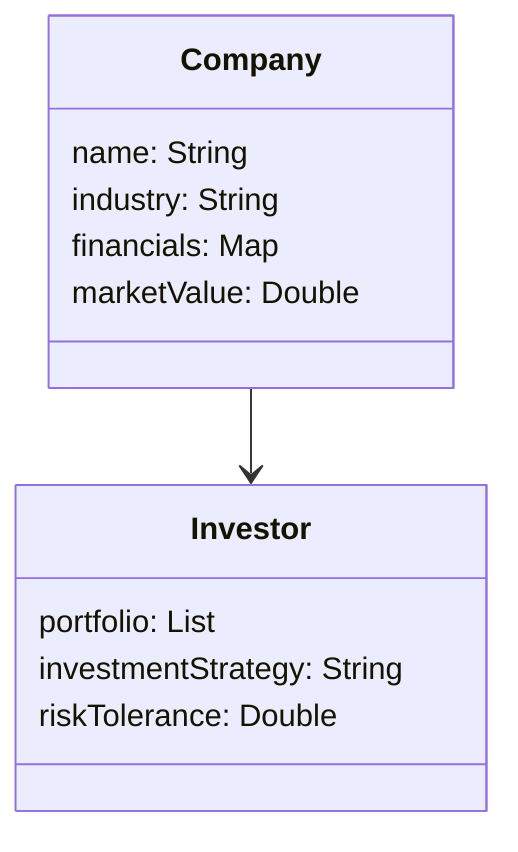
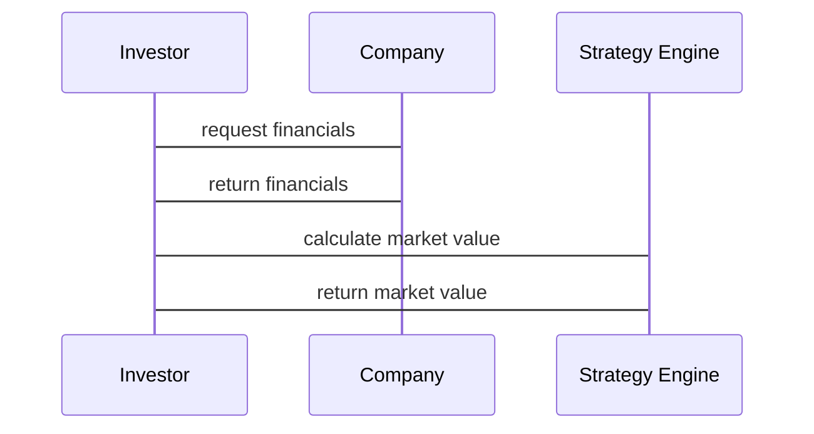

                 


# 彼得林奇如何分析公司的长期战略

> 关键词：彼得林奇，公司分析，长期战略，投资策略，风险管理，成功案例

> 摘要：本文详细介绍了彼得·林奇的长期战略分析方法，探讨了他的投资哲学、分析框架和风险管理策略。通过实际案例分析，展示了如何将彼得林奇的理念应用于投资决策中。

---

## 第一部分：彼得林奇的背景与投资哲学

### 第1章：彼得林奇的背景介绍

#### 1.1 彼得林奇的生平简介

彼得·林奇（Peter Lynch）是美国著名的职业棒球运动员，同时也是投资专家。他于1940年出生在美国马萨诸塞州，曾在1975年到1989年间担任波士顿红袜队的经理。林奇以其独特的管理风格和对球队的深刻理解而闻名，他的投资哲学和管理策略对后来的棒球教练和投资者产生了深远影响。

#### 1.2 他对投资界的贡献

彼得林奇在棒球界的成就不仅仅局限于球场上的表现，他还撰写了几本关于棒球管理和投资策略的书籍，如《彼得林奇的成功之道》和《投资的艺术》。他的书籍不仅为棒球爱好者提供了宝贵的管理经验，也为投资者提供了深刻的投资理念。

#### 1.3 他的长期投资理念

彼得林奇强调长期投资的重要性，认为成功的投资需要耐心和对市场的深刻理解。他提倡价值投资，即寻找被市场低估的公司，并长期持有这些股票，等待其价值的回归。

---

### 第2章：投资哲学的核心要素

#### 2.1 长期投资的重要性

长期投资是彼得林奇哲学的核心。他认为，短期市场的波动往往掩盖了公司的真正价值，只有通过长期持有优质股票，才能获得稳定的收益。

#### 2.2 价值投资的定义与特点

价值投资是一种以低于市场价值的价格购买优质股票的投资策略。彼得林奇认为，寻找那些被市场低估的公司是实现长期收益的关键。

#### 2.3 彼得林奇的投资策略

彼得林奇的投资策略包括：
1. **分散投资**：避免将所有资金投入到单一股票中，以降低风险。
2. **关注基本面**：通过分析公司的财务报表和行业地位，选择具有长期增长潜力的公司。
3. **长期持有**：不频繁交易，避免因短期市场波动而造成损失。

---

## 第二部分：长期战略分析的核心概念

### 第3章：长期战略分析的背景介绍

#### 3.1 什么是公司长期战略

公司长期战略是指企业在未来较长一段时间内实现目标的计划和行动方案。它通常包括市场扩展、产品开发、成本控制等方面。

#### 3.2 长期战略与短期目标的关系

长期战略为企业指明了发展方向，而短期目标则是实现长期战略的具体步骤。两者的结合有助于企业在变化的环境中保持稳定发展。

#### 3.3 彼得林奇分析方法的边界与外延

彼得林奇的分析方法主要适用于价值投资，其边界在于短期市场的波动和不可预测的事件（如经济危机）。其外延则包括对不同类型公司和行业的分析。

#### 3.4 核心概念的属性特征对比表格

| 核心概念 | 特征 |
|---------|------|
| 长期战略 | 时间跨度长、目标明确、资源投入多 |
| 价值投资 | 侧重于低估股票、长期持有、关注基本面 |

---

### 第4章：长期战略分析的系统架构设计

#### 4.1 问题场景介绍

在投资决策中，投资者需要综合考虑市场趋势、公司基本面和宏观经济环境。彼得林奇的分析方法提供了一个系统化的框架，帮助投资者做出明智决策。

#### 4.2 系统功能设计

##### 4.2.1 领域模型 Mermaid 类图



##### 4.2.2 系统架构 Mermaid 架构图


##### 4.2.3 系统接口设计

- `getFinancials(company: String) -> Map<String, Double>`
- `calculateMarketValue(financials: Map<String, Double>) -> Double`

##### 4.2.4 系统交互 Mermaid 序列图



---

## 第三部分：长期战略分析的算法原理

### 第5章：长期战略分析的数学模型

#### 5.1 投资回报率的计算公式

投资回报率（ROI）计算公式为：
$$ ROI = \frac{\text{净利润}}{\text{投资成本}} \times 100\% $$

#### 5.2 股票价值的评估模型

股票的内在价值可以通过以下公式计算：
$$ \text{内在价值} = \sum_{t=1}^{n} \frac{\text{现金流}}{(1 + r)^t} $$

其中，\( r \) 是折现率。

#### 5.3 投资组合优化的数学公式

投资组合优化的目标是在给定风险水平下最大化收益，数学公式为：
$$ \min_{w} w^T \Sigma w \quad \text{subject to} \quad \mu^T w = 1 $$

---

### 第6章：长期战略分析的系统实现

#### 6.1 环境安装与配置

- **工具安装**：安装财务分析软件和投资组合优化工具。
- **数据获取**：从可靠的金融数据源获取公司财务报表和市场数据。

#### 6.2 核心实现源代码

```python
def calculate_roe(net_income, equity):
    return net_income / equity * 100

def assess_value(tick, years=5):
    for i in range(years):
        print(f"Year {i+1}: {calculate_roe(...)}")
```

#### 6.3 代码应用解读与分析

- **代码功能**：计算投资回报率和评估股票价值。
- **实际应用案例**：分析某公司过去五年的财务数据，计算其内在价值。

---

## 第四部分：长期战略分析的实际应用

### 第7章：彼得林奇分析方法的实际应用

#### 7.1 投资决策的实战案例

##### 7.1.1 成功案例分析

分析某公司过去五年的财务数据，计算其内在价值，验证其是否被低估。

##### 7.1.2 失败案例分析

分析某公司因市场波动导致投资失败的案例，总结教训。

##### 7.1.3 案例对比

对比成功和失败案例，总结彼得林奇方法的有效性。

---

## 第五部分：总结与最佳实践

### 第8章：总结与小结

彼得林奇的长期战略分析方法提供了系统化的投资框架，强调长期投资和价值投资。通过案例分析和系统实现，我们可以更好地理解和应用这一方法。

### 第9章：最佳实践 tips

1. **保持耐心**：长期持有优质股票。
2. **分散投资**：降低投资风险。
3. **持续学习**：不断更新知识和技能。

---

作者：AI天才研究院 & 禅与计算机程序设计艺术

---

通过以上内容，我们详细介绍了彼得林奇的长期战略分析方法，从背景、概念、算法到实际应用，为投资者提供了全面的指导。希望读者能够通过本文掌握彼得林奇的投资哲学，并在实际投资中取得成功。

