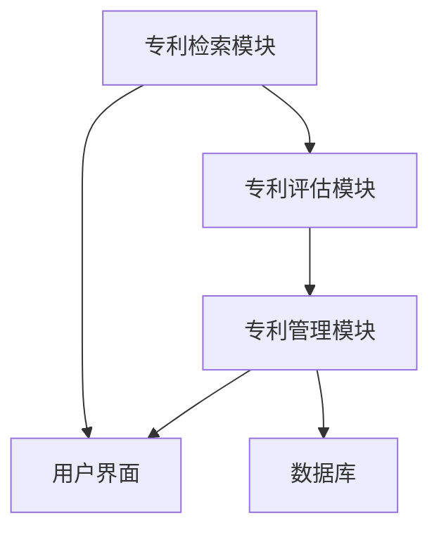
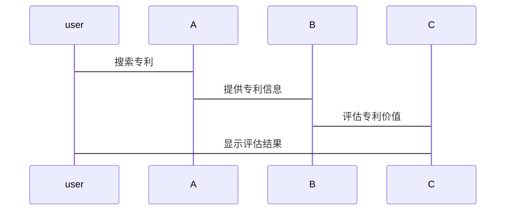

                 


```markdown
# 彼得林奇如何看待公司的专利组合战略

## 关键词：专利组合战略，彼得林奇，投资理念，知识产权管理，企业战略，专利布局

## 摘要：本文从彼得林奇的投资理念出发，探讨专利组合战略在企业中的重要性，分析其核心要素、制定步骤、评估方法，结合实际案例，提供系统的战略实施建议，为企业制定和优化专利组合战略提供深度见解。

---

## 第1章：专利组合战略概述

### 1.1 专利组合战略的基本概念
#### 1.1.1 专利组合的定义与内涵
- 专利组合的定义
- 专利组合的核心特征：技术多样性、地域覆盖、时间跨度
- 专利组合的分类：防御型、进攻型、平衡型

#### 1.1.2 专利组合战略的背景与重要性
- 知识产权保护的重要性
- 专利组合战略在企业竞争中的作用
- 专利组合与企业长期发展的关系

### 1.2 彼得林奇与专利组合战略
#### 1.2.1 彼得林奇的投资理念
- 长期价值投资的核心观点
- 价值发现与风险控制
- 股票分析与投资决策的逻辑

#### 1.2.2 彼得林奇与专利组合战略的关联
- 投资理念对企业专利管理的启示
- 专利组合的长期价值与投资回报的联系
- 风险分散与专利组合优化的相似性

---

## 第2章：专利组合战略的核心要素

### 2.1 专利组合的构成
#### 2.1.1 技术领域选择
- 核心技术领域的识别
- 边缘技术领域的布局
- 技术预见与未来趋势分析

#### 2.1.2 专利数量与质量
- 专利数量与企业竞争力的关系
- 专利质量的评估标准：创新性、保护范围、法律稳定性
- 数量与质量的平衡策略

#### 2.1.3 地域分布与全球化布局
- 主要市场的专利覆盖策略
- 区域性专利制度的差异分析
- 全球专利组合的构建与管理

### 2.2 专利组合的战略目标
#### 2.2.1 技术领先目标
- 通过专利布局实现技术垄断
- 技术预见与专利储备的策略

#### 2.2.2 市场竞争目标
- 专利组合在市场竞争中的作用
- 通过专利组合建立市场壁垒

#### 2.2.3 法律保护目标
- 专利组合在法律诉讼中的防御与进攻作用
- 如何通过专利组合降低法律风险

---

## 第3章：专利组合战略的制定与实施

### 3.1 专利组合战略的制定步骤
#### 3.1.1 确定战略目标
- 企业战略目标与专利组合的关系
- 如何将企业战略转化为专利组合目标

#### 3.1.2 识别核心专利技术
- 核心技术的识别方法
- 技术评估与筛选标准
- 专利检索与分析工具的使用

#### 3.1.3 制定专利布局策略
- 技术领域布局的规划
- 时间跨度与专利有效期的协调
- 地域覆盖的策略选择

### 3.2 专利组合战略的实施方法
#### 3.2.1 技术研发与专利申请
- 研发阶段的专利管理
- 如何将研发成果转化为专利资产
- 专利申请的流程与注意事项

#### 3.2.2 专利收购与合作
- 通过收购获取关键专利
- 专利合作的战略意义
- 合作伙伴的选择与管理

#### 3.2.3 专利维护与管理
- 专利维护的周期性与成本控制
- 专利组合的动态调整
- 专利信息的管理和利用

---

## 第4章：彼得林奇视角下的专利组合战略分析

### 4.1 彼得林奇的投资逻辑与专利组合战略的联系
#### 4.1.1 长期价值投资理念对专利管理的启示
- 专利资产的长期价值评估
- 如何通过专利组合实现企业价值最大化

#### 4.1.2 风险分散与专利组合优化
- 专利组合的风险管理
- 如何通过组合优化降低投资风险

#### 4.1.3 市场动向与专利布局
- 市场变化对专利组合的影响
- 如何根据市场趋势调整专利布局

### 4.2 彼得林奇对专利组合战略的启示
#### 4.2.1 高质量专利的重要性
- 专利质量评估标准
- 高质量专利对企业竞争力的提升作用

#### 4.2.2 风险控制与专利组合优化
- 通过组合优化降低法律风险
- 如何在专利组合中实现风险分散

#### 4.2.3 长期视角下的专利战略
- 长期规划与专利组合的动态调整
- 如何通过长期布局实现企业战略目标

---

## 第5章：专利组合战略的评估与优化

### 5.1 专利组合的评估方法
#### 5.1.1 专利质量评估
- 专利质量的多维度评估指标
- 如何通过评估指标筛选核心专利

#### 5.1.2 专利组合的竞争力分析
- 与竞争对手的专利对比分析
- 专利组合的市场竞争力评估

#### 5.1.3 专利组合的风险评估
- 法律风险的评估与管理
- 技术风险的识别与应对

### 5.2 专利组合的优化策略
#### 5.2.1 动态调整策略
- 根据市场变化调整专利布局
- 如何在专利组合中实现动态平衡

#### 5.2.2 高效管理策略
- 专利组合的数字化管理工具
- 知识管理系统在专利管理中的应用

#### 5.2.3 持续创新策略
- 通过技术创新扩展专利组合
- 创新与专利布局的协同效应

---

## 第6章：系统分析与架构设计

### 6.1 系统功能设计
#### 6.1.1 专利检索模块
- 多维度专利检索功能
- 专利信息的分类与存储

#### 6.1.2 专利评估模块
- 专利质量评估算法
- 评估结果的可视化展示

#### 6.1.3 专利管理模块
- 组合管理功能
- 动态调整与优化工具

### 6.2 系统架构设计
#### 6.2.1 系统架构图


#### 6.2.2 系统交互序列图


---

## 第7章：项目实战：专利组合战略的制定与实施

### 7.1 实战背景
- 某科技公司面临的技术挑战
- 专利组合战略的制定需求

### 7.2 实战步骤
#### 7.2.1 专利检索与分析
- 使用专利检索工具进行技术分析
- 竞争对手专利布局分析

#### 7.2.2 专利组合的制定
- 核心技术领域的确定
- 专利布局策略的制定

#### 7.2.3 实施与监控
- 专利申请与维护
- 定期评估与优化

### 7.3 实战结果
- 专利组合的实施效果
- 对企业竞争力的提升作用

---

## 第8章：总结与展望

### 8.1 总结
- 专利组合战略的核心要素与实施步骤
- 彼得林奇投资理念对企业专利管理的启示

### 8.2 展望
- 人工智能与专利组合管理的结合
- 未来专利组合战略的发展趋势

### 8.3 注意事项
- 专利组合战略的风险控制
- 如何平衡专利数量与质量

### 8.4 最佳实践 Tips
- 定期评估与优化
- 利用数字化工具提高管理效率

---

## 作者：AI天才研究院/AI Genius Institute & 禅与计算机程序设计艺术 /Zen And The Art of Computer Programming
```

