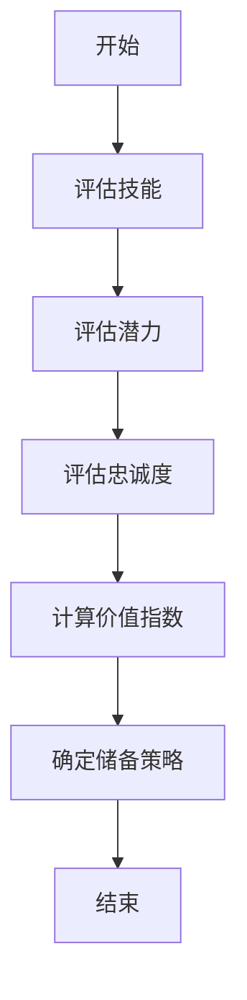
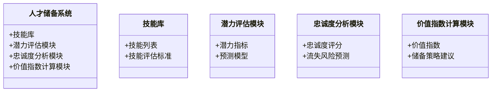
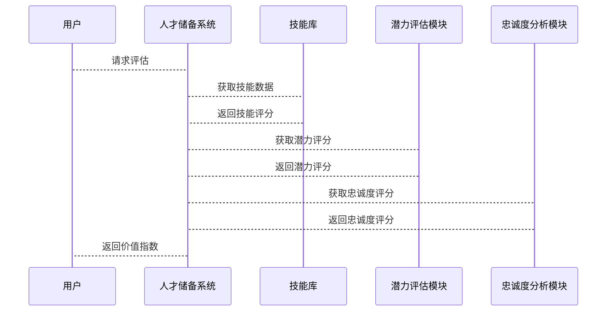

                 


# 彼得林奇如何看待公司的人才储备策略

## 关键词：彼得林奇、人才储备、公司战略、投资理念、人才管理

## 摘要：本文从彼得林奇的投资理念出发，探讨公司人才储备策略的重要性、实施方法及其与企业战略的关系。通过分析核心概念、算法模型和实际案例，提供切实可行的建议，帮助企业在数字化时代优化人才储备策略。

---

## 目录大纲：

### 第一部分：引言

### 第二部分：人才储备策略的背景

### 第三部分：人才储备策略的核心概念

### 第四部分：数学模型与算法原理

### 第五部分：系统架构与实施框架

### 第六部分：项目实战与案例分析

### 第七部分：最佳实践与总结

---

## 第一部分：引言

### # 第1章：引言

#### 1.1 书籍的目的与重要性

- 1.1.1 为什么人才储备策略至关重要
- 1.1.2 彼得林奇的视角与投资理念
- 1.1.3 当前人才市场的挑战与机遇

---

## 第二部分：人才储备策略的背景

### # 第2章：人才储备策略的重要性

#### 2.1 人才储备的定义与核心要素

- 2.1.1 人才储备的定义
- 2.1.2 核心要素：技能、潜力、忠诚度
- 2.1.3 人才储备与公司战略的关系

#### 2.2 彼得林奇的投资理念与人才储备

- 2.2.1 投资理念的核心：寻找优秀企业
- 2.2.2 人才储备与企业价值的关系
- 2.2.3 彼得林奇对人才储备的见解

#### 2.3 当前人才市场的现状与趋势

- 2.3.1 数字化转型对人才的需求
- 2.3.2 竞争加剧与人才储备的压力
- 2.3.3 未来人才储备的趋势

---

## 第三部分：人才储备策略的核心概念

### # 第3章：人才储备策略的关键要素

#### 3.1 核心概念与联系

- 3.1.1 人才储备策略的定义
- 3.1.2 关键要素对比表格
- 3.1.3 ER实体关系图

#### 3.2 算法原理

- 3.2.1 人才价值评估模型
- 3.2.2 用 Mermaid 绘制算法流程图
- 3.2.3 数学模型与公式推导

---

## 第四部分：数学模型与算法原理

### # 第4章：数学模型与公式

#### 4.1 人才价值评估模型

- 4.1.1 模型定义：$$V = aS + bP + cL$$
  - $$S$$：技能水平
  - $$P$$：潜力评估
  - $$L$$：忠诚度
  - $$a$$、$$b$$、$$c$$：权重系数

- 4.1.2 案例分析：计算某员工的价值指数

#### 4.2 用 Mermaid 绘制算法流程图



#### 4.3 数学模型的详细推导

- 4.3.1 技能与潜力的权重调整
- 4.3.2 忠诚度对长期价值的影响
- 4.3.3 示例：假设$$a=0.5$$，$$b=0.3$$，$$c=0.2$$，计算员工价值指数

---

## 第五部分：系统架构与实施框架

### # 第5章：系统架构与实施框架

#### 5.1 问题场景介绍

- 5.1.1 数字化转型中的人才需求
- 5.1.2 竞争环境下的储备压力

#### 5.2 项目介绍

- 5.2.1 项目目标：优化人才储备策略
- 5.2.2 项目范围：涵盖技能评估、潜力预测、忠诚度分析
- 5.2.3 项目关键成功因素：数据驱动、动态调整

#### 5.3 系统功能设计

- 5.3.1 领域模型：Mermaid类图


#### 5.4 系统架构设计

- 5.4.1 架构图：Mermaid架构图


#### 5.5 系统接口设计

- 5.5.1 接口描述：API接口用于数据交互
- 5.5.2 接口示例：RESTful API调用

#### 5.6 系统交互设计

- 5.6.1 序列图：Mermaid序列图


---

## 第六部分：项目实战与案例分析

### # 第6章：项目实战与案例分析

#### 6.1 环境安装

- 6.1.1 安装Python和必要的库（如pandas、numpy）
- 6.1.2 安装Mermaid CLI工具

#### 6.2 系统核心实现源代码

```python
# 人才价值评估模型
def calculate_value_index(skills, potential, loyalty):
    return 0.5 * skills + 0.3 * potential + 0.2 * loyalty

# 数据处理
import pandas as pd

# 示例数据
data = {
    '员工': ['A', 'B', 'C'],
    '技能': [85, 90, 88],
    '潜力': [70, 80, 75],
    '忠诚度': [90, 85, 88]
}

df = pd.DataFrame(data)
df['价值指数'] = df.apply(lambda x: calculate_value_index(x['技能'], x['潜力'], x['忠诚度']), axis=1)

print(df)
```

#### 6.3 代码应用解读与分析

- 6.3.1 代码功能：计算每个员工的价值指数
- 6.3.2 应用场景：基于价值指数调整储备策略
- 6.3.3 实际案例分析：假设某公司员工的数据，计算并调整储备策略

---

## 第七部分：最佳实践与总结

### # 第7章：最佳实践与总结

#### 7.1 总结

- 7.1.1 人才储备策略的核心要点
- 7.1.2 彼得林奇视角的独特见解
- 7.1.3 实施策略的关键成功因素

#### 7.2 最佳实践 tips

- 7.2.1 数据驱动决策的重要性
- 7.2.2 动态调整策略的必要性
- 7.2.3 建立长期培养机制

#### 7.3 注意事项

- 7.3.1 避免过于依赖单一指标
- 7.3.2 确保数据的准确性和及时性
- 7.3.3 考虑员工的职业发展路径

#### 7.4 拓展阅读

- 7.4.1 推荐书籍：彼得林奇的《选股的艺术》
- 7.4.2 相关研究：人才管理领域的最新研究成果

---

## 作者：AI天才研究院/AI Genius Institute & 禅与计算机程序设计艺术/Zen And The Art of Computer Programming

---

这篇博客文章系统地分析了彼得林奇如何看待公司的人才储备策略，结合了投资理念、数学模型和实际案例，为读者提供了深入的理论支持和实用的实施方法。通过详细的内容和清晰的结构，帮助读者更好地理解和应用人才储备策略，从而提升企业的竞争力。

