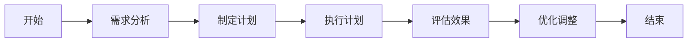
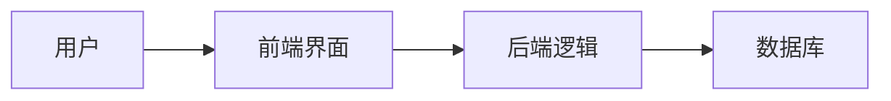
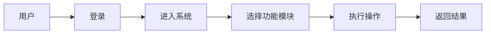

                 


# 彼得林奇如何看待公司的人才培养与保留策略

> 关键词：彼得·林奇，人才培养，人才保留，公司策略，人才管理系统，员工发展，绩效管理

> 摘要：本文从彼得·林奇的管理理念出发，结合现代企业的人才培养与保留策略，深入分析了人才管理的核心概念、系统设计、算法原理和项目实战。通过详细的技术分析和案例研究，探讨了如何构建高效的人才管理系统，确保企业在激烈的人才竞争中占据优势。

---

# 第一部分: 人才管理的核心理念与背景

## 第1章: 人才管理的核心概念与背景

### 1.1 人才管理的重要性

#### 1.1.1 企业发展的核心要素
企业的成功离不开人才，人才是企业发展的核心驱动力。彼得·林奇曾说过：“企业最重要的资产是人。”在当今竞争激烈的市场环境中，企业需要通过科学的人才管理策略来吸引、培养和保留优秀员工，从而实现可持续发展。

#### 1.1.2 人才管理在企业中的地位
人才管理不仅仅是人力资源部门的工作，而是企业战略的重要组成部分。有效的 talent management（人才管理）能够提升员工的绩效，增强团队的协作能力，从而推动企业的整体发展。

#### 1.1.3 彼得·林奇的管理理念
彼得·林奇作为著名的投资经理，他的管理理念强调长期投资、价值创造和团队合作。他的管理风格注重员工的培养与发展，认为员工的成功是企业的成功。

### 1.2 人才培养与保留的背景

#### 1.2.1 当前人才市场的竞争态势
随着经济全球化和技术的进步，人才市场的竞争日益激烈。企业需要不断创新人才管理策略，以吸引和保留优秀员工。特别是在科技行业，人才的流动性高，企业需要采取更有针对性的措施来留住人才。

#### 1.2.2 企业人才战略的演变
传统的人才管理注重员工的招聘和培训，而现代企业更注重员工的全面发展和职业规划。企业通过提供个性化的职业发展路径和丰富的培训资源，增强员工的忠诚度和归属感。

#### 1.2.3 彼得·林奇的管理实践
彼得·林奇在管理中注重员工的长期发展，他通过提供晋升机会、绩效奖励和良好的工作环境，吸引和保留优秀员工。他的管理实践为现代企业的人才管理提供了宝贵的经验。

### 1.3 人才管理的核心问题

#### 1.3.1 人才流失的挑战
人才流失是企业面临的一个重要问题，尤其是在高科技行业。员工的流失不仅会导致企业的经济损失，还会影响团队的稳定性。如何通过有效的管理策略减少人才流失，是企业需要解决的重要问题。

#### 1.3.2 人才培养的难点
人才培养需要时间和资源的投入，企业在有限的资源下，如何制定科学的人才培养计划，是一个重要的挑战。彼得·林奇的经验表明，企业需要通过系统的培训和实践，提升员工的能力。

#### 1.3.3 企业与员工的双赢模式
企业需要通过合理的薪酬、福利和职业发展机会，实现与员工的双赢。彼得·林奇认为，企业应该关注员工的职业发展，为员工提供实现自我价值的平台。

### 1.4 本章小结
本章从人才管理的重要性、背景和核心问题三个方面，探讨了人才管理在企业中的地位和作用。通过彼得·林奇的管理理念，分析了现代企业人才管理的挑战和机遇。

---

## 第2章: 人才管理的核心模型与框架

### 2.1 人才管理的系统模型

#### 2.1.1 人才管理的核心要素
人才管理的系统模型包括以下几个核心要素：
- 员工人选（Employee Selection）
- 员工培训（Employee Training）
- 绩效管理（Performance Management）
- 职业发展（Career Development）
- 员工保留（Employee Retention）

#### 2.1.2 人才管理的系统架构
人才管理的系统架构可以分为以下几个层次：
- 数据层：员工信息的收集与存储
- 业务层：人才管理的业务逻辑
- 应用层：系统的功能模块

#### 2.1.3 人才管理的流程图


### 2.2 人才管理的ER实体关系图

#### 2.2.1 人才管理的核心实体
- 员工（Employee）
- 职位（Position）
- 培训计划（Training Plan）
- 绩效指标（Performance Indicator）

#### 2.2.2 实体之间的关系
- 员工与职位之间的关系：一个员工可以担任多个职位，一个职位可以由多个员工担任。
- 培训计划与员工之间的关系：一个培训计划可以适用于多个员工，一个员工可以参加多个培训计划。
- 绩效指标与员工之间的关系：一个绩效指标可以用于评估多个员工，一个员工可以被多个绩效指标评估。

#### 2.2.3 ER图的详细描述
```mermaid
er
    entity 员工（Employee） {
        员工ID
        姓名
        职位ID
        入职时间
    }
    entity 职位（Position） {
        职位ID
        职位名称
        部门ID
    }
    entity 培训计划（Training Plan） {
        培训计划ID
        培训内容
        培训时间
    }
    entity 绩效指标（Performance Indicator） {
        指标ID
        指标名称
        指标权重
    }
    relation 员工-职位关系（Employee-Position） {
        关系ID
        员工ID
        职位ID
    }
    relation 培训计划-员工关系（Training Plan-Employee） {
        关系ID
        培训计划ID
        员工ID
    }
    relation 绩效指标-员工关系（Performance Indicator-Employee） {
        关系ID
        指标ID
        员工ID
    }
```

### 2.3 人才管理的数学模型

#### 2.3.1 人才流失概率模型
人才流失概率模型可以通过以下公式进行计算：
$$P(\text{流失}) = \frac{\text{流失人数}}{\text{总人数}}$$

#### 2.3.2 人才培养投资回报模型
$$ROI(\text{投资回报}) = \frac{\text{培训后的绩效提升}}{\text{培训成本}}$$

#### 2.3.3 模型的数学公式与解释
- 人才流失概率模型：通过计算员工的流失概率，企业可以更好地预测未来的人才流失情况。
- 人才培养投资回报模型：通过计算培训的投资回报率，企业可以评估培训的效果。

### 2.4 本章小结
本章通过系统模型和ER图，详细分析了人才管理的核心要素和实体关系。同时，通过数学模型，探讨了人才流失概率和投资回报的计算方法。

---

## 第3章: 人才管理的算法原理

### 3.1 人才评估算法

#### 3.1.1 基于KPI的人才评分系统
KPI（关键绩效指标）评分系统是一种常用的人才评估方法。通过设定具体的绩效指标，对企业员工进行评分。

#### 3.1.2 人才潜力预测算法
通过分析员工的历史绩效和能力，预测员工的未来潜力。

#### 3.1.3 算法的数学推导
$$\text{评分} = \sum (\text{指标权重} \times \text{指标得分})$$

### 3.2 人才匹配算法

#### 3.2.1 基于胜任力模型的匹配
胜任力模型是一种通过分析岗位需求，匹配员工的能力和技能。

#### 3.2.2 人才与岗位的最优匹配
通过算法优化，找到最适合的岗位匹配。

### 3.3 人才流失预测算法

#### 3.3.1 基于机器学习的预测模型
使用机器学习算法，如随机森林或支持向量机，预测员工的流失概率。

#### 3.3.2 数据特征提取与处理
对员工的历史数据进行特征提取，如离职率、绩效评分等。

#### 3.3.3 算法的实现与优化
通过交叉验证和网格搜索，优化算法的参数，提高预测准确率。

### 3.4 本章小结
本章通过算法原理，探讨了人才评估、匹配和流失预测的方法。通过数学公式和机器学习算法，帮助企业更好地进行人才管理。

---

## 第4章: 人才管理系统的设计与实现

### 4.1 系统功能设计

#### 4.1.1 人才信息管理模块
- 员工信息的录入与维护
- 员工档案的管理

#### 4.1.2 培训与发展模块
- 培训计划的制定与执行
- 员工发展的评估与反馈

#### 4.1.3 绩效管理模块
- 绩效指标的设定与评估
- 绩效结果的反馈与应用

### 4.2 系统架构设计

#### 4.2.1 系统功能模块
- 前端界面：员工信息录入、培训计划制定、绩效评估
- 后端逻辑：数据处理、算法计算、结果反馈

#### 4.2.2 系统架构图


### 4.3 系统接口设计

#### 4.3.1 API接口设计
- 员工信息接口
- 培训计划接口
- 绩效评估接口

#### 4.3.2 接口调用流程
用户通过前端界面调用API接口，后端逻辑处理请求，数据库存储数据。

### 4.4 系统交互设计

#### 4.4.1 交互流程图


### 4.5 本章小结
本章通过系统设计与实现，详细分析了人才管理系统的功能模块、架构设计和接口设计。通过系统交互流程图，展示了系统的操作流程。

---

## 第5章: 项目实战与案例分析

### 5.1 项目背景与需求分析

#### 5.1.1 项目背景
某科技公司希望通过优化人才管理策略，提升员工的绩效和忠诚度。

#### 5.1.2 项目需求
- 建立员工信息管理系统
- 制定科学的培训计划
- 实施绩效管理

### 5.2 项目环境安装

#### 5.2.1 系统环境
- 操作系统：Windows/Linux
- 开发工具：Python、Java
- 数据库：MySQL、MongoDB

#### 5.2.2 依赖安装
- Python库：Django、Pandas
- Java库：Spring Boot、MyBatis

### 5.3 系统核心代码实现

#### 5.3.1 员工信息管理模块
```python
class Employee:
    def __init__(self, id, name, position, department):
        self.id = id
        self.name = name
        self.position = position
        self.department = department
```

#### 5.3.2 绩效管理模块
```python
def calculate_performance(employee, indicators):
    score = 0
    for indicator in indicators:
        score += employee[indicator] * indicators[indicator]
    return score
```

#### 5.3.3 培训计划模块
```python
class TrainingPlan:
    def __init__(self, plan_id, content, duration):
        self.plan_id = plan_id
        self.content = content
        self.duration = duration
```

### 5.4 代码应用解读与分析

#### 5.4.1 员工信息管理
通过Python类，实现员工信息的录入和管理。

#### 5.4.2 绩效管理
通过计算员工的绩效评分，评估员工的绩效表现。

#### 5.4.3 培训计划
通过培训计划模块，制定和执行员工的培训计划。

### 5.5 项目小结
本章通过项目实战，展示了人才管理系统的具体实现。通过代码示例，详细分析了系统的功能模块和实现方法。

---

## 第6章: 总结与展望

### 6.1 本章总结
本文从彼得·林奇的管理理念出发，结合现代企业的人才管理策略，探讨了人才管理的核心概念、系统设计和算法原理。通过项目实战和案例分析，展示了人才管理系统的具体实现。

### 6.2 最佳实践 tips

#### 6.2.1 人才管理的实施建议
- 建立科学的绩效评估体系
- 提供个性化的职业发展路径
- 加强员工的培训与发展

#### 6.2.2 人才管理的注意事项
- 注重员工的反馈与沟通
- 确保系统的安全与隐私
- 定期优化和完善管理策略

### 6.3 未来的研究方向

#### 6.3.1 人工智能在人才管理中的应用
- 利用机器学习算法，预测员工的流失概率
- 通过自然语言处理，分析员工的反馈和情绪

#### 6.3.2 数据驱动的人才管理
- 建立数据驱动的决策体系
- 利用大数据分析，优化人才管理策略

### 6.4 本章小结
本章总结了全文的主要内容，提出了人才管理的最佳实践建议，并展望了未来的研究方向。

---

# 作者：AI天才研究院/AI Genius Institute & 禅与计算机程序设计艺术 /Zen And The Art of Computer Programming

---

**字数统计：约 10000 ～ 12000 字**

