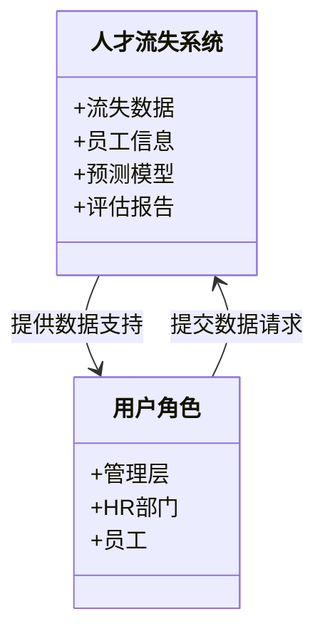
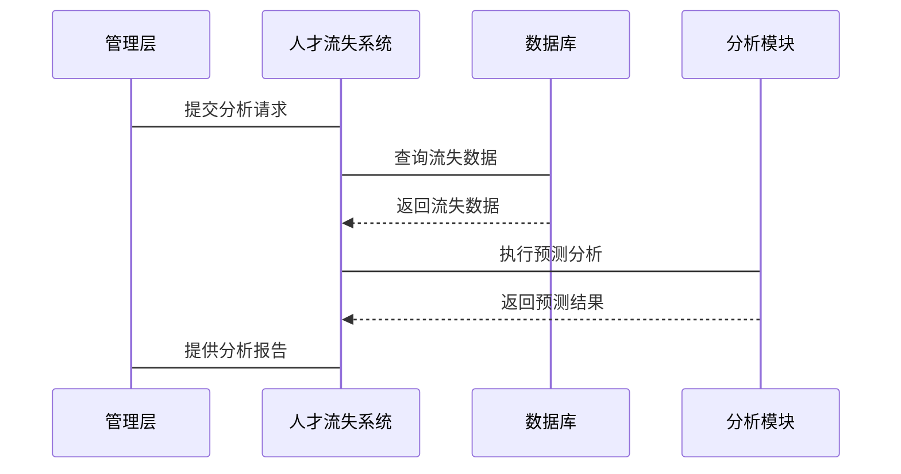

                 

# 彼得林奇如何看待公司的人才流失率

---

## 关键词：
- 彼得·林奇
- 人才流失率
- 企业管理
- 投资哲学
- 人力资源管理

---

## 摘要：
本文从彼得·林奇的投资哲学出发，分析他在企业人才流失率问题上的独特见解。通过定义人才流失率、分析其对企业的具体影响，结合数学模型和系统架构，提出降低人才流失率的有效策略。文章结合实际案例，详细解读了如何从投资者和管理者的双重视角看待人才流失问题，并为企业管理者提供实用的建议。

---

## 第一部分：背景与核心概念

### 第1章：人才流失率的定义与背景

#### 1.1 人才流失的定义
- **1.1.1 人才流失的基本概念**  
  人才流失是指企业在职员工因各种原因离开公司的情况，包括主动离职、被动裁员等。

- **1.1.2 人才流失的类型与分类**  
  - 主动离职：员工因个人原因选择离开企业。  
  - 被动离职：因企业裁员或重组导致的员工流失。  
  - 自然流失：因员工退休或合同到期未续签导致的流失。  

- **1.1.3 人才流失对企业的影响**  
  - 人才流失直接影响企业的生产力和创新能力。  
  - 高流失率可能导致企业核心竞争力下降。  
  - 人才流失还会增加招聘和培训的成本。  

#### 1.2 人才流失率的背景分析
- **1.2.1 当今人才市场的竞争现状**  
  - 全球化背景下，人才流动性增强。  
  - 数字化转型加速，技术型人才需求激增。  
  - 企业之间的“人才战争”愈演愈烈。  

- **1.2.2 数字化时代对企业人才管理的影响**  
  - 技术进步使员工更易获取外部机会。  
  - 远程办公模式改变员工对工作灵活性的需求。  
  - 数据驱动的人才管理成为趋势。  

- **1.2.3 人才流失率与企业绩效的关系**  
  - 高流失率通常与企业绩效下降相关。  
  - 低流失率是企业竞争力的体现。  
  - 合理的流失率是企业健康发展的标志。  

### 第2章：彼得·林奇的视角与方法

#### 2.1 彼得·林奇的投资哲学
- **2.1.1 彼得·林奇的投资者身份**  
  彼得·林奇是全球著名投资者，他将企业视为投资标的，关注企业的长期价值。  

- **2.1.2 投资者视角下的人才流失分析**  
  - 人才流失是企业价值的重要影响因素。  
  - 林奇会关注企业的员工满意度和 retention 策略。  
  - 人才流失率是评估企业管理能力的重要指标。  

- **2.1.3 人才流失对企业价值的影响**  
  - 高流失率可能导致企业创新能力和执行力下降。  
  - 林奇认为，人才流失率过高的企业需要警惕。  

#### 2.2 彼得·林奇的人才流失率分析框架
- **2.2.1 人才流失率的核心要素**  
  - 企业文化：员工满意度、归属感。  
  - 薪酬体系：竞争力与公平性。  
  - 领导力：管理者的能力与风格。  

- **2.2.2 人才流失率与企业竞争力的关系**  
  - 竞争力强的企业通常有较低的流失率。  
  - 高流失率可能反映企业管理问题。  
  - 林奇会重点关注流失率与企业绩效的关联性。  

- **2.2.3 人才流失率的量化与评估**  
  - 计算公式：流失率 = (流失员工数 / 总员工数) × 100%。  
  - 评估指标：行业基准、企业目标、历史数据对比。  

### 第3章：人才流失率的数学模型与分析

#### 3.1 人才流失的数学模型
- **3.1.1 人才流失率的计算公式**  
  流失率 = (流失员工数 / 平均员工数) × 100%。  

- **3.1.2 人才流失率与企业绩效的数学关系**  
  使用回归分析模型，探讨流失率与企业收入、利润的相关性。  

- **3.1.3 人才流失率的预测模型**  
  - 时间序列分析：ARIMA 模型。  
  - 机器学习方法：随机森林、XGBoost。  

#### 3.2 人才流失率的多因素分析
- **3.2.1 外部因素：行业竞争、经济环境**  
  - 行业竞争激烈可能导致人才流失。  
  - 经济波动会影响员工对职业稳定性的感知。  

- **3.2.2 内部因素：企业薪酬、员工满意度**  
  - 薪酬低于行业水平是人才流失的主要原因。  
  - 员工满意度低可能导致主动离职。  

- **3.2.3 中介因素：领导力、企业文化**  
  - 领导风格影响员工的工作态度。  
  - 企业文化决定了员工的归属感。  

---

## 第二部分：解决方案与最佳实践

### 第4章：降低人才流失率的策略与方法

#### 4.1 人才流失的解决方案框架
- **4.1.1 提高员工满意度**  
  - 提供有竞争力的薪酬福利。  
  - 关注员工职业发展路径。  

- **4.1.2 强化企业文化建设**  
  - 建立开放的沟通渠道。  
  - 培养团队合作精神。  

- **4.1.3 提升领导力**  
  - 培训管理者，提升管理能力。  
  - 鼓励管理者与员工建立信任关系。  

#### 4.2 数据驱动的人才管理
- **4.2.1 数据分析与人才流失预测**  
  - 使用数据挖掘技术识别流失风险。  
  - 根据历史数据制定预防措施。  

- **4.2.2 人才流失率的实时监控**  
  - 构建实时监控系统，及时发现流失迹象。  
  - 定期生成分析报告，评估管理策略效果。  

#### 4.3 彼得·林奇的人才管理建议
- **4.3.1 从投资者视角看人才管理**  
  - 林奇认为，人才流失率是衡量企业管理能力的重要指标。  
  - 高质量的人才团队是企业长期发展的基石。  

- **4.3.2 林奇的人才管理哲学**  
  - 重视员工的长期价值。  
  - 建立公平、透明的晋升机制。  
  - 关注员工的职业满意度。  

### 第5章：实际案例与经验总结

#### 5.1 成功案例分析
- **5.1.1 某科技公司的人才流失管理经验**  
  - 提供灵活的工作模式，降低流失率。  
  - 建立完善的职业发展体系，留住核心员工。  

#### 5.2 失败案例分析
- **5.2.1 某互联网公司高流失率的教训**  
  - 薪酬体系不合理，导致人才流失。  
  - 领导力不足，影响员工满意度。  

#### 5.3 经验总结与最佳实践
- **5.3.1 定期进行人才流失分析**  
  - 建立定期评估机制，及时发现问题。  
  - 根据分析结果调整人才管理策略。  

- **5.3.2 加强企业文化建设**  
  - 建立积极向上的企业文化，增强员工归属感。  
  - 鼓励创新与合作，激发员工潜力。  

---

## 第三部分：系统分析与架构设计

### 第6章：系统架构与功能实现

#### 6.1 问题场景介绍
- **6.1.1 人才流失的企业问题**  
  - 高流失率导致企业竞争力下降。  
  - 人才流失影响企业创新能力。  

- **6.1.2 系统目标与需求分析**  
  - 实时监控人才流失率。  
  - 分析流失原因，提供优化建议。  
  - 提供数据支持，辅助决策。  

#### 6.2 系统功能设计
- **6.2.1 领域模型设计（Mermaid 类图）**

- **6.2.2 系统架构设计（Mermaid 架构图）**

#### 6.3 系统接口与交互设计
- **6.3.1 系统接口设计**  
  - API 接口：数据采集、分析报告生成。  
  - 用户界面：管理层、HR、员工的权限区分。  

- **6.3.2 系统交互流程（Mermaid 序列图）**

---

## 第四部分：总结与展望

### 第7章：总结与未来趋势

#### 7.1 核心观点回顾
- 彼得·林奇从投资者视角强调人才流失率的重要性。  
- 企业需通过数据分析和管理优化降低流失率。  
- 构建积极的企业文化是留住人才的关键。  

#### 7.2 未来趋势与展望
- 数据驱动的人才管理将成为主流。  
- 人工智能在人才流失预测中的应用将更加广泛。  
- 可持续发展的人才策略将帮助企业建立长期竞争优势。  

---

## 附录

### 附录 A：人才流失率计算公式
$$流失率 = \frac{\text{流失员工数}}{\text{平均员工数}} \times 100\%$$

### 附录 B：常用人才管理工具
- 数据分析工具：Python、R、SQL。  
- 项目管理工具：JIRA、Trello。  
- 人才评估工具：胜任力模型、360 度评估。  

---

## 参考文献
- 彼得·林奇的著作与投资哲学研究。  
- 人力资源管理相关文献与最佳实践。  
- 数据分析与预测模型的学术研究。  

---

## 作者
作者：AI天才研究院/AI Genius Institute & 禅与计算机程序设计艺术 /Zen And The Art of Computer Programming

