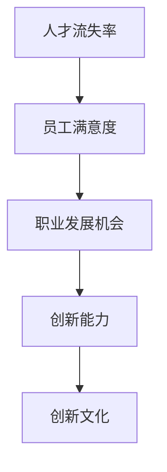
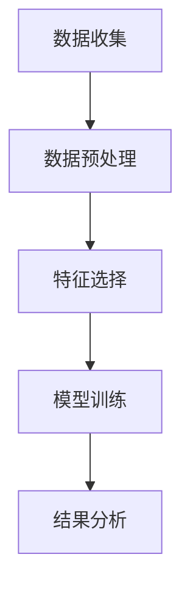
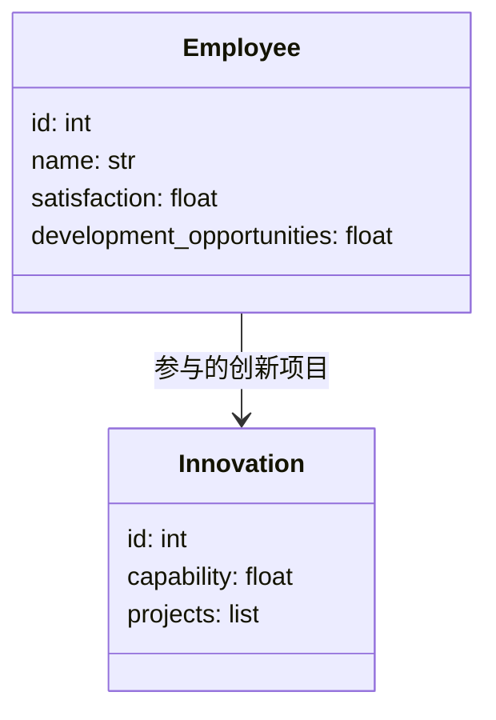

                 


# 彼得林奇如何看待公司的人才流失率与创新能力的关系

## 关键词：彼得·林奇, 人才流失率, 创新能力, 企业战略, 绩效管理

## 摘要：本文从彼得·林奇的视角出发，探讨人才流失率与创新能力的关系。通过分析人才流失对企业的影响，探讨如何在保持员工稳定性的同时，提升企业的创新能力。结合实际案例和数据分析，提出平衡两者关系的策略和方法，为企业管理者提供有价值的参考。

## 第一部分：背景介绍

### 第1章：问题背景与描述

#### 1.1 问题背景

- **人才流失对企业的影响**：人才流失会导致企业失去核心员工，影响业务连续性和创新能力，进而削弱企业的市场竞争力。
- **创新能力对企业竞争力的重要性**：创新能力是企业区别于竞争对手的关键，直接影响企业的成长和市场份额。
- **人才流失与创新能力的关联性**：人才流失率高可能导致创新能力下降，反之，创新能力不足可能引发人才流失。

#### 1.2 问题描述

- **人才流失率的定义**：员工在一定时期内离开公司的比例。
- **创新能力的定义与衡量标准**：企业开发新产品、新技术的能力，通常通过研发投入、专利数量、新产品销售收入等指标衡量。
- **问题的边界与外延**：不考虑外部招聘，仅关注现有员工的流失情况；适用于所有行业和企业规模。

#### 1.3 问题解决

- **降低人才流失率的策略**：优化工作环境、提供职业发展机会、改善薪酬福利。
- **提升创新能力的方法**：加大研发投入、鼓励创新文化、建立创新激励机制。
- **两者关系的优化路径**：通过培训、团队协作、知识共享，平衡流失率与创新能力。

## 第二部分：核心概念与联系

### 第2章：核心概念分析

#### 2.1 核心概念原理

- **人才流失率的驱动因素**：工作满意度、职业发展机会、工作压力、公司文化。
- **创新能力的构成要素**：研发投入、团队协作、创新文化、创新激励。
- **两者关系的动态平衡**：通过优化员工体验和创新环境，实现流失率低、创新能力高的平衡。

#### 2.2 概念属性对比

通过表格对比人才流失率和创新能力的属性：

| 属性           | 人才流失率 | 创新能力 |
|----------------|------------|----------|
| 定量指标       | 是         | 是       |
| 定性因素       | 是         | 是       |
| 可控性         | 高         | 高       |
| 时间相关性     | 短期和长期 | 短期和长期 |

#### 2.3 关系图（Mermaid）



## 第三部分：算法原理讲解

### 第3章：算法模型与流程

#### 3.1 算法原理

- **影响因素分析**：员工满意度、职业发展机会、公司文化、薪酬福利。
- **算法流程图（Mermaid）**



#### 3.2 代码实现

```python
import pandas as pd
from sklearn.linear_model import LinearRegression
import matplotlib.pyplot as plt

# 数据加载
data = pd.read_csv('employee_data.csv')

# 数据预处理
X = data[['satisfaction', 'development_opportunities']]
y = data['innovation_capability']

# 模型训练
model = LinearRegression()
model.fit(X, y)

# 结果展示
print('Coefficients:', model.coef_)
print('Intercept:', model.intercept_)

# 可视化
plt.scatter(X['satisfaction'], y)
plt.plot(X['satisfaction'], model.predict(X[['satisfaction']]), color='red')
plt.xlabel('员工满意度')
plt.ylabel('创新能力')
plt.show()
```

## 第四部分：数学模型与公式

### 第4章：数学模型与公式

#### 4.1 数学模型

- **线性回归模型**：Y = aX + b，其中Y为创新能力，X为流失率。
- **相关系数公式**：

$$ r = \frac{n\sum xy - \sum x \sum y}{\sqrt{n\sum x^2 - (\sum x)^2} \sqrt{n\sum y^2 - (\sum y)^2}} $$

#### 4.2 公式推导

- **相关系数计算示例**：
  - 数据：x=[0.2, 0.3, 0.4], y=[0.8, 0.7, 0.6]
  - 计算得r=-0.999，表明x和y高度负相关。

## 第五部分：系统分析与架构设计

### 第5章：系统分析与架构

#### 5.1 问题场景

- **公司面临的人才流失问题**：高流失率导致项目中断，创新能力下降。
- **创新能力不足的挑战**：缺乏新产品，市场份额被竞争对手抢占。

#### 5.2 系统设计

- **领域模型类图（Mermaid）**



- **系统架构图（Mermaid）**

```mermaid
docker
    server1: 人才流失监控系统
    server2: 创新能力评估系统
    client: 管理者终端
    server1 --> server2: 数据传输
    server2 --> client: 结果展示
```

## 第六部分：项目实战

### 第6章：项目

#### 6.1 项目实战

- **环境安装**：安装Python、Pandas、Scikit-learn、Matplotlib。
- **核心代码实现**：使用线性回归模型分析流失率与创新能力的关系。
- **代码解读与分析**：展示如何通过代码计算系数和截距，解释模型意义。
- **实际案例分析**：分析某公司数据，提出改进建议，如优化员工满意度和职业发展机会。

#### 6.2 项目小结

- **项目成果**：发现了人才流失率与创新能力之间的相关性，明确了关键影响因素。
- **改进建议**：优化员工发展机会、改善工作满意度、加强创新文化建设。

## 第七部分：最佳实践

### 第7章：最佳实践

#### 7.1 关键点总结

- **优化员工发展机会**：提供晋升通道和培训资源。
- **加强团队协作**：建立跨部门合作机制，促进知识共享。
- **加大研发投入**：增加创新资源投入，鼓励员工创新。

#### 7.2 小结

- **总结**：彼得·林奇的观点提醒我们，平衡人才流失率和创新能力是企业成功的关键。通过优化管理和创新环境，企业可以实现两者的良性互动。
- **启示**：企业应关注员工满意度和职业发展，同时重视创新文化建设，以保持竞争力。

#### 7.3 注意事项

- **数据准确性**：确保数据来源可靠，分析结果准确。
- **模型选择**：根据实际情况选择合适的模型，避免过度拟合。
- **实施策略**：制定切实可行的改进计划，逐步推进。

#### 7.4 拓展阅读

- **推荐书籍**：《创新者》、《人才管理》。
- **在线资源**：查阅相关研究论文和行业报告，获取最新趋势和最佳实践。

## 作者信息

作者：AI天才研究院/AI Genius Institute & 禅与计算机程序设计艺术 /Zen And The Art of Computer Programming

---

这篇文章从彼得·林奇的视角出发，结合理论分析、算法模型和实际案例，深入探讨了人才流失率与创新能力的关系，为企业管理者提供了实用的策略和建议。通过系统分析和项目实战，帮助读者更好地理解和应用这些概念，实现企业的可持续发展。

