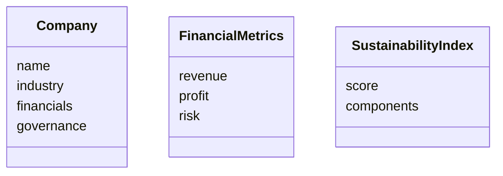
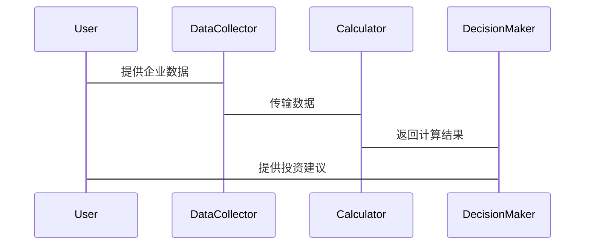

                 

# 彼得·林奇如何看待公司的可持续发展

> 关键词：彼得·林奇，可持续发展，投资策略，公司治理，风险管理，财务健康

> 摘要：本文从彼得·林奇的投资视角，分析公司可持续发展的关键因素，包括财务健康、管理团队、行业地位、企业治理、风险管理等方面。通过系统分析和案例研究，探讨如何将可持续发展理念融入企业战略，并通过数学模型和算法进行量化评估。

---

# 第一部分: 公司可持续发展的背景与定义

## 第1章: 可持续发展的定义与背景

### 1.1 可持续发展的定义

#### 1.1.1 可持续发展的基本概念
可持续发展（Sustainability）是指在满足当前需求的同时，不损害后代人满足其需求的能力。在商业领域，可持续发展不仅关注环境和社会责任，还涉及企业的长期盈利能力和抗风险能力。

#### 1.1.2 可持续发展的重要性
企业在追求短期利润的同时，必须考虑长期的可持续性。通过实现可持续发展，企业可以增强市场竞争力、降低风险、提升品牌价值，并为股东创造长期价值。

#### 1.1.3 可持续发展与企业发展的关系
企业可持续发展是企业长期生存和发展的基石。通过优化资源利用、减少环境影响、提升员工福祉和履行社会责任，企业可以实现与社会的共同繁荣。

---

### 1.2 彼得·林奇与可持续发展的关联

#### 1.2.1 彼得·林奇的投资理念
彼得·林奇是全球著名投资者，注重基本面分析和长期投资。他认为，投资成功的关键在于选择具有强大竞争优势和良好管理的公司。

#### 1.2.2 可持续发展对投资的影响
可持续发展是企业长期盈利的保障。通过关注企业的可持续性，投资者可以更好地评估公司的长期价值和风险。

#### 1.2.3 彼得·林奇研究方法的延展
彼得·林奇的研究方法强调对企业基本面的深入分析，包括财务状况、管理团队和行业地位。这些方法同样适用于评估公司的可持续发展能力。

---

## 第2章: 可持续发展的核心要素

### 2.1 财务健康与可持续性

#### 2.1.1 财务健康的核心指标
- 净利润：衡量企业盈利能力的重要指标。
- 营业收入：反映企业的市场地位和销售能力。
- 净利润率：净利润与营业收入的比率，反映企业的盈利效率。

#### 2.1.2 净利润与可持续发展
净利润是企业可持续发展的基础。稳定的净利润增长表明企业具有持续的盈利能力。

#### 2.1.3 财务风险与可持续性
高负债率和低现金流的企业面临较高的财务风险，这会影响企业的可持续性。

---

### 2.2 管理团队与企业治理

#### 2.2.1 管理团队的稳定性
稳定的管理团队是企业长期发展的关键。频繁的高层变动可能影响企业的战略连续性和执行力。

#### 2.2.2 企业治理结构
良好的治理结构包括有效的董事会、透明的决策流程和明确的职责分工。这有助于提升企业的治理效率和风险管理能力。

#### 2.2.3 管理层决策对可持续性的影响
管理层的决策直接影响企业的可持续性。例如，注重环保和员工福利的决策可以提升企业的社会形象和长期竞争力。

---

### 2.3 行业地位与竞争优势

#### 2.3.1 行业地位的评估
企业在全球或区域市场中的地位决定了其市场影响力和抗风险能力。

#### 2.3.2 竞争优势的分析
竞争优势包括成本优势、技术优势、品牌优势等。这些优势是企业长期盈利的关键。

#### 2.3.3 行业趋势与可持续性
行业趋势的变化可能影响企业的可持续性。例如，环保法规的趋严要求企业加快绿色转型。

---

## 第3章: 可持续发展的数学模型与分析

### 3.1 财务指标的数学模型

#### 3.1.1 净利润公式
$$\text{净利润} = \text{收入} - \text{成本} - \text{税金} - \text{费用}$$

#### 3.1.2 净利润率计算
$$\text{净利润率} = \frac{\text{净利润}}{\text{收入}} \times 100\%$$

---

### 3.2 可持续发展指数的构建

#### 3.2.1 可持续发展指数的定义
可持续发展指数（Sustainability Index）是衡量企业可持续发展能力的综合指标，通常由多个子指标组成。

#### 3.2.2 指数构建的步骤
1. 确定关键指标：如净利润率、研发投入占比、员工满意度等。
2. 给予权重：根据指标的重要性分配权重。
3. 计算得分：通过加权平均计算企业的可持续发展指数。

#### 3.2.3 指数权重的分配
- 净利润率：权重40%
- 研发投入：权重30%
- 员工满意度：权重20%
- 环境影响：权重10%

---

### 3.3 系统架构设计

#### 3.3.1 系统功能设计

---

## 第4章: 可持续发展的投资策略

### 4.1 投资策略的核心原则

#### 4.1.1 长期投资
长期投资注重企业的长期价值，而非短期波动。

#### 4.1.2 价值投资
选择具有低估价值和强大竞争优势的公司进行投资。

#### 4.1.3 风险管理
通过分散投资和严格的风险评估降低投资风险。

---

### 4.2 可持续发展的投资方法

#### 4.2.1 ESG投资
ESG（环境、社会、治理）投资注重企业的环境表现、社会责任和治理结构。

#### 4.2.2 股票筛选
通过筛选符合可持续发展理念的公司进行投资。

#### 4.2.3 投资组合优化
根据企业的可持续性表现优化投资组合。

---

## 第5章: 可持续发展与风险管理

### 5.1 风险管理的核心要素

#### 5.1.1 财务风险
高负债率和现金流不足是主要的财务风险。

#### 5.1.2 行业风险
行业波动和政策变化可能影响企业的可持续性。

#### 5.1.3 管理风险
管理不善和高层变动可能影响企业的战略执行。

---

### 5.2 风险管理策略

#### 5.2.1 财务风险管理
通过优化资本结构和控制成本降低财务风险。

#### 5.2.2 行业风险管理
密切关注行业趋势和政策变化，提前制定应对策略。

#### 5.2.3 管理风险管理
建立高效的管理团队和清晰的治理结构，确保战略执行。

---

## 第6章: 可持续发展的系统架构设计

### 6.1 系统功能设计

#### 6.1.1 系统功能模块
- 数据采集模块：收集企业的财务、治理和社会责任数据。
- 指标计算模块：计算企业的可持续发展指数。
- 投资决策模块：根据指标结果优化投资组合。

#### 6.1.2 系统交互流程

---

## 第7章: 项目实战

### 7.1 案例分析

#### 7.1.1 项目背景
以某科技公司为例，分析其可持续发展能力。

#### 7.1.2 数据采集
收集该公司的财务数据、治理结构和社会责任表现。

#### 7.1.3 计算可持续发展指数
根据权重计算该公司的可持续发展指数。

#### 7.1.4 投资决策
根据计算结果优化投资组合。

---

## 第8章: 总结与展望

### 8.1 总结

通过彼得·林奇的投资视角，我们分析了公司可持续发展的关键因素，包括财务健康、管理团队、行业地位、企业治理和风险管理。可持续发展是企业长期盈利的基石，也是投资者关注的核心。

### 8.2 展望

未来，随着全球对可持续发展的关注增加，企业需要更加注重绿色转型和社会责任。投资者也应该将可持续性作为投资决策的重要因素，以实现长期价值创造。

---

作者：AI天才研究院/AI Genius Institute & 禅与计算机程序设计艺术 /Zen And The Art of Computer Programming

