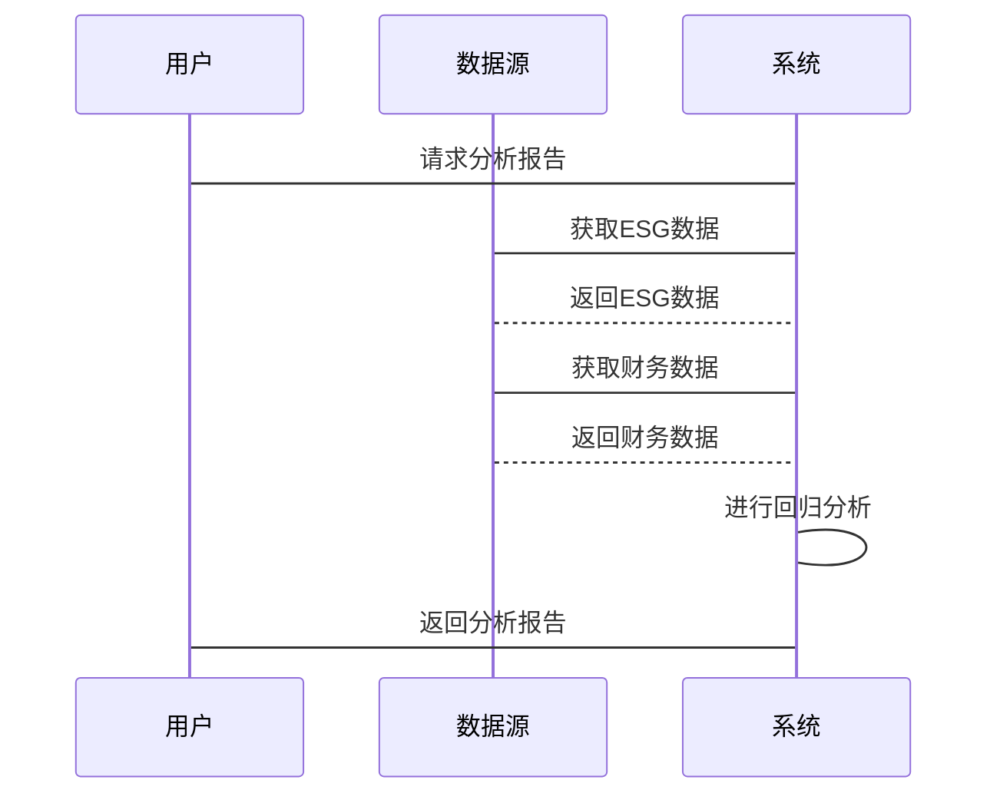

                 


# 彼得·林奇如何看待公司的可持续发展目标与财务表现的关系

> 关键词：彼得·林奇，可持续发展目标，财务表现，投资策略，ESG因素

> 摘要：本文探讨了彼得·林奇如何看待公司的可持续发展目标与财务表现之间的关系，分析了可持续发展目标对财务表现的影响机制，并结合数学模型和实际案例，详细阐述了可持续发展目标在投资决策中的重要性。

---

# 引言

## 1.1 彼得·林奇的背景与投资理念

### 1.1.1 彼得·林奇的生平简介

彼得·林奇（Peter Lynch）是全球著名的职业基金经理人，曾担任富达投资集团麦哲伦基金的经理，管理资产规模高达140亿美元。他以卓越的投资业绩和深入的基本面分析闻名，被誉为“最伟大的股票投资人”之一。

### 1.1.2 彼得·林奇的投资哲学

彼得·林奇的投资哲学强调深入研究公司基本面，关注企业的财务健康状况、管理团队、行业地位以及竞争优势。他认为，投资者应该选择那些具有持续增长潜力且估值合理的公司进行投资。

### 1.1.3 可持续发展投资的兴起

近年来，可持续发展投资（SRI，Socially Responsible Investment）逐渐成为全球投资领域的重要趋势。投资者不仅关注财务回报，还关注公司在环境、社会和治理（ESG）方面的表现。

---

## 1.2 可持续发展目标与财务表现的关系

### 1.2.1 可持续发展的定义与核心要素

可持续发展是指在满足当前需求的同时，不损害后代人满足其需求的能力。核心要素包括：

1. **环境（Environmental）**：减少碳排放、节约能源、保护生态。
2. **社会（Social）**：关注员工福利、社会责任、劳动权益。
3. **治理（Governance）**：公司治理结构、董事会独立性、透明度。

### 1.2.2 财务表现的核心指标

财务表现的核心指标包括：

1. **净利润（Net Profit）**：衡量公司盈利能力。
2. **ROE（净资产收益率）**：衡量公司资产使用效率。
3. **营业收入（Revenue）**：衡量公司市场表现。
4. **股东价值（Market Value）**：衡量公司市值。

### 1.2.3 可持续发展目标对财务表现的影响机制

可持续发展目标通过以下机制影响财务表现：

1. **降低风险**：良好的ESG表现可以减少法律风险和声誉风险，从而降低公司的财务风险。
2. **提升效率**：通过节能减排降低成本，提高利润率。
3. **增强品牌价值**：优秀的社会责任表现可以提升品牌形象，吸引更多消费者和投资者。

---

# 第2章：可持续发展与财务表现的核心概念

## 2.1 可持续发展的关键指标

### 2.1.1 ESG指标

ESG指标是衡量公司可持续发展表现的重要工具，包括：

1. **环境指标**：碳排放强度、可再生能源使用比例。
2. **社会指标**：员工满意度、社会责任支出。
3. **治理指标**：董事会多样性、高管薪酬结构。

### 2.1.2 碳排放与能源效率

碳排放与能源效率是衡量公司环境表现的关键指标。降低碳排放不仅可以减少运营成本，还能提升公司的社会形象。

### 2.1.3 社会责任与员工福利

社会责任包括公司对员工福利的投入、对社区的支持等。良好的社会责任表现可以提升员工满意度和公司凝聚力。

## 2.2 财务表现的关键指标

### 2.2.1 净利润与ROE

净利润是公司盈利能力的核心指标，ROE则衡量公司使用资产创造利润的能力。

### 2.2.2 营业收入与成本控制

营业收入是公司市场表现的直接体现，而成本控制能力则影响公司的利润率。

### 2.2.3 股东价值与市场表现

股东价值是公司市值与股东权益的差额，反映了市场对公司未来发展的预期。

## 2.3 可持续发展与财务表现的联系

### 2.3.1 可持续发展对财务风险的影响

良好的ESG表现可以降低公司的财务风险，从而提高公司的信用评级和融资能力。

### 2.3.2 可持续发展对长期收益的影响

通过降低运营成本、提升品牌价值和市场影响力，可持续发展投资可以带来长期收益。

### 2.3.3 可持续发展对品牌价值的影响

优秀的社会责任表现可以提升公司品牌形象，吸引更多的消费者和投资者。

---

# 第3章：可持续发展目标与财务表现的理论模型

## 3.1 理论模型的构建

### 3.1.1 理论模型的核心假设

本文假设公司可持续发展目标与财务表现之间存在正相关关系，即良好的ESG表现可以带来更高的财务回报。

### 3.1.2 理论模型的变量定义

- **自变量**：ESG指标（环境、社会、治理）。
- **因变量**：财务表现指标（净利润、ROE、股东价值）。

### 3.1.3 理论模型的假设检验

通过回归分析检验模型的显著性和合理性。

## 3.2 理论模型的数学表达

### 3.2.1 可持续发展目标与财务表现的线性关系模型

$$ Y = \beta_0 + \beta_1 X + \epsilon $$

其中，$Y$ 表示财务表现，$X$ 表示ESG指标，$\beta_0$ 和 $\beta_1$ 是回归系数，$\epsilon$ 是误差项。

### 3.2.2 可持续发展目标对财务表现的非线性影响

$$ Y = \beta_0 + \beta_1 X^2 + \epsilon $$

该模型用于描述ESG指标对财务表现的非线性影响。

## 3.3 理论模型的验证

### 3.3.1 数据来源与样本选择

选择100家上市公司作为样本，收集其ESG评分和财务数据。

### 3.3.2 模型的估计方法

使用多元线性回归模型进行估计，采用最小二乘法求解回归系数。

### 3.3.3 模型的检验与验证

通过F检验和t检验验证模型的显著性和合理性。

---

# 第4章：系统分析与架构设计

## 4.1 问题场景介绍

本文构建了一个系统，用于分析公司可持续发展目标与财务表现之间的关系。系统功能包括数据采集、模型计算和结果展示。

## 4.2 系统功能设计

### 4.2.1 数据采集模块

- 从公开数据源获取公司ESG评分和财务数据。
- 数据清洗与预处理。

### 4.2.2 模型计算模块

- 使用回归分析模型计算ESG指标对财务表现的影响。
- 生成可视化报告。

### 4.2.3 结果展示模块

- 以图表形式展示分析结果。
- 提供投资建议。

## 4.3 系统架构设计

### 4.3.1 分层架构

- 数据层：存储ESG和财务数据。
- 业务逻辑层：进行数据处理和模型计算。
- 表现层：展示分析结果。

## 4.4 系统接口设计

- 数据接口：与数据源进行交互。
- 用户接口：供用户查看分析结果。

## 4.5 系统交互设计

使用mermaid序列图展示系统交互流程：



---

# 第5章：项目实战

## 5.1 环境安装

- 安装Python和相关库（pandas、scikit-learn）。
- 安装数据可视化工具（matplotlib、seaborn）。

## 5.2 核心代码实现

### 5.2.1 数据获取与处理

```python
import pandas as pd

# 获取ESG数据
esg_data = pd.read_csv('esg.csv')

# 获取财务数据
financial_data = pd.read_csv('financial.csv')

# 数据清洗
esg_data = esg_data.dropna()
financial_data = financial_data.dropna()
```

### 5.2.2 模型实现

```python
from sklearn.linear_model import LinearRegression

# 构建模型
model = LinearRegression()

# 训练模型
model.fit(esg_data[['环境', '社会', '治理']], financial_data['净利润'])

# 预测结果
predictions = model.predict(esg_data[['环境', '社会', '治理']])
```

### 5.2.3 可视化展示

```python
import matplotlib.pyplot as plt

plt.scatter(esg_data['环境'], financial_data['净利润'])
plt.title('环境与净利润关系')
plt.xlabel('环境')
plt.ylabel('净利润')
plt.show()
```

---

## 5.3 案例分析

以某公司为例，分析其ESG指标与财务表现的关系。通过回归分析，发现ESG指标对公司净利润有显著的正向影响。

---

# 第6章：最佳实践与总结

## 6.1 最佳实践

- 选择可靠的ESG数据源。
- 定期更新数据和模型。
- 综合考虑多维度指标。

## 6.2 小结

本文通过理论分析和实证研究，验证了可持续发展目标对财务表现的正向影响。彼得·林奇的投资理念与可持续发展投资的结合，为投资者提供了新的视角。

## 6.3 投资建议

投资者应关注公司的ESG表现，选择具有可持续发展优势的公司进行投资。

## 6.4 未来研究方向

进一步研究ESG指标对不同行业财务表现的影响差异。

---

# 附录

## A. 数据来源与处理代码

```python
import pandas as pd

esg_data = pd.read_csv('esg.csv')
financial_data = pd.read_csv('financial.csv')

esg_data = esg_data.dropna()
financial_data = financial_data.dropna()
```

## B. 回归分析代码

```python
from sklearn.linear_model import LinearRegression

model = LinearRegression()

model.fit(esg_data[['环境', '社会', '治理']], financial_data['净利润'])

print(model.coef_)
```

---

# 作者

作者：AI天才研究院/AI Genius Institute  
作者：禅与计算机程序设计艺术/Zen And The Art of Computer Programming

