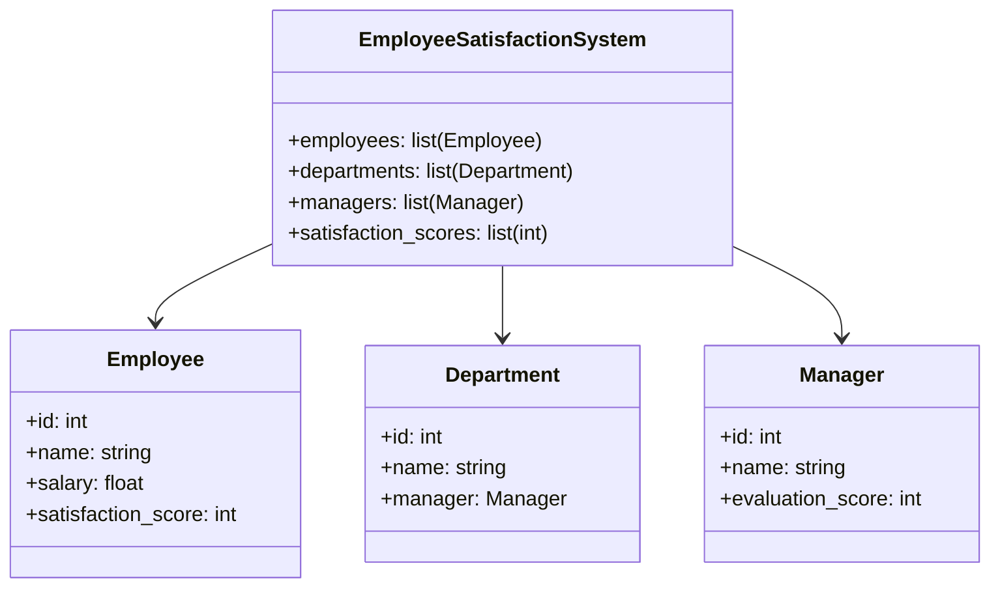

                 


# 彼得林奇如何看待公司的员工满意度

> 关键词：彼得林奇，员工满意度，公司绩效，投资理念，管理哲学，价值模型

> 摘要：本文从彼得·林奇的投资哲学出发，探讨员工满意度对公司绩效的影响。通过构建数学模型和系统架构，分析员工满意度的预测方法，并结合实际案例，提出提升员工满意度的策略。文章结合理论与实践，为公司管理者提供实用建议。

---

## 第一部分：员工满意度的背景与重要性

### 1.1 员工满意度的核心概念

#### 1.1.1 什么是员工满意度

员工满意度是员工对其工作环境、薪酬、职业发展和管理风格的综合评价。以下是员工满意度的定义和核心要素：

**定义：**
员工满意度是员工对其工作体验的整体评价，反映了员工对工作条件、公司文化和发展机会的满意程度。

**核心要素：**
- **薪酬**：薪资是否合理，是否具有竞争力。
- **工作环境**：工作条件是否舒适，是否有良好的办公环境。
- **职业发展**：是否有晋升机会和培训资源。
- **管理风格**：管理者是否支持员工发展，沟通是否顺畅。

#### 1.1.2 员工满意度的重要性

员工满意度对公司的绩效和员工忠诚度有直接影响。以下是员工满意度的重要性分析：

- **对公司绩效的影响：** 满意的员工通常更具生产力，能够为公司创造更多价值。
- **对员工忠诚度的影响：** 高满意度的员工更可能留在公司，降低员工流失率。
- **对公司文化的塑造：** 通过提升员工满意度，可以增强公司的凝聚力和文化认同感。

#### 1.1.3 彼得·林奇的管理风格

彼得·林奇是著名的基金经理，他的投资理念强调长期价值和管理层能力。他的管理哲学可以总结为：

- **长期主义**：注重长期价值，而非短期收益。
- **管理层评估**：选择管理层能力强、公司治理良好的公司。
- **员工满意度与公司价值**：高员工满意度通常意味着公司治理良好，员工积极性高，公司价值得以提升。

### 1.2 员工满意度与公司绩效的关系

员工满意度与公司绩效之间存在正相关关系。以下是详细分析：

- **正向关系分析：** 高满意度员工通常具有更高的生产力和创造力，能够为公司带来更高的利润和股价增长。
- **影响因素分析：** 薪酬、工作环境、管理风格等对员工满意度的影响程度可以通过对比分析得出。

---

## 第二部分：彼得·林奇的员工满意度分析方法

### 2.1 彼得·林奇的投资理念

#### 2.1.1 投资理念的核心

彼得·林奇的投资理念以价值投资和长期主义为核心。他注重选择那些管理层能力强、公司治理良好的公司，认为这些公司的员工满意度和公司绩效会更好。

- **价值投资**：寻找那些被市场低估的公司，长期持有，获得超额收益。
- **长期主义**：关注公司的长期发展，而非短期波动。

#### 2.1.2 管理层评估

彼得·林奇在选择投资标的时，非常重视管理层的能力和风格。他认为，一个优秀的管理层能够提升员工满意度，进而推动公司绩效。以下是管理层评估的关键点：

- **管理层能力**：是否具备战略眼光和执行力。
- **管理风格**：是否支持员工发展，是否注重员工满意度。

### 2.2 员工满意度的财务价值

#### 2.2.1 高满意度员工的财务贡献

高满意度的员工通常能够为公司带来更高的财务贡献。以下是具体的贡献点：

- **更高的生产力**：满意的员工更积极主动，工作效率更高。
- **更低的员工流失率**：高满意度员工更可能留在公司，减少招聘和培训成本。
- **更高的客户满意度**：满意的员工能够为客户提供更好的服务，提升客户满意度和忠诚度。

#### 2.2.2 彼得·林奇的员工满意度财务模型

为了量化员工满意度的财务价值，我们可以构建一个简单的回归模型，分析员工满意度与公司绩效之间的关系。以下是回归模型的详细步骤：

1. **数据收集**：收集员工满意度评分和公司绩效数据（如利润增长率、股价增长率）。
2. **回归分析**：使用最小二乘法，建立员工满意度评分与公司绩效的回归模型。
3. **模型评估**：通过R²值评估模型的拟合程度，R²越高，说明员工满意度对绩效的影响越大。

---

## 第三部分：数学模型与算法原理

### 3.1 员工满意度预测模型

我们使用线性回归模型来预测员工满意度。以下是模型的详细步骤：

1. **数据预处理**：将员工满意度评分（因变量）和影响因素（自变量，如薪酬、工作环境评分等）进行标准化处理。
2. **模型构建**：使用线性回归算法，建立员工满意度预测模型。
3. **模型验证**：通过交叉验证评估模型的准确性和稳定性。

以下是线性回归的公式：

$$
y = \beta_0 + \beta_1x_1 + \beta_2x_2 + \dots + \beta_nx_n + \epsilon
$$

其中：
- $y$ 是员工满意度评分
- $x_i$ 是自变量（如薪酬评分）
- $\beta_i$ 是回归系数
- $\epsilon$ 是误差项

### 3.2 算法实现

以下是使用Python实现员工满意度预测模型的代码示例：

```python
import numpy as np
import pandas as pd
from sklearn.linear_model import LinearRegression
from sklearn.metrics import mean_squared_error
from sklearn.model_selection import train_test_split

# 数据预处理
data = pd.read_csv('employee_satisfaction.csv')
X = data[['salary', 'work_environment', 'management']].values
y = data['satisfaction_score'].values

# 划分训练集和测试集
X_train, X_test, y_train, y_test = train_test_split(X, y, test_size=0.2, random_state=42)

# 模型训练
model = LinearRegression()
model.fit(X_train, y_train)

# 模型预测
y_pred = model.predict(X_test)

# 模型评估
mse = mean_squared_error(y_test, y_pred)
r2 = model.score(X_test, y_test)

print(f'Mean Squared Error: {mse}')
print(f'R-squared: {r2}')
```

---

## 第四部分：系统分析与架构设计

### 4.1 系统功能设计

#### 4.1.1 领域模型

以下是员工满意度分析系统的领域模型：



#### 4.1.2 系统架构

以下是员工满意度分析系统的架构图：

```mermaid
architecturalDiagram
    main Container {
        [Employee Satisfaction System]
        include "Data Collection Module"
        include "Analysis Module"
        include "Reporting Module"
    }
    Data Collection Module --> Employee Database
    Analysis Module --> Machine Learning Models
    Reporting Module --> Visualization Tools
```

---

## 第五部分：项目实战

### 5.1 项目背景

我们选择一家中型科技公司作为案例，分析其员工满意度情况，并提出改进建议。

#### 5.1.1 环境安装

安装必要的工具和库：

```bash
pip install pandas numpy scikit-learn matplotlib
```

#### 5.1.2 核心代码实现

以下是数据清洗和分析的代码示例：

```python
import pandas as pd
import matplotlib.pyplot as plt
from sklearn.decomposition import PCA

# 数据加载与预处理
data = pd.read_csv('employee_survey.csv')
data = data.dropna()
data = pd.get_dummies(data)

# 数据降维
pca = PCA(n_components=2)
principal_components = pca.fit_transform(data)

# 数据可视化
plt.scatter(principal_components[:, 0], principal_components[:, 1], c=data['satisfaction_score'], cmap='viridis')
plt.xlabel('Principal Component 1')
plt.ylabel('Principal Component 2')
plt.colorbar(label='Satisfaction Score')
plt.show()
```

#### 5.1.3 案例分析与改进建议

通过数据分析，我们发现薪酬和管理风格是影响员工满意度的主要因素。以下是改进建议：

- 提高员工薪酬水平，使其更具竞争力。
- 改进管理风格，增强管理者与员工的沟通。

---

## 第六部分：总结与最佳实践

### 6.1 总结

彼得·林奇的投资理念告诉我们，员工满意度是公司绩效的重要指标。通过构建数学模型和系统架构，我们可以量化员工满意度，并采取有效措施提升员工满意度，从而实现公司价值最大化。

### 6.2 最佳实践

- **定期进行员工满意度调查**，及时发现问题。
- **关注薪酬和管理风格**，这是影响员工满意度的主要因素。
- **建立良好的沟通机制**，增强员工与管理层的互动。

### 6.3 注意事项

- 在实际操作中，需结合公司实际情况，灵活调整策略。
- 数据分析需结合定性分析，全面评估员工满意度。

### 6.4 未来研究方向

- 探讨员工满意度与客户满意度之间的关系。
- 研究不同行业员工满意度的影响因素差异。

---

## 作者：AI天才研究院/AI Genius Institute & 禅与计算机程序设计艺术 /Zen And The Art of Computer Programming

---

通过本文的分析，我们深入探讨了彼得·林奇如何看待公司的员工满意度，并结合理论与实践，为公司管理者提供了实用的建议。希望本文能为您提供有价值的见解，帮助您更好地管理团队，提升公司绩效。

