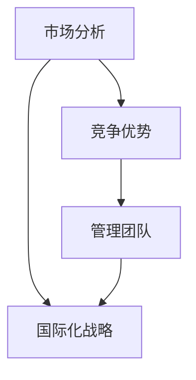

                 

# 彼得林奇如何看待公司的国际化战略

---

## 关键词  
国际化的投资分析，彼得·林奇，公司战略，全球市场，风险管理，投资策略

---

## 摘要  
本文深入探讨了国际化的投资分析，结合彼得·林奇的投资理念和公司战略，分析了如何在国际化战略中实现投资价值的最大化。文章从投资学视角出发，结合实际案例和数据分析，提出了系统化的国际化战略实施路径和风险应对策略，为读者提供了深刻的投资见解和实践指导。

---

## 第1章：彼得·林奇的背景与分析方法

### 1.1 彼得·林奇的简介  
彼得·林奇是全球著名投资专家，以其独特的投资理念闻名。他的分析方法注重基本面研究和长期投资，强调对公司管理层、财务状况和市场环境的深入评估。林奇的著作《彼得·林奇的成功投资》等，为投资者提供了丰富的理论和实践指导。

### 1.2 国际化战略的背景  
国际化战略是企业在全球化背景下扩展市场的关键策略。随着全球经济一体化的加深，企业需要通过国际化战略来获取新的增长点，优化资源配置，提升竞争力。

---

## 第2章：国际化战略的核心概念

### 2.1 国际化战略的定义与目标  
国际化战略是指企业在全球范围内扩展市场、优化资源配置和提升竞争力的一系列战略行动。其核心目标包括市场扩展、资源优化和竞争优势的构建。

### 2.2 国际化战略的关键要素  
- **市场分析**：研究目标市场的规模、增长潜力和竞争格局。
- **文化适应**：理解并适应不同国家的文化差异，优化运营策略。
- **风险管理**：识别并应对国际化过程中可能面临的经济、政治和技术风险。

---

## 第3章：投资学视角下的国际化战略分析

### 3.1 投资视角的核心概念  
- **资产评估**：通过财务指标（如市盈率、ROE）评估公司的投资价值。
- **市场潜力**：分析目标市场的增长潜力和竞争优势。

### 3.2 彼得·林奇的投资指标  
- **市盈率（P/E）**：衡量股票价格是否合理。
- **市净率（P/B）**：评估股票价格相对于账面价值的高低。
- **ROE（净资产收益率）**：衡量公司盈利能力。

### 3.3 实例分析  
以某跨国公司为例，分析其国际化战略中的投资价值和潜在风险。

---

## 第4章：国际市场环境分析

### 4.1 经济环境  
- **经济增长率**：影响市场的扩张潜力。
- **通货膨胀**：影响投资回报和成本控制。

### 4.2 政治环境  
- **政治稳定性**：评估政府政策的连续性和稳定性。
- **政策风险**：分析贸易政策、税收政策等对外资的限制。

### 4.3 法律环境  
- **法律体系**：了解当地法律对市场进入和运营的限制。
- **税收政策**：评估税收负担对投资的影响。

---

## 第5章：彼得·林奇的分析框架

### 5.1 分析框架的构建  
- **市场分析**：研究目标市场的竞争格局和增长潜力。
- **竞争优势**：评估公司在技术、成本和品牌上的优势。
- **管理团队**：考察管理层的经验和战略执行力。

### 5.2 案例分析  
以具体公司为例，分析彼得·林奇的分析框架在实际中的应用。

### 5.3 架构图  
使用Mermaid绘制的分析框架图：

---

## 第6章：国际化战略的风险与挑战

### 6.1 风险分析  
- **政治风险**：政府政策变化对企业的影响。
- **经济波动**：汇率波动和经济周期对投资的影响。
- **文化差异**：跨文化管理中的沟通障碍和适应成本。

### 6.2 应对策略  
- **风险评估**：系统性识别和评估潜在风险。
- **多元化市场**：分散投资以降低风险。
- **本地化管理**：建立本地化团队，优化运营策略。

---

## 第7章：实施路径与最佳实践

### 7.1 市场进入策略  
- **直接投资**：建立全资子公司。
- **合资合作**：与当地企业合作，降低进入壁垒。
- **特许经营**：利用加盟商快速扩张。

### 7.2 团队建设  
- **本地化人才**：招聘熟悉当地市场的专业人才。
- **国际化团队**：组建多元化的管理团队，提升全球视野。

### 7.3 运营管理  
- **跨文化管理**：建立有效的沟通机制和管理流程。
- **供应链管理**：优化全球供应链，降低运营成本。

---

## 第8章：投资机会与未来展望

### 8.1 高增长市场  
- **新兴市场**：如东南亚、拉丁美洲，具有较大的增长潜力。
- **技术创新**：关注科技领域的投资机会，如人工智能、大数据。

### 8.2 未来展望  
- **全球化趋势**：跨国公司将继续主导全球市场。
- **技术驱动**：技术创新将为国际化战略提供新的机遇。

---

## 第9章：总结与未来展望

### 9.1 主要观点总结  
- 彼得·林奇的分析方法为国际化战略提供了重要的理论支持。
- 国际化战略的成功实施需要结合市场分析、竞争优势和风险管理。

### 9.2 未来展望  
- 随着全球化深入，国际化战略将继续成为公司发展的重要驱动力。
-抽取出更多的投资机会，尤其是在高增长市场和技术驱动领域。

---

## 附录

### 附录A：相关术语解释  
- **国际化战略**：企业在全球范围内扩展市场和优化资源配置的策略。
- **彼得·林奇**：著名投资专家，以其基本面分析和长期投资理念闻名。

### 附录B：数据与参考资料  
- 数据来源：国际货币基金组织（IMF）、世界银行、彼得·林奇的著作等。

---

## 作者：AI天才研究院/AI Genius Institute & 禅与计算机程序设计艺术/Zen And The Art of Computer Programming

---

**摘要**：本文通过分析彼得·林奇的投资理念，结合国际化战略的核心要素和实际案例，为读者提供了系统化的投资分析方法和实践指导。文章内容详实，结构清晰，适合投资者和企业管理者阅读。

