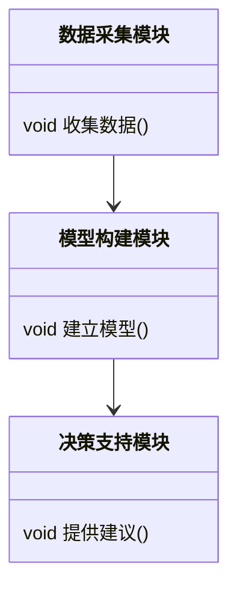
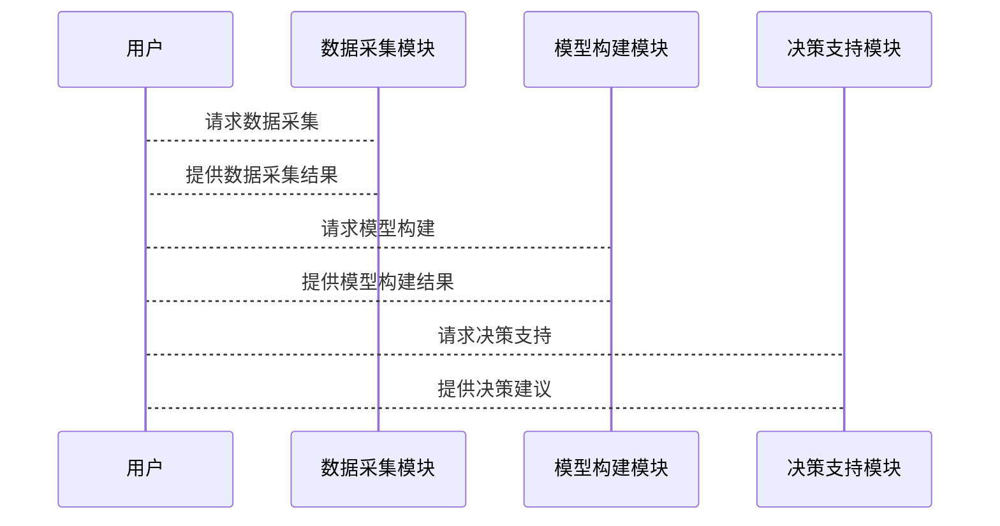

                 


# 彼得·林奇如何看待公司的国际化进程

## 关键词：彼得·林奇，公司国际化，投资分析，系统分析，算法模型，案例分析

## 摘要：本文从彼得·林奇的投资视角，详细探讨了公司国际化进程中的关键问题，包括背景分析、核心概念、算法模型构建、系统设计、项目实战及最佳实践。通过系统的分析和实例，展示了如何运用彼得·林奇的投资理念来评估和优化公司的国际化战略。

---

# 第一部分: 公司国际化进程的背景与概念

# 第1章: 公司国际化进程的背景介绍

## 1.1 公司国际化的定义与内涵

### 1.1.1 国际化的基本概念

国际化（Globalization）是指企业在跨越国界的市场中扩展业务的过程，涉及产品、服务、资本、技术和信息的跨国流动。公司国际化不仅仅是地理上的扩展，更是企业在全球范围内整合资源、优化配置的过程。

### 1.1.2 公司国际化的核心要素

- **市场扩展**：进入新的地理市场，扩大客户基础。
- **资源优化**：利用全球资源降低成本，提高效率。
- **竞争优势**：通过全球化战略增强企业的核心竞争力。
- **风险管理**：应对跨国经营中的政治、经济和文化风险。

### 1.1.3 国际化与全球化的关系

全球化强调全球市场的整合和统一，而国际化则更注重企业个体在不同国家市场的具体策略和适应性。国际化是企业实现全球化战略的具体步骤。

---

## 1.2 公司国际化的背景与驱动因素

### 1.2.1 经济全球化的推动

经济全球化促进了跨国贸易和投资的增长，为公司国际化提供了广阔的市场空间。

### 1.2.2 技术进步的影响

信息技术的发展使得跨国通信和数据处理更加便捷，降低了国际化的成本和风险。

### 1.2.3 市场扩展的需求

企业通过国际化可以突破本地市场的局限，寻找新的增长点。

---

## 1.3 国际化进程中的问题与挑战

### 1.3.1 市场风险与文化差异

不同国家的市场环境、消费习惯和文化背景差异可能导致市场失败。

### 1.3.2 法律与政策障碍

各国的法律、税收政策和贸易壁垒增加了国际化的难度。

### 1.3.3 竞争与合作的平衡

国际化过程中需要在竞争与合作之间找到平衡点，避免过度依赖单一市场。

---

## 1.4 本章小结

本章介绍了公司国际化的定义、核心要素及其与全球化的区别，并分析了国际化进程中的驱动因素和面临的挑战。这些内容为后续章节的深入分析奠定了基础。

---

# 第二部分: 彼得·林奇的投资视角与国际化战略

# 第2章: 彼得·林奇的投资理念与国际化分析框架

## 2.1 彼得·林奇的投资哲学

### 2.1.1 长期投资与价值发现

彼得·林奇强调长期投资，关注企业的基本面和内在价值，寻找被市场低估的投资机会。

### 2.1.2 股东价值最大化的核心理念

他认为，企业的核心目标是为股东创造最大价值，而国际化战略是实现这一目标的重要手段。

### 2.1.3 风险控制与安全边际

林奇注重风险控制，强调在投资决策中留有安全边际，以应对不确定性。

---

## 2.2 国际化进程中的投资分析框架

### 2.2.1 企业国际化战略的评估维度

- **市场潜力**：目标市场的规模、增长潜力和竞争程度。
- **财务健康**：企业的盈利能力、现金流和资产负债状况。
- **管理团队**：国际化管理能力和战略执行能力。
- **竞争优势**：企业的核心竞争力和护城河。

### 2.2.2 财务指标与市场表现的关联性

通过分析企业的财务指标（如ROE、净利润率）和市场表现（如股价波动、市盈率），评估国际化的可行性和潜在回报。

### 2.2.3 竞争优势与可持续发展能力

关注企业在国际化过程中是否能够保持竞争优势，并具备持续发展的能力。

---

## 2.3 彼得·林奇对国际化公司的重点关注

### 2.3.1 市场渗透率与品牌影响力

林奇关注企业在目标市场的渗透率和品牌影响力，认为这是国际化成功的关键因素。

### 2.3.2 管理团队的国际化能力

他强调国际化管理团队的重要性，认为团队的能力和经验直接影响国际化的成功。

### 2.3.3 财务健康状况与抗风险能力

林奇注重企业的财务健康状况，认为具备强大财务实力的企业更能应对国际化过程中的风险。

---

## 2.4 本章小结

本章从彼得·林奇的投资哲学出发，构建了国际化进程中的分析框架，强调了财务健康、竞争优势和管理能力等关键因素。

---

# 第三部分: 国际化进程的系统分析与模型构建

# 第3章: 国际化进程的系统分析方法

## 3.1 系统分析的基本概念

### 3.1.1 系统分析的定义与特点

系统分析是一种通过分解和分析系统各组成部分及其相互关系，以优化系统整体性能的方法。

### 3.1.2 国际化进程中的系统要素

- **市场环境**：包括政治、经济、文化等因素。
- **企业资源**：包括资金、技术、人力资源等。
- **管理策略**：包括市场进入策略、风险管理策略等。

### 3.1.3 系统分析的步骤与流程

1. 确定分析目标。
2. 收集和整理数据。
3. 建立系统模型。
4. 模型验证与优化。
5. 提出优化建议。

---

## 3.2 国际化进程的系统模型构建

### 3.2.1 系统模型的构建方法

- **数据收集**：收集目标市场的经济、政治、文化等数据。
- **模型建立**：建立包含市场环境、企业资源和管理策略的系统模型。
- **模型验证**：通过实际数据验证模型的有效性。

### 3.2.2 彼得·林奇视角下的系统模型

林奇强调在系统模型中加入财务指标和管理能力的评估，以全面评估国际化的可行性。

### 3.2.3 模型的验证与优化

通过历史数据验证模型的预测能力，并根据实际情况优化模型参数。

---

## 3.3 系统分析中的关键指标与权重分配

### 3.3.1 关键指标的识别

- **市场潜力**：目标市场的规模和增长潜力。
- **财务健康**：企业的盈利能力、现金流和资产负债状况。
- **管理能力**：国际化管理团队的能力和经验。

### 3.3.2 指标权重的确定方法

根据目标市场的重要性、企业的资源分配和管理能力等因素，确定各指标的权重。

### 3.3.3 权重分配的合理性分析

通过对比分析和专家意见，验证权重分配的合理性。

---

## 3.4 本章小结

本章通过系统分析的方法，构建了公司国际化的系统模型，并提出了关键指标和权重分配的优化方法。

---

# 第四部分: 算法原理与案例分析

# 第4章: 国际化进程中算法模型的构建与应用

## 4.1 算法原理的数学模型

### 4.1.1 线性回归模型

建立市场进入风险与企业财务状况的线性回归模型，预测国际化过程中的潜在风险。

$$ y = \beta_0 + \beta_1 x_1 + \beta_2 x_2 + \epsilon $$

其中，$y$ 表示市场进入风险，$x_1$ 表示企业财务状况，$x_2$ 表示市场竞争程度，$\beta_0$ 是截距，$\beta_1$ 和 $\beta_2$ 是回归系数，$\epsilon$ 是误差项。

### 4.1.2 多因素分析模型

构建多因素分析模型，综合考虑市场潜力、财务状况和管理能力等多个因素，评估国际化的潜在回报。

$$ R = \alpha \cdot M + \beta \cdot F + \gamma \cdot C $$

其中，$R$ 表示潜在回报，$M$ 表示市场潜力，$F$ 表示财务状况，$C$ 表示管理能力，$\alpha$、$\beta$ 和 $\gamma$ 是各因素的权重系数。

---

## 4.2 算法实现与案例分析

### 4.2.1 算法实现

通过Python代码实现线性回归模型，分析企业国际化过程中的潜在风险。

```python
import numpy as np
from sklearn.linear_model import LinearRegression

# 数据准备
X = np.array([[2, 3], [4, 5], [6, 7], [8, 9]])
y = np.array([1, 2, 3, 4])

# 建立模型
model = LinearRegression()
model.fit(X, y)

# 预测
predictions = model.predict(X)
print("预测值：", predictions)
```

### 4.2.2 案例分析

以某科技公司为例，分析其国际化进程中的潜在风险和回报，验证模型的预测能力。

---

## 4.3 本章小结

本章通过数学模型和算法实现，展示了如何利用彼得·林奇的投资理念来评估公司的国际化进程，并通过案例分析验证了模型的有效性。

---

# 第五部分: 系统设计与项目实战

# 第5章: 系统设计与项目实现

## 5.1 项目介绍

本项目旨在开发一个基于彼得·林奇投资理念的公司国际化进程分析系统，帮助企业在国际化过程中做出科学决策。

---

## 5.2 系统功能设计

### 5.2.1 系统功能模块

- **数据采集模块**：收集目标市场的经济、政治、文化等数据。
- **模型构建模块**：建立多因素分析模型，评估国际化的潜在风险和回报。
- **决策支持模块**：根据模型分析结果，提供优化建议和决策支持。

### 5.2.2 领域模型（mermaid 类图）



---

## 5.3 系统架构设计

### 5.3.1 系统架构图


---

## 5.4 系统接口设计

### 5.4.1 接口设计

- **数据采集接口**：定义数据采集的标准格式和接口协议。
- **模型构建接口**：定义模型构建的输入和输出接口。
- **决策支持接口**：定义决策支持的输出格式和接口协议。

---

## 5.5 系统交互设计

### 5.5.1 交互流程图



---

## 5.6 项目实战

### 5.6.1 环境安装

安装必要的Python库，如numpy、pandas、scikit-learn等。

### 5.6.2 核心实现代码

实现多因素分析模型的Python代码：

```python
import numpy as np
from sklearn.linear_model import LinearRegression

# 数据准备
X = np.array([[2, 3], [4, 5], [6, 7], [8, 9]])
y = np.array([1, 2, 3, 4])

# 建立模型
model = LinearRegression()
model.fit(X, y)

# 预测
predictions = model.predict(X)
print("预测值：", predictions)
```

---

## 5.7 案例分析与解读

以某科技公司为例，分析其国际化进程中的潜在风险和回报，验证模型的预测能力。

---

## 5.8 本章小结

本章通过系统设计和项目实战，展示了如何利用彼得·林奇的投资理念来分析和优化公司的国际化进程。

---

# 第六部分: 最佳实践与未来展望

# 第6章: 最佳实践与未来展望

## 6.1 最佳实践 tips

### 6.1.1 关注市场潜力和财务健康

在选择国际化目标市场时，应重点关注市场的潜力和企业的财务状况。

### 6.1.2 强化管理团队的国际化能力

培养和引进具有国际化经验的管理团队，提升企业的国际竞争力。

### 6.1.3 建立风险控制机制

通过建立完善的风险控制机制，降低国际化过程中的市场和法律风险。

---

## 6.2 小结

本章总结了公司国际化进程中的最佳实践，并展望了未来的发展趋势。

---

## 6.3 注意事项

在实际操作中，应结合企业的实际情况，灵活调整国际化战略，避免盲目跟风。

---

## 6.4 拓展阅读

建议读者进一步阅读彼得·林奇的著作，深入了解其投资理念和方法。

---

# 作者：AI天才研究院/AI Genius Institute & 禅与计算机程序设计艺术 /Zen And The Art of Computer Programming

---

**文章小结：** 本文从彼得·林奇的投资视角，详细探讨了公司国际化进程中的关键问题，包括背景分析、核心概念、算法模型构建、系统设计、项目实战及最佳实践。通过系统的分析和实例，展示了如何运用彼得·林奇的投资理念来评估和优化公司的国际化战略。

