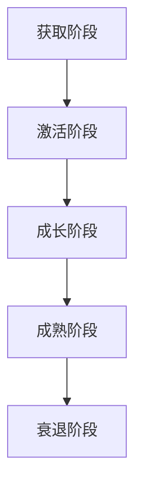

                 

# 彼得·林奇如何看待公司的客户粘性

## 关键词：客户粘性、彼得·林奇、投资分析、客户忠诚度、客户保留率

## 摘要：
客户粘性是衡量客户对公司产品或服务的依赖程度的重要指标，是企业长期盈利能力的关键因素。本文从彼得·林奇的投资视角，深入分析客户粘性的定义、衡量指标、驱动因素以及提升策略。通过结合理论与实际案例，探讨如何通过客户生命周期管理、产品创新和服务优化等手段，有效提升客户粘性，为企业创造持续价值。

---

# 第一部分：客户粘性的背景与重要性

## 第1章：客户粘性的概念与背景

### 1.1 什么是客户粘性

客户粘性是指客户对企业的产品或服务的依赖程度，客户粘性越高的企业，客户越难被竞争对手吸引，企业的盈利能力也越强。客户粘性不仅包括客户的行为表现，还包括客户的情感投入和经济利益的绑定。

**客户粘性的核心要素**：
- **行为粘性**：客户持续购买产品或服务的行为频率。
- **情感粘性**：客户对品牌的情感依赖和忠诚度。
- **经济粘性**：客户因经济利益或成本因素而难以转换供应商。

### 1.2 客户粘性的重要性

客户粘性是企业长期发展的基石，直接影响企业的市场份额和盈利能力。彼得·林奇在投资分析中非常重视客户粘性，认为客户粘性高的企业具备更强的竞争优势和投资价值。

**客户粘性对企业的战略意义**：
- **降低客户获取成本**：高粘性的客户更容易通过口碑传播吸引新客户，降低营销成本。
- **提高客户生命周期价值**：高粘性客户会持续购买，为企业创造更多收入。
- **增强抗风险能力**：在市场波动时，高粘性客户更可能保持忠诚，减少流失。

### 1.3 彼得·林奇与客户粘性

彼得·林奇是美国著名投资家，他强调投资于具备强大竞争优势和可持续发展能力的企业。在分析企业时，他特别关注客户粘性，认为客户粘性是企业抵御竞争和保持盈利能力的关键因素。

**彼得·林奇如何评估客户粘性**：
- **考察客户满意度**：客户是否满意并愿意长期使用产品。
- **分析客户保留率**：客户流失率低的企业通常具备较高的客户粘性。
- **研究客户净推荐值（NPS）**：客户愿意推荐给他人，说明客户粘性高。

---

## 第2章：客户粘性的核心概念与分析框架

### 2.1 客户粘性的维度

客户粘性可以从多个维度进行分析，每个维度反映了客户与企业之间的关系深度。

**客户粘性的维度分析**：
- **行为粘性**：客户的行为模式，如购买频率、购买金额等。
- **情感粘性**：客户对品牌的情感投入，如品牌忠诚度。
- **经济粘性**：客户因经济利益而难以转换，如长期合同或订阅模式。

### 2.2 客户粘性的驱动因素

客户粘性的高低取决于多个因素，包括产品、服务、品牌和客户体验等。

**客户粘性的驱动因素**：
- **产品价值**：产品的独特性和创新性。
- **服务质量**：客户支持的及时性和专业性。
- **品牌忠诚度**：客户对企业品牌的情感依赖。

### 2.3 客户粘性的衡量指标

通过量化指标可以更准确地评估客户粘性，帮助企业制定有效的策略。

**客户粘性的衡量指标**：
- **客户保留率**：客户在一定时间内继续使用产品或服务的比例。
- **客户生命周期价值（CLV）**：客户在企业生命周期内为企业带来的总收入。
- **客户净推荐值（NPS）**：客户推荐企业给他人的好感度。

---

# 第二部分：客户粘性的分析与评估

## 第3章：客户生命周期分析

### 3.1 客户生命周期模型

客户生命周期模型帮助企业理解客户在不同阶段的行为特征，从而制定相应的营销和服务策略。

**客户生命周期的阶段划分**：
1. **获取阶段**：吸引新客户。
2. **激活阶段**：促使新客户首次购买或使用产品。
3. **成长阶段**：客户逐渐增加购买频率和金额。
4. **成熟阶段**：客户进入稳定购买期。
5. **衰退阶段**：客户逐渐减少购买或停止使用。

**客户生命周期模型的可视化（Mermaid流程图）**：

### 3.2 客户生命周期价值的计算

客户生命周期价值（CLV）是衡量客户粘性的重要指标，计算公式如下：

$$ CLV = \text{客户平均收入} \times \text{客户生命周期} $$

**CLV计算步骤**：
1. 确定客户的平均收入。
2. 确定客户的平均生命周期。
3. 计算客户在生命周期内的总价值。

---

## 第4章：客户满意度与客户粘性分析

### 4.1 客户满意度的测量

客户满意度是客户粘性的重要影响因素，通过调查和数据分析可以准确衡量客户满意度。

**客户满意度调查方法**：
- **问卷调查**：设计标准化问卷，收集客户反馈。
- **访谈法**：深入了解客户的实际体验。
- **在线评分**：通过网站或应用收集客户评分。

### 4.2 客户投诉与客户流失分析

客户投诉和流失分析可以帮助企业发现潜在问题，及时调整策略。

**客户投诉的分类与处理**：
- **产品问题**：产品质量不达标。
- **服务问题**：客服响应慢或态度差。
- **价格问题**：价格不合理。

**客户流失的原因分析**：
- **产品替代性高**：市场上存在相似产品。
- **服务质量差**：客户体验不佳。
- **价格竞争力不足**：产品价格高于竞争对手。

---

# 第三部分：提升客户粘性的策略与方法

## 第5章：产品与服务创新对客户粘性的影响

### 5.1 产品创新的策略

产品创新是提升客户粘性的有效手段，通过持续改进和创新产品，可以满足客户不断变化的需求。

**产品创新的策略**：
- **持续改进现有产品**：根据客户反馈优化产品功能。
- **推出新产品**：满足市场新需求，吸引新客户。
- **产品差异化**：通过独特功能或设计脱颖而出。

### 5.2 客户关系管理的优化

有效的客户关系管理（CRM）可以帮助企业更好地维护客户关系，提升客户粘性。

**CRM的核心功能**：
- **客户信息管理**：记录和管理客户信息。
- **客户互动管理**：跟踪客户与企业的互动记录。
- **客户细分**：根据客户特征进行分类，制定个性化策略。

---

## 第6章：定价策略与客户粘性

### 6.1 价格敏感性分析

价格敏感性分析帮助企业理解客户对价格的敏感程度，制定合理的定价策略。

**价格敏感性分析方法**：
- **价格弹性测试**：通过调整价格观察销售量变化。
- **客户细分定价**：根据客户群体制定不同价格策略。

### 6.2 客户忠诚计划的设计

客户忠诚计划是提升客户粘性的有效工具，通过奖励机制激励客户持续购买。

**客户忠诚计划的设计原则**：
- **简单易懂**：客户容易理解和参与。
- **激励性强**：奖励机制能够有效激励客户。
- **可持续性**：计划长期可行，不会带来过度成本。

---

# 第四部分：案例分析与实战应用

## 第7章：案例分析：某科技公司的客户粘性提升

### 7.1 案例背景

某科技公司通过产品创新和服务优化，成功提升了客户粘性，成为行业领导者。

**案例分析**：
- **产品创新**：推出智能化产品，满足客户需求。
- **服务优化**：提供24/7客服支持，提升客户满意度。
- **客户忠诚计划**：推出积分奖励计划，激励客户持续购买。

### 7.2 数据分析与策略调整

通过数据分析，企业可以实时监控客户粘性指标，及时调整策略。

**数据分析工具**：
- **Google Analytics**：分析网站流量和用户行为。
- **客户关系管理系统（CRM）**：记录和分析客户数据。

---

# 第五部分：未来趋势与挑战

## 第8章：客户粘性未来的挑战与机遇

### 8.1 技术发展对客户粘性的影响

技术进步将改变客户与企业之间的互动方式，影响客户粘性的评估和提升。

**技术发展的影响**：
- **人工智能**：通过AI技术优化客户体验。
- **大数据分析**：精准预测客户行为，制定个性化策略。

### 8.2 全球化与客户粘性的挑战

全球化背景下，企业需要面对更复杂的市场环境，客户粘性的管理更具挑战性。

**全球化带来的挑战**：
- **文化差异**：不同地区的客户行为和偏好差异大。
- **竞争加剧**：全球市场竞争更加激烈，客户粘性管理难度增加。

---

# 结语

客户粘性是企业长期发展的关键因素，彼得·林奇的投资理念为企业提供了重要的指导。通过客户生命周期管理、产品创新和服务优化，企业可以有效提升客户粘性，实现可持续发展。

作者：AI天才研究院/AI Genius Institute & 禅与计算机程序设计艺术 /Zen And The Art of Computer Programming

