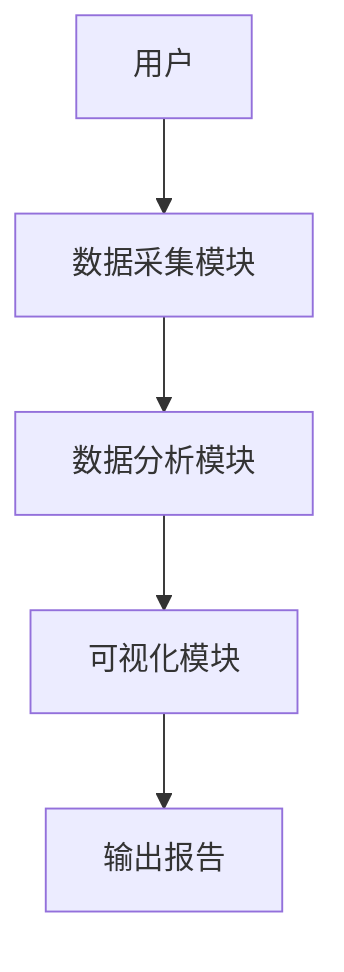

                 


# 彼得林奇如何看待公司的市场份额

## 关键词：市场份额, 彼得·林奇, 投资策略, 市场分析, 企业竞争力

## 摘要：本文从彼得·林奇的投资视角出发，深入分析了公司市场份额的核心概念、分析方法和实际应用场景。通过技术术语和实际案例，详细阐述了如何通过市场份额分析评估公司竞争力和投资价值。

---

## 第一部分：背景介绍：公司市场份额的核心概念

### 第1章：公司市场份额的定义与重要性

#### 1.1 公司市场份额的定义
- **1.1.1 什么是市场份额**
  - 市场份额是指公司在特定市场中所占的销售比例。
  - 示例：某公司在电子产品市场中占据20%的份额。

- **1.1.2 市场份额的计算方法**
  - 公式：$$\text{市场份额} = \frac{\text{公司销售额}}{\text{行业总销售额}}$$
  - 例如，公司销售额为100万元，行业总销售额为500万元，则市场份额为20%。

- **1.1.3 市场份额的行业差异**
  - 高科技行业 vs. 日常消费品行业：份额差异大，分析方法不同。

#### 1.2 为什么市场份额对公司和投资者至关重要
- **1.2.1 市场份额与公司竞争力的关系**
  - 高市场份额意味着公司有更强的市场影响力。
  - 例如，苹果在高端智能手机市场占据主导地位。

- **1.2.2 市场份额与投资价值的关联**
  - 高市场份额通常意味着稳定的收入和利润。
  - 例如，亚马逊在云计算市场的高份额确保了其盈利能力。

- **1.2.3 市场份额变化的预警信号**
  - 份额下降可能预示着公司竞争力的减弱或战略失误。
  - 例如，市场份额下降可能意味着公司需要调整产品或市场策略。

#### 1.3 彼得·林奇的投资理念概述
- **1.3.1 彼得·林奇的投资者身份与方法**
  - 林奇是价值投资的代表，注重基本面分析。
  - 他强调长期投资，寻找具有竞争优势的公司。

- **1.3.2 彼得·林奇对市场份额的关注点**
  - 他关注公司的市场份额是否稳定或增长。
  - 他喜欢投资那些市场份额持续增长的公司。

- **1.3.3 本书的核心问题与目标**
  - 探讨如何通过分析公司市场份额来评估投资价值。
  - 提供实用的分析工具和方法，帮助投资者做出明智决策。

---

## 第二部分：公司市场份额的核心概念与分析框架

### 第2章：市场份额的核心要素与结构

#### 2.1 市场份额的核心要素
- **2.1.1 产品或服务的市场定位**
  - 市场定位影响市场份额，例如高端市场或大众市场。
  - 例如，特斯拉在电动汽车市场的定位是高端，因此市场份额较高。

- **2.1.2 目标客户群体的特征**
  - 目标客户的需求和购买习惯直接影响市场份额。
  - 例如，年轻人可能更倾向于购买智能手机，影响市场份额。

- **2.1.3 竞争对手的市场份额分布**
  - 分析竞争对手的市场份额有助于了解行业格局。
  - 例如，分析竞争对手的市场份额可以帮助公司制定竞争策略。

#### 2.2 市场份额的结构与模型
- **2.2.1 市场份额的饼图模型（Mermaid图示）**
  ```mermaid
  pie
    "公司A": 30%
    "公司B": 25%
    "公司C": 20%
    "其他": 25%
  ```

- **2.2.2 企业竞争力的四维模型（Mermaid图示）**
  ```mermaid
  mindmap
    核心竞争力
      市场份额
        产品优势
        价格优势
      技术优势
        创新能力
        研发投入
      品牌影响力
        品牌知名度
        品牌忠诚度
      财务健康
        资金实力
        利润能力
  ```

#### 2.3 市场份额与企业竞争力的关系
- **2.3.1 市场份额的驱动因素分析**
  - 产品优势、价格优势、品牌影响力和财务健康是主要驱动因素。
  - 例如，苹果的产品创新和技术优势使其在高端市场占据高份额。

- **2.3.2 企业竞争力的外部与内部影响**
  - 外部因素：行业竞争、经济环境。
  - 内部因素：公司战略、管理效率。

---

## 第三部分：市场份额的算法原理与数学模型

### 第3章：市场份额分析的基本方法

#### 3.1 市场份额分析的核心算法
- **3.1.1 市场份额预测模型（Mermaid流程图）**
  ```mermaid
  graph TD
    A[开始] --> B[收集数据]
    B --> C[计算市场份额]
    C --> D[分析趋势]
    D --> E[结束]
  ```

- **3.1.2 竞争对手市场份额变化的分析方法**
  - 对比分析法：比较竞争对手的市场份额变化。
  - 趋势分析法：观察市场份额的变化趋势。

#### 3.2 市场份额的数学模型与公式
- **3.2.1 市场份额计算公式**
  $$\text{市场份额} = \frac{\text{公司销售额}}{\text{行业总销售额}}$$
  - 示例：公司销售额为100万元，行业总销售额为500万元，则市场份额为20%。

- **3.2.2 市场份额变化的预测公式**
  $$\Delta \text{市场份额} = \frac{\text{公司增长率} - \text{行业增长率}}{\text{行业增长率}}$$
  - 示例：公司增长率10%，行业增长率5%，则市场份额变化为：
    $$\Delta \text{市场份额} = \frac{10\% - 5\%}{5\%} = 1$$
    即市场份额增加1%。

#### 3.3 通俗易懂的市场份额分析案例
- **3.3.1 假设一个行业有5家公司，计算每家公司的市场份额**
  - 行业总销售额：1000万元。
  - 公司A：200万元（20%）。
  - 公司B：150万元（15%）。
  - 公司C：120万元（12%）。
  - 公司D：80万元（8%）。
  - 公司E：30万元（3%）。

- **3.3.2 假设行业增长率5%，公司A的增长率为10%，预测市场份额变化**
  $$\Delta \text{市场份额} = \frac{10\% - 5\%}{5\%} = 1\%$$
  - 公司A的市场份额将增加1%，从20%增加到21%。

---

## 第四部分：系统分析与架构设计

### 第4章：系统功能设计与架构

#### 4.1 系统功能设计
- **4.1.1 数据采集模块**
  - 收集行业和公司的销售数据。
  - 使用工具：数据库查询、API接口。

- **4.1.2 数据分析模块**
  - 计算市场份额。
  - 使用工具：Python、Pandas库。

- **4.1.3 可视化模块**
  - 绘制饼图和趋势图。
  - 使用工具：Matplotlib、Seaborn库。

#### 4.2 系统架构设计（Mermaid图示）


#### 4.3 接口设计与交互
- **接口设计**
  - RESTful API接口：提供数据接口，方便数据输入和输出。
  - 示例接口：`/api/data/upload` 接收数据文件。

- **交互设计**
  - 用户输入：选择行业和公司数据。
  - 系统输出：生成市场份额分析报告。

---

## 第五部分：项目实战

### 第5章：环境安装与系统实现

#### 5.1 环境安装
- **安装Python**
  - 安装步骤：使用pip安装Python和相关库。
  - 示例代码：
    ```bash
    python -m pip install pandas matplotlib
    ```

#### 5.2 核心代码实现
- **数据采集模块**
  ```python
  import pandas as pd

  # 读取数据文件
  df = pd.read_csv('market_share.csv')
  ```

- **数据分析模块**
  ```python
  # 计算市场份额
  company_share = df['公司销售额'] / df['行业总销售额']
  ```

- **可视化模块**
  ```python
  import matplotlib.pyplot as plt

  plt.pie(company_share, labels=df['公司名称'], autopct='%1.1f%%')
  plt.show()
  ```

#### 5.3 案例分析与结果解读
- **案例分析**
  - 分析某行业（如智能手机市场）的市场份额。
  - 使用上述代码生成饼图，展示各公司的市场份额。

- **结果解读**
  - 通过饼图分析，识别市场份额领先公司及其竞争优势。
  - 例如，苹果在高端市场的份额较高，可能得益于其品牌和技术优势。

---

## 第六部分：最佳实践与总结

### 第6章：彼得·林奇的策略总结

#### 6.1 本章小结
- 彼得·林奇强调长期投资和公司竞争力。
- 分析市场份额是评估投资价值的重要指标。

#### 6.2 注意事项
- 数据来源的准确性。
- 分析方法的适用性。
- 结合其他因素（如财务状况、行业趋势）进行综合分析。

#### 6.3 拓展阅读
- 推荐书籍：《彼得·林奇的成功投资》。
- 推荐博客：深入探讨市场份额分析的技术博客。

---

## 作者：AI天才研究院/AI Genius Institute & 禅与计算机程序设计艺术 /Zen And The Art of Computer Programming

---

本文通过系统化的分析和实战案例，深入探讨了彼得·林奇如何看待公司的市场份额。从核心概念到数学模型，从系统设计到项目实战，为读者提供了全面的分析工具和方法，帮助投资者和企业在竞争激烈的市场中做出明智决策。

