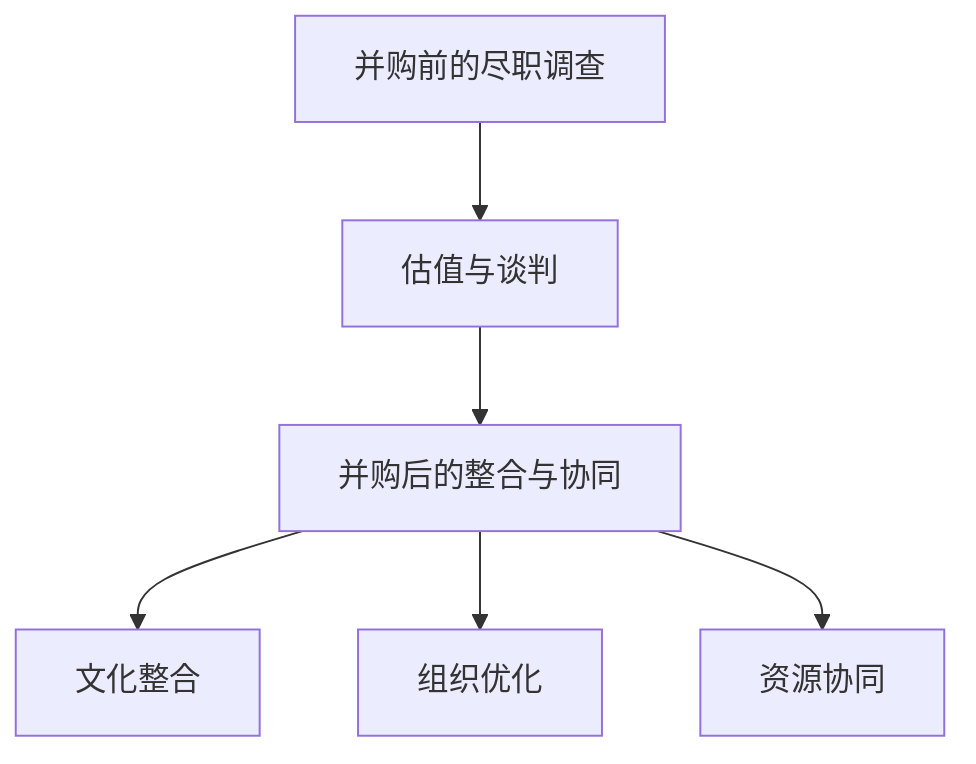
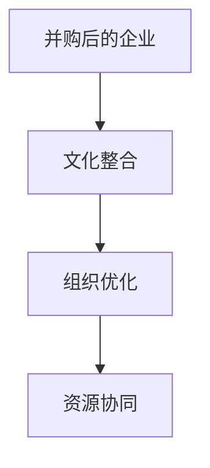

                 


# 彼得林奇如何看待公司的并购整合能力

## 关键词：彼得林奇，并购整合，企业战略，投资策略，风险管理

## 摘要：并购整合是企业战略中的重要环节，而彼得林奇作为投资界的传奇人物，对并购整合有着独特的见解。本文从彼得林奇的投资哲学出发，分析他在并购整合中的策略与方法，并结合实际案例，探讨并购整合的核心概念、算法原理和系统架构设计，为读者提供全面的理论与实践指导。

---

## 第1章：并购整合的定义与重要性

### 1.1 并购整合的定义

#### 1.1.1 并购的定义与类型
并购（Mergers and Acquisitions, M&A）是指一家企业与其他企业合并或收购其资产、股权等行为。并购可以分为以下几种类型：
- **横向并购**：同一行业内的企业合并，以扩大市场份额。
- **纵向并购**：产业链上下游企业的合并，以控制更多环节。
- **混合并购**：不同行业或不同业务的企业合并，以实现多元化发展。

#### 1.1.2 整合的定义与目标
整合是指在并购后，将两家企业的资源、组织结构、文化等进行融合的过程。整合的目标是实现协同效应，最大化企业价值。

#### 1.1.3 并购整合的核心要素
- **战略一致性**：并购后的企业战略目标一致。
- **组织协同性**：组织结构和流程的协调。
- **文化融合**：企业文化的兼容与融合。

### 1.2 并购整合的重要性

#### 1.2.1 并购整合在企业战略中的作用
- **扩大规模**：通过并购快速扩大企业规模。
- **优化资源**：整合资源，提高效率。
- **提升竞争力**：通过协同效应增强市场竞争力。

#### 1.2.2 并购整合对行业竞争的影响
- **市场集中度提高**：并购整合可能导致行业集中度上升。
- **竞争优势增强**：整合后的企业可能在技术、市场份额等方面更具优势。

#### 1.2.3 并购整合对股东价值的提升
- **协同效应**：整合后的协同效应可能带来更高的股东价值。
- **成本降低**：通过资源整合降低成本，提升盈利能力。

### 1.3 并购整合的历史发展

#### 1.3.1 并购整合的历史演变
并购整合的历史可以追溯到工业革命时期，随着企业规模的扩大，整合逐渐成为企业战略的重要组成部分。

#### 1.3.2 并购整合的现代趋势
现代并购整合更加注重协同效应和文化融合，同时技术的发展也为企业整合提供了更多工具和方法。

#### 1.3.3 并购整合的全球化视角
随着全球化的推进，跨国并购和整合成为趋势，企业在跨国整合中面临更多挑战和机遇。

---

## 第2章：彼得·林奇的并购整合理念

### 2.1 彼得·林奇的投资哲学

#### 2.1.1 彼得·林奇的投资理念概述
彼得·林奇是美国著名的投资经理人，以其成功的投资策略和对企业的深入分析闻名。他认为投资的关键在于选择具有持续竞争优势的企业。

#### 2.1.2 彼得·林奇的选股标准
- **财务健康**：企业财务状况稳健，盈利能力强。
- **管理团队**：管理层经验丰富，能力强。
- **行业地位**：企业在行业中具有竞争优势。

#### 2.1.3 彼得·林奇的风险管理策略
- **分散投资**：避免过度集中投资。
- **长期视角**：注重长期价值，而非短期波动。

### 2.2 彼得·林奇如何看待并购整合

#### 2.2.1 并购整合在彼得·林奇投资策略中的地位
彼得·林奇认为，并购整合是企业实现增长和提升竞争力的重要手段，但并非所有并购都成功。

#### 2.2.2 彼得·林奇对并购整合成功的关键因素
- **战略一致性**：并购后的企业战略目标一致。
- **文化融合**：企业文化兼容，整合顺利。
- **管理层能力**：管理层具备整合能力和战略眼光。

#### 2.2.3 彼得·林奇对并购整合失败的反思
彼得·林奇认为，并购失败的主要原因在于整合过程中缺乏规划和执行力，或者忽视了文化差异。

---

## 第3章：并购整合的核心概念与联系

### 3.1 并购整合的类型

#### 3.1.1 横向并购
横向并购是同一行业内的企业合并，旨在扩大市场份额。例如，两家竞争对手的合并可以减少竞争，提高定价能力。

#### 3.1.2 纵向并购
纵向并购是产业链上下游企业的合并，旨在控制更多环节。例如，汽车制造企业并购零部件供应商。

#### 3.1.3 混合并购
混合并购是不同行业或不同业务的企业合并，旨在实现多元化发展。例如，科技企业并购传统制造业企业。

### 3.2 并购整合的关键要素

#### 3.2.1 企业文化整合
企业文化整合是并购整合的重要部分，企业文化差异可能导致整合失败。例如，一家注重创新的企业并购一家注重效率的企业，可能导致文化冲突。

#### 3.2.2 组织结构整合
组织结构整合需要重新设计企业架构，确保整合后的组织高效运行。例如，合并后的公司可能需要调整部门结构，优化管理流程。

#### 3.2.3 资源整合
资源整合包括人力资源、财务资源、技术资源等的整合。例如，并购后的企业需要整合技术资源，优化研发流程。

### 3.3 并购整合的流程

#### 3.3.1 并购前的尽职调查
尽职调查是并购前的重要步骤，包括对目标企业的财务状况、法律问题、管理层能力等进行详细调查。

#### 3.3.2 并购中的估值与谈判
估值与谈判是并购的核心环节，企业需要合理评估目标企业的价值，并进行有效的谈判。

#### 3.3.3 并购后的整合与协同
整合与协同是并购后的关键步骤，包括企业文化整合、组织结构优化、资源优化配置等，以实现协同效应。

---

## 第4章：并购整合的数学模型与算法原理

### 4.1 并购整合的加权平均法

#### 4.1.1 加权平均法的定义
加权平均法是一种常用的并购估值方法，通过给目标企业的各项指标赋予不同的权重，计算加权平均值。

#### 4.1.2 加权平均法的公式推导
加权平均法的公式为：
$$
\text{加权平均值} = \sum (\text{权重} \times \text{指标值})
$$

#### 4.1.3 加权平均法的案例分析
例如，假设目标企业A的利润为100，权重为0.4；目标企业B的利润为80，权重为0.6。则加权平均利润为：
$$
0.4 \times 100 + 0.6 \times 80 = 40 + 48 = 88
$$

### 4.2 并购整合的决策树模型

#### 4.2.1 决策树模型的定义
决策树模型是一种用于决策分析的工具，通过绘制决策树来分析不同决策路径的结果。

#### 4.2.2 决策树模型的构建步骤
1. 确定决策目标。
2. 识别可能的决策方案。
3. 分析每种决策的可能结果和概率。
4. 计算每种决策的期望值。
5. 选择最优决策方案。

#### 4.2.3 决策树模型的案例分析
例如，企业在考虑是否并购目标企业，可以通过决策树模型分析并购与不并购的可能结果和概率。

---

## 第5章：并购整合的系统分析与架构设计

### 5.1 并购整合的系统功能设计

#### 5.1.1 并购前的尽职调查
- **目标企业分析**：分析目标企业的财务状况、管理团队、市场地位等。
- **风险评估**：评估并购可能带来的风险。

#### 5.1.2 并购中的估值与谈判
- **估值模型**：使用加权平均法、决策树模型等进行估值。
- **谈判策略**：制定合理的谈判策略，确保并购价格合理。

#### 5.1.3 并购后的整合与协同
- **文化整合**：制定企业文化整合方案，促进文化融合。
- **组织优化**：重新设计组织结构，优化管理流程。
- **资源协同**：整合资源，提高协同效应。

### 5.2 并购整合的系统架构设计

#### 5.2.1 系统架构图
以下是一个并购整合系统的简要架构图：



#### 5.2.2 系统接口设计
- **接口1**：目标企业数据接口，用于获取目标企业的财务数据、管理团队信息等。
- **接口2**：并购估值接口，用于计算并购的估值。
- **接口3**：整合协同接口，用于监控整合过程中的协同效应。

---

## 第6章：并购整合的项目实战

### 6.1 项目背景与目标
假设我们是一家科技企业，希望通过并购整合一家同类企业，提升市场份额和技术创新能力。

### 6.2 项目环境与工具
- **工具**：Python、Excel、Mermaid、LaTeX。
- **环境**：Windows或Mac操作系统，Python 3.8以上版本。

### 6.3 项目实现

#### 6.3.1 并购前的尽职调查
编写Python代码，从目标企业获取财务数据，并进行初步分析：

```python
import pandas as pd

# 读取目标企业财务数据
df = pd.read_csv('target_financial.csv')

# 计算财务指标
profitability = df['净利润'].mean()
liquidity = df['现金流'].mean()

print(f"盈利能力：{profitability}")
print(f"流动性：{liquidity}")
```

#### 6.3.2 并购中的估值与谈判
使用加权平均法计算并购估值：

```python
# 定义权重
weights = {'净利润': 0.4, '收入': 0.3, '资产': 0.3}

# 计算加权平均值
def calculate_weighted_average(values, weights):
    return sum(v * w for v, w in zip(values, weights.values())) / sum(weights.values())

# 计算估值
valuation = calculate_weighted_average([100, 80, 90], weights)
print(f"并购估值：{valuation}")
```

#### 6.3.3 并购后的整合与协同
绘制整合过程的流程图：



---

## 第7章：并购整合的注意事项与拓展阅读

### 7.1 注意事项
- **文化差异**：并购整合中需要注意企业文化差异，避免文化冲突。
- **整合风险**：并购整合存在失败风险，企业需要制定应对措施。
- **监管合规**：并购过程中需要遵守相关法律法规。

### 7.2 拓展阅读
- **《彼得林奇的成功投资策略》**：深入理解彼得林奇的投资哲学。
- **《并购整合的实务操作》**：学习并购整合的具体操作方法。
- **《企业战略管理》**：了解企业战略管理的相关理论。

---

## 小结

并购整合是企业战略中的重要环节，而彼得林奇的并购整合理念为企业提供了宝贵的借鉴。通过本文的分析，我们可以看到，并购整合的成功不仅需要战略规划，还需要文化融合和组织优化。希望本文的内容能够为读者在并购整合领域提供有益的指导。

---

## 作者

作者：AI天才研究院/AI Genius Institute & 禅与计算机程序设计艺术 /Zen And The Art of Computer Programming

