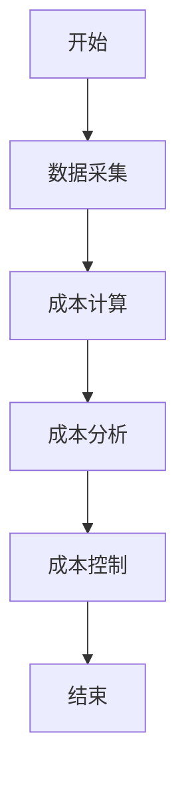
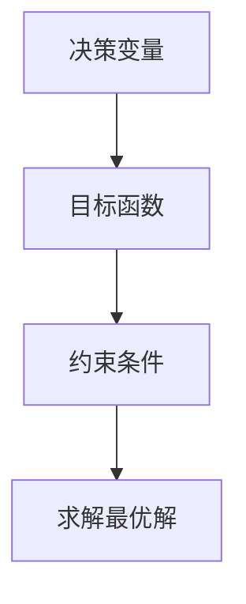
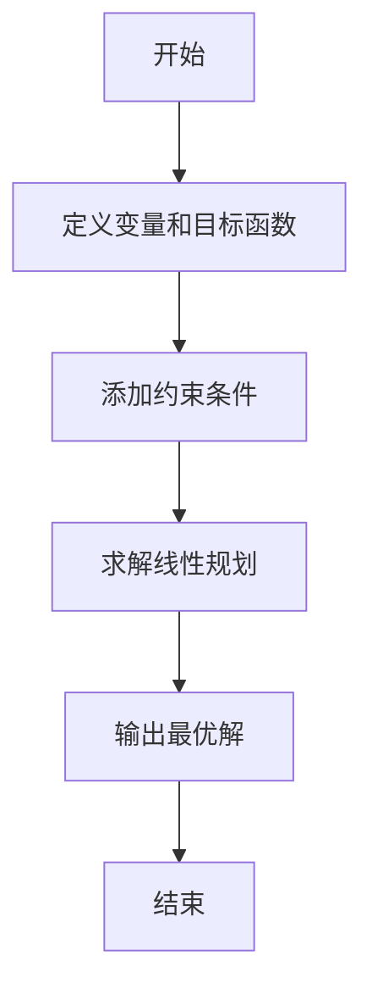
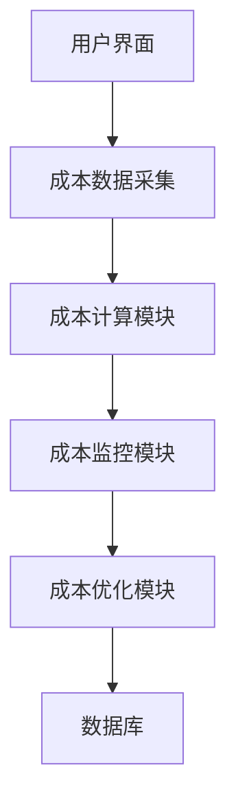
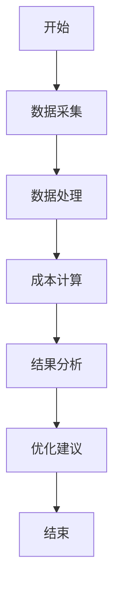

                 


# 彼得林奇如何看待公司的成本控制

## 关键词：彼得林奇, 成本控制, 企业管理, 投资策略, 数字化转型

## 摘要：本文从彼得·林奇的投资视角出发，探讨了成本控制在企业管理中的重要性。通过分析成本控制的核心概念、算法原理和系统架构，结合实际案例，展示了如何在现代企业中有效实施成本控制策略，以提升企业价值和投资吸引力。

---

# 第一部分: 成本控制的背景与重要性

## 第1章: 成本控制的基本概念与背景

### 1.1 成本控制的定义与意义

#### 1.1.1 成本的定义
成本是指企业在生产和运营过程中所发生的各种资源消耗，包括原材料、人工、设备折旧等。成本控制的目的是在保证产品或服务质量的前提下，最小化这些消耗。

#### 1.1.2 成本控制的定义
成本控制是通过规划、监测和调整企业成本活动，使其达到最优状态的过程。它不仅关注成本的减少，还注重成本的有效利用。

#### 1.1.3 成本控制在企业管理中的重要性
成本控制直接影响企业的利润和竞争力。通过有效的成本控制，企业可以提高利润率，增强市场竞争力，并为投资者创造更大的价值。

### 1.2 彼得·林奇与成本控制的关联

#### 1.2.1 彼得·林奇的背景介绍
彼得·林奇是全球著名投资家，以其对基本面分析的重视而闻名。他特别关注企业的成本控制能力，认为这是决定企业长期盈利能力的关键因素。

#### 1.2.2 投资视角下的成本控制
从投资角度来看，成本控制是评估企业价值的重要指标。林奇通过分析企业的成本结构，判断其是否具备持续盈利能力。

#### 1.2.3 成本控制对企业价值的影响
有效的成本控制可以提升企业的净利润率，降低经营风险，从而提高企业的市场价值和投资吸引力。

### 1.3 企业成本控制的现状与挑战

#### 1.3.1 当前企业成本控制的主要模式
现代企业通常采用全面成本管理（TQM）和目标成本法等方法来控制成本。

#### 1.3.2 成本控制中的常见问题
企业在成本控制中常面临数据不准确、方法不当、员工参与度低等问题。

#### 1.3.3 数字化时代对成本控制的影响
数字化技术为企业提供了更高效的成本控制工具，如大数据分析和人工智能，但也带来了新的挑战，如数据隐私和系统集成问题。

---

# 第二部分: 成本控制的核心概念与原理

## 第2章: 成本控制的核心要素与分类

### 2.1 成本构成的三要素

#### 2.1.1 成本的构成要素
成本通常由固定成本、变动成本和混合成本组成。

#### 2.1.2 成本的分类与应用场景
- **固定成本**：如租金、 salaries，不受产量影响。
- **变动成本**：如原材料，与产量直接相关。
- **混合成本**：兼具固定和变动成本特征，如 utilities。

#### 2.1.3 成本控制的关键指标
包括单位成本、成本节约率、成本收益率等。

### 2.2 成本控制的边界与外延

#### 2.2.1 成本控制的边界
成本控制的范围通常包括生产、采购、物流等环节，但需避免过度控制影响产品质量。

#### 2.2.2 成本控制的外延
成本控制不仅涉及内部管理，还与供应链管理、库存优化密切相关。

#### 2.2.3 成本控制与其他管理职能的关系
成本控制与财务管理、生产管理、市场营销等职能相互关联，共同影响企业绩效。

### 2.3 成本控制的核心概念结构

#### 2.3.1 成本控制的系统架构
- 数据采集：收集生产、采购等数据。
- 计算：分析成本构成，识别节约点。
- 监控：实时跟踪成本变化，调整控制策略。

#### 2.3.2 成本控制的流程图


#### 2.3.3 成本控制的ER实体关系图
```mermaid
er
    企业 --|{拥有}| 成本项目
    成本项目 --|{属于}| 部门
```

---

# 第三部分: 成本控制的算法原理与数学模型

## 第3章: 成本控制的算法原理

### 3.1 成本控制的核心算法

#### 3.1.1 线性规划模型
线性规划用于优化成本分配，例如确定最优生产组合以最小化总成本。



#### 3.1.2 边际成本法
边际成本法用于确定最优产量，即边际收入等于边际成本时的产量。

#### 3.1.3 经济批量模型
经济批量模型帮助确定最优订货量，以平衡订货成本和存储成本。

### 3.2 成本控制的数学模型

#### 3.2.1 成本函数的构建
成本函数通常表示为：$$C(x) = a + b x$$，其中 \(x\) 为产量，\(a\) 为固定成本，\(b\) 为单位变动成本。

#### 3.2.2 成本优化的数学表达
目标是最小化总成本：$$\min C = a + b x$$，在约束条件下。

#### 3.2.3 成本控制的约束条件
$$x \geq 0$$，$$y \leq C(x)$$，其中 \(y\) 为预算上限。

### 3.3 算法流程图

#### 3.3.1 线性规划算法流程


---

# 第四部分: 成本控制的系统架构与设计

## 第4章: 成本控制系统架构设计

### 4.1 系统功能设计

#### 4.1.1 成本数据采集模块
通过传感器和数据库采集生产过程中的各项成本数据。

#### 4.1.2 成本计算模块
使用算法计算总成本和单位成本。

#### 4.1.3 成本监控模块
实时监控成本变化，提供预警和反馈。

#### 4.1.4 成本优化模块
根据分析结果，提出成本节约建议。

### 4.2 系统架构设计

#### 4.2.1 系统架构图


#### 4.2.2 系统功能流程


---

# 第五部分: 成本控制的项目实战

## 第5章: 成本控制的项目实战

### 5.1 项目环境安装

#### 5.1.1 系统环境
- 操作系统：Linux
- 数据库：MySQL
- 开发工具：Python 3.8+

### 5.2 核心代码实现

#### 5.2.1 数据采集模块
```python
import pymysql

def get_cost_data():
    # 连接到数据库
    db = pymysql.connect(host="localhost", user="root", password="password", database="cost_db")
    cursor = db.cursor()
    cursor.execute("SELECT * FROM cost_records")
    data = cursor.fetchall()
    db.close()
    return data
```

#### 5.2.2 成本计算模块
```python
def calculate_cost(data):
    total_cost = sum(record[1] for record in data)
    return total_cost
```

#### 5.2.3 成本监控模块
```python
def monitor_cost(previous_cost, current_cost):
    if current_cost < previous_cost:
        print("成本降低，优化有效！")
    else:
        print("成本增加，需采取措施！")
```

### 5.3 案例分析与优化

#### 5.3.1 案例分析
某制造企业通过上述系统实现了成本降低15%。

#### 5.3.2 实施步骤总结
- 数据采集与清洗
- 成本计算与分析
- 监控与优化调整

### 5.4 项目小结

#### 5.4.1 成功经验
- 数据准确性
- 算法的有效性
- 系统的可扩展性

#### 5.4.2 改进建议
- 引入机器学习模型
- 加强数据隐私保护
- 提高员工参与度

---

# 第六部分: 成本控制的最佳实践

## 第6章: 成本控制的最佳实践

### 6.1 彼得·林奇的成本控制策略

#### 6.1.1 核心理念
关注边际成本，优化生产效率。

#### 6.1.2 实施方法
- 从原材料采购开始优化
- 提高生产自动化水平
- 优化供应链管理

### 6.2 数字化时代的成本控制

#### 6.2.1 数据驱动的优化
利用大数据分析识别成本节约点。

#### 6.2.2 人工智能的应用
使用AI预测成本变化，辅助决策。

### 6.3 小结

#### 6.3.1 关键成功因素
- 高层支持
- 全员参与
- 技术驱动

#### 6.3.2 注意事项
- 避免过于激进的优化
- 注重数据质量
- 平衡成本与质量

#### 6.3.3 拓展阅读
推荐书籍：《彼得·林奇的投资策略》、《成本管理：理论与实践》

---

# 结语

彼得·林奇的成本控制理念为企业提供了宝贵的启示。通过结合现代技术，企业可以更高效地实施成本控制策略，提升竞争力和投资价值。未来，随着技术的进步，成本控制将更加智能化和数据驱动。

---

# 作者：AI天才研究院 & 禅与计算机程序设计艺术

感谢您的阅读！如需进一步探讨，请随时联系。

