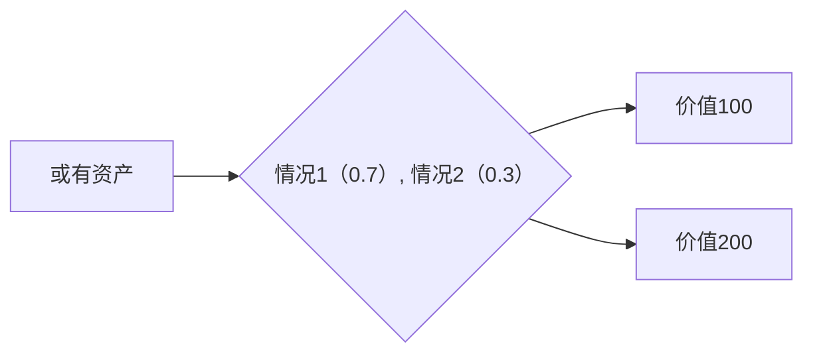

                 


# 彼得·林奇如何看待公司的或有资产价值

## 关键词：彼得·林奇、或有资产、投资价值、资产评估、风险管理

## 摘要：本文深入探讨了彼得·林奇如何分析公司的或有资产价值。首先介绍了或有资产的基本概念和分类，然后分析了彼得·林奇的投资理念和评估方法，接着详细阐述了或有资产的数学模型和系统架构设计，最后通过实际案例分析展示了如何在投资决策中应用这些方法。

---

# 第1章: 或有资产的基本概念与背景

## 1.1 或有资产的定义与分类

### 1.1.1 或有资产的定义
或有资产是指公司在未来可能获得的资产，其价值取决于特定条件是否满足。例如，未决诉讼的胜诉、合同履行的可能性等都属于或有资产的范畴。

| 分类 | 特征 | 例子 |
|------|------|------|
| 确定性或有资产 | 可能性极高 | 未决诉讼胜诉概率超过90% |
| 可能性或有资产 | 可能性中等 | 未来一年内可能获得的专利 |
| 或有负债 | 可能性较低 | 未决诉讼败诉概率低于10% |

### 1.1.2 或有资产的分类
或有资产可以分为以下几类：
1. **确定性或有资产**：可能性极高，通常出现在公司财务报表的“其他应收款”或“预计负债”中。
2. **可能性或有资产**：可能性中等，通常需要进一步分析。
3. **或有负债**：可能性较低，通常被视为潜在的财务风险。

### 1.1.3 或有资产的特征与属性对比表格
下表对比了或有资产与确定性资产的主要区别：

| 特征 | 或有资产 | 确定性资产 |
|------|----------|------------|
| 存在性 | 未来可能获得 | 当前已获得 |
| 价值 | 取决于条件 | 确定 |
| 风险 | 高 | 低 |

## 1.2 彼得·林奇的背景与投资理念

### 1.2.1 彼得·林奇的生平简介
彼得·林奇（Peter Lynch）是美国著名的职业棒球运动员，以其在美国职业棒球大联盟（MLB）的卓越表现而闻名。他的职业生涯跨越了多个时代，是棒球历史上最伟大的球员之一。

### 1.2.2 彼得·林奇的投资哲学
林奇的投资哲学基于以下几个核心原则：
1. **长期投资**：他认为投资是马拉松，而不是短跑。
2. **分散投资**：通过投资不同类型的资产来降低风险。
3. **价值投资**：寻找被市场低估的资产。

### 1.2.3 彼得·林奇对或有资产的看法
林奇认为，或有资产的价值取决于其未来的可能性。他强调，在评估或有资产时，必须考虑其发生的概率以及潜在的财务影响。

---

# 第2章: 或有资产的评估方法与数学模型

## 2.1 或有资产的评估原理

### 2.1.1 或有资产的现值计算公式
或有资产的现值（PV）可以通过以下公式计算：

$$ PV = \frac{FV}{(1 + r)^n} $$

其中：
- \( FV \) 是未来价值
- \( r \) 是折现率
- \( n \) 是时间（年）

### 2.1.2 或有资产的风险调整现值模型
风险调整的现值（RAP）模型考虑了资产的风险因素：

$$ RAP = PV + \text{风险溢价} $$

### 2.1.3 或有资产的期望值与概率分析
期望值（EV）计算公式为：

$$ EV = \sum (P_i \times FV_i) $$

其中，\( P_i \) 是第 \( i \) 种情况的概率，\( FV_i \) 是第 \( i \) 种情况的未来价值。

## 2.2 或有资产的数学模型

### 2.2.1 或有资产的未来现金流预测公式
未来现金流（FCF）预测公式：

$$ FCF = \sum_{t=1}^{n} \frac{CF_t}{(1 + r)^t} $$

### 2.2.2 或有资产的风险调整折现率模型
风险调整折现率（RAB）模型：

$$ RAB = r + \text{风险溢价} $$

### 2.2.3 或有资产的期权定价模型
Black-Scholes期权定价公式：

$$ C = S_0 e^{rT} N(d_1) - K e^{rT} N(d_2) $$

其中：
- \( S_0 \) 是标的资产当前价格
- \( K \) 是执行价格
- \( r \) 是无风险利率
- \( T \) 是时间至到期日
- \( N(d) \) 是标准正态分布的累积分布函数
- \( d_1 = \frac{\ln(\frac{S_0}{K}) + (r + \frac{\sigma^2}{2})T}{\sigma \sqrt{T}} \)
- \( d_2 = d_1 - \sigma \sqrt{T} \)

---

# 第3章: 彼得·林奇的或有资产分析框架

## 3.1 或有资产的决策树分析

### 3.1.1 或有资产的可能结果分析
决策树用于分析或有资产的各种可能结果及其概率：

```
                或有资产
              /     \     
         情况1（概率=0.7） 情况2（概率=0.3）
```

### 3.1.2 或有资产的概率分布模型
概率分布模型展示了或有资产在不同情况下的分布：

| 情况 | 概率 | 价值 |
|------|------|------|
| A    | 0.3  | 100  |
| B    | 0.5  | 200  |
| C    | 0.2  | 300  |

### 3.1.3 或有资产的决策树绘制（Mermaid流程图）



## 3.2 或有资产的系统架构设计

### 3.2.1 系统功能模块划分
系统功能模块包括：
1. 数据输入模块
2. 模型计算模块
3. 结果展示模块

### 3.2.2 系统架构图（Mermaid架构图）

```mermaid
rect
    分为三个区域：
    数据输入模块、模型计算模块、结果展示模块
```

---

# 第4章: 彼得·林奇的或有资产投资策略

## 4.1 或有资产的投资组合管理

### 4.1.1 投资组合的分散化原则
分散化投资可以降低风险：

$$ \text{组合风险} < \text{单一资产风险} $$

### 4.1.2 或有资产在投资组合中的权重分配
权重分配应基于资产的风险和收益：

| 资产 | 权重 |
|------|------|
| 或有资产A | 30% |
| 或有资产B | 20% |

### 4.1.3 或有资产的风险收益比分析
风险收益比（Risk-Reward Ratio）：

$$ \text{风险收益比} = \frac{\text{预期收益}}{\text{风险}} $$

## 4.2 或有资产的长期价值判断

### 4.2.1 公司基本面分析
基本面分析包括盈利能力、财务状况和行业地位。

### 4.2.2 行业趋势分析
行业趋势分析有助于判断资产的未来价值。

### 4.2.3 竞争优势分析
竞争优势分析包括成本优势、技术优势等。

---

# 第5章: 或有资产的项目实战与案例分析

## 5.1 环境安装与数据准备

### 5.1.1 数据收集与清洗
数据来源包括财务报表、市场报告等。

### 5.1.2 数据分析工具安装
常用工具包括Excel、Python（Pandas、NumPy）等。

### 5.1.3 数据可视化工具使用
使用Matplotlib或Seaborn进行数据可视化。

## 5.2 核心算法实现与代码解读

### 5.2.1 或有资产评估算法实现
Python代码示例：

```python
def calculate_pv(future_value, discount_rate, years):
    return future_value / (1 + discount_rate) ** years
```

### 5.2.2 投资组合优化算法实现
Python代码示例：

```python
import numpy as np
from scipy.optimize import minimize

def portfolio_optimization(returns, weights):
    n = len(weights)
    objective = lambda w: np.sum(w * returns * w.T)
    constraints = [{'type': 'eq', 'fun': lambda w: np.sum(w) - 1}]
    result = minimize(objective, weights, constraints)
    return result.x
```

### 5.2.3 代码解读与功能分析
上述代码实现了现值计算和投资组合优化，帮助投资者评估或有资产的价值。

## 5.3 案例分析与经验总结

### 5.3.1 典型案例分析
以某公司或有资产为例，分析其价值和风险。

### 5.3.2 投资决策过程总结
总结投资决策的关键步骤和注意事项。

---

# 总结

彼得·林奇的投资理念强调长期、分散和价值投资。通过对或有资产的深入分析，投资者可以更好地评估其潜在价值，做出更明智的投资决策。

---

# 作者：AI天才研究院/AI Genius Institute & 禅与计算机程序设计艺术 /Zen And The Art of Computer Programming

