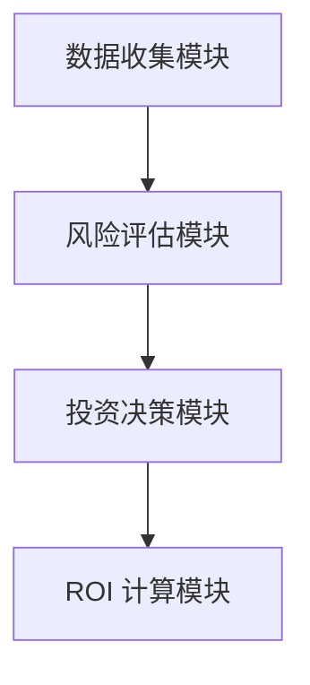

                 


# 彼得林奇如何看待公司的数据安全投资回报率

## 关键词：数据安全，投资回报率，彼得·林奇，风险管理，数据资产

## 摘要：  
本文深入探讨了彼得·林奇对数据安全投资回报率的看法，从数据安全的重要性、投资回报率的定义、数学模型的建立、系统架构的设计，到实际项目中的应用，全面解析如何评估和优化数据安全投资。通过案例分析和代码实现，本文为读者提供了实用的方法和工具，帮助企业在数字化时代做出明智的投资决策。

---

## 第一章：数据安全投资回报率的背景与重要性

### 1.1 数据安全的重要性

#### 1.1.1 数据泄露的代价  
在数字化时代，数据成为企业的核心资产。数据泄露可能导致的损失包括：  
- 企业的声誉损失：客户信任的丧失可能导致客户流失，进而影响收入。  
- 财务损失：直接的罚款（如 GDPR 违规的罚款）和间接的修复成本（如恢复数据、修复系统漏洞等）。  
- 法律责任：企业可能面临法律诉讼和赔偿责任。  

#### 1.1.2 数据安全投资的必要性  
数据安全投资是保护企业数据资产的重要手段。通过投资数据安全技术、培训员工和制定安全策略，企业可以有效降低数据泄露的风险，保障业务的连续性和稳定性。  

#### 1.1.3 数据安全与企业竞争力的关系  
数据安全不仅是合规性的要求，更是企业竞争力的重要组成部分。数据安全能力强的企业能够更好地保护客户数据，提升客户信任，从而在市场中获得竞争优势。

---

### 1.2 投资回报率的基本概念

#### 1.2.1 投资回报率的定义  
投资回报率（ROI，Return on Investment）是衡量投资效益的重要指标，计算公式为：  
$$ROI = \frac{\text{净收益}}{\text{投资成本}} \times 100\%$$  

#### 1.2.2 数据安全投资回报率的特殊性  
数据安全投资回报率的特殊性在于其收益难以直接量化。数据安全投资的直接收益是避免损失，因此需要通过估算潜在损失来间接计算投资回报率。

#### 1.2.3 彼得·林奇对投资回报率的分析方法  
彼得·林奇以基本面分析著称，他强调通过深入研究企业基本面来评估投资回报。在数据安全领域，林奇可能会关注企业的数据资产价值、安全措施的有效性以及潜在风险的可控性。

---

## 第二章：数据安全投资回报率的核心概念

### 2.1 数据安全投资回报率的定义与特点

#### 2.1.1 数据安全投资回报率的定义  
数据安全投资回报率是指企业在数据安全方面的投资所产生的收益与投资成本的比率。  
$$\text{数据安全 ROI} = \frac{\text{数据安全带来的收益}}{\text{数据安全投资成本}} \times 100\%$$  

#### 2.1.2 数据安全投资回报率的核心要素  
- 数据资产的价值评估：数据对企业的重要性决定了安全投资的必要性。  
- 数据安全风险的量化：通过风险评估确定数据安全投资的重点领域。  
- 投资成本与收益的平衡：在有限的预算内，选择最优的安全措施组合。

#### 2.1.3 彼得·林奇视角下的数据安全投资回报率  
林奇可能会强调数据安全投资的长期效益，认为通过合理配置资源，可以在降低风险的同时提升企业的长期价值。

---

## 第三章：数据安全投资回报率的数学模型与算法

### 3.1 数据安全投资回报率的数学公式

#### 3.1.1 数据安全投资回报率的计算公式  
数据安全投资回报率的计算公式如下：  
$$ROI = \frac{\text{预期损失减少} - \text{安全投资成本}}{\text{安全投资成本}} \times 100\%$$  

#### 3.1.2 预期损失的计算  
预期损失可以通过以下步骤计算：  
1. 确定数据资产的潜在损失（如罚款、修复成本等）。  
2. 评估安全措施的有效性，确定其降低风险的能力。  
3. 计算预期损失的减少量。  

#### 3.1.3 投资成本的计算  
投资成本包括技术投入（如防火墙、加密设备等）、人力资源投入（如安全培训、团队建设）以及其他相关费用。

---

### 3.2 数据安全投资回报率的算法实现

#### 3.2.1 算法步骤  
1. 估算数据资产的潜在损失。  
2. 确定安全措施的成本。  
3. 计算预期损失的减少量。  
4. 应用 ROI 公式计算投资回报率。  

#### 3.2.2 算法实现示例  
以下是一个简单的 Python 实现：  

```python
def calculate_data_security ROI(potential_loss, investment_cost, risk_reduction):
    expected_loss_reduction = potential_loss * (1 - risk_reduction)
    net_benefit = expected_loss_reduction - investment_cost
    ROI = (net_benefit / investment_cost) * 100
    return ROI

# 示例数据
potential_loss = 1000000  # 预期潜在损失
investment_cost = 200000   # 投资成本
risk_reduction = 0.8       # 风险降低率

result = calculate_data_security ROI(potential_loss, investment_cost, risk_reduction)
print(f"数据安全 ROI 为：{result}%")
```

---

## 第四章：数据安全投资回报率的系统架构与实现

### 4.1 数据安全投资回报率的系统架构

#### 4.1.1 系统架构设计  
数据安全投资回报率分析系统主要包括以下几个模块：  
- 数据收集模块：收集企业的数据资产、安全措施和潜在风险。  
- 风险评估模块：评估数据安全风险并计算预期损失。  
- 投资决策模块：根据 ROI 分析结果制定最优的安全投资策略。  

#### 4.1.2 系统架构图  


---

### 4.2 数据安全投资回报率的系统实现

#### 4.2.1 数据收集模块  
数据收集模块负责收集企业的数据资产信息，包括数据类型、存储位置和访问权限等。  

#### 4.2.2 风险评估模块  
风险评估模块通过分析潜在风险，计算数据安全投资的预期损失。  

#### 4.2.3 投资决策模块  
投资决策模块根据 ROI 分析结果，为企业制定最优的数据安全投资策略。  

---

## 第五章：数据安全投资回报率的项目实战

### 5.1 项目背景与目标  
某企业计划投入 200 万元用于数据安全建设，希望通过 ROI 分析选择最优的安全措施组合。  

### 5.2 数据收集与分析  
收集企业的数据资产、潜在风险和安全措施成本。  

### 5.3 项目实施  
通过 ROI 分析，选择性价比最高的安全措施组合，优化数据安全投资。

---

## 第六章：数据安全投资回报率的最佳实践

### 6.1 小结  
数据安全投资回报率是企业在数字化时代必须关注的重要指标。通过科学的 ROI 分析，企业可以优化数据安全投资，降低风险，提升竞争力。

### 6.2 注意事项  
- 数据安全 ROI 分析需要结合企业的实际情况，避免一刀切。  
- 数据安全投资应注重长期效益，而不仅仅是短期回报。  
- 定期评估和优化数据安全 ROI 分析结果，适应不断变化的安全威胁。

### 6.3 拓展阅读  
- Peter Lynch 的投资哲学。  
- 数据安全领域的最新技术与趋势。  

---

## 作者：AI天才研究院/AI Genius Institute & 禅与计算机程序设计艺术 /Zen And The Art of Computer Programming

