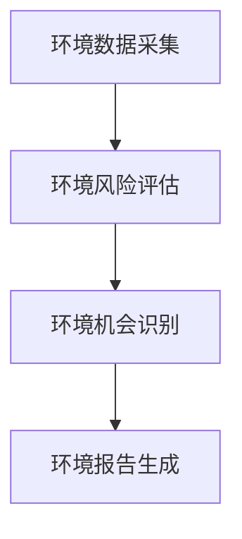
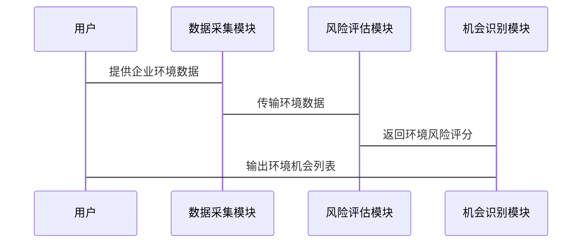

                 


# 彼得林奇如何看待公司的环境可持续性策略

## 关键词：  
彼得林奇，环境可持续性，ESG评分，投资策略，风险管理，企业价值

## 摘要：  
本文从彼得林奇的投资哲学出发，探讨他如何看待公司的环境可持续性策略。通过分析环境、社会和治理（ESG）框架，结合实际案例，详细阐述环境可持续性策略对企业价值的影响、量化评估方法以及投资策略的应用。文章结合数学模型、算法原理和系统架构，为读者提供全面的视角和实用的工具。

---

# 第1章: 彼得林奇与环境可持续性策略的背景

## 1.1 彼得林奇的背景与投资理念

### 1.1.1 彼得林奇的生平简介
彼得·林奇（Peter Lynch）是美国著名的投资经理人，以其在富达投资管理公司的长期任职期间取得了卓越的投资业绩而闻名。他强调长期投资、深入研究和对市场的深刻理解。林奇的投资哲学以“找到好的公司并长期持有”为核心，注重企业的基本面分析和管理层质量。

### 1.1.2 彼得林奇的投资哲学
林奇的投资哲学可以总结为以下几点：
1. **深入研究**：关注企业的基本面，包括财务数据、管理层能力和市场地位。
2. **长期持有**：避免频繁交易，专注于优质企业的价值增长。
3. **分散投资**：通过投资不同类型的企业分散风险。
4. **关注管理层**：管理层的能力和决策对企业价值至关重要。

### 1.1.3 彼得林奇对环境问题的关注
随着全球对环境问题的重视，林奇也开始关注企业的环境可持续性策略。他认为，环境问题不仅是社会责任，更是影响企业长期价值的重要因素。企业对环境的管理能力直接影响其成本、风险和市场竞争力。

---

## 1.2 环境可持续性策略的定义与重要性

### 1.2.1 环境可持续性策略的定义
环境可持续性策略是指企业在经营过程中采取的一系列措施，旨在减少对环境的负面影响，同时实现长期的经济和社会价值。这些措施包括减少碳排放、节约资源、减少污染和推动绿色技术创新。

### 1.2.2 环境可持续性与企业价值的关系
环境可持续性策略通过降低环境风险、提升品牌价值和增强市场竞争力，直接影响企业的长期价值。例如，一家采用绿色技术的企业可能在成本控制和市场准入方面具有优势。

### 1.2.3 环境可持续性策略的全球趋势
全球范围内，越来越多的投资者将环境、社会和治理（ESG）因素纳入投资决策。企业如果忽视环境可持续性，可能面临政策风险、声誉损失和市场排斥。

---

## 1.3 本书的目的与结构

### 1.3.1 本书的核心目标
本书旨在从彼得林奇的投资哲学出发，结合环境可持续性策略的理论和实践，为投资者提供一套系统化的分析框架。

### 1.3.2 本书的章节安排
- 第2章：环境可持续性策略的核心要素。
- 第3章：环境可持续性策略的分析框架。
- 第4章：环境可持续性策略的系统分析。
- 第5章：环境可持续性策略的项目实战。
- 第6章：环境可持续性策略的最佳实践。

### 1.3.3 本书的读者群体
本书适合投资管理者、企业高管、研究人员以及对环境可持续性投资感兴趣的读者。

---

# 第2章: 环境可持续性策略的核心概念

## 2.1 环境、社会和治理（ESG）框架

### 2.1.1 环境因素（E）
环境因素关注企业的资源消耗、碳排放和污染情况。例如，一家高污染企业可能面临更高的监管风险和运营成本。

### 2.1.2 社会因素（S）
社会因素关注企业与员工、社区和消费者的关系。例如，员工权益保护良好的企业更容易吸引人才。

### 2.1.3 治理因素（G）
治理因素关注企业的管理结构和内部控制。例如，透明的治理结构可以降低企业的声誉风险。

## 2.2 环境可持续性与企业竞争力

### 2.2.1 环境政策对企业的影响
政府的环保政策直接影响企业的运营成本和市场准入。例如，碳排放税可能增加企业的成本。

### 2.2.2 环境技术的创新与应用
绿色技术的创新可以降低企业的生产成本，同时提升产品的市场竞争力。

### 2.2.3 环境成本与企业利润的关系
环境成本的增加可能短期内影响企业的利润，但长期来看，绿色技术创新可以降低成本并提升收益。

## 2.3 环境可持续性策略的量化评估

### 2.3.1 环境绩效指标（EPI）
环境绩效指标用于衡量企业的环境表现，例如单位产品碳排放量。

### 2.3.2 碳足迹计算方法
碳足迹是企业整个生命周期的碳排放总量，帮助企业识别减排机会。

### 2.3.3 可持续发展评级体系
通过第三方机构对企业ESG表现的评级，投资者可以更直观地评估企业的环境风险。

---

# 第3章: 环境可持续性策略的分析框架

## 3.1 环境风险评估模型

### 3.1.1 环境风险的识别与分类
环境风险包括物理风险（如极端天气事件）和监管风险（如环保政策变化）。

### 3.1.2 环境风险的量化方法
通过数学模型计算环境风险对财务业绩的影响，例如：
$$ \text{环境风险影响} = \text{碳排放量} \times \text{碳价格} $$

### 3.1.3 环境风险对企业价值的影响
环境风险可能通过增加成本、降低收入或影响企业声誉，间接影响企业价值。

## 3.2 环境机会识别与投资策略

### 3.2.1 环境机会的识别方法
通过分析市场趋势和技术创新，识别绿色产业的投资机会。

### 3.2.2 环境投资的回报分析
绿色技术的投资回报可能高于传统行业，但需要考虑技术和市场风险。

### 3.2.3 环境投资的风险管理
通过分散投资、设置止损点和定期评估，降低环境投资的风险。

## 3.3 环境可持续性策略的比较分析

### 3.3.1 不同行业环境策略的差异
例如，制造业可能更关注碳排放，而科技企业可能更关注绿色技术创新。

### 3.3.2 不同地区环境政策的对比
不同地区的环保政策差异可能影响企业的市场准入和运营成本。

### 3.3.3 不同企业环境表现的评价
通过ESG评级对企业环境表现进行对比分析，识别优质投资标的。

---

# 第4章: 环境可持续性策略的系统分析

## 4.1 系统功能设计

### 4.1.1 环境数据采集模块
通过收集企业的碳排放、资源消耗等数据，建立环境数据库。

### 4.1.2 环境风险评估模块
使用数学模型评估环境风险对企业价值的影响。

### 4.1.3 环境机

---

### 4.1.4 环境机会识别模块
通过市场分析和技术评估，识别绿色产业的投资机会。

## 4.2 系统架构设计

### 4.2.1 系统功能模块
- 数据采集模块：收集环境数据。
- 风险评估模块：计算环境风险。
- 机会识别模块：识别绿色投资机会。
- 报告生成模块：输出环境可持续性报告。

### 4.2.2 系统架构图


---

## 4.3 系统接口设计

### 4.3.1 数据接口
- 输入：企业环境数据。
- 输出：环境风险评分和机会列表。

### 4.3.2 用户接口
- 输入：用户选择的企业列表。
- 输出：环境可持续性报告。

## 4.4 系统交互序列图



---

# 第5章: 环境可持续性策略的项目实战

## 5.1 环境可持续性策略的环境数据采集

### 5.1.1 环境数据采集工具安装
安装必要的数据分析工具，例如Python和Pandas库。

### 5.1.2 数据采集代码
```python
import pandas as pd

# 数据采集代码示例
data = {
    '企业名称': ['公司A', '公司B', '公司C'],
    '碳排放量': [100, 200, 150],
    '资源消耗': [50, 70, 60]
}
df = pd.DataFrame(data)
print(df)
```

### 5.1.3 数据采集结果解读
通过数据分析工具，识别企业的环境表现，例如碳排放量较高的企业可能面临更高的环境风险。

## 5.2 环境可持续性策略的风险评估

### 5.2.1 风险评估模型
使用数学模型计算环境风险对财务业绩的影响：
$$ \text{环境风险影响} = \text{碳排放量} \times \text{碳价格} $$

### 5.2.2 风险评估代码
```python
def calculate_environmental_risk(carbon_emission, carbon_price):
    return carbon_emission * carbon_price

risk = calculate_environmental_risk(200, 50)
print(f"环境风险影响为: {risk}")
```

### 5.2.3 风险评估结果解读
环境风险可能通过增加成本或降低收入影响企业价值。

## 5.3 环境可持续性策略的机会识别

### 5.3.1 机会识别模型
通过市场分析和技术评估，识别绿色产业的投资机会。

### 5.3.2 机会识别代码
```python
def identify_green机遇():
    return "绿色技术投资机会"

opportunity = identify_green机遇()
print(f"识别到的环境机会为: {opportunity}")
```

### 5.3.3 机会识别结果解读
绿色技术的投资回报可能高于传统行业，但需要考虑技术和市场风险。

---

# 第6章: 环境可持续性策略的最佳实践

## 6.1 环境可持续性策略的小结

### 6.1.1 核心要点总结
- 环境可持续性策略是企业长期价值的重要组成部分。
- 投资者应将ESG因素纳入投资决策。

## 6.2 环境可持续性策略的注意事项

### 6.2.1 数据质量
环境数据的准确性和完整性直接影响评估结果。

### 6.2.2 模型局限性
数学模型可能无法完全捕捉环境风险的复杂性。

## 6.3 环境可持续性策略的拓展阅读

### 6.3.1 推荐书籍
- 《可持续投资：从理念到实践》
- 《环境风险管理：理论与应用》

### 6.3.2 推荐报告
- MSCI的ESG评级报告
- 环境保护 agency的年度报告

---

# 结论

环境可持续性策略不仅是企业的社会责任，也是影响企业长期价值的重要因素。彼得林奇的投资哲学为环境可持续性策略的分析提供了新的视角。通过量化评估、系统分析和项目实战，投资者可以更好地识别环境风险和机会，制定科学的投资策略。

---

# 作者

作者：AI天才研究院/AI Genius Institute & 禅与计算机程序设计艺术 /Zen And The Art of Computer Programming

