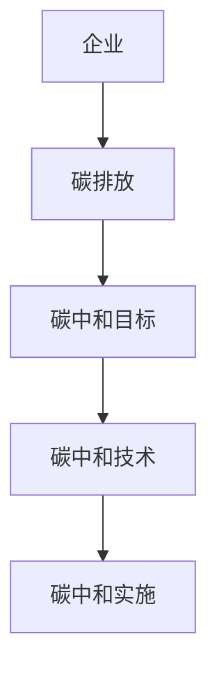
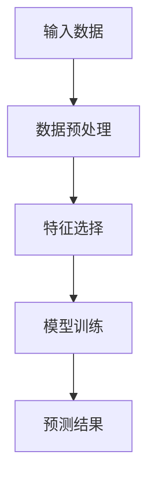

                 

# 彼得林奇如何看待公司的碳中和战略实施进度

## 关键词：
碳中和战略，彼得·林奇，投资分析，企业可持续发展，碳排放管理

## 摘要：
本文从投资分析的角度，探讨彼得·林奇如何看待公司的碳中和战略实施进度。通过对碳中和战略的背景、核心概念、分析方法、实施策略、投资机会和风险管理等方面进行详细分析，结合实际案例，为投资者和企业提供深入的见解和策略建议。

## 第一部分: 碳中和战略的背景与核心概念

### 第1章: 碳中和战略的背景与重要性

#### 1.1 碳中和的定义与背景
碳中和是指在一定时期内，通过减少温室气体排放、增加碳汇等方式，使二氧化碳的净排放量为零。随着全球气候变化问题的加剧，碳中和已成为全球关注的焦点。企业实施碳中和战略不仅是履行社会责任，更是提升竞争力的重要手段。

#### 1.2 碳中和战略的必要性
碳中和战略对企业竞争力的影响深远。通过减少碳排放，企业可以降低运营成本，提高资源利用效率，同时满足日益严格的环保政策要求。此外，碳中和战略还能提升企业的品牌形象，增强投资者信心，为企业带来长期的经济利益。

#### 1.3 企业碳中和战略的核心目标
企业碳中和战略的核心目标包括减少碳排放总量、实现能源结构优化、推动技术创新和提高管理效率。具体目标通常包括设定明确的减排时间表、制定可执行的减排措施和建立有效的监测体系。

### 第2章: 碳中和战略的核心概念与联系

#### 2.1 碳中和战略的核心要素
碳中和战略的核心要素包括碳排放源识别、减排技术选择、碳汇资源开发和管理优化。企业需要从生产过程、供应链管理、产品设计等方面进行全面考虑，确保碳中和战略的有效实施。

#### 2.2 碳中和战略的核心原理
碳中和战略的实现依赖于技术创新和管理优化。企业需要通过技术创新降低碳排放，同时通过优化管理流程提高资源利用效率。此外，碳中和战略还需要企业与政府、供应商和客户等多方利益相关者进行有效合作。

#### 2.3 碳中和战略的ER实体关系图

## 第二部分: 碳中和战略的分析与实施

### 第3章: 碳中和战略的分析框架

#### 3.1 碳中和战略的分析方法
企业需要从多个维度分析碳中和战略的实施进度，包括碳排放的量化与评估、碳中和目标的可行性分析和碳中和战略的经济性评估。通过科学的分析方法，企业可以制定合理的战略目标和实施路径。

#### 3.2 碳中和战略的分析框架
碳中和战略的分析框架包括问题场景介绍、项目介绍、系统功能设计、系统架构设计和系统交互设计。通过系统化的分析，企业可以全面了解碳中和战略的实施需求和潜在挑战。

#### 3.3 碳中和战略的算法原理
碳中和战略的实现需要依赖多种算法和技术，如碳排放预测模型和优化算法。以下是碳排放预测模型的流程图：

## 第三部分: 碳中和战略的实施策略

### 第4章: 碳中和战略的实施策略

#### 4.1 碳中和战略的实施路径
企业需要制定清晰的实施路径，包括设定短期和长期目标、选择合适的减排技术和建立有效的监测体系。通过分阶段实施，企业可以逐步实现碳中和目标。

#### 4.2 碳中和战略的技术创新
技术创新是实现碳中和的关键。企业需要加大对清洁能源技术、碳捕集技术等的研发投入，同时与高校和科研机构合作，推动技术创新。

#### 4.3 碳中和战略的成本控制
成本控制是碳中和战略实施中的重要环节。企业需要通过优化管理流程、选择合适的减排技术和利用碳汇资源，有效降低实施成本。

## 第四部分: 碳中和战略的投资机会

### 第5章: 碳中和战略的投资机会

#### 5.1 碳中和战略的投资领域
碳中和战略带来的投资机会包括新能源、环保技术、碳交易市场和绿色金融。投资者可以通过投资这些领域，获取长期的经济回报。

#### 5.2 碳中和战略的投资策略
投资者需要制定合理的投资策略，包括分散投资风险、关注技术创新企业和选择具有可持续发展能力的企业。通过科学的投资策略，投资者可以最大化投资收益。

## 第五部分: 碳中和战略的风险管理

### 第6章: 碳中和战略的风险管理

#### 6.1 碳中和战略的风险分析
企业在实施碳中和战略过程中可能面临政策风险、技术风险和市场风险。通过全面的风险分析，企业可以制定有效的风险管理策略。

#### 6.2 碳中和战略的风险应对
企业需要建立完善的风险应对机制，包括制定应急预案、加强内部沟通和建立外部合作网络。通过有效的风险应对，企业可以降低碳中和战略实施的风险。

## 第六部分: 碳中和战略的未来趋势

### 第7章: 碳中和战略的未来趋势

#### 7.1 碳中和战略的技术创新
未来，碳中和战略将更加依赖技术创新。清洁能源技术、智能能源管理和碳捕集技术等将在未来发挥重要作用。

#### 7.2 碳中和战略的全球化
碳中和战略将从局部地区向全球范围扩展。随着全球气候变化问题的加剧，各国将加强合作，共同推动碳中和目标的实现。

## 总结与展望

碳中和战略是企业实现可持续发展的重要手段。通过科学的分析和有效的实施，企业可以在减少碳排放的同时，提升自身的竞争力。未来，随着技术的不断进步和政策的支持，碳中和战略将在全球经济中发挥更加重要的作用。

## 作者

作者：AI天才研究院/AI Genius Institute & 禅与计算机程序设计艺术/Zen And The Art of Computer Programming

