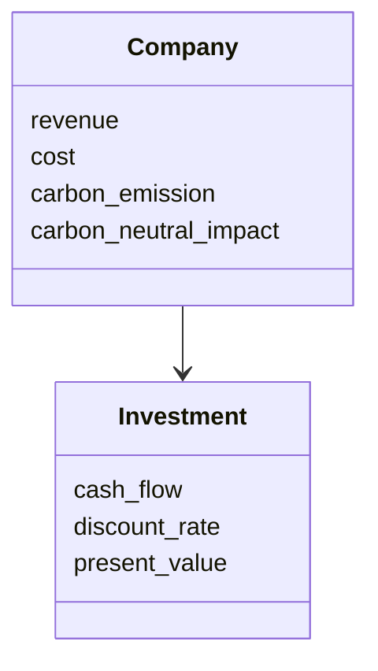

                 


# 彼得·林奇如何看待公司的碳中和承诺对估值的影响

> 关键词：彼得·林奇，碳中和承诺，企业估值，投资策略，环境风险

> 摘要：本文从彼得·林奇的投资视角出发，探讨碳中和承诺对企业估值的影响，分析其如何通过环境因素重新评估企业价值，降低风险，抓住投资机会。

---

# 第一部分：引言与背景介绍

## 第1章：碳中和承诺的背景与影响

### 1.1 碳中和承诺的定义与背景

碳中和承诺是指企业在一定时间内，通过减少温室气体排放、使用碳抵消等方式，使自身的碳排放总量降至零。随着全球气候变化问题的加剧，碳中和承诺已成为企业社会责任和投资决策的重要考量因素。

#### 1.1.1 碳中和承诺的定义
碳中和承诺是企业对其碳足迹的全面管理，包括减少直接和间接碳排放、购买碳信用等。企业通过实现碳中和，可以提升品牌形象、降低环境风险。

#### 1.1.2 碳中和承诺的全球背景
全球气候变化问题促使各国政府和企业采取行动。碳中和承诺不仅是企业社会责任的体现，也是应对政策监管和市场趋势的关键策略。

#### 1.1.3 碳中和承诺对企业的影响
- **正面影响**：提升品牌形象、降低环境风险、开拓绿色市场。
- **负面影响**：初期投入成本增加、技术转型的挑战。

### 1.2 投资者视角下的碳中和承诺

#### 1.2.1 投资者的关注点
投资者关注企业的可持续发展能力，碳中和承诺是企业风险管理、长期价值和竞争优势的关键因素。

#### 1.2.2 碳中和承诺对投资决策的影响
- **降低投资风险**：减少环境政策合规风险。
- **提高投资回报**：绿色企业更具市场竞争力。

#### 1.2.3 碳中和承诺的长期与短期影响
- **长期影响**：塑造企业的可持续发展形象。
- **短期影响**：可能面临额外的合规成本。

---

# 第二部分：核心概念与联系

## 第2章：核心概念与联系

### 2.1 碳中和承诺与企业价值

#### 2.1.1 碳中和承诺与企业价值的关系
碳中和承诺通过降低环境风险和提升品牌价值，间接影响企业估值。

#### 2.1.2 碳中和承诺对财务表现的影响
- **收入增长**：绿色产品溢价。
- **成本增加**：碳减排技术投资。

#### 2.1.3 碳中和承诺对投资决策的影响
- **投资机会**：绿色技术投资。
- **投资风险**：环境政策风险。

### 2.2 彼得·林奇的投资理念

#### 2.2.1 投资理念的核心要素
- **长期投资**：关注企业的长期价值。
- **基本面分析**：重视企业的财务状况和竞争优势。

#### 2.2.2 彼得·林奇对环境因素的关注
- **环境风险**：企业碳排放的合规风险。
- **环境机会**：绿色产业的投资机会。

#### 2.2.3 碳中和承诺与彼得·林奇投资理念的结合
- **价值发现**：碳中和承诺是企业竞争优势的体现。
- **风险管理**：碳中和承诺降低环境政策风险。

---

# 第三部分：算法原理与实现

## 第3章：碳中和承诺的估值模型

### 3.1 传统企业估值模型的扩展

#### 3.1.1 现金流折现模型的调整
将碳中和承诺的未来收益和成本纳入现金流预测。

#### 3.1.2 市盈率与市净率的修正
考虑碳中和承诺对企业盈利能力和资产质量的影响。

#### 3.1.3 股权价值的重新评估
基于碳中和承诺的环境效益和财务影响，调整股权价值。

### 3.2 碳中和承诺的量化方法

#### 3.2.1 碳排放的量化与成本分摊
量化企业的碳排放，并分摊到各个业务部门。

#### 3.2.2 绿色收益的预测与折现
预测绿色产品和服务的收入，并进行折现处理。

#### 3.2.3 碳信用交易的估值
基于碳信用市场的价格波动，评估碳信用的价值。

## 第4章：算法原理与实现

### 4.1 碳中和承诺的数学模型

#### 4.1.1 碳排放成本的数学表达式
$$ \text{碳排放成本} = \sum_{i=1}^{n} c_i \cdot q_i $$
其中，\( c_i \) 是第 \( i \) 种碳排放的单位成本，\( q_i \) 是排放量。

#### 4.1.2 绿色收益的预测模型
$$ \text{绿色收益} = \beta \cdot (\text{绿色产品收入} - \text{绿色产品成本}) $$

### 4.2 算法实现

#### 4.2.1 碳中和承诺的现金流折现模型

```python
def calculate_carbon_neutral_value(revenue, cost, discount_rate):
    net_cash_flow = revenue - cost
    present_value = net_cash_flow / (1 + discount_rate)
    return present_value
```

#### 4.2.2 碳中和承诺的市盈率修正模型

```python
def calculate_adjusted_pe_ratio(earnings, carbon_neutral_impact):
    adjusted_earnings = earnings * (1 + carbon_neutral_impact)
    pe_ratio = adjusted_earnings / price_per_share
    return pe_ratio
```

---

# 第四部分：系统分析与架构设计

## 第5章：系统分析与架构设计

### 5.1 问题场景介绍

#### 5.1.1 问题背景
碳中和承诺对企业估值的影响需要通过系统化的方法进行评估。

#### 5.1.2 项目介绍
设计一个基于彼得·林奇投资理念的碳中和承诺估值系统。

### 5.2 系统功能设计

#### 5.2.1 领域模型


#### 5.2.2 系统架构


### 5.3 系统架构设计

#### 5.3.1 系统架构图
```mermaid
architectural
    [用户界面]
    [数据处理模块]
    [估值计算模块]
    [结果展示模块]
```

#### 5.3.2 系统接口设计
- 输入接口：企业财务数据、碳排放数据。
- 输出接口：估值结果、投资建议。

---

# 第五部分：项目实战

## 第6章：项目实战

### 6.1 环境安装

#### 6.1.1 系统环境
- Python 3.8+
- Jupyter Notebook
- 数据库：MySQL或PostgreSQL

#### 6.1.2 安装依赖
- pandas
- numpy
- matplotlib

### 6.2 核心实现

#### 6.2.1 数据处理

```python
import pandas as pd

data = pd.read_csv('carbon_data.csv')
data['carbon_emission'] = data['carbon_emission'].apply(lambda x: x * 0.8)
```

#### 6.2.2 估值计算

```python
def calculate_discounted_cash_flows(cash_flows, discount_rate):
    discounted_flows = []
    for cash_flow in cash_flows:
        discounted_flow = cash_flow / (1 + discount_rate)
        discounted_flows.append(discounted_flow)
    return discounted_flows

discount_rate = 0.05
discounted_flows = calculate_discounted_cash_flows([100, 200, 300], discount_rate)
```

### 6.3 案例分析

#### 6.3.1 案例背景
假设一家科技公司承诺在5年内实现碳中和。

#### 6.3.2 案例分析

```python
revenue = 500
cost = 300
discount_rate = 0.05

net_cash_flow = revenue - cost
present_value = net_cash_flow / (1 + discount_rate)
print(f"Present Value: {present_value}")
```

---

# 第六部分：最佳实践与总结

## 第7章：最佳实践与总结

### 7.1 小结

- 碳中和承诺是企业估值的重要因素。
- 彼得·林奇的投资理念与碳中和承诺密切相关。

### 7.2 注意事项

- 数据的准确性和完整性。
- 模型的合理性和适用性。

### 7.3 未来展望

- 碳中和承诺的估值方法将更加多样化。
- 绿色投资将推动企业转型。

---

# 作者信息

作者：AI天才研究院/AI Genius Institute & 禅与计算机程序设计艺术 /Zen And The Art of Computer Programming

---

感谢您的阅读！如需进一步探讨或获取更多资料，请随时联系。

