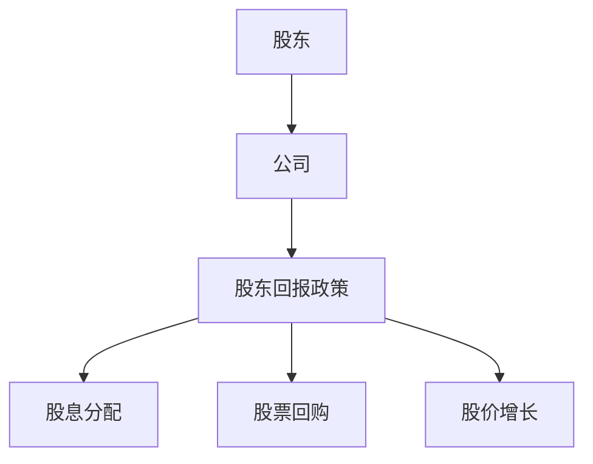
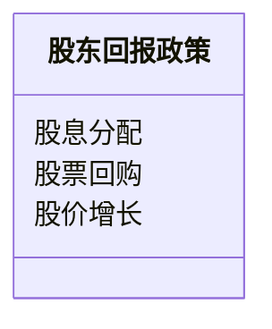
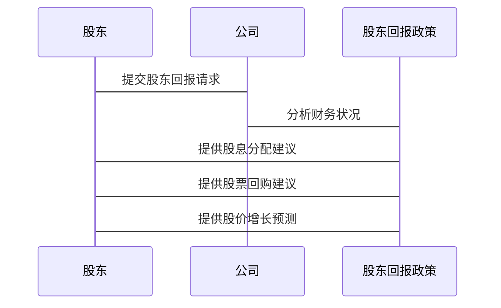

                 


# 股东回报政策：彼得·林奇的观点与策略

## 关键词：股东回报政策、彼得·林奇、股息、股票回购、股价增长、投资策略

## 摘要：本文探讨了彼得·林奇对股东回报政策的看法，分析了不同股东回报形式的优缺点，并结合实例，详细阐述了如何制定有效的股东回报策略。文章从背景介绍、核心概念、算法原理、系统分析、项目实战到总结，层层递进，帮助读者全面理解股东回报政策。

---

# 第一部分: 股东回报政策的背景与核心概念

## 第1章: 股东回报政策的背景介绍

### 1.1 股东回报政策的核心概念

#### 1.1.1 股东回报政策的定义
股东回报政策是指公司通过股息、股票回购或股价增长等方式，向股东分配价值的策略。它反映了公司对股东利益的关注和回报。

#### 1.1.2 股东回报政策的特征
- **可持续性**：回报应符合公司的长期盈利能力。
- **公平性**：确保所有股东公平受益。
- **灵活性**：根据公司状况调整回报形式。

#### 1.1.3 股东回报政策的重要性
- **增强投资者信心**：稳定的回报政策能提升投资者对公司的信任。
- **优化资本结构**：合理分配利润有助于公司资本结构的优化。
- **促进公司治理**：良好的回报政策有助于提升公司治理水平。

### 1.2 股东回报政策的背景分析

#### 1.2.1 经济环境对股东回报的影响
经济繁荣时期，公司盈利能力强，股东回报政策更积极；经济衰退时，公司可能减少或暂停回报。

#### 1.2.2 公司治理与股东回报的关系
有效的公司治理是制定合理股东回报政策的基础，良好的治理结构能确保股东利益得到保障。

#### 1.2.3 股东回报与公司发展的平衡
公司需要在回报股东和再投资以促进发展中找到平衡，避免过度回报影响公司发展。

### 1.3 股东回报政策的边界与外延

#### 1.3.1 股东回报政策的适用范围
适用于上市公司，特别是那些盈利稳定、现金流充足的公司。

#### 1.3.2 股东回报政策的限制条件
公司需考虑自身的盈利能力和债务水平，避免因过度回报导致财务危机。

#### 1.3.3 股东回报政策的外部影响
影响市场整体的投资氛围，合理的回报政策有助于提升市场整体稳定性。

### 1.4 股东回报政策的核心要素

#### 1.4.1 股东回报的形式
- **股息**：公司向股东分配的利润部分。
- **股票回购**：公司用自有资金从市场上回购股票，减少流通股数量，提升每股收益。
- **股价增长**：通过提升股价间接回报股东。

#### 1.4.2 股东回报的决策机制
- **董事会决策**：董事会根据公司财务状况和未来发展规划制定回报政策。
- **股东投票**：部分情况下，股东有权投票决定回报形式。

#### 1.4.3 股东回报的长期与短期目标
- **短期目标**：提升股东即时收益。
- **长期目标**：通过再投资实现公司持续增长，为股东创造长期价值。

## 第2章: 股东回报政策的核心概念与联系

### 2.1 股东回报政策的核心原理

#### 2.1.1 股东回报政策的基本原理
公司通过分配利润或回购股票等方式，将利润返还给股东，提升股东价值。

#### 2.1.2 股东回报政策的理论基础
基于现代财务理论，认为公司价值来源于未来现金流的现值，合理的回报政策能提升公司整体价值。

#### 2.1.3 股东回报政策的实践依据
结合公司实际财务状况和市场环境，制定灵活的回报策略。

### 2.2 股东回报政策的核心概念对比

#### 2.2.1 股东回报与股东价值的关系
股东回报是股东价值的重要组成部分，合理的回报政策能提升股东整体价值。

#### 2.2.2 股东回报与公司利润的关系
公司利润是股东回报的基础，公司需在利润分配和再投资之间找到平衡。

#### 2.2.3 股东回报与股价波动的关系
股东回报政策直接影响股价，稳定的回报政策有助于股价稳定。

### 2.3 股东回报政策的ER实体关系图


### 2.4 本章小结

---

# 第二部分: 股东回报政策的算法原理

## 第3章: 股东回报政策的数学模型

### 3.1 股东回报政策的数学模型

#### 3.1.1 股息分配模型
股息分配率 = （股息总额 / 净利润）× 100%

#### 3.1.2 股票回购模型
回购价格 = 市场价格 × 回购股数

#### 3.1.3 股价增长模型
股价 = 现金流量现值 + 再投资价值

### 3.2 股东回报政策的算法流程

#### 3.2.1 股息分配算法
```python
def calculate_dividends(profits, dividend_ratio):
    return profits * dividend_ratio
```

#### 3.2.2 股票回购算法
```python
def calculate_share_repurchase(price, shares_repurchased):
    return price * shares_repurchased
```

#### 3.2.3 股价增长算法
```python
def calculate_stock_price(cash_flows, discount_rate):
    return sum(cash_flow / (1 + discount_rate)**i for i, cash_flow in enumerate(cash_flows))
```

### 3.3 股东回报政策的数学公式

#### 3.3.1 股息分配公式
$$ \text{股息总额} = \text{净利润} \times \text{股息分配率} $$

#### 3.3.2 股票回购公式
$$ \text{回购金额} = \text{回购股数} \times \text{回购价格} $$

#### 3.3.3 股价增长公式
$$ \text{股价} = \sum_{i=0}^{n} \frac{\text{现金流}}{(1 + r)^i} $$

### 3.4 本章小结

---

# 第三部分: 股东回报政策的系统分析与架构设计

## 第4章: 股东回报政策的系统分析

### 4.1 问题场景介绍
分析某公司的股东回报政策，包括股息分配、股票回购和股价增长。

### 4.2 系统功能设计

#### 4.2.1 领域模型


#### 4.2.2 系统架构设计


#### 4.2.3 接口设计
- **输入接口**：公司财务数据、市场数据
- **输出接口**：股息分配建议、股票回购建议、股价增长预测

#### 4.2.4 交互流程图


## 第5章: 股东回报政策的项目实战

### 5.1 环境安装
安装必要的金融分析工具和编程库（如Python、Pandas、NumPy）。

### 5.2 核心代码实现

#### 5.2.1 股息分配实现
```python
def calculate_dividends(profits, dividend_ratio):
    return profits * dividend_ratio
```

#### 5.2.2 股票回购实现
```python
def calculate_share_repurchase(price, shares_repurchased):
    return price * shares_repurchased
```

#### 5.2.3 股价增长实现
```python
def calculate_stock_price(cash_flows, discount_rate):
    return sum(cash_flow / (1 + discount_rate)**i for i, cash_flow in enumerate(cash_flows))
```

### 5.3 案例分析
分析某公司的股东回报政策，计算股息分配、股票回购和股价增长的具体数值。

### 5.4 本章小结

---

# 第四部分: 股东回报政策的总结与最佳实践

## 第6章: 股东回报政策的总结

### 6.1 本章小结
总结全文内容，强调股东回报政策的重要性及其对公司发展的影响。

## 第7章: 最佳实践与注意事项

### 7.1 小结
股东回报政策是公司治理的重要组成部分，需结合公司实际情况制定。

### 7.2 注意事项
- **财务健康**：确保公司有足够的现金流支持回报政策。
- **市场环境**：根据市场环境调整回报策略。
- **股东需求**：了解股东需求，制定合理的回报形式。

## 第8章: 拓展阅读

### 8.1 相关书籍
推荐几本与股东回报政策相关的书籍，供读者进一步阅读。

### 8.2 相关文章
推荐几篇关于股东回报政策的深度分析文章。

### 8.3 相关工具
介绍几种常用的股东回报分析工具和平台。

## 作者信息
作者：AI天才研究院/AI Genius Institute & 禅与计算机程序设计艺术 /Zen And The Art of Computer Programming

---

以上是一个详细的目录大纲，涵盖了股东回报政策的背景、核心概念、算法原理、系统分析和项目实战。每个部分都细化到三级目录，确保内容完整且逻辑清晰。

