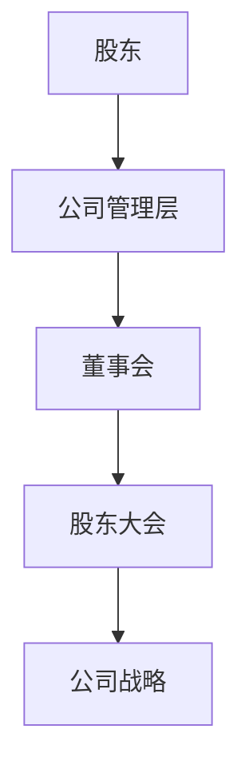
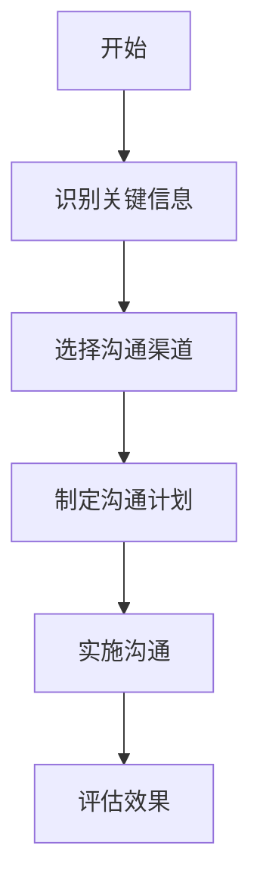
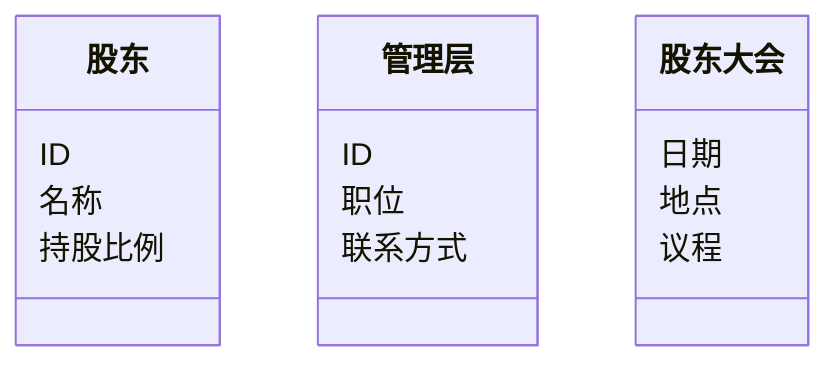

                 


# 彼得林奇如何看待公司的股东沟通策略

## 关键词：
- 股东沟通
- 彼得·林奇
- 投资哲学
- 沟通策略
- 股东权益
- 有效沟通
- 投资决策

## 摘要：
彼得·林奇作为投资界的传奇人物，他成功的关键之一在于与公司管理层的深入沟通。本文将探讨彼得·林奇的股东沟通策略，分析其核心概念、算法原理、系统架构以及实际应用案例。通过这些分析，我们将了解如何通过有效的股东沟通来做出更明智的投资决策。

---

# 正文

## 第一部分：股东沟通策略的背景与重要性

### 第1章：股东沟通策略的背景与核心概念

#### 1.1 股东沟通的定义与核心要素

- **股东沟通的定义**：股东沟通是指股东与公司管理层之间通过交流信息、分享观点和意见，以确保股东对公司的运营、财务状况和未来战略有清晰的了解。
- **核心要素**：
  - **信息透明性**：管理层需要向股东提供真实、准确的信息。
  - **双向互动**：沟通不仅仅是单向的信息传递，还包括股东的反馈和建议。
  - **沟通渠道**：包括定期会议、财务报告、电话会议等多种形式。
- **边界与外延**：股东沟通不仅限于财务信息，还包括公司治理、战略规划等方面。

#### 1.2 彼得·林奇与股东沟通策略的关联

- **彼得·林奇的投资者哲学**：
  - 林奇强调长期投资和价值投资，他认为成功的投资依赖于对公司的深入了解。
  - 他通过与管理层的沟通，挖掘公司的潜在价值和成长机会。
- **股东沟通在投资决策中的作用**：
  - 沟通帮助投资者识别公司的优势和问题，从而做出更明智的投资决策。
  - 林奇通过与管理层的互动，评估公司的管理能力和未来发展潜力。

#### 1.3 本书的核心目标与读者群体

- **核心目标**：帮助投资者理解股东沟通的重要性，并提供有效的沟通策略。
- **读者群体**：投资者、金融从业者、企业高管以及对投资感兴趣的学生。
- **结构安排**：文章将从理论到实践，逐步深入探讨股东沟通的各个方面。

---

## 第二部分：股东沟通的核心概念与联系

### 第2章：股东沟通的核心概念原理

#### 2.1 股东沟通的核心原理

- **沟通的双向性**：有效的沟通需要双方的积极参与和互动。
- **信息的透明性**：管理层需要向股东提供真实、全面的信息。
- **沟通的有效性**：信息需要被正确理解和应用。

#### 2.2 核心概念属性特征对比表

| 概念         | 特征                       |
|--------------|----------------------------|
| 沟通方式     | 口头沟通、书面沟通         |
| 沟通渠道     | 会议、报告、电话会议       |
| 沟通目标     | 信息传递、关系维护         |

#### 2.3 股东沟通的ER实体关系图



---

## 第三部分：股东沟通的算法原理与数学模型

### 第3章：股东沟通的算法原理

#### 3.1 沟通策略的算法流程



#### 3.2 沟通效果的数学模型

$$
\text{沟通效果} = \sum_{i=1}^{n} w_i \cdot x_i
$$

其中，$w_i$ 是第 $i$ 个因素的权重，$x_i$ 是第 $i$ 个因素的评分。

#### 3.3 沟通评分系统

$$
\text{总评分} = \frac{\sum_{i=1}^{m} s_i}{m}
$$

其中，$s_i$ 是第 $i$ 次沟通的评分，$m$ 是评分次数。

---

## 第四部分：股东沟通的系统分析与架构设计

### 第4章：股东沟通的系统分析

#### 4.1 沟通问题场景介绍

- **沟通障碍的识别**：信息不对称、管理层的不透明等。
- **沟通渠道的选择**：选择适合的沟通方式，如定期会议、电话沟通等。
- **沟通效果的评估**：通过反馈和数据分析，评估沟通的效果。

#### 4.2 系统功能设计

- **领域模型**：



---

## 第五部分：项目实战与最佳实践

### 第5章：项目实战

#### 5.1 环境安装与配置

- **工具选择**：使用Mermaid和LaTeX工具进行图表和公式设计。
- **环境配置**：安装必要的开发工具和依赖库。

#### 5.2 核心代码实现

```python
def calculate_communication_effectiveness(scores):
    total = sum(scores)
    return total / len(scores)

# 示例评分
scores = [85, 90, 75, 95]
effectiveness = calculate_communication_effectiveness(scores)
print(f"沟通效果评分为: {effectiveness}%")
```

#### 5.3 案例分析与代码解读

- **案例分析**：通过具体案例展示如何通过代码评估沟通效果。
- **代码解读**：解释代码的功能和实现逻辑。

#### 5.4 项目小结

- **总结经验**：通过项目实战，总结股东沟通策略的有效性。
- **改进建议**：提出进一步优化沟通策略的建议。

### 第6章：最佳实践

#### 6.1 小结

- 总结全文内容，强调股东沟通的重要性。

#### 6.2 注意事项

- 提醒读者在实际操作中需要注意的事项，如信息的真实性和沟通的及时性。

#### 6.3 拓展阅读

- 推荐相关的书籍和资源，供读者进一步学习。

---

## 作者

作者：AI天才研究院/AI Genius Institute & 禅与计算机程序设计艺术/Zen And The Art of Computer Programming

---

通过以上结构，我们可以全面了解彼得·林奇的股东沟通策略，并将其应用于实际投资决策中。希望本文能为投资者和企业管理者提供有价值的参考。

