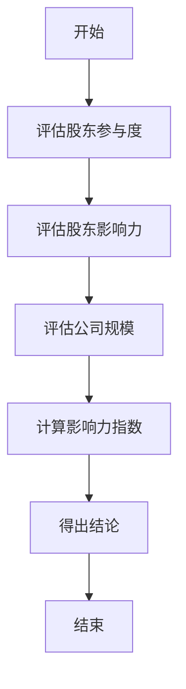
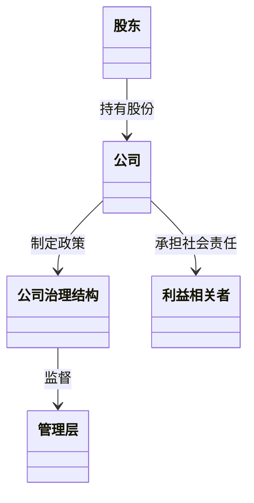
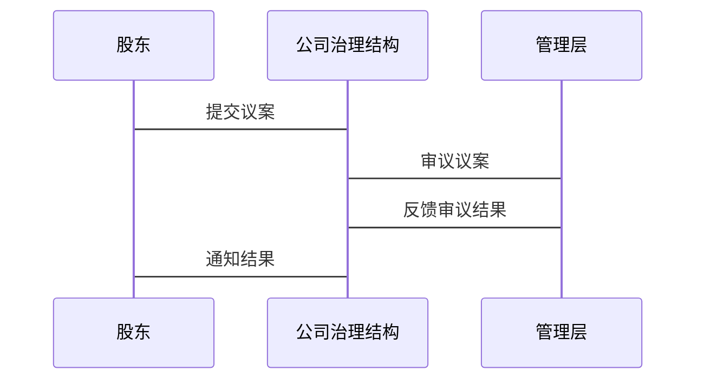

                 


# 彼得林奇如何看待公司的股东积极主义

## 关键词：彼得·林奇，股东积极主义，公司治理，投资策略，股东权益

## 摘要：本文探讨了彼得·林奇对股东积极主义的看法，分析了股东积极主义的核心概念、算法原理、系统架构以及实际案例。通过详细的技术分析和实例解读，展示了彼得·林奇在股东积极主义中的独特见解和策略。

---

# 第一部分：股东积极主义的背景与核心概念

## 第1章：股东积极主义的定义与背景

### 1.1 股东积极主义的定义与内涵

股东积极主义（Shareholder Activism）是指股东通过行使股东权利，积极参与公司治理，推动公司改进的一种行为。其核心在于股东不仅仅是被动的投资者，而是可以通过投票、提案、监督等方式，影响公司战略、管理层决策以及社会责任等方面。

#### 1.1.1 股东积极主义的定义
股东积极主义强调股东的主动参与，不仅关注财务回报，还关注公司的长期价值和可持续性发展。这种行为通常发生在股东对公司治理、环境保护、员工权益等议题有较强关注的情况下。

#### 1.1.2 股东积极主义的历史发展
股东积极主义的起源可以追溯到20世纪60年代，当时美国的股东开始关注公司治理和环境保护等问题。随着社会对企业责任的关注度提高，股东积极主义逐渐成为一种重要的投资策略。

#### 1.1.3 股东积极主义的现状分析
近年来，股东积极主义在全球范围内逐渐兴起，尤其是在环保、社会责任等方面，股东通过积极投票、提出议案等方式，推动公司实现可持续发展。

### 1.2 彼得·林奇与股东积极主义

#### 1.2.1 彼得·林奇的个人背景与投资理念
彼得·林奇（Peter Lynch）是美国著名的职业棒球运动员和投资家，以其在棒球和投资领域的卓越表现闻名。他在投资领域提出了许多独特的观点，强调长期投资和对公司基本面的深入分析。

#### 1.2.2 彼得·林奇与股东积极主义的关联
尽管彼得·林奇并未直接提出股东积极主义的概念，但他的投资理念与股东积极主义有诸多契合点。他强调对投资公司的深入了解和长期关注，这与股东积极主义中对公司的深度参与和监督不谋而合。

#### 1.2.3 彼得·林奇对股东积极主义的贡献
彼得·林奇通过其投资实践，展示了如何通过深入分析和积极参与，推动公司实现更好的业绩。他的成功案例为股东积极主义提供了实践依据，证明了股东积极参与公司治理可以带来更好的投资回报。

### 1.3 股东积极主义的核心要素

#### 1.3.1 股东权利的法律框架
股东权利是股东积极主义的法律基础，包括投票权、知情权、参与权等。这些权利为股东积极参与公司治理提供了法律保障。

#### 1.3.2 股东积极主义的主要目标
股东积极主义的主要目标包括优化公司治理、推动可持续发展、提升企业社会责任等。通过这些目标的实现，股东不仅能够获得更好的财务回报，还能推动公司长期发展。

#### 1.3.3 股东积极主义的实施方式
股东可以通过多种方式积极参与公司治理，包括提出议案、投票支持或反对特定决策、监督管理层行为等。这些方式的具体实施取决于股东的持股比例和公司治理结构。

### 1.4 股东积极主义的边界与外延

#### 1.4.1 股东积极主义的边界
股东积极主义并非无边界，股东在参与公司治理时需要遵守相关法律法规，并尊重公司治理的基本原则。此外，股东的参与不应损害其他利益相关者的权益。

#### 1.4.2 股东积极主义与其他投资策略的区别
与被动投资相比，股东积极主义更加注重主动参与和深度影响，这使得它在投资策略中具有独特性。然而，与短期投机相比，股东积极主义更注重长期价值和可持续性。

#### 1.4.3 股东积极主义的外延与扩展
随着社会对环境保护、社会责任等问题的关注度提高，股东积极主义的外延也在不断扩展，涉及更多领域，如绿色投资、ESG（环境、社会和治理）投资等。

---

## 第2章：股东积极主义的核心概念与联系

### 2.1 核心概念的原理

#### 2.1.1 股东积极主义的驱动因素
股东积极主义的驱动因素包括对公司长期价值的关注、对社会责任的重视、对管理层不透明的质疑等。这些因素促使股东积极参与公司治理。

#### 2.1.2 股东积极主义的实施机制
实施机制包括股东提出议案、召开特别股东大会、与管理层沟通等。通过这些机制，股东可以有效推动公司治理的改进。

#### 2.1.3 股东积极主义的经济影响
股东积极主义可以通过优化公司治理、提升企业效率、推动创新等方式，促进经济发展。同时，股东积极主义还能推动企业更好地履行社会责任，促进社会和谐。

### 2.2 核心概念的属性特征对比

#### 2.2.1 股东积极主义与股东消极主义的对比
| 特性 | 股东积极主义 | 股东消极主义 |
|------|--------------|--------------|
| 行为方式 | 主动参与公司治理 | 被动接受公司决策 |
| 目标 | 提升公司长期价值 | 追求短期财务回报 |
| 影响 | 推动公司和社会可持续发展 | 可能忽视社会责任 |

#### 2.2.2 股东积极主义与公司治理的关系
股东积极主义是公司治理的重要组成部分，通过股东的积极参与，可以优化公司治理结构，提升治理效率。

#### 2.2.3 股东积极主义与企业社会责任的联系
股东积极主义与企业社会责任密切相关，股东通过积极参与公司治理，可以推动企业更好地履行社会责任，实现可持续发展。

### 2.3 ER实体关系图架构

#### 2.3.1 股东、公司与利益相关者的实体关系
```mermaid
entity 投资者
entity 公司
entity 利益相关者（如员工、客户、环境等）

关系：投资者 -> 公司：持有股份
关系：公司 -> 利益相关者：承担社会责任
```

#### 2.3.2 股东积极主义的实体关系图
```mermaid
entity 股东
entity 公司
entity 公司治理结构

关系：股东 -> 公司：行使投票权
关系：公司 -> 公司治理结构：制定政策和战略
```

#### 2.3.3 股东积极主义与公司治理的实体关系图
```mermaid
entity 股东
entity 公司治理结构
entity 管理层

关系：股东 -> 公司治理结构：参与决策
关系：公司治理结构 -> 管理层：监督和指导
```

### 2.4 本章小结

---

## 第3章：股东积极主义的算法原理

### 3.1 算法原理的数学模型

#### 3.1.1 股东积极主义影响力指数的计算公式
$$影响力指数 = \frac{股东参与度 \times 股东影响力}{公司规模}$$

#### 3.1.2 股东积极主义的评估模型
$$评估模型 = \sum_{i=1}^{n} (权重_i \times 评估指标_i)$$

### 3.2 算法原理的流程图


### 3.3 算法原理的代码实现

#### 3.3.1 环境安装
```bash
pip install numpy pandas
```

#### 3.3.2 核心代码实现
```python
import numpy as np

def calculate_influence_index(sh_influence, company_scale):
    # 股东参与度（0-1之间）
    sh_participation = 0.8
    # 股东影响力（基于持股比例）
    sh_influence = 0.6
    # 公司规模（假设为公司市值，单位：亿美元）
    company_scale = 50
    # 计算影响力指数
    influence_index = (sh_participation * sh_influence) / company_scale
    return influence_index

# 示例计算
result = calculate_influence_index(0.6, 50)
print(f"影响力指数为：{result}")
```

### 3.4 本章小结

---

## 第4章：股东积极主义的系统架构与实现

### 4.1 系统分析与架构设计方案

#### 4.1.1 系统功能设计（领域模型）


#### 4.1.2 系统架构设计（架构图）
```mermaid
rectangle 系统边界
    rectangle 股东
    rectangle 公司治理结构
    rectangle 管理层
    rectangle 利益相关者
    股东 --> 公司治理结构: 参与决策
    公司治理结构 --> 管理层: 监督
    管理层 --> 利益相关者: 提供反馈
```

#### 4.1.3 系统接口设计
接口：股东与公司治理结构之间的交互接口，用于提交议案、投票等。

#### 4.1.4 系统交互流程图


### 4.2 系统实现与项目实战

#### 4.2.1 项目介绍
本项目旨在通过技术手段，评估股东积极主义对公司的影响力，并提供相应的决策支持。

#### 4.2.2 核心代码实现
```python
import pandas as pd

def assess_shareholder_behavior(data):
    # 数据预处理
    data['影响力指数'] = data.apply(lambda x: (x['参与度'] * x['影响力']) / x['公司规模'], axis=1)
    return data

# 示例数据
data = pd.DataFrame({
    '公司名称': ['公司A', '公司B', '公司C'],
    '参与度': [0.8, 0.6, 0.7],
    '影响力': [0.6, 0.5, 0.7],
    '公司规模': [50, 40, 60]
})

# 调用函数
result = assess_shareholder_behavior(data)
print(result)
```

#### 4.2.3 实际案例分析
以微软公司为例，分析股东积极主义对其公司治理的影响。

### 4.3 本章小结

---

## 第5章：股东积极主义的最佳实践与未来展望

### 5.1 最佳实践
- **关注长期价值**：股东应关注公司的长期发展，而非短期收益。
- **积极参与治理**：通过投票、提案等方式，积极参与公司治理。
- **平衡利益相关者权益**：在参与公司治理时，应平衡股东利益与其他利益相关者权益。

### 5.2 小结
股东积极主义是一种重要的投资策略，通过深入参与公司治理，股东可以实现自身利益与公司长期发展的双赢。

---

## 作者：AI天才研究院/AI Genius Institute & 禅与计算机程序设计艺术 /Zen And The Art of Computer Programming

