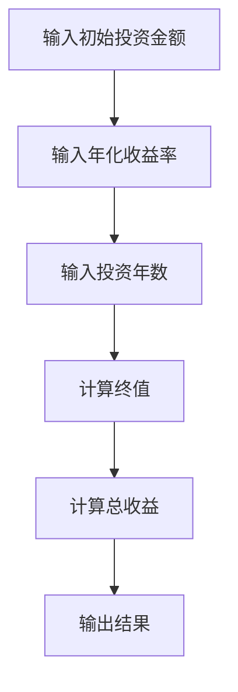
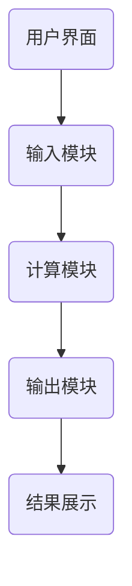
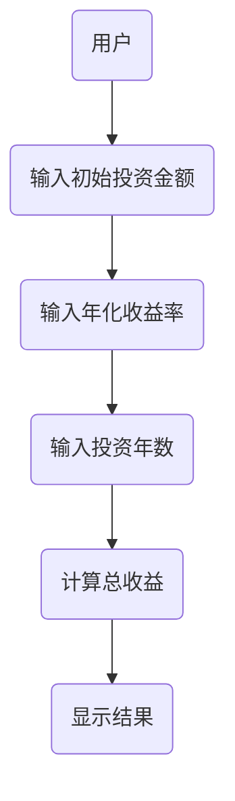

                 


# 彼得林奇如何看待公司的股息再投资计划

## 关键词：股息再投资、彼得·林奇、投资策略、股息计算、投资回报、再投资计划

## 摘要：  
本文从彼得·林奇的投资理念出发，详细探讨了股息再投资计划的实施策略。文章首先介绍了股息再投资的基本概念和优势，随后分析了其背后的数学模型与算法原理，结合实际案例展示了如何通过编程实现股息再投资的计算与优化。最后，本文总结了股息再投资的最佳实践和注意事项，为投资者提供了全面的指导。

---

# 第1章 股息再投资的基本概念

## 1.1 股息再投资的定义与特点

### 1.1.1 股息再投资的定义  
股息再投资是指公司将分配给股东的股息，按照一定比例或金额再次投资于公司股票的过程。这种投资方式通常通过自动再投资计划（Drip计划）实现，投资者无需手动操作，股息自动转化为新的股票或基金份额。

### 1.1.2 股息再投资的核心特点  
- **自动性**：股息自动再投资，无需手动操作。  
- **复利效应**：通过复利效应，投资回报率逐步放大。  
- **低成本**：通常没有额外的手续费或佣金。  
- **灵活性**：投资者可以根据自身需求调整再投资的频率和比例。

### 1.1.3 股息再投资与传统投资的区别  
- **传统投资**：投资者手动选择投资标的和时机。  
- **股息再投资**：投资行为自动化，依赖于公司股息的分配和再投资计划的设计。

---

## 1.2 股息再投资的背景与重要性

### 1.2.1 股息再投资的历史发展  
股息再投资的概念可以追溯到20世纪初，但随着现代投资工具的发展，特别是在美国，自动再投资计划（如Drip计划）逐渐普及。

### 1.2.2 股息再投资在现代投资中的地位  
股息再投资已成为投资者实现财富增长的重要手段之一，尤其适合长期投资者和价值投资者。

### 1.2.3 股息再投资的潜在优势与风险  
- **优势**：  
  - 利用复利效应，长期收益显著。  
  - 分散投资风险，降低市场波动的影响。  
  - 无需频繁交易，降低成本。  
- **风险**：  
  - 取决于公司的股息分配政策。  
  - 公司股价波动可能影响再投资的收益。

---

## 1.3 彼得·林奇与股息再投资的关系

### 1.3.1 彼得·林奇的投资理念概述  
彼得·林奇是美国著名投资专家，强调长期投资、价值投资和分散投资。他认为，股息再投资是实现长期收益的重要手段。

### 1.3.2 林奇对股息再投资的重视  
林奇认为，股息再投资可以帮助投资者在不增加本金的前提下，通过复利效应实现财富增长。

### 1.3.3 林奇股息再投资策略的核心观点  
- 选择股息稳定且增长的公司。  
- 长期持有，避免频繁交易。  
- 结合基本面分析，选择优质公司。

---

# 第2章 股息再投资的数学模型与公式

## 2.1 股息再投资的基本公式

### 2.1.1 股息再投资的计算公式  
股息再投资的总收益可以通过以下公式计算：

$$
\text{总收益} = \text{初始投资} \times (1 + r)^n - \text{初始投资}
$$

其中，$r$ 是年化收益率，$n$ 是投资年数。

### 2.1.2 再投资股份数量的计算  
假设每股股息为 $D$，当前股价为 $P$，则再投资的股份数量为：

$$
\text{再投资股数} = \frac{D \times \text{当前股数}}{P}
$$

### 2.1.3 总投资回报的计算公式  
总投资回报可以表示为：

$$
\text{总投资回报} = \text{初始投资} \times (1 + \text{股息收益率})^n
$$

---

## 2.2 股息再投资的数学模型

### 2.2.1 股息再投资的复利模型  
股息再投资的复利模型可以表示为：

$$
\text{终值} = \text{现值} \times (1 + r)^n
$$

其中，$r$ 是年化收益率，$n$ 是投资年数。

### 2.2.2 股息再投资的年化收益计算  
年化收益可以通过以下公式计算：

$$
r = \left( \frac{\text{终值}}{\text{现值}} \right)^{1/n} - 1
$$

### 2.2.3 股息再投资的风险评估模型  
风险评估模型可以参考标准差和贝塔系数，公式如下：

$$
\text{标准差} = \sqrt{\sum_{i=1}^{n} (\text{实际收益}_i - \text{期望收益})^2 / n}
$$

$$
\beta = \frac{\text{协方差(资产收益, 市场收益)}}{\text{方差(市场收益)}}
$$

---

# 第3章 股息再投资的算法与实现

## 3.1 股息再投资的算法流程

### 3.1.1 确定股息分配  
- 输入股息分配比例或金额。  
- 计算应分配的股息总额。

### 3.1.2 计算再投资股份数量  
- 根据当前股价和股息总额，计算再投资股数。

### 3.1.3 更新投资组合  
- 调整投资组合中的股票数量和总价值。

---

## 3.2 股息再投资的代码实现

### 3.2.1 环境安装与配置  
- 安装Python和相关库（如NumPy、Pandas）。  
- 配置投资参数，如初始投资金额、年化收益率等。

### 3.2.2 核心算法代码  
```python
import numpy as np

def calculate_dividend_reinvestment(initial_investment, annual_return, years):
    # 计算终值
    final_value = initial_investment * (1 + annual_return) ** years
    # 计算总收益
    total_return = final_value - initial_investment
    return total_return

# 示例计算
initial_investment = 10000  # 初始投资金额
annual_return = 0.05        # 年化收益率
years = 10                   # 投资年数

total_return = calculate_dividend_reinvestment(initial_investment, annual_return, years)
print(f"总收益：${total_return:.2f}")
```

### 3.2.3 代码功能解读  
上述代码通过复利公式计算股息再投资的总收益，展示了如何将数学模型转化为代码实现。

---

# 第4章 股息再投资系统的架构与实现

## 4.1 系统功能设计

### 4.1.1 系统功能模块划分  
- 输入模块：接收初始投资金额、年化收益率等参数。  
- 计算模块：执行股息再投资的计算。  
- 输出模块：显示计算结果。

### 4.1.2 系统功能流程图  


---

## 4.2 系统架构设计

### 4.2.1 系统架构图  


---

## 4.3 系统接口设计

### 4.3.1 输入接口  
- 提供初始投资金额、年化收益率和投资年数的输入。

### 4.3.2 输出接口  
- 显示计算结果，包括总收益和年化收益率。

---

## 4.4 系统交互流程图



---

# 第5章 股息再投资计算器开发

## 5.1 项目需求分析

### 5.1.1 项目目标  
开发一个股息再投资计算器，帮助投资者计算股息再投资的总收益。

### 5.1.2 项目功能需求  
- 输入初始投资金额、年化收益率和投资年数。  
- 计算并显示总收益。

### 5.1.3 项目技术选型  
- 使用Python语言实现。  
- 使用NumPy和Pandas库进行数据处理。

---

## 5.2 核心代码实现

### 5.2.1 环境安装与配置  
```bash
pip install numpy pandas
```

### 5.2.2 核心算法代码  
```python
import numpy as np

def calculate_dividend_reinvestment(initial_investment, annual_return, years):
    final_value = initial_investment * (1 + annual_return) ** years
    total_return = final_value - initial_investment
    return total_return

# 示例计算
initial_investment = 10000
annual_return = 0.05
years = 10

total_return = calculate_dividend_reinvestment(initial_investment, annual_return, years)
print(f"总收益：${total_return:.2f}")
```

### 5.2.3 代码功能解读  
上述代码通过复利公式计算股息再投资的总收益，展示了如何将数学模型转化为代码实现。

---

## 5.3 实际案例分析

### 5.3.1 案例背景  
假设投资者初始投资金额为10,000美元，年化收益率为5%，投资年数为10年。

### 5.3.2 计算过程  
使用公式：

$$
\text{总收益} = 10000 \times (1 + 0.05)^{10} - 10000
$$

计算得：

$$
\text{总收益} = 10000 \times 1.62889 - 10000 = 6288.90 \text{美元}
$$

### 5.3.3 结果分析  
通过股息再投资，投资者在10年内的总收益为6288.90美元，年化收益率为5%。

---

## 5.4 项目小结  
通过本项目，我们实现了股息再投资计算器的开发，展示了如何将数学模型转化为实际应用，帮助投资者更好地进行投资决策。

---

# 第6章 股息再投资的最佳实践

## 6.1 投资策略与注意事项

### 6.1.1 选择优质公司  
选择股息稳定且增长的公司，确保股息再投资的可持续性。

### 6.1.2 考虑税收影响  
了解所在地区的税收政策，避免因税收影响投资收益。

### 6.1.3 分散投资风险  
通过分散投资，降低个股波动对整体投资组合的影响。

---

## 6.2 小结与展望

### 6.2.1 小结  
股息再投资是一种有效的投资方式，通过复利效应实现财富增长。投资者需要选择优质公司，合理配置资产。

### 6.2.2 展望  
随着金融科技的发展，股息再投资将更加智能化和自动化，投资者可以利用更多的工具和平台实现高效投资。

---

# 作者：AI天才研究院 & 禅与计算机程序设计艺术

