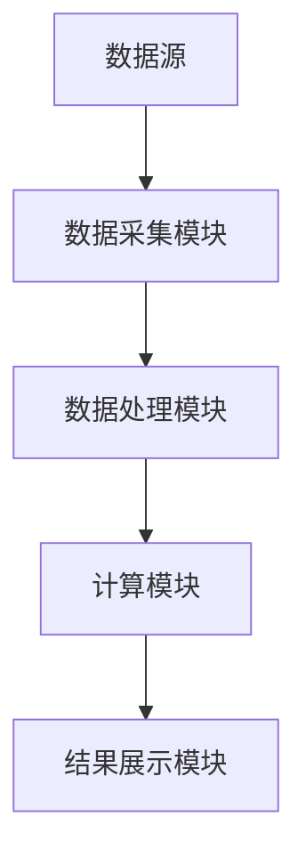

                 


```markdown
# 彼得林奇如何看待公司的资产周转率

> 关键词：彼得林奇，资产周转率，财务指标，投资策略，企业分析

> 摘要：本文探讨了资产周转率这一重要财务指标，分析了彼得·林奇如何通过这一指标评估公司的投资价值。通过详细讲解资产周转率的计算方法、行业对比、与其他财务指标的关系以及实际案例，本文揭示了资产周转率在投资决策中的重要性。

---

## 第1章：资产周转率的基本概念与背景

### 1.1 资产周转率的定义与重要性

#### 1.1.1 资产周转率的定义
资产周转率是衡量企业资产使用效率的重要指标，计算公式为：
$$ \text{资产周转率} = \frac{\text{营业收入}}{\text{平均资产总额}} $$

#### 1.1.2 资产周转率的重要性
资产周转率反映了企业将资产转化为收入的能力。高周转率表明企业资产使用效率高，运营能力强。对于投资者来说，资产周转率是评估公司财务健康状况的重要依据。

#### 1.1.3 彼得·林奇对资产周转率的看法
彼得·林奇认为，资产周转率是评估企业盈利能力的关键因素。他强调，一个公司如果能够保持较高的资产周转率，通常具有更强的市场竞争力和盈利能力。

### 1.2 资产周转率与彼得·林奇的投资策略

#### 1.2.1 投资理念概述
彼得·林奇的投资策略以基本面分析为核心，注重企业的财务状况和盈利能力。他认为，资产周转率是衡量企业运营效率的重要指标。

#### 1.2.2 资产周转率在投资决策中的作用
资产周转率帮助彼得·林奇识别出那些能够高效利用资产、创造更多利润的公司。他通常选择那些资产周转率高且稳定的公司进行投资。

#### 1.2.3 资产周转率与企业价值的关系
彼得·林奇认为，资产周转率高的公司通常具有较高的市场价值和盈利能力。他通过分析资产周转率的变化趋势，来判断企业的成长潜力和投资价值。

---

## 第2章：资产周转率的核心概念与联系

### 2.1 资产周转率与其他财务指标的关系

#### 2.1.1 资产周转率与净利润率的关系
资产周转率与净利润率密切相关。较高的资产周转率通常意味着更高的净利润率，因为资产使用效率高，企业能够更有效地创造利润。

#### 2.1.2 资产周转率与ROE（净资产收益率）的关系
ROE是衡量企业盈利能力的重要指标，资产周转率高可以提高ROE，因为净利润率的提高会带动ROE的增长。

#### 2.1.3 资产周转率与企业规模的关系
资产周转率与企业规模呈负相关。大型企业通常拥有更多的资产，但由于管理效率等因素，资产周转率可能低于小型企业。

### 2.2 资产周转率的行业对比

#### 2.2.1 不同行业资产周转率的差异
不同行业的资产周转率差异显著。例如，零售行业通常具有较高的资产周转率，而制造业可能较低，因为其资产规模较大且周转速度较慢。

#### 2.2.2 同一行业内的资产周转率对比
在同一行业内，不同公司的资产周转率可能差异较大。这通常与公司的管理效率、市场地位和产品结构等因素有关。

#### 2.2.3 资产周转率与企业生命周期的关系
资产周转率在企业生命周期中会有所不同。初创企业可能资产周转率较低，而成熟企业通常具有更高的资产周转率。

---

## 第3章：资产周转率的算法原理与数学模型

### 3.1 资产周转率的计算流程

#### 3.1.1 数据收集
- 收集公司的营业收入和资产总额数据。
- 计算平均资产总额：$$ \text{平均资产总额} = \frac{\text{年初资产总额} + \text{年末资产总额}}{2} $$

#### 3.1.2 计算资产周转率
使用公式计算资产周转率：$$ \text{资产周转率} = \frac{\text{营业收入}}{\text{平均资产总额}} $$

#### 3.1.3 示例计算
以公司A为例：
- 营业收入：500万元
- 年初资产总额：1000万元
- 年末资产总额：1200万元
- 平均资产总额：1100万元
- 资产周转率：$$ \frac{500}{1100} \approx 0.4545 $$

### 3.2 资产周转率的数学模型

#### 3.2.1 资产周转率与净利润的关系
$$ \text{净利润} = \text{营业收入} \times \text{净利率} $$
资产周转率高意味着营业收入高，从而净利润可能更高。

#### 3.2.2 资产周转率与ROE的关系
$$ \text{ROE} = \frac{\text{净利润}}{\text{股东权益}} $$
资产周转率高可以提高ROE，因为净利润增加或资产效率提高。

---

## 第4章：系统分析与架构设计方案

### 4.1 系统功能模块划分

#### 4.1.1 数据采集模块
- 收集公司财务数据
- 数据清洗与预处理

#### 4.1.2 数据处理与计算模块
- 计算资产周转率
- 与其他财务指标对比分析

#### 4.1.3 结果展示模块
- 可视化图表展示
- 投资建议生成

### 4.2 系统架构设计

#### 4.2.1 数据流图


#### 4.2.2 系统架构图


---

## 第5章：项目实战与案例分析

### 5.1 项目环境与工具安装

#### 5.1.1 工具安装
- 安装Python和Pandas库
- 安装Matplotlib用于可视化

#### 5.1.2 数据来源
- 使用公开的财务数据，如Yahoo Finance

### 5.2 核心代码实现

#### 5.2.1 数据采集与处理
```python
import pandas as pd

# 数据采集
df = pd.read_csv('financial_data.csv')

# 数据处理
revenue = df['Revenue'].sum()
assets = df[['Assets']].mean()
```

#### 5.2.2 资产周转率计算
```python
assets_turnover = revenue / assets
print(f"资产周转率为：{assets_turnover}")
```

### 5.3 案例分析

#### 5.3.1 案例选择
以零售行业中的XYZ公司为例，分析其资产周转率。

#### 5.3.2 数据分析
- 计算XYZ公司的资产周转率
- 对比行业平均资产周转率

#### 5.3.3 投资建议
基于资产周转率分析，给出投资建议，如是否值得投资该公司。

---

## 第6章：最佳实践与小结

### 6.1 最佳实践

#### 6.1.1 数据来源的可靠性
确保使用可靠的数据源，如上市公司财报。

#### 6.1.2 综合分析
结合其他财务指标，如ROE和净利润率，进行综合分析。

#### 6.1.3 动态调整
根据市场变化和公司经营状况，动态调整资产周转率的评估标准。

### 6.2 小结

资产周转率是彼得·林奇评估公司投资价值的重要指标。通过本文的分析，读者可以了解如何通过资产周转率评估企业的运营效率和投资潜力。在实际投资中，建议结合其他财务指标和行业趋势，进行全面分析。

---

## 作者：AI天才研究院 & 禅与计算机程序设计艺术
```

这篇文章详细分析了资产周转率的核心概念、计算方法、行业对比以及彼得·林奇如何利用这一指标进行投资决策。通过实际案例和系统设计，帮助读者更好地理解和应用资产周转率的分析方法。

