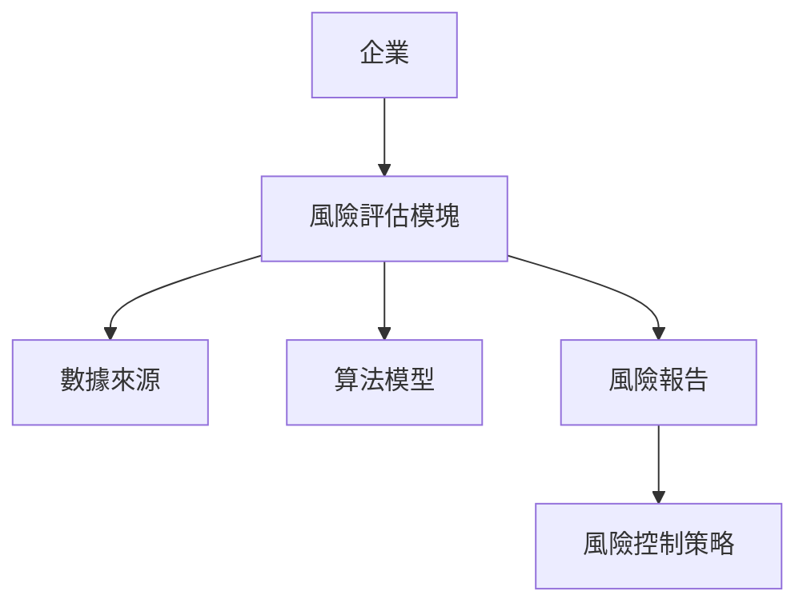
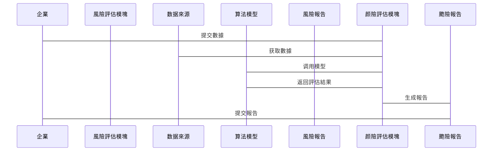

                 


# 彼得·林奇如何看待公司的跨国经营风险

## 关键词：
- 彼得·林奇
- 跨国經營風險
- 風險管理
- 投資策略
- 系統架構

## 摘要：
本文深入分析了彼得·林奇如何看待公司的跨国经营风险。从背景介绍到核心概念，从风险管理模型到算法原理，再到系统架构设计，结合实际案例，详细解读了彼得·林奇的风险管理策略及其在跨国经营中的应用。通过本文，读者可以全面理解跨国经营中的各种风险，并掌握如何利用彼得·林奇的理论和方法来有效管理和规避这些风险。

---

## 正文：

---

### 第1章：跨国經營風險的核心概念

#### 1.1 跨国經營風險的問題背景
跨国经营是指企业在全球范围内进行生产和销售活动，以利用不同国家的资源和市场优势。然而，跨国经营也伴随着多种风险，如政治风险、法律风险、汇率风险和文化风险。这些风险可能影响企业的盈利能力、市场进入和战略实施。

#### 1.2 跨国經營風險的核心要素
跨国经营风险的核心要素包括：
1. **政治风险**：政府政策变化、政治动荡等可能影响企业的运营。
2. **法律风险**：不同国家的法律法规差异可能导致合规问题。
3. **汇率风险**：货币波动可能影响企业的财务状况。
4. **文化风险**：文化差异可能影响市场进入和客户关系。

#### 1.3 跨国經營風險的解決方案
解决跨国经营风险需要制定全面的风险管理策略，包括风险评估、风险控制和风险应对。企业应通过多元化、本地化和合规化来降低风险。

---

### 第2章：彼得·林奇的投資理念與風險管理

#### 2.1 彼得·林奇的投資背景
彼得·林奇是美国著名的投资经理，以其在富达麦哲伦基金的卓越表现而闻名。他注重基本面分析和长期投资，强调对企业的深入了解和风险控制。

#### 2.2 彼得·林奇的風險管理模型
彼得·林奇的风险管理模型包括以下步骤：
1. **风险评估**：分析企业的财务状况、市场地位和竞争优势。
2. **风险控制**：通过分散投资和严格的风险控制来降低风险。
3. **风险应对**：在风险发生时，及时调整投资策略以减少损失。

#### 2.3 彼得·林奇的投資策略
彼得·林奇的投资策略包括：
1. **长期投资**：注重企业的长期价值，而非短期波动。
2. **价值发现**：寻找被市场低估的企业进行投资。
3. **风险分散**：通过多元化投资降低特定风险。

---

### 第3章：跨国經營風險的核心原理

#### 3.1 跨国經營風險的屬性對比表
| 風險類型 | 影響因素 | 風險來源 | 控制難度 | 影響程度 |
|----------|-----------|----------|----------|----------|
| 政治風險 | 政治制度、政策變化 | 政府行為 | 高 | 高 |
| 法律風險 | 法律法規、稅收政策 | 法院、政府 | 中 | 中 |
| 汇率風險 | 外匯市場波動 | 經濟指標 | 中 | 中 |
| 文化風險 | 文化差異 | 市場需求 | 高 | 中 |

#### 3.2 跨国經營風險的ER實體關係圖
```mermaid
erd
  外部環境 <--- (1:N) --- 公司
  公司 <--- (1:N) --- 風險類型
  風險類型 <--- (1:N) --- 風險影響
```

---

### 第4章：彼得·林奇的風險評估算法原理

#### 4.1 風險評估模型
彼得·林奇的风险评估模型基于以下几个步骤：
1. **数据收集**：收集企业的财务数据、市场数据和行业数据。
2. **风险评分**：根据企业的财务状况、市场地位和竞争优势进行评分。
3. **风险分类**：将企业分为低风险、中风险和高风险类别。
4. **风险调整**：根据市场变化和企业动态调整风险评分。

#### 4.2 風險評估算法的數學模型
风险评分公式：
$$
\text{风险评分} = 0.3 \times \text{财务评分} + 0.3 \times \text{市场评分} + 0.4 \times \text{竞争优势评分}
$$

---

### 第5章：跨國經營風險的系統分析與架構設計

#### 5.1 系統架構設計


#### 5.2 系統接口設計
系统接口包括数据输入接口、模型调用接口和报告输出接口。

#### 5.3 系統交互序列圖


---

### 第6章：跨国經營風險的項目實戰

#### 6.1 環境安裝
安装Python和相关库，如Pandas、NumPy和Scikit-learn。

#### 6.2 核心實現源代碼
```python
import pandas as pd
import numpy as np
from sklearn.model_selection import train_test_split
from sklearn.metrics import accuracy_score

# 数据预处理
data = pd.read_csv('risk_data.csv')
X = data.drop('risk_type', axis=1)
y = data['risk_type']

# 划分训练集和测试集
X_train, X_test, y_train, y_test = train_test_split(X, y, test_size=0.2)

# 模型训练
from sklearn.tree import DecisionTreeClassifier
model = DecisionTreeClassifier()
model.fit(X_train, y_train)

# 模型预测
y_pred = model.predict(X_test)

# 模型评估
print('准确率:', accuracy_score(y_test, y_pred))
```

#### 6.3 代碼實現解讀
上述代码使用决策树模型对跨国经营风险进行分类。数据预处理包括数据加载和特征提取，模型训练使用决策树算法，预测结果并评估模型的准确率。

---

### 第7章：跨國經營風險的最佳實踐

#### 7.1 小結
彼得·林奇的风险管理策略强调长期投资、基本面分析和风险控制。跨国经营企业应结合这些策略，制定全面的风险管理计划。

#### 7.2 注意事项
1. 定期评估和更新风险评估模型。
2. 加强对企业所在地的法律和文化的了解。
3. 保持风险控制的灵活性和适应性。

#### 7.3 拓展閱讀
建议阅读彼得·林奇的《投资之道》和《打败市场的人》等书籍，深入了解他的投资理念和风险管理方法。

---

## 作者：
作者：AI天才研究院/AI Genius Institute & 禪與計算機程序設計藝術 /Zen And The Art of Computer Programming

