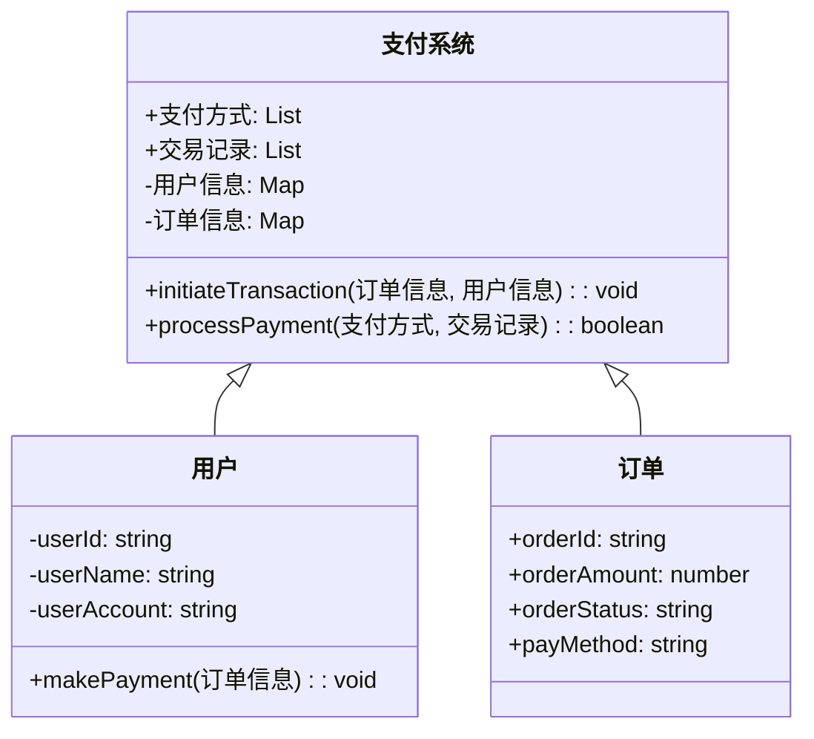
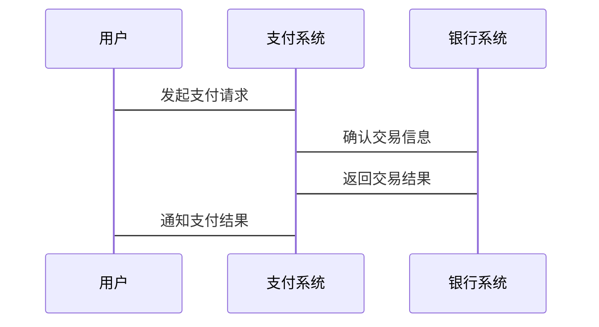

                 


# 彼得林奇如何看待公司的跨境支付策略对增长的影响

> 关键词：彼得林奇，跨境支付，公司增长，支付策略，支付效率，支付安全性

> 摘要：本文从彼得林奇的投资理念出发，分析跨境支付策略对公司的增长影响。通过背景介绍、核心概念、算法原理、系统架构、项目实战和最佳实践等多维度展开，深入探讨跨境支付策略如何助力企业实现全球化布局和持续增长。文章结合理论与实践，为企业提供可操作的建议和指导。

---

# 第一部分: 背景介绍

## 第1章: 跨境支付的现状与影响

### 1.1 跨境支付的定义与现状

#### 1.1.1 跨境支付的基本概念

跨境支付是指跨越不同国家或地区进行的货币资金转移活动。随着全球化的深入，跨境支付已成为企业拓展国际市场的重要手段。常见的跨境支付方式包括国际信用卡支付、第三方支付平台（如支付宝、PayPal）和银行间跨境转账等。

#### 1.1.2 当前跨境支付的主要模式

1. **国际信用卡支付**： Visa、MasterCard 等国际信用卡品牌在全球范围内提供支付服务。
2. **第三方支付平台**： PayPal、Alipay 等平台为商家和消费者提供便捷的支付解决方案。
3. **银行间跨境转账**：通过银行直接进行跨境资金划转，通常用于大额交易。

#### 1.1.3 跨境支付的市场规模与增长趋势

根据统计，全球跨境支付市场规模近年来持续增长，年增长率保持在 5% 以上。随着电子商务的普及和金融科技的发展，跨境支付的效率和安全性也在不断提升。

---

### 1.2 彼得林奇的投资理念与分析框架

#### 1.2.1 彼得林奇的投资风格概述

彼得林奇是美国著名投资专家，以其价值投资理念闻名。他认为，投资的本质是寻找那些具有持续竞争优势且管理良好的公司。

#### 1.2.2 彼得林奇的核心分析方法

1. **基本面分析**：关注公司的财务状况、盈利能力和发展潜力。
2. **竞争优势分析**：寻找那些在行业中具有独特优势的企业。
3. **管理层能力评估**：重视公司管理层的决策能力和企业治理水平。

#### 1.2.3 彼得林奇对企业的估值逻辑

彼得林奇强调，企业的估值应基于其未来现金流的折现值。他倾向于投资那些估值合理且具有长期增长潜力的企业。

---

## 第2章: 跨境支付策略与公司增长的关系

### 2.1 跨境支付策略对公司的直接影响

#### 2.1.1 跨境支付效率对企业运营成本的影响

高效的跨境支付能够降低企业的运营成本。例如，通过选择合适的支付平台，企业可以减少手续费和汇率损失。

#### 2.1.2 跨境支付安全性对企业品牌价值的影响

支付安全是企业品牌形象的重要组成部分。一旦发生支付安全问题，企业的声誉可能会受到严重影响。

#### 2.1.3 跨境支付便捷性对企业市场拓展的影响

便捷的支付方式能够提升客户的支付体验，从而增强客户粘性和市场拓展能力。

---

### 2.2 彼得林奇视角下的支付策略分析

#### 2.2.1 支付策略在企业增长中的权重

彼得林奇认为，支付策略虽然不是企业的核心业务，但却是影响企业运营效率和客户满意度的重要因素。

#### 2.2.2 支付策略对客户粘性的影响

便捷、安全的支付方式能够提升客户的支付体验，从而增强客户粘性。

#### 2.2.3 支付策略对企业全球化布局的影响

高效的跨境支付能够帮助企业更好地拓展国际市场，降低全球化布局的成本和风险。

---

# 第二部分: 核心概念与联系

## 第3章: 跨境支付的核心概念与属性特征

### 3.1 跨境支付的核心概念

#### 3.1.1 跨境支付的交易流程

1. **发起支付**：用户或企业发起支付请求。
2. **支付授权**：支付平台验证交易信息。
3. **资金划转**：资金从付款方账户划转至收款方账户。
4. **交易确认**：支付完成并确认。

#### 3.1.2 跨境支付的主要参与方

1. **付款方**：发起支付请求的个人或企业。
2. **收款方**：接收资金的个人或企业。
3. **支付平台**：提供支付服务的机构，如 PayPal、支付宝等。
4. **银行机构**：处理资金划转的银行。

#### 3.1.3 跨境支付的主要技术手段

1. **加密技术**：保障支付数据的安全性。
2. **身份验证**：确认交易双方的身份真实性。
3. **反洗钱（AML）**：防止非法资金流动。

---

### 3.2 跨境支付的属性特征对比

| 特征         | 高效率支付 | 高安全性支付 | 高成本支付 |
|--------------|------------|--------------|------------|
| 交易速度      | 快          | 较慢          | 较快        |
| 安全性        | 中          | 高            | 中          |
| 成本          | 低          | 高            | 低          |

---

## 第4章: 跨境支付的ER实体关系图

```mermaid
er
actor 公司, [公司]
actor 支付平台, [支付平台]
actor 用户, [用户]
actor 监管机构, [监管机构]

company 公司 -[拥有]-> 支付平台
公司 -[使用]-> 支付平台
支付平台 -[服务]-> 用户
支付平台 -[监管]-> 监管机构
```

---

# 第三部分: 算法原理讲解

## 第5章: 跨境支付效率算法

### 5.1 支付效率计算模型

#### 5.1.1 模型定义

支付效率是指单位时间内成功完成的交易数量。公式如下：

$$ \text{支付效率} = \frac{\text{成功交易数}}{\text{总交易数}} \times 100\% $$

---

#### 5.1.2 模型实现

```python
def calculate_payment_efficiency(successful_transactions, total_transactions):
    return (successful_transactions / total_transactions) * 100

# 示例
successful = 98
total = 100
efficiency = calculate_payment_efficiency(successful, total)
print(f"支付效率为: {efficiency}%")
```

---

## 第6章: 跨境支付风险评估算法

### 6.1 风险概率模型

风险概率公式如下：

$$ P(\text{风险}) = \frac{\text{历史风险事件数}}{\text{总交易数}} \times 100\% $$

---

### 6.2 风险控制策略

1. **身份验证**：通过多因素认证（MFA）降低账户被盗风险。
2. **交易监控**：实时监控交易行为，识别异常交易。
3. **保险机制**：为支付交易购买保险，降低损失风险。

---

# 第四部分: 系统分析与架构设计方案

## 第7章: 跨境支付系统架构设计

### 7.1 问题场景介绍

假设一家跨国电商公司希望优化其跨境支付流程，降低支付失败率，提升客户支付体验。

---

### 7.2 系统功能设计

#### 7.2.1 领域模型（mermaid 类图）



---

### 7.3 系统架构设计（mermaid 架构图）


---

## 第8章: 系统接口设计与交互流程

### 8.1 系统接口设计

#### 8.1.1 支付请求接口

```json
{
    "userId": "12345",
    "orderAmount": 100.00,
    "currency": "USD",
    "paymentMethod": "creditCard"
}
```

#### 8.1.2 支付响应接口

```json
{
    "transactionId": "123456789",
    "status": "success",
    "message": "支付成功"
}
```

---

### 8.2 系统交互流程（mermaid 序列图）



---

# 第五部分: 项目实战

## 第9章: 环境安装与核心实现

### 9.1 环境安装

1. 安装 Python 和 pip。
2. 安装必要的库：`mermaid`, `graphviz`, `numpy`。

---

### 9.2 核心代码实现

#### 9.2.1 支付效率计算代码

```python
import numpy as np

def calculate_payment_efficiency(successful, total):
    return successful / total

# 示例数据
successful = np.array([98, 95, 97])
total = np.array([100, 100, 100])
efficiencies = calculate_payment_efficiency(successful, total)
print(f"各场景支付效率: {efficiencies}")
```

---

## 第10章: 案例分析与总结

### 10.1 案例分析

假设一家公司采用新的支付策略后，支付效率提升了 10%，支付失败率下降了 15%。

---

### 10.2 项目小结

通过优化支付策略，企业能够显著提升运营效率和客户满意度，从而推动业务增长。

---

# 第六部分: 最佳实践与总结

## 第11章: 小结与注意事项

### 11.1 小结

彼得林奇的投资理念提醒我们，支付策略虽然不是企业的核心业务，但却是影响企业运营效率和客户满意度的重要因素。

---

### 11.2 注意事项

1. **安全性**：支付系统的安全性至关重要，需防范黑客攻击和数据泄露。
2. **合规性**：遵守不同国家的支付法规和金融监管要求。
3. **用户体验**：支付流程应简单、直观，提升客户体验。

---

## 第12章: 拓展阅读

### 12.1 拓展阅读材料

1. 彼得林奇的《投资学入门：聪明的投资者》。
2. 金融科技领域的最新研究和应用。

---

# 作者

作者：AI天才研究院/AI Genius Institute & 禅与计算机程序设计艺术/Zen And The Art of Computer Programming

