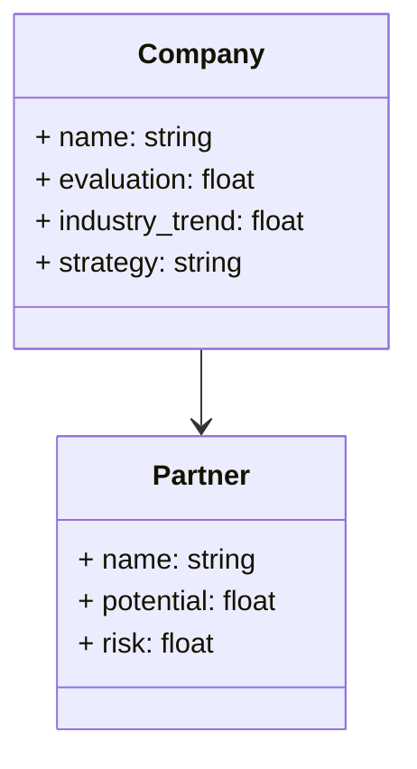
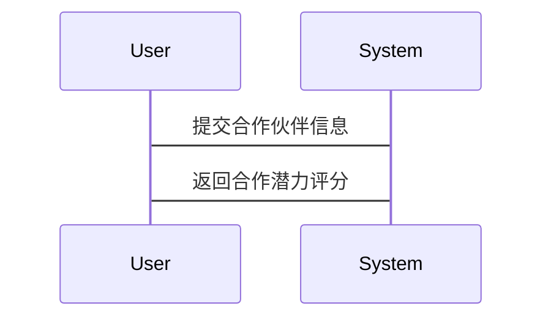

                 


# 彼得林奇如何看待公司的跨界合作策略

## 关键词：彼得·林奇, 跨界合作, 投资策略, 企业战略, 风险评估, 行业趋势, 战略合作

## 摘要：
本文从彼得·林奇的投资理念出发，探讨他如何看待公司的跨界合作策略。通过分析跨界合作的核心概念、算法原理、系统架构设计和实际案例，结合彼得·林奇的选股策略和风险评估方法，为读者提供一个全面的视角来理解跨界合作的机遇与挑战。文章结合理论与实践，为企业的跨界合作提供可操作的建议和指导。

---

# 第一部分: 背景介绍与核心概念

## 第1章: 跨界合作的定义与背景

### 1.1 跨界合作的定义
#### 1.1.1 跨界合作的定义与内涵
跨界合作是指不同行业或领域的企业之间，通过资源共享、优势互补，共同开发新产品、开拓市场或解决复杂问题的一种合作模式。其核心在于打破行业界限，创造新的商业价值。

#### 1.1.2 跨界合作的背景与现状
随着市场竞争的加剧和行业边界的模糊，跨界合作已成为企业获取增长的新动能。例如，科技与金融、互联网与零售等领域的跨界合作日益频繁，为企业带来了新的发展机遇。

#### 1.1.3 跨界合作的核心要素
- **战略目标**：明确合作双方的核心诉求。
- **资源整合**：充分利用双方的资源和能力。
- **风险分担**：合理分配合作中的风险和责任。
- **合作模式**：选择适合双方的合作方式。

### 1.2 彼得·林奇的投资理念
#### 1.2.1 彼得·林奇的投资风格概述
彼得·林奇是全球著名投资家，他强调基本面分析和长期价值投资。他认为，成功的投资取决于对企业基本面的深入研究和对行业趋势的准确判断。

#### 1.2.2 彼得·林奇的选股策略
- **企业基本面分析**：重点关注企业的盈利能力、财务状况和管理团队。
- **行业趋势分析**：选择处于上升周期的行业。
- **估值分析**：寻找被低估的股票。

#### 1.2.3 彼得·林奇对跨界合作的看法
彼得·林奇认为，跨界合作可以为企业带来新的增长点，但前提是合作双方必须具备互补性，并且合作能够真正为企业创造价值。

### 1.3 跨界合作在企业战略中的地位
#### 1.3.1 跨界合作对企业发展的意义
跨界合作可以帮助企业突破行业限制，拓展新的市场，提升竞争力。

#### 1.3.2 跨界合作与企业核心竞争力
跨界合作不仅是企业外部资源整合的手段，更是企业核心竞争力的重要组成部分。

#### 1.3.3 跨界合作的边界与外延
跨界合作的边界在于企业核心业务的专注性，而外延则体现在与非核心业务相关的领域。

### 1.4 本章小结
本章从跨界合作的定义、背景和核心要素出发，结合彼得·林奇的投资理念，探讨了跨界合作在企业战略中的地位和意义。

---

## 第2章: 跨界合作的核心概念与联系

### 2.1 跨界合作的核心概念
#### 2.1.1 跨界合作的动机与目标
- **动机**：突破行业限制，寻找新的增长点。
- **目标**：实现资源共享、优势互补，创造更大的商业价值。

#### 2.1.2 跨界合作的模式与类型
- **模式**：战略联盟、合资企业、并购等。
- **类型**：技术合作、市场合作、资本合作等。

#### 2.1.3 跨界合作的参与者与利益分配
- **参与者**：企业、合作伙伴、第三方机构等。
- **利益分配**：根据合作内容和贡献比例进行分配。

### 2.2 跨界合作的核心要素对比
#### 2.2.1 合作伙伴选择标准对比
- **企业资质**：合作伙伴的行业地位和财务状况。
- **合作潜力**：双方的互补性和协同效应。
- **合作风险**：法律风险、市场风险等。

#### 2.2.2 合作模式对比
- **战略联盟**：灵活性高，风险较低。
- **合资企业**：资源整合度高，但决策成本较高。

#### 2.2.3 合作风险对比
- **法律风险**：合同履行和知识产权保护。
- **市场风险**：市场需求变化和竞争压力。

### 2.3 跨界合作的ER实体关系图
```mermaid
er
actor(投资者) --> company(企业)
company --> industry(行业)
company --> strategy(战略)
company --> risk(风险)
company --> value(价值)
```

### 2.4 本章小结
本章通过对比分析，探讨了跨界合作的核心概念和关键要素，并通过ER图展示了跨界合作的实体关系。

---

## 第3章: 彼得·林奇的跨界合作分析方法

### 3.1 彼得·林奇的分析框架
#### 3.1.1 企业基本面分析
- **盈利能力**：ROE（净资产收益率）和净利润率。
- **财务状况**：资产负债率和现金流情况。

#### 3.1.2 行业趋势分析
- **市场需求**：行业增长潜力和竞争格局。
- **技术发展**：技术创新对企业竞争力的影响。

#### 3.1.3 跨界合作的可行性评估
- **合作动机**：企业是否具备合作的内在需求。
- **合作潜力**：双方的资源互补性和协同效应。

### 3.2 彼得·林奇的跨界合作评分模型


### 3.3 评分模型的数学公式
企业跨界合作价值评分公式：
$$ V = \frac{E \times (1 - R)}{T} $$
其中：
- $E$ 表示企业基本面评分
- $R$ 表示合作风险评分
- $T$ 表示行业趋势评分

### 3.4 本章小结
本章通过彼得·林奇的分析框架和评分模型，探讨了如何评估跨界合作的可行性和价值。

---

## 第4章: 跨界合作的算法原理与实现

### 4.1 跨界合作的算法原理
#### 4.1.1 跨界合作的匹配算法
- **目标**：找到最适合的合作伙伴。
- **方法**：基于企业基本面和行业趋势的匹配。

#### 4.1.2 跨界合作的评估算法
- **目标**：评估合作的潜在价值。
- **方法**：基于评分模型和数学公式进行计算。

#### 4.1.3 跨界合作的优化算法
- **目标**：最大化合作价值，最小化合作风险。
- **方法**：动态调整合作策略，优化资源配置。

### 4.2 跨界合作的匹配算法实现
```python
def cross_match(company1, company2):
    # 计算企业基本面评分
    e1 = company1.evaluation
    e2 = company2.evaluation
    # 计算行业趋势评分
    t1 = company1.industry_trend
    t2 = company2.industry_trend
    # 计算合作潜力
    potential = (e1 + e2) / 2 * (t1 + t2) / 2
    return potential
```

### 4.3 跨界合作的优化算法
```python
def optimize_strategy(partners, risks):
    # 风险分担优化
    risk分配 = {}
    for partner in partners:
        risk分配[partner] = min(risks[partner], 0.5)
    return risk分配
```

### 4.4 本章小结
本章通过算法原理和实现，展示了如何利用彼得·林奇的分析方法，优化企业的跨界合作策略。

---

## 第5章: 系统分析与架构设计方案

### 5.1 问题场景介绍
- **问题**：企业如何选择合适的跨界合作伙伴？
- **目标**：设计一个系统，帮助企业在跨界合作中实现资源优化配置。

### 5.2 系统功能设计
#### 5.2.1 领域模型设计


#### 5.2.2 系统架构设计


### 5.3 系统接口设计
- **输入接口**：合作伙伴信息输入。
- **输出接口**：合作潜力评分和风险评估结果。

### 5.4 系统交互设计


### 5.5 本章小结
本章通过系统分析和架构设计，展示了如何利用技术手段优化企业的跨界合作策略。

---

## 第6章: 项目实战

### 6.1 环境安装
- **工具**：Python、Mermaid、Jupyter Notebook。
- **依赖库**：安装numpy、pandas、matplotlib。

### 6.2 核心代码实现
```python
import numpy as np
import pandas as pd

def calculate_potential(evaluation, industry_trend):
    return (evaluation * industry_trend) / 100

company_data = pd.DataFrame({
    'company': ['A', 'B', 'C'],
    'evaluation': [80, 70, 90],
    'industry_trend': [90, 80, 70]
})

company_data['potential'] = company_data.apply(lambda x: calculate_potential(x.evaluation, x.industry_trend), axis=1)
print(company_data)
```

### 6.3 案例分析
- **案例**：科技公司与金融企业合作。
- **分析**：通过评分模型评估合作潜力和风险。

### 6.4 小结
本章通过实际案例展示了如何利用技术手段实现跨界合作的评估和优化。

---

## 第7章: 最佳实践与总结

### 7.1 小结
- **核心观点**：跨界合作是企业获取增长的新动能。
- **关键点**：选择合适的合作伙伴，合理分担风险。

### 7.2 注意事项
- **风险控制**：合作前需做好风险评估。
- **资源整合**：充分利用双方资源，实现优势互补。

### 7.3 拓展阅读
- 推荐书籍：《彼得·林奇的成功投资策略》。
- 推荐文章：《跨界合作的机遇与挑战》。

---

## 作者：AI天才研究院/AI Genius Institute & 禅与计算机程序设计艺术 /Zen And The Art of Computer Programming

---

本文通过彼得·林奇的投资理念，结合技术手段，为读者提供了跨界合作的深度分析和实践指导。希望本文能为企业在跨界合作中提供有价值的参考和启发。

