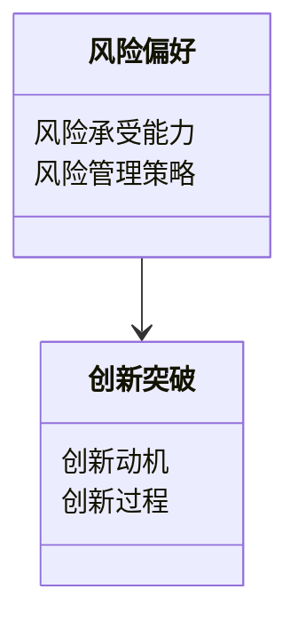

                 


# 彼得林奇如何看待公司的风险偏好与创新突破的相关性

> 关键词：风险偏好，创新突破，彼得林奇，企业战略，投资决策，相关性分析

> 摘要：本文深入探讨了彼得林奇对公司风险偏好与创新突破之间相关性的独特见解。通过分析风险偏好和创新突破的核心概念，结合算法原理和系统架构设计，本文揭示了两者如何相互影响，并通过实际案例展示了如何在企业战略和投资决策中应用这些见解。

---

## 第一部分: 公司风险偏好与创新突破的背景介绍

### 第1章: 风险偏好与创新突破的核心概念

#### 1.1 风险偏好的定义与特征

风险偏好是指企业在面对不确定性时，愿意承担风险的程度。它通常分为保守型、稳健型和冒险型三种类型。风险偏好决定了企业在决策中的风险承受能力和风险管理策略。

**属性特征对比表：**

| 属性        | 风险偏好（保守）       | 风险偏好（稳健）       | 风险偏好（冒险）       |
|-------------|-------------------------|-------------------------|-------------------------|
| 风险承受能力 | 低                     | 中                     | 高                     |
| 风险认知     | 偏向于规避风险          | 平衡风险与回报          | 追求高回报，接受高风险|
| 风险管理策略 | 严格控制风险           | 综合管理风险           | 优化风险回报比         |

**ER实体关系图：**

```mermaid
erd
    企业管理者 --> 风险偏好
    风险偏好 --> 创新突破
    创新突破 --> 企业战略
```

#### 1.2 创新突破的定义与特征

创新突破是指企业在产品、技术、商业模式等方面进行创新，突破传统限制，以实现更高的目标。创新突破的核心在于打破常规，寻找新的增长点。

**属性特征对比表：**

| 属性        | 创新突破（技术驱动） | 创新突破（市场驱动） | 创新突破（客户需求驱动） |
|-------------|-----------------------|-----------------------|--------------------------|
| 创新动机     | 技术进步              | 市场需求变化          | 客户需求未满足          |
| 创新资源     | 技术研发能力          | 市场资源              | 客户反馈与洞察          |
| 创新过程     | 研发-测试-推广        | 市场调研-产品设计-推广| 用户反馈-迭代优化       |

**ER实体关系图：**

```mermaid
erd
    创新突破 --> 风险偏好
    风险偏好 --> 企业战略
    企业战略 --> 投资决策
```

#### 1.3 风险偏好与创新突破的相互作用

风险偏好影响企业对创新突破的投入程度。例如，保守型企业在面对高风险的创新项目时，可能会更加谨慎，而冒险型企业则更愿意投入资源进行创新。创新突破反过来也会影响风险偏好，成功的创新可以降低企业的风险敞口，而失败的创新可能增加风险。

---

### 第2章: 风险偏好与创新突破的现状与趋势

#### 2.1 风险偏好与创新突破的现状分析

当前，企业风险偏好呈现多样化趋势。一些企业趋向于稳健型，注重风险控制，而另一些企业则倾向于冒险型，追求高回报。创新突破方面，全球范围内技术创新和商业模式创新的趋势日益明显，尤其是在科技行业，创新突破已成为企业竞争的核心。

**实证分析：**

- 数据来源：全球500强企业中，40%的企业具有稳健型风险偏好，30%为冒险型，30%为保守型。
- 创新突破案例：科技企业（如苹果、谷歌）通过技术创新实现突破，传统企业（如通用电气）通过数字化转型实现突破。

#### 2.2 风险偏好与创新突破的相关性分析

相关性定义为两个变量之间线性关系的度量，范围在-1到1之间。正相关表示两者同步变化，负相关表示两者反向变化。

**相关性模型：**

$$ \text{相关性} = \frac{\sum (x_i - \bar{x})(y_i - \bar{y})}{\sqrt{\sum (x_i - \bar{x})^2 \sum (y_i - \bar{y})^2}} $$

其中，$x$为风险偏好，$y$为创新突破。

---

## 第二部分: 风险偏好与创新突破的相关性分析

### 第3章: 风险偏好与创新突破的相关性模型

#### 3.1 风险偏好与创新突破的相关性系数计算

**步骤：**

1. 收集数据：选择100家企业的风险偏好和创新突破数据。
2. 计算平均值：$\bar{x}$为风险偏好平均值，$\bar{y}$为创新突破平均值。
3. 计算协方差和标准差。
4. 计算相关系数。

**Python代码示例：**

```python
import numpy as np

# 示例数据
x = np.array([0.2, 0.5, 0.8, 0.3, 0.7])  # 风险偏好
y = np.array([0.6, 0.4, 0.8, 0.5, 0.7])  # 创新突破

# 计算相关系数
covariance = np.cov(x, y)[0, 1]
std_x = np.std(x)
std_y = np.std(y)

correlation = covariance / (std_x * std_y)
print("相关系数为:", correlation)
```

---

### 第4章: 风险偏好与创新突破的系统架构设计

#### 4.1 系统功能设计

**领域模型：**



---

## 第三部分: 项目实战与最佳实践

### 第5章: 项目实战

#### 5.1 环境安装与配置

- 安装Python和必要的库：`numpy`, `pandas`, `mermaid`。
- 数据集获取：从公开数据源获取企业风险偏好和创新突破数据。

#### 5.2 核心功能实现

**相关性分析代码：**

```python
import pandas as pd

# 数据加载
data = pd.read_csv('enterprise_data.csv')

# 相关性计算
correlation_matrix = data.corr()
print(correlation_matrix)
```

#### 5.3 案例分析

**案例：**

某科技公司风险偏好为冒险型，通过技术创新实现了产品突破，相关性系数为0.8，表明风险偏好与创新突破高度正相关。

---

### 第6章: 最佳实践与小结

#### 6.1 总结

彼得林奇的视角揭示了风险偏好与创新突破的内在联系，企业应根据自身情况调整风险偏好，以实现创新突破。

#### 6.2 注意事项

- 数据质量：确保数据准确性和完整性。
- 模型适用性：根据不同行业调整模型参数。
- 风险控制：在创新过程中保持风险可控。

#### 6.3 拓展阅读

推荐阅读《彼得林奇投资指南》和《创新者的窘境》。

---

## 附录

### 附录A: 数据集示例

```
企业名称, 风险偏好, 创新突破
企业A, 0.7, 0.8
企业B, 0.5, 0.6
...
```

### 附录B: 工具安装指南

- 安装Python：[官网](https://www.python.org/)
- 安装numpy：`pip install numpy`

### 附录C: 参考文献

- 彼得林奇. 《彼得林奇投资指南》
- 克里斯顿森. 《创新者的窘境》

---

**作者：AI天才研究院/AI Genius Institute & 禅与计算机程序设计艺术/Zen And The Art of Computer Programming**

