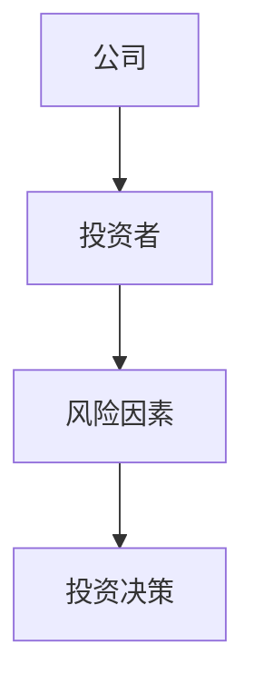
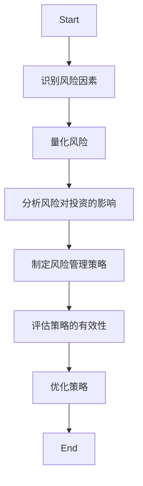
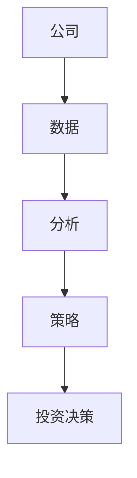
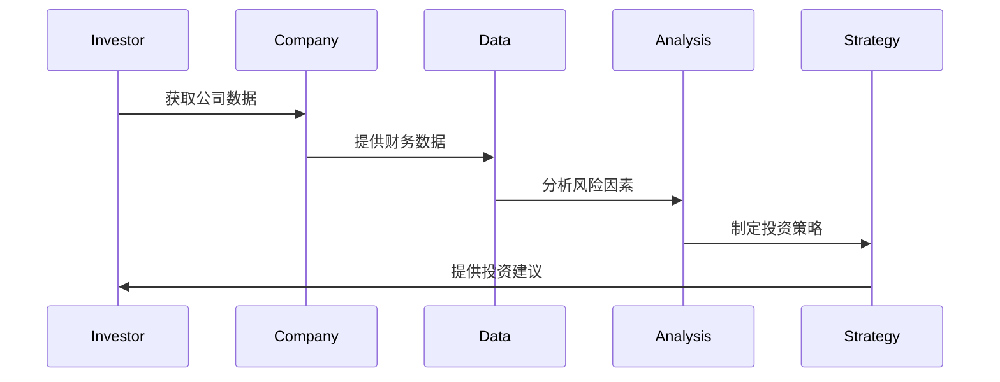

                 


# 彼得·林奇如何看待公司的风险偏好变化

## 关键词：彼得·林奇，风险偏好，投资决策，风险管理，公司分析

## 摘要：  
本文深入探讨了彼得·林奇在评估公司风险偏好时的独特视角，结合投资哲学、数学模型、系统架构和实际案例，全面解析了风险偏好在投资决策中的重要作用。通过详细分析林奇的风险评估方法，本文为投资者提供了实用的策略和工具，帮助他们在复杂市场中做出明智决策。

---

# 第一部分: 风险偏好的基本概念与背景介绍

## 第1章: 风险偏好的定义与内涵

### 1.1 风险偏好的问题背景  
风险偏好是投资者在面对不确定性时的态度，直接影响投资决策的方向和结果。彼得·林奇作为一位成功的投资经理，深刻理解风险偏好的重要性，并将其融入自己的投资哲学中。

### 1.2 风险偏好与投资决策的关系  
风险偏好决定了投资者对高风险高回报的承受能力，进而影响投资组合的选择。林奇认为，理解公司的风险偏好是评估其长期潜力的关键。

### 1.3 风险偏好的核心要素  
- 风险承受能力  
- 风险厌恶程度  
- 风险收益平衡  

---

## 第2章: 彼得·林奇的投资理念与风险偏好

### 2.1 彼得·林奇的投资者画像  
林奇注重基本面分析，关注公司的财务健康和管理层能力，这体现了他对风险偏好的谨慎态度。

### 2.2 林奇的投资哲学  
林奇强调长期投资和价值发现，认为风险偏好是公司稳健发展的基石。

### 2.3 林奇分析框架的核心要素  
- 公司基本面分析  
- 行业风险评估  
- 宏观经济影响  

---

# 第二部分: 风险偏好的核心概念与联系

## 第3章: 风险偏好的核心概念原理

### 3.1 风险偏好的属性特征  
- 风险厌恶：规避高风险投资  
- 风险中性：平衡风险与收益  
- 风险偏好：寻求高风险高回报  

### 3.2 风险偏好与投资风险的对比表格  
| 风险类型 | 投资决策 | 风险偏好 |  
|---------|----------|----------|  
| 低风险  | 保守型   | 风险厌恶 |  
| 中风险  | 平衡型   | 风险中性 |  
| 高风险  | 进取型   | 风险偏好 |  

---

## 第4章: 风险偏好与投资决策的系统架构

### 4.1 风险偏好的ER实体关系图  


### 4.2 投资决策的系统架构  
- 数据获取：公司财务数据、行业趋势  
- 风险评估：量化风险因素  
- 策略制定：基于风险偏好的投资策略  

---

# 第三部分: 风险偏好的算法原理与数学模型

## 第5章: 风险偏好的评估算法流程

### 5.1 风险评估的流程图  


### 5.2 风险偏好的数学模型  
$$ \text{风险偏好} = \frac{\text{预期收益} - \text{无风险收益}}{\text{风险标准差}} $$

---

## 第6章: 风险偏好的数学模型与公式

### 6.1 风险偏好的量化公式  
$$ R_p = \sum_{i=1}^{n} w_i R_i $$  
其中，$w_i$ 是权重，$R_i$ 是各资产的预期收益。

---

# 第四部分: 风险偏好的系统分析与架构设计

## 第7章: 投资决策中的风险偏好分析

### 7.1 问题场景介绍  
- 投资者如何根据公司风险偏好制定投资策略？  
- 如何量化风险因素并评估其影响？

### 7.2 系统功能设计  
- 数据获取：公司财务数据、行业趋势  
- 风险评估：量化风险因素  
- 策略制定：基于风险偏好的投资策略  

---

## 第8章: 风险偏好的系统架构设计

### 8.1 系统架构图  


---

## 第9章: 风险偏好的系统接口设计

### 9.1 数据获取接口  
- 输入：公司财务数据  
- 输出：风险因素列表  

### 9.2 风险分析接口  
- 输入：风险因素  
- 输出：风险影响评估  

---

## 第10章: 风险偏好的系统交互设计

### 10.1 序列图  


---

# 第五部分: 项目实战与最佳实践

## 第11章: 风险偏好的项目实战

### 11.1 环境安装  
- 安装Python和相关库（pandas、numpy）  

### 11.2 系统核心实现  
```python
import pandas as pd
import numpy as np

def calculate_risk_preference(data):
    # 计算风险因素
    risk_factors = data['风险因素']
    # 量化风险
    risk_scores = pd.Series(risk_factors).rank()
    return risk_scores

# 示例数据
data = {
    '风险因素': ['高', '中', '低'],
    '预期收益': [10, 5, 2]
}
result = calculate_risk_preference(data)
print(result)
```

---

## 第12章: 风险偏好的最佳实践

### 12.1 小结  
- 风险偏好是投资决策的核心要素。  
- 林奇的方法强调基本面分析和长期价值。  

### 12.2 注意事项  
- 风险偏好因人而异，需根据自身情况调整。  
- 风险量化需结合具体市场环境。  

### 12.3 拓展阅读  
- 彼得·林奇的《投资最重要的事情》  
- 风险管理的经典文献  

---

## 第六部分: 结语

### 结语  
彼得·林奇的风险偏好分析方法为投资者提供了宝贵的思路。通过量化分析和基本面研究，投资者可以在复杂市场中做出明智决策。希望本文的分析能为读者提供启发，并在实际投资中有所帮助。

---

## 作者：AI天才研究院/AI Genius Institute & 禅与计算机程序设计艺术 /Zen And The Art of Computer Programming

