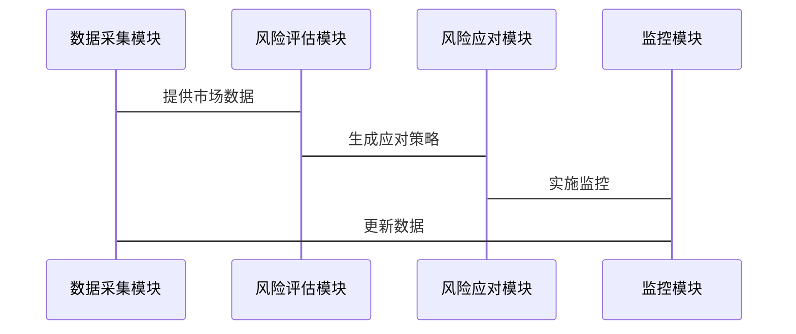

                 


# 彼得林奇如何看待公司的风险管理

## 关键词：风险管理、彼得·林奇、投资策略、风险管理框架、VaR模型、系统架构、项目实战

## 摘要

本文从彼得·林奇的视角探讨公司风险管理的重要性及其具体策略。通过分析风险管理的核心概念、工具与方法，结合实际案例，构建风险管理系统的框架，并通过项目实战展示如何在公司中实施有效的风险管理策略。文章还总结了最佳实践和未来趋势，为读者提供全面的指导。

---

## 正文

### 第一章：风险管理的基础概念与理论

#### 1.1 风险管理的定义与背景

- **风险的定义与特征**  
  风险是未来结果的不确定性，通常表现为损失的可能性。公司风险管理涉及识别、评估和应对这些不确定性，以确保企业稳健运营。

- **风险管理的起源与发展**  
  风险管理起源于保险业，逐步扩展到金融、企业管理和信息技术等领域。随着全球化和数字化的推进，风险管理变得尤为重要。

- **风险管理的核心目标与原则**  
  核心目标是将潜在损失降至最低，同时抓住潜在机会。风险管理应遵循全面性、动态性和成本效益原则。

#### 1.2 风险管理的分类与应用场景

- **风险管理的分类**  
  | 类别          | 描述                           |
  |---------------|--------------------------------|
  | 金融风险      | 与财务相关的风险，如市场波动 |
  | 市场风险      | 产品或服务的市场波动风险     |
  | 信用风险      | 交易对手违约的风险           |
  | 操作风险      | 操作失误或流程缺陷的风险     |

- **风险管理的应用场景**  
  - 企业战略规划
  - 投资决策
  - 项目管理
  - 信息技术安全

- **风险的外延与边界**  
  风险管理不仅关注财务损失，还涉及声誉、合规和环境等方面。

#### 1.3 风险管理的核心要素

- **风险识别**  
  使用SWOT分析法识别内部和外部风险。

- **风险评估**  
  量化风险影响，常用概率-影响矩阵进行评估。

- **风险应对**  
  制定应对策略，如规避、减轻、转移和接受风险。

- **风险监控**  
  建立持续监控机制，及时调整策略。

---

### 第二章：彼得·林奇的风险管理视角

#### 2.1 彼得·林奇的投资哲学

- **价值投资的核心理念**  
  林奇强调基本面分析，寻找被低估的股票。

- **长期投资与分散投资**  
  分散投资降低风险，长期持有减少短期波动影响。

#### 2.2 风险管理策略

- **分散投资**  
  通过投资不同类型资产降低风险。

- **风险定价**  
  评估资产风险与收益的匹配。

- **风险管理文化**  
  建立风险意识和内部控制系统。

#### 2.3 风险管理创新观点

- **风险与收益的平衡**  
  风险是收益的来源，但需谨慎管理。

- **市场波动中的机会**  
  利用市场恐慌寻找被低估资产。

---

### 第三章：风险管理的核心概念

#### 3.1 风险管理的核心概念

- **风险识别与评估**  
  使用VaR模型量化潜在损失。

- **VaR模型**  
  计算特定置信水平下的最大可能损失。

$$ \text{VaR} = \mu + z \cdot \sigma $$

其中，$\mu$是平均回报，$z$是标准正态分布的分位数，$\sigma$是标准差。

- **VaR的计算步骤**  
  1. 计算资产回报的平均值和标准差。
  2. 确定置信水平，选择对应的$z$值。
  3. 计算VaR。

#### 3.2 风险管理工具与方法

- **压力测试**  
  模拟极端市场条件下的资产表现。

- **情景分析**  
  评估不同市场情景下的风险敞口。

---

### 第四章：风险管理的系统架构与工具

#### 4.1 系统架构设计

- **系统功能模块**  
  - 数据采集与处理模块
  - 风险评估模块
  - 风险应对策略模块
  - 监控与报告模块

- **系统交互流程**  
  使用Mermaid序列图展示各模块交互流程。



#### 4.2 项目实战：基于VaR的管理系统

- **环境配置**  
  安装Python和相关库。

- **数据处理与分析**  
  编写代码读取数据，计算VaR。

```python
import numpy as np

def calculate_var(data, confidence_level=0.95):
    mu = np.mean(data)
    sigma = np.std(data)
    z = np.percentile(np.random.standard_normal(10000), 100 * (1 - confidence_level))
    var = mu + z * sigma
    return var

# 示例数据
data = np.random.normal(0, 1, 1000)
var = calculate_var(data)
print(f"VaR at {confidence_level} confidence level: {var}")
```

- **结果展示**  
  使用可视化工具展示VaR结果。

---

### 第五章：总结与最佳实践

#### 5.1 总结

- 彼得·林奇的风险管理策略强调长期投资和分散风险。
- VaR模型是量化风险的重要工具。
- 系统化方法提升风险管理效率。

#### 5.2 最佳实践 tips

- 定期评估和更新风险管理策略。
- 利用现代技术如大数据和AI优化风险管理。
- 建立风险管理文化，培养员工的风险意识。

---

## 作者

作者：AI天才研究院/AI Genius Institute & 禅与计算机程序设计艺术 /Zen And The Art of Computer Programming

