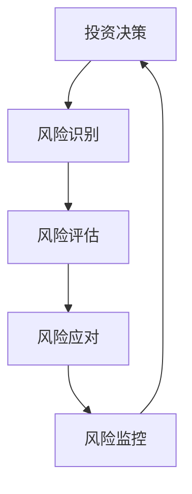

                 


# 彼得林奇如何看待公司的风险管理能力

> 关键词：风险管理能力，彼得·林奇，投资策略，财务分析，风险管理框架

> 摘要：本文深入探讨了彼得·林奇在公司风险管理能力方面的独特见解，结合其投资策略和风险管理框架，分析了如何通过财务指标评估公司风险，并通过案例分析展示了风险管理在投资决策中的实际应用。

---

# 第一部分: 引言

## 第1章: 彼得·林奇与风险管理概述

### 1.1 彼得·林奇的背景与投资理念

彼得·林奇是全球最著名的职业股票投资者之一，曾任富达投资的麦哲伦基金经理，管理资产规模曾高达1400亿美元。他的投资哲学以“价值投资”为核心，强调对公司基本面的深入分析和长期持有的策略。林奇的成功不仅在于他的投资业绩，更在于他对企业风险管理能力的深刻理解。

**1.1.1 彼得·林奇的生平简介**

- 出生：1941年，美国波士顿。
- 教育：毕业于宾夕法尼亚大学，持有金融学和历史学双学位。
- 投资生涯：1971年加入富达投资，开始管理麦哲伦基金，至1990年退休。
- 著作：《彼得·林奇的选股艺术》、《彼得·林奇谈投资》等。

**1.1.2 彼得·林奇的投资哲学与风格**

- 价值投资：寻找那些被市场低估的公司。
- 长期持有：避免频繁交易，降低交易成本。
- 风险控制：在投资决策中，风险控制是首要考虑的因素。

**1.1.3 彼得·林奇对风险管理的重视**

林奇认为，风险管理是投资成功的基石。他强调，投资者必须在投资前识别潜在风险，并制定应对策略。他的风险管理框架以财务分析为核心，结合行业分析和市场环境，帮助投资者降低投资风险。

---

## 1.2 风险管理的核心概念

### 1.2.1 风险管理的定义与内涵

风险管理是指通过识别、评估和应对各种潜在风险，以降低其对目标的影响。在投资领域，风险管理的核心在于识别那些可能影响公司财务健康和投资回报的因素。

### 1.2.2 风险管理的重要性

- 保护投资本金：避免重大损失。
- 提高投资回报：通过降低风险，实现更稳定的收益。
- 优化投资决策：通过风险评估，选择更优质的投资标的。

### 1.2.3 风险管理的基本框架

- 风险识别：识别可能影响投资的各类风险。
- 风险评估：量化风险的可能性和影响程度。
- 风险应对：制定应对策略，降低风险影响。
- 风险监控：持续跟踪风险变化，及时调整应对策略。

---

## 1.3 本书的目的与结构

### 1.3.1 本书的研究目标

本文旨在探讨彼得·林奇的风险管理理念，结合其投资策略，分析如何通过财务指标和行业分析评估公司的风险管理能力。

### 1.3.2 本书的章节安排

本文分为四个主要部分：
1. 引言：介绍彼得·林奇及其风险管理理念。
2. 核心概念：讲解风险管理的基本框架和方法。
3. 风险管理的系统分析与架构设计。
4. 项目实战：通过具体案例分析，展示风险管理的实际应用。

### 1.3.3 本书的阅读方法

建议读者结合实际投资案例，逐步理解风险管理的核心概念，并通过系统架构图和流程图，掌握风险管理的实施步骤。

---

# 第二部分: 风险管理的核心概念与方法

## 第2章: 风险管理的基本框架

### 2.1 风险管理的四个核心要素

**2.1.1 风险识别**

- 风险识别的方法：
  1. 定性分析：通过行业分析和公司基本面分析，识别潜在风险。
  2. 定量分析：通过财务指标分析，量化风险程度。

**2.1.2 风险评估**

- 风险评估的关键指标：
  1. 财务健康状况：通过资产负债表、利润表和现金流量表分析公司财务健康状况。
  2. 盈利能力：通过ROE（净资产收益率）、净利润率等指标评估公司盈利能力。

**2.1.3 风险应对**

- 风险应对的策略：
  1. 风险规避：通过分散投资降低单一投资的风险。
  2. 风险降低：通过优化投资组合降低整体风险。
  3. 风险转移：通过衍生工具将部分风险转移给他人。

**2.1.4 风险监控**

- 风险监控的工具：
  1. 实时监控：通过市场数据和财务报表，实时跟踪公司风险。
  2. 定期评估：定期评估公司风险状况，及时调整投资策略。

---

## 第3章: 彼得·林奇的风险评估方法

### 3.1 风险评估的基本原则

**3.1.1 风险评估的科学性**

- 科学性体现在：
  1. 数据的准确性：使用可靠的财务数据进行分析。
  2. 方法的系统性：采用系统化的分析方法，确保评估结果的客观性。

**3.1.2 风险评估的系统性**

- 系统性体现在：
  1. 全面性：从财务、市场、行业等多个维度进行评估。
  2. 动态性：根据市场变化和公司经营状况，动态调整评估结果。

### 3.2 彼得·林奇的财务指标分析

**3.2.1 财务健康状况的评估标准**

- 核心财务指标：
  1. 资产负债率：评估公司财务杠杆风险。
  2. 净利润率：评估公司盈利能力。
  3. 存货周转率：评估公司运营效率。

**3.2.2 关键财务指标的解读**

- 资产负债率：$$ \text{资产负债率} = \frac{\text{总负债}}{\text{总资产}} \times 100\% $$
- 净利润率：$$ \text{净利润率} = \frac{\text{净利润}}{\text{营业收入}} \times 100\% $$
- 存货周转率：$$ \text{存货周转率} = \frac{\text{营业收入}}{\text{平均存货}} $$

**3.2.3 财务风险的量化方法**

- 通过财务比率分析，量化公司财务风险：
  1. 流动比率：$$ \text{流动比率} = \frac{\text{流动资产}}{\text{流动负债}} $$
  2. 速动比率：$$ \text{速动比率} = \frac{\text{速动资产}}{\text{流动负债}} $$

---

## 第4章: 彼得·林奇的风险应对策略

### 4.1 风险应对的基本策略

**4.1.1 风险规避**

- 通过分散投资降低单一投资的风险。

**4.1.2 风险降低**

- 通过优化投资组合降低整体风险。

**4.1.3 风险转移**

- 通过衍生工具将部分风险转移给他人。

**4.1.4 风险接受**

- 在无法避免的情况下，接受一定的风险。

### 4.2 彼得·林奇的风险对冲方法

**4.2.1 通过多样化投资分散风险**

- 构建多元化的投资组合，降低单一资产的风险。

**4.2.2 利用衍生工具对冲风险**

- 使用期货、期权等衍生工具，对冲市场波动风险。

**4.2.3 通过行业轮动降低风险**

- 根据市场周期变化，调整投资组合中不同行业的权重。

---

## 第5章: 风险管理的系统分析与架构设计

### 5.1 风险管理的系统架构图



---

## 第6章: 项目实战

### 6.1 环境安装

- 需要的工具：
  1. Python编程语言
  2. Pandas、Numpy等数据分析库
  3. Matplotlib或Seaborn可视化库

### 6.2 核心代码实现

```python
import pandas as pd
import numpy as np
import matplotlib.pyplot as plt

# 假设我们有一个公司的财务数据
data = {
    'Year': [2018, 2019, 2020, 2021, 2022],
    'Revenue': [100, 120, 110, 130, 140],
    'NetProfit': [20, 25, 22, 28, 30]
}

df = pd.DataFrame(data)
print(df)

# 计算净利润率
df['NetProfitRatio'] = df['NetProfit'] / df['Revenue'] * 100
print(df)
```

### 6.3 案例分析

**案例：假设我们分析一家公司的财务健康状况**

- 数据来源：公司过去5年的财务报表。
- 分析步骤：
  1. 计算关键财务指标（如净利润率、流动比率等）。
  2. 对比行业平均水平，评估公司财务健康状况。
  3. 根据分析结果，制定投资策略。

---

## 第7章: 结论与未来展望

### 7.1 本章小结

- 彼得·林奇的风险管理理念以财务分析为核心，强调风险识别、评估和应对的系统性。
- 通过财务指标分析和行业分析，投资者可以有效评估公司的风险管理能力，并制定相应的投资策略。

### 7.2 最佳实践 Tips

- 在投资前，一定要对公司进行深入的财务分析。
- 通过多样化投资和衍生工具，降低投资风险。
- 定期评估投资组合的风险状况，及时调整投资策略。

### 7.3 未来展望

- 随着人工智能和大数据技术的发展，风险管理将更加精准和高效。
- 投资者需要不断学习新的风险管理工具和技术，以应对复杂的市场环境。

---

# 作者：AI天才研究院/AI Genius Institute & 禅与计算机程序设计艺术 /Zen And The Art of Computer Programming

---

**注**：由于篇幅限制，以上内容为文章的部分章节，完整文章将包含更多细节和案例分析。

