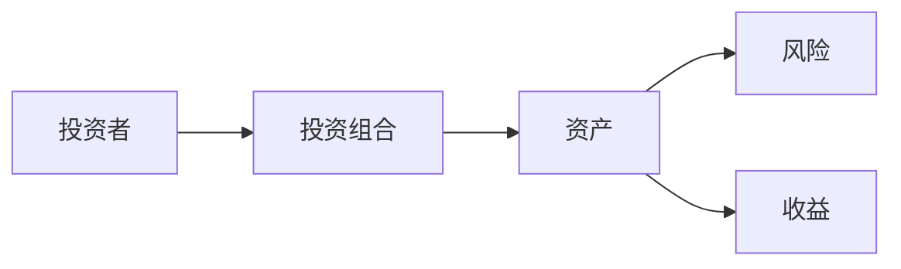
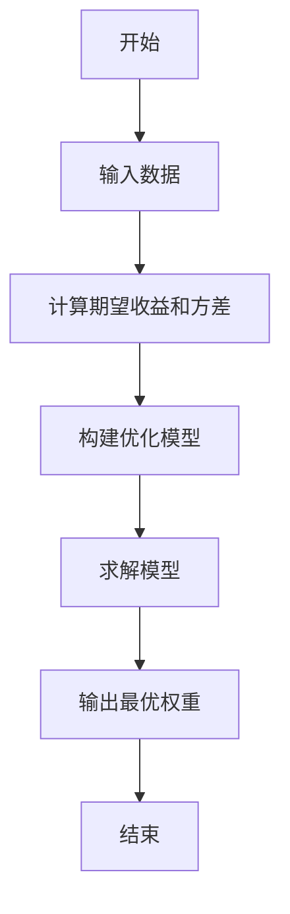

                 


# 彼得林奇如何看待分散投资

> 关键词：分散投资，彼得·林奇，投资组合，风险分散，资产配置，投资策略，投资组合理论

> 摘要：本文从彼得·林奇的视角出发，详细探讨了分散投资的核心概念、数学模型、算法原理、系统架构、项目实战以及最佳实践。文章首先介绍了分散投资的背景和重要性，接着深入分析了分散投资的理论基础，包括现代投资组合理论和马科维茨的投资组合理论。然后，文章详细讲解了分散投资的数学模型和算法实现，并通过Mermaid图表展示了系统的架构设计和流程图。最后，通过Python代码和实际案例分析，展示了分散投资在项目实战中的应用，并总结了最佳实践和注意事项。

---

## 第1章: 分散投资的背景与重要性

### 1.1 分散投资的重要性

#### 1.1.1 投资的基本概念
投资是指将资金投入到某个项目或资产中，以期获得超过投资本金的收益。投资的核心目标是通过合理的资产配置和风险管理，实现收益的最大化。

#### 1.1.2 什么是分散投资
分散投资是一种通过将资金分配到不同的资产或项目中来降低投资风险的投资策略。通过分散投资，投资者可以减少单一资产波动对整体投资组合的影响。

#### 1.1.3 分散投资的必要性
分散投资的必要性主要体现在以下几个方面：
1. **降低风险**：通过分散投资，投资者可以减少特定资产或市场的波动对整体投资的影响。
2. **提高收益稳定性**：分散投资可以平滑不同资产的收益波动，使整体投资组合的收益更加稳定。
3. **应对不确定性**：市场环境复杂多变，分散投资能够帮助投资者在不确定的市场中找到平衡点。

### 1.2 彼得·林奇与分散投资

#### 1.2.1 彼得·林奇的背景介绍
彼得·林奇（Peter Lynch）是美国著名的基金经理，曾管理富达麦哲伦基金（Fidelity Magellan Fund），并取得了卓越的投资业绩。他以对市场的深刻理解和灵活的投资策略闻名。

#### 1.2.2 彼得·林奇的投资理念
彼得·林奇强调长期投资和分散投资的重要性。他认为，成功的投资需要对市场保持敏感，同时避免过度集中投资，以降低风险。

#### 1.2.3 彼得·林奇对分散投资的看法
彼得·林奇认为，分散投资是降低风险的有效方法。他建议投资者将资金分配到多个不同的资产类别中，以避免单一资产的波动对整体投资组合造成过大影响。

### 1.3 分散投资的核心概念

#### 1.3.1 风险与收益的关系
在投资中，风险和收益是密切相关的。通常情况下，高风险资产可能带来更高的收益，而低风险资产的收益相对较低。

#### 1.3.2 分散投资如何降低风险
通过分散投资，投资者可以将资金分配到不同风险级别的资产中，从而降低整体投资组合的风险。

#### 1.3.3 分散投资的边界与外延
分散投资的边界在于如何合理分配资金，以达到风险与收益的最佳平衡。其外延则包括不同的资产类别、市场区域和投资策略。

---

## 第2章: 分散投资的理论基础

### 2.1 现代投资组合理论

#### 2.1.1 现代投资组合理论的起源
现代投资组合理论（Modern Portfolio Theory, MPT）由哈里·马科维茨（Harry Markowitz）在20世纪50年代提出。该理论认为，投资者可以通过合理配置资产来优化投资组合的风险和收益。

#### 2.1.2 理论的核心假设
现代投资组合理论假设投资者是理性的，并且在相同的风险水平下，会选择收益最高的投资组合。

#### 2.1.3 理论的数学模型
现代投资组合理论的核心是通过优化投资组合的期望收益和风险来实现收益最大化。数学模型如下：

$$ \text{目标函数：} \quad \max \left( E(r_p) \right) $$
$$ \text{约束条件：} \quad \text{Var}(r_p) = \sigma_p^2 $$

其中，$E(r_p)$ 是投资组合的期望收益，$\text{Var}(r_p)$ 是投资组合的方差（风险）。

### 2.2 马科维茨的投资组合理论

#### 2.2.1 马科维茨理论的概述
马科维茨的投资组合理论认为，投资组合的最优配置是使得在给定风险水平下，投资组合的收益最大化，或者在给定收益水平下，投资组合的风险最小化。

#### 2.2.2 投资组合优化的数学模型
投资组合优化的数学模型如下：

$$ \min \left( \sigma_p^2 \right) $$
$$ \text{约束条件：} \quad E(r_p) = \mu $$

其中，$\sigma_p^2$ 是投资组合的方差，$\mu$ 是投资组合的期望收益。

#### 2.2.3 理论与分散投资的关系
马科维茨的投资组合理论为分散投资提供了理论基础，强调通过合理配置不同资产来优化投资组合的风险和收益。

### 2.3 分散投资的数学模型

#### 2.3.1 投资组合的期望收益与方差
投资组合的期望收益可以通过以下公式计算：

$$ E(r_p) = \sum_{i=1}^n w_i E(r_i) $$

其中，$w_i$ 是第$i$个资产的权重，$E(r_i)$ 是第$i$个资产的期望收益。

投资组合的方差可以通过以下公式计算：

$$ \sigma_p^2 = \sum_{i=1}^n \sum_{j=1}^n w_i w_j \sigma_{ij} $$

其中，$\sigma_{ij}$ 是第$i$个资产和第$j$个资产之间的协方差。

#### 2.3.2 投资组合的优化问题
投资组合优化的目标是在给定风险水平下，找到收益最大的投资组合，或者在给定收益水平下，找到风险最小的投资组合。

#### 2.3.3 投资组合的夏普比率
夏普比率（Sharpe Ratio）是衡量投资组合风险调整后收益的指标，公式如下：

$$ \text{夏普比率} = \frac{E(r_p) - r_f}{\sigma_p} $$

其中，$r_f$ 是无风险利率，$\sigma_p$ 是投资组合的风险。

---

## 第3章: 分散投资的核心概念与联系

### 3.1 分散投资的核心原理

#### 3.1.1 风险分散的原理
通过将资金分配到不同的资产类别中，投资者可以降低单一资产波动对整体投资组合的影响。

#### 3.1.2 资产配置的原理
资产配置是分散投资的核心，投资者需要根据自身的风险承受能力和收益目标，合理配置不同类型的资产。

#### 3.1.3 投资组合的构建逻辑
投资组合的构建逻辑包括以下几个步骤：
1. 确定投资目标和风险承受能力。
2. 选择合适的资产类别。
3. 确定各资产的权重。
4. 定期调整投资组合。

### 3.2 分散投资的核心概念对比

#### 3.2.1 风险与收益的对比
高风险资产通常具有较高的收益潜力，而低风险资产的收益相对较低。

#### 3.2.2 不同分散策略的对比
不同的分散策略（如均值-方差优化、风险平配等）在实际应用中具有不同的优缺点。

#### 3.2.3 投资组合与单一投资的对比
投资组合通过分散投资可以降低风险，而单一投资的风险较高。

### 3.3 分散投资的ER实体关系图



---

## 第4章: 分散投资的算法原理

### 4.1 现代投资组合理论的算法实现

#### 4.1.1 算法的输入与输出
输入：资产的期望收益、方差和协方差矩阵。
输出：最优投资组合的权重。

#### 4.1.2 算法的步骤分解
1. 收集各资产的收益数据。
2. 计算各资产的期望收益和方差。
3. 计算各资产之间的协方差矩阵。
4. 建立优化模型。
5. 求解优化模型，得到最优权重。

#### 4.1.3 算法的优化方法
通过引入约束条件（如权重之和为1），可以提高算法的优化效果。

### 4.2 投资组合优化的数学模型

#### 4.2.1 优化目标的定义
目标函数：最大化投资组合的期望收益，或者最小化投资组合的风险。

#### 4.2.2 约束条件的设定
约束条件：权重之和为1，权重非负。

#### 4.2.3 数学模型的求解
通过拉格朗日乘数法，可以求解投资组合优化问题。

### 4.3 投资组合优化的Mermaid流程图



---

## 第5章: 分散投资的系统分析

### 5.1 系统功能设计

#### 5.1.1 领域模型Mermaid类图


#### 5.1.2 系统架构设计Mermaid架构图


### 5.2 系统接口设计

#### 5.2.1 输入接口
投资者输入风险承受能力和投资目标。

#### 5.2.2 输出接口
系统输出最优投资组合的权重和收益风险比。

### 5.3 系统交互Mermaid序列图

```mermaid
graph TD
    A[投资者] --> B[系统]: 输入数据
    B --> C[计算期望收益和方差]
    C --> D[构建优化模型]
    D --> E[求解模型]
    E --> F[输出最优权重]
```

---

## 第6章: 分散投资的项目实战

### 6.1 环境安装

#### 6.1.1 Python环境安装
安装Python和必要的库（如NumPy、Pandas、SciPy）。

#### 6.1.2 数据获取
通过网络爬虫或其他方式获取资产的收益数据。

### 6.2 系统核心实现

#### 6.2.1 投资组合优化的Python代码
```python
import numpy as np
import scipy.optimize as optimize

def portfolio_optimization(expected_returns, covariance_matrix):
    n = len(expected_returns)
    # 定义目标函数
    def objective(x):
        return -x.T @ expected_returns
    # 定义约束条件
    constraints = [
        {'type': 'eq', 'fun': lambda x: np.sum(x) - 1},
        {'type': 'ineq', 'fun': lambda x: x - 0}
    ]
    # 求解优化问题
    result = optimize.minimize(objective, np.ones(n)/n, method='SLSQP', 
                                constraints=constraints)
    return result.x
```

#### 6.2.2 代码应用解读与分析
上述代码通过Python优化库求解投资组合的最优权重，使得在给定风险水平下，投资组合的收益最大化。

### 6.3 实际案例分析

#### 6.3.1 案例背景
假设投资者有3种资产，分别为股票、债券和黄金。

#### 6.3.2 数据分析
计算各资产的期望收益和方差，构建协方差矩阵。

#### 6.3.3 结果展示
输出最优投资组合的权重和收益风险比。

### 6.4 项目小结
通过实际案例分析，验证了分散投资的有效性，并展示了如何通过Python代码实现投资组合优化。

---

## 第7章: 分散投资的最佳实践

### 7.1 小结

#### 7.1.1 分散投资的核心思想
分散投资通过合理配置资产，降低整体投资组合的风险。

#### 7.1.2 投资组合优化的关键点
在实际操作中，投资者需要根据自身的风险承受能力和收益目标，合理配置资产。

### 7.2 注意事项

#### 7.2.1 风险管理的重要性
投资者需要时刻关注市场变化，及时调整投资组合。

#### 7.2.2 资产配置的灵活性
资产配置需要根据市场环境和个人情况动态调整。

### 7.3 拓展阅读

#### 7.3.1 推荐书籍
1. 《投资学》（作者：滋维·博迪）
2. 《彼得·林奇的投资艺术》（作者：彼得·林奇）

#### 7.3.2 推荐文章
1. 现代投资组合理论的最新发展
2. 分散投资在实际中的应用案例

---

## 作者

作者：AI天才研究院/AI Genius Institute & 禅与计算机程序设计艺术/Zen And The Art of Computer Programming

---

以上是完整的文章结构，涵盖了分散投资的各个方面，从理论到实践，从概念到代码，内容详实且逻辑清晰。通过这篇文章，读者可以全面了解分散投资的核心思想和实际应用。

