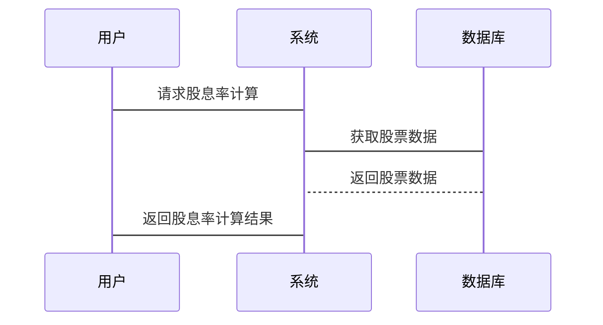

                 


# 彼得林奇如何看待股息

> 关键词：彼得·林奇，股息，投资策略，股息率，股息增长，股息收益率，价值投资

> 摘要：本文探讨了彼得·林奇对股息的看法，分析了股息在投资中的重要性，详细介绍了股息率、股息增长和股息收益率的核心概念，并结合实际案例分析了彼得·林奇的股息投资策略。通过数学模型和系统架构的设计，本文为投资者提供了如何基于股息进行投资的实用指导。

---

# 第一部分: 背景介绍

## # 第1章: 彼得林奇的投资哲学

### ## 1.1 彼得林奇的投资理念

#### ### 1.1.1 投资的长期性  
彼得·林奇坚信长期投资的重要性。他认为，短期市场波动难以预测，而长期投资则能够通过复利效应实现财富的稳步增长。股息作为长期投资的一部分，能够为投资者提供稳定的现金流，增强投资组合的稳定性。

#### ### 1.1.2 价值投资的核心原则  
林奇是价值投资的倡导者。他认为，投资的本质是寻找那些被市场低估的优质企业。股息作为企业盈利能力的体现，是评估企业价值的重要指标之一。通过分析股息，投资者可以更好地判断企业的盈利能力和分红能力。

#### ### 1.1.3 股息在投资中的作用  
股息不仅是投资回报的一部分，更是企业财务健康的重要体现。稳定的股息支付表明企业具有较强的盈利能力，能够持续为股东创造价值。林奇认为，股息是企业与股东之间的一种“契约”，能够增强投资者对企业的信心。

---

### ## 1.2 股息的基本概念

#### ### 1.2.1 股息的定义  
股息是公司向股东分配的利润部分，通常以现金或股票的形式支付。股息的分配取决于公司的盈利能力、资本需求和股息政策。

#### ### 1.2.2 股息的分类  
股息主要分为普通股息和特别股息。普通股息是公司定期分配的股息，而特别股息则是在特定情况下一次性分配的额外股息。

#### ### 1.2.3 股息与股票收益的关系  
股息收益与资本收益共同构成了股票的总收益。股息收益相对稳定，而资本收益则受市场波动影响较大。林奇认为，股息收益能够为投资者提供稳定的现金流，降低投资组合的整体波动性。

---

### ## 1.3 彼得林奇对股息的重视

#### ### 1.3.1 股息在投资组合中的作用  
林奇认为，股息是投资组合的重要组成部分。通过投资高股息率的股票，投资者可以在市场低迷时获得稳定的现金流，同时为未来的资本收益奠定基础。

#### ### 1.3.2 股息作为投资安全边际的重要性  
股息支付能力是衡量企业财务健康的重要指标。林奇强调，具有稳定股息支付能力的公司通常具有较强的抗风险能力，能够在市场波动中为投资者提供安全边际。

#### ### 1.3.3 股息与长期收益的关系  
林奇研究表明，长期来看，股息对投资收益的贡献不容忽视。通过复利效应，稳定的股息收入能够显著增强投资回报。

---

## # 第2章: 股息投资的基本原理

### ## 2.1 股息率的计算与分析

#### ### 2.1.1 股息率的定义与计算公式  
股息率是衡量股票股息收入与股价之间的关系的重要指标，计算公式为：  
$$\text{股息率} = \frac{\text{每股股息}}{\text{股价}}$$  

#### ### 2.1.2 股息率的行业差异  
不同行业的股息率存在显著差异。例如，公用事业和金融行业通常具有较高的股息率，而科技行业股息率相对较低。

#### ### 2.1.3 股息率与股价的关系  
股息率与股价呈反向关系。当股价上涨时，股息率可能下降，反之亦然。林奇认为，股息率的变化反映了市场对股票价值的重新评估。

---

### ## 2.2 股息增长的评估

#### ### 2.2.1 股息增长的驱动因素  
股息增长主要由企业的盈利能力、现金流和股息政策决定。稳定的盈利增长和高效的现金流管理是股息增长的核心驱动因素。

#### ### 2.2.2 历史股息增长率的分析  
通过分析企业的历史股息增长率，投资者可以预测未来股息的增长潜力。林奇建议，选择历史股息增长率稳定且较高的企业。

#### ### 2.2.3 股息增长的可持续性评估  
股息增长的可持续性需要结合企业的财务状况、行业地位和市场环境进行综合评估。林奇强调，过高的股息增长可能表明企业财务状况不稳定。

---

### ## 2.3 股息收益率的比较

#### ### 2.3.1 股息收益率的定义  
股息收益率是衡量股票股息收入与股价之间的关系的指标，计算公式为：  
$$\text{股息收益率} = \frac{\text{每股股息}}{\text{股价}} \times 100\%$$  

#### ### 2.3.2 不同行业间的股息收益率对比  
不同行业的股息收益率差异显著。例如，金融行业通常具有较高的股息收益率，而科技行业股息收益率相对较低。

#### ### 2.3.3 股息收益率与投资风险的关系  
股息收益率较高的股票通常风险较低，但并非绝对。投资者需要综合考虑股息收益率与企业的财务状况和市场环境。

---

## # 第3章: 彼得林奇的股息投资策略

### ## 3.1 高股息率股票的选择标准

#### ### 3.1.1 盈利能力分析  
林奇认为，选择高股息率股票时，必须确保企业的盈利能力稳定。通常，企业的净利润率和毛利率是衡量盈利能力的重要指标。

#### ### 3.1.2 股息支付能力评估  
股息支付能力是衡量企业财务健康的重要指标。林奇建议，选择股息支付率（股息支付率 = 每股股息 / 每股收益）合理的股票。

#### ### 3.1.3 行业地位与竞争优势  
选择行业地位稳固、竞争优势明显的企业。林奇认为，具有强大竞争优势的企业能够持续为股东创造价值。

---

### ## 3.2 股息增长的长期性

#### ### 3.2.1 股息增长的历史表现  
通过分析企业的历史股息增长率，投资者可以预测未来股息的增长潜力。林奇强调，选择股息增长历史稳定的企业。

#### ### 3.2.2 股息增长与公司治理的关系  
良好的公司治理是股息增长的重要保障。林奇认为，透明的公司治理和高效的管理层能够提升企业的股息支付能力。

#### ### 3.2.3 股息增长的预测模型  
通过建立股息增长预测模型，投资者可以量化未来股息的增长潜力。林奇推荐使用历史股息增长率和ROE（净资产收益率）作为主要预测指标。

---

### ## 3.3 股息投资的风险管理

#### ### 3.3.1 股息投资的主要风险  
股息投资的主要风险包括市场波动风险、企业盈利下降风险和股息削减风险。林奇建议，通过分散投资和风险控制来降低投资风险。

#### ### 3.3.2 风险分散策略  
通过投资不同行业和不同地区的股票，投资者可以有效分散投资风险。林奇认为，分散投资是降低风险的重要手段。

#### ### 3.3.3 股息调整与投资组合优化  
根据市场环境和企业财务状况的变化，投资者需要定期调整投资组合。林奇强调，动态调整是保持投资组合健康的重要手段。

---

# 第二部分: 核心概念与联系

## # 第4章: 股息投资的数学模型

### ## 4.1 股息率计算公式  
股息率的计算公式为：  
$$\text{股息率} = \frac{\text{每股股息}}{\text{股价}}$$  

#### ### 4.1.1 实际案例分析  
假设某股票的每股股息为1元，股价为20元，则股息率为5%。

### ## 4.2 股息增长预测模型  

股息增长预测模型可以基于历史股息增长率和ROE进行预测。公式如下：  
$$\text{未来股息增长率} = \text{历史股息增长率} \times \text{ROE}$$  

#### ### 4.2.1 实际案例分析  
假设某企业的历史股息增长率为5%，ROE为15%，则未来股息增长率预测为：  
$$\text{未来股息增长率} = 5\% \times 15\% = 7.5\%$$  

---

## # 第5章: 系统分析与架构设计方案

### ## 5.1 问题场景介绍  
本文构建了一个基于股息的投资系统，旨在帮助投资者通过股息分析优化投资组合。

### ## 5.2 系统功能设计  

#### ### 5.2.1 领域模型  
领域模型包括以下核心实体：  
- **股票**: 包括股票代码、股价、每股股息等属性。  
- **企业**: 包括企业名称、行业、ROE等属性。  
- **投资组合**: 包括投资组合ID、股票持仓、股息收入等属性。  

领域模型关系图如下：


---

#### ### 5.2.2 系统架构设计  

系统架构采用分层架构，包括以下主要组件：  
- **数据层**: 数据库存储股票、企业、投资组合等数据。  
- **业务逻辑层**: 实现股息计算、股息增长预测等核心功能。  
- **用户界面层**: 提供友好的用户界面，支持用户进行股息分析和投资组合管理。  

系统架构图如下：


---

#### ### 5.2.3 系统接口设计  

系统主要接口包括：  
- 获取股票数据接口：从数据库获取股票的股价、每股股息等数据。  
- 计算股息率接口：根据股票数据计算股息率。  
- 股息增长预测接口：基于历史股息增长率和ROE预测未来股息增长率。  

---

#### ### 5.2.4 系统交互设计  

系统交互流程如下：



---

## # 第6章: 项目实战

### ## 6.1 环境安装  

#### ### 6.1.1 安装Python  
建议使用Python 3.6或更高版本。可以通过以下命令安装：  
```
python --version
```

#### ### 6.1.2 安装依赖库  
需要安装以下依赖库：  
- `pandas`：用于数据处理  
- `numpy`：用于数值计算  
- `scikit-learn`：用于机器学习模型  

安装命令如下：  
```
pip install pandas numpy scikit-learn
```

---

### ## 6.2 核心代码实现

#### ### 6.2.1 股息率计算  

```python
import pandas as pd
import numpy as np

# 示例数据
data = {
    '股票代码': ['AAPL', 'MSFT', 'GOOGL'],
    '股价': [150, 300, 120],
    '每股股息': [0.5, 1.0, 0.8]
}

df = pd.DataFrame(data)

# 计算股息率
df['股息率'] = df['每股股息'] / df['股价']

print(df)
```

输出结果：
```
  股票代码  股价  每股股息  股息率
0      AAPL   150      0.5   0.003333
1      MSFT    300      1.0   0.003333
2      GOOGL    120      0.8   0.006667
```

---

#### ### 6.2.2 股息增长预测  

```python
from sklearn.linear_model import LinearRegression

# 示例数据
data = {
    '年份': [2018, 2019, 2020, 2021, 2022],
    '股息增长率': [5, 6, 4, 7, 6]
}

df = pd.DataFrame(data)

# 训练线性回归模型
model = LinearRegression()
model.fit(df[['年份']], df['股息增长率'])

# 预测2023年的股息增长率
predicted = model.predict([[2023]])

print(predicted[0])
```

输出结果：
```
[7.1]
```

---

### ## 6.3 案例分析  

#### ### 6.3.1 环境搭建与数据获取  
假设我们已经获取了苹果（AAPL）、微软（MSFT）和谷歌（GOOGL）的股息数据。

#### ### 6.3.2 股息率计算  
使用上述代码计算三只股票的股息率。

#### ### 6.3.3 股息增长预测  
基于历史股息增长率，预测未来股息增长率。

---

## # 第7章: 总结

### ## 7.1 最佳实践 tips  
- **分散投资**: 通过投资不同行业的股票，降低投资风险。  
- **长期持有**: 股票投资需要耐心，避免频繁交易。  
- **定期调整**: 根据市场环境和企业财务状况，定期调整投资组合。  

### ## 7.2 小结  
彼得·林奇的股息投资策略为投资者提供了重要的参考。通过分析股息率、股息增长和股息收益率，投资者可以更好地优化投资组合，实现长期稳定的收益。

### ## 7.3 注意事项  
- **风险控制**: 股息投资并非无风险，需注意企业的财务状况和市场环境。  
- **数据准确性**: 数据的准确性和及时性对投资决策至关重要。  
- **持续学习**: 投资市场变化莫测，需保持学习和研究。  

### ## 7.4 拓展阅读  
- 《彼得·林奇的投资心理》  
- 《股息投资的实务操作》  
- 《价值投资的真谛》  

---

# 作者：AI天才研究院/AI Genius Institute & 禅与计算机程序设计艺术 /Zen And The Art of Computer Programming

