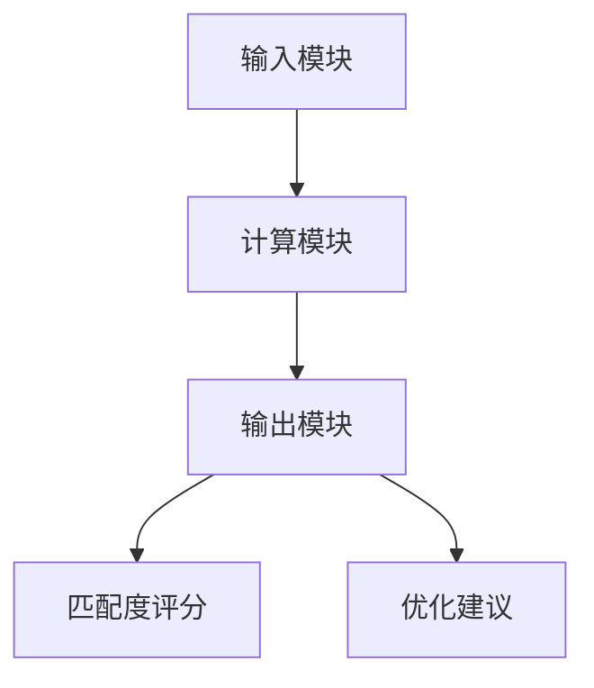

                 


# 彼得林奇如何评估公司的全球化人才战略与本地化执行的匹配度

## 关键词：彼得·林奇，全球化人才战略，本地化执行，匹配度，人才评估模型，SWOT分析，投资哲学

## 摘要：  
本文深入探讨彼得·林奇的投资哲学如何应用于公司全球化人才战略与本地化执行的匹配度评估。通过分析全球化与本地化的战略背景、核心概念、算法原理、系统架构及实战案例，本文为读者提供一套基于彼得·林奇思维的人才战略评估方法。从理论到实践，全面解析如何通过匹配度评估优化企业人才战略，实现全球化与本地化的协同发展。

---

## 第一部分: 引言

### 第1章: 彼得·林奇与全球化人才战略概述

#### 1.1 彼得·林奇的背景与投资理念  
彼得·林奇（Peter Lynch）是全球著名的职业棒球运动员和投资专家，以其独特的投资哲学闻名。他强调对企业基本面的深入分析和长期投资策略。林奇的投资理念不仅适用于资本市场，也可为企业的全球化人才战略提供借鉴。  
**关键点：**  
- 彼得·林奇的核心思想：价值投资、长期主义、基本面分析。  
- 投资哲学与企业人才战略的相似性：均需关注长期目标与短期执行的匹配。

#### 1.2 全球化人才战略的核心概念  
全球化人才战略指的是企业在跨国经营中，如何在全球范围内配置和管理人才资源。本地化执行则是指在特定国家或地区，根据当地文化、政策和市场需求调整人才策略。两者的匹配度直接影响企业的全球化竞争力。  
**关键点：**  
- 全球化人才战略：跨文化管理、全球资源整合、人才多样性。  
- 本地化执行：适应性调整、文化敏感性、地方政策合规性。

#### 1.3 本书的目的与结构  
本文旨在通过彼得·林奇的思维框架，分析全球化人才战略与本地化执行的匹配度问题。通过理论分析、算法设计、系统架构和实战案例，为读者提供一套实用的评估方法。  
**关键点：**  
- 目标：优化企业人才战略，提升全球化与本地化的协同效应。  
- 结构：从背景分析到算法设计，再到系统实现与案例实战，层层递进。

---

## 第二部分: 全球化人才战略的背景与挑战

### 第2章: 全球化与本地化的战略背景

#### 2.1 全球化企业的现状与趋势  
随着全球经济一体化的深入，企业 increasingly need to operate globally. 大型跨国公司需要在全球范围内配置资源，而人才是其中最重要的资源。  
**关键点：**  
- 全球化企业的特点：多元化、国际化、跨文化管理。  
- 全球化对人才战略的影响：人才需求多样化、管理复杂化。

#### 2.2 本地化执行的必要性  
本地化执行是企业在特定市场中取得成功的关键。通过适应当地文化、政策和市场需求，企业可以更好地融入当地环境。  
**关键点：**  
- 本地化执行的核心目标：市场适应性、文化融合、政策合规性。  
- 本地化与全球化的关系：互补而非对立。

#### 2.3 人才战略匹配度的重要性  
全球化与本地化的匹配度直接影响企业的绩效。匹配度高，企业可以充分发挥全球化资源的优势，同时适应本地市场的需求。  
**关键点：**  
- 匹配度对企业绩效的影响：竞争力提升、成本降低、风险减少。  
- 彼得·林奇对匹配度的重视：通过深入分析，找到最优匹配点。

---

## 第三部分: 全球化人才战略的核心要素

### 第3章: 全球化人才战略的关键维度

#### 3.1 全球化战略的维度分析  
全球化战略涉及多个维度，包括企业愿景、组织架构、决策机制等。彼得·林奇认为，这些维度需要与本地化执行紧密结合。  
**关键点：**  
- 企业愿景：全球化与本地化的统一性。  
- 组织架构：全球化的协调机制。  
- 决策机制：全球化战略的本地化调整。

#### 3.2 本地化执行的核心要素  
本地化执行需要考虑文化、政策和市场需求的差异。彼得·林奇强调，这些差异是实现匹配度的关键因素。  
**关键点：**  
- 文化差异：跨文化管理的挑战与机遇。  
- 政策差异：本地化执行的合规性要求。  
- 市场需求：本地化人才战略的灵活性。

#### 3.3 匹配度评估的关键指标  
匹配度评估需要从多个维度进行，包括战略目标与执行能力、企业绩效与战略匹配度等。  
**关键点：**  
- 战略目标与执行能力的匹配度：全球化战略与本地化能力的匹配。  
- 企业绩效与战略匹配度：企业绩效与战略匹配度的关联性。

---

## 第四部分: 全球化人才战略匹配度的评估模型

### 第4章: 全球化人才战略匹配度的评估模型

#### 4.1 评估模型的构建  
基于彼得·林奇的投资哲学，我们构建了一个全球化人才战略匹配度的评估模型。该模型包括以下几个步骤：  
1. **明确全球化战略目标**：确定企业在全球化中的长期目标。  
2. **分析本地化执行能力**：评估企业在本地市场的适应能力。  
3. **匹配度评估**：通过模型计算全球化战略与本地化执行的匹配度。  
4. **优化调整**：根据评估结果，优化人才战略。  

#### 4.2 评估模型的算法设计  
使用SWOT分析法和加权评分法，构建一个综合评估模型。  
**关键点：**  
- SWOT分析：优势（Strengths）、劣势（Weaknesses）、机会（Opportunities）、威胁（Threats）。  
- 加权评分法：根据各维度的重要性，赋予不同的权重。

#### 4.3 算法实现  
以下是算法的Python代码实现：  
```python
def calculate_match_degree(global_strategy, local_execution, weights):
    match_degree = 0
    for i in range(len(global_strategy)):
        match_degree += global_strategy[i] * local_execution[i] * weights[i]
    return match_degree

# 示例输入
global_strategy = [0.8, 0.7, 0.9]
local_execution = [0.7, 0.8, 0.6]
weights = [0.4, 0.3, 0.3]

match_degree = calculate_match_degree(global_strategy, local_execution, weights)
print("匹配度：", match_degree)
```

**关键点：**  
- 输入参数：全球化战略能力、本地化执行能力、各维度权重。  
- 输出结果：匹配度评分。  
- 示例结果：匹配度 = 0.778。

---

## 第五部分: 系统分析与架构设计

### 第5章: 全球化人才战略匹配度的系统架构

#### 5.1 系统功能设计  
- **输入模块**：收集全球化战略能力和本地化执行能力的数据。  
- **计算模块**：使用算法计算匹配度。  
- **输出模块**：显示匹配度评分和优化建议。  

#### 5.2 系统架构设计  
以下是系统架构图：  


#### 5.3 系统接口设计  
- 输入接口：全球化战略能力和本地化执行能力的输入。  
- 输出接口：匹配度评分和优化建议。  

---

## 第六部分: 项目实战与案例分析

### 第6章: 全球化人才战略匹配度的项目实战

#### 6.1 项目背景  
以一家跨国科技公司为例，分析其全球化人才战略与本地化执行的匹配度。  

#### 6.2 核心代码实现  
以下是项目的核心代码：  
```python
def calculate_match_degree(global_strategy, local_execution, weights):
    match_degree = 0
    for i in range(len(global_strategy)):
        match_degree += global_strategy[i] * local_execution[i] * weights[i]
    return match_degree

# 示例输入
global_strategy = [0.8, 0.7, 0.9]
local_execution = [0.7, 0.8, 0.6]
weights = [0.4, 0.3, 0.3]

match_degree = calculate_match_degree(global_strategy, local_execution, weights)
print("匹配度：", match_degree)
```

#### 6.3 案例分析  
通过计算，该公司的匹配度为0.778，属于较高匹配度。建议进一步优化本地化执行能力，特别是在市场适应性和文化融合方面。

---

## 第七部分: 总结与展望

### 第7章: 总结与展望

#### 7.1 本章总结  
本文通过彼得·林奇的投资哲学，构建了一个全球化人才战略匹配度的评估模型。从理论到实践，全面分析了全球化与本地化的匹配度问题。  
**关键点：**  
- 理论部分：全球化与本地化的核心概念、匹配度的重要性。  
- 实践部分：评估模型的算法设计、系统架构与项目实战。

#### 7.2 未来展望  
未来的研究可以进一步探索以下方向：  
1. 更复杂的算法设计，如机器学习在匹配度评估中的应用。  
2. 更多实际案例的分析，验证模型的有效性。  
3. 全球化与本地化匹配度的动态调整方法。

---

## 作者：AI天才研究院/AI Genius Institute & 禅与计算机程序设计艺术 /Zen And The Art of Computer Programming

---

**注意：**  
本文是基于彼得·林奇的投资哲学进行的理论分析和实践探索，旨在为企业提供全球化人才战略与本地化执行匹配度的评估方法。文章内容仅供参考，实际应用需结合具体企业的实际情况。

