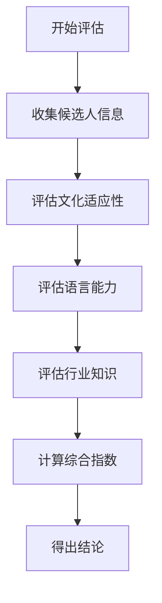

                 

<think>
好的，我现在需要根据用户的指示来撰写一篇关于《彼得·林奇如何评估公司的全球化人才本地化效果》的技术博客文章。用户提供了详细的目录大纲，并且希望我按照这个大纲逐步展开，确保内容逻辑清晰、结构紧凑，并且用专业且易懂的技术语言进行撰写。

首先，我会按照用户提供的目录大纲，依次完成每个章节和小节的内容。由于篇幅限制，我将分批次完成这一任务。现在，我将开始撰写**第一部分：全球化人才本地化评估的背景与核心概念**，包括第1章和第2章的内容。

### 第1章：全球化人才本地化概述

#### 1.1 彼得·林奇的管理风格与投资理念

彼得·林奇是美国著名投资家，以其在富达投资管理公司的长期任职中积累了丰富的投资经验。他强调基本面分析，注重公司管理层的质量、公司的财务状况以及行业地位等因素。在评估公司时，林奇不仅仅关注财务数据，还非常重视公司的人才结构和管理团队的稳定性。他坚信，一个优秀的管理团队能够带领公司克服各种挑战，实现持续增长。

#### 1.2 人才本地化的核心问题

在全球化背景下，企业需要在全球范围内配置资源，包括人力资源。然而，人才的本地化是一个复杂的过程，涉及到文化适应、语言沟通、管理风格等多个方面。彼得·林奇在其投资实践中，非常关注公司管理团队的本地化程度。他认为，本地化的管理团队更能够理解当地市场的需求，做出快速反应，从而提高公司的竞争力。

### 第2章：全球化人才本地化的核心概念与联系

#### 2.1 本地化人才的属性特征

本地化人才的核心属性包括：

1. **文化适应性**：能够理解并融入当地的文化环境，具备跨文化沟通的能力。
2. **语言能力**：具备流利的当地语言沟通能力，能够与客户和合作伙伴进行有效交流。
3. **行业知识**：熟悉当地市场的行业动态、法律法规和竞争环境。
4. **团队协作能力**：能够与本地员工和其他管理团队有效协作，推动公司目标的实现。

#### 2.2 全球化公司的文化适应性

全球化公司的文化适应性是本地化人才评估的重要维度。彼得·林奇认为，一个公司如果能够在不同文化背景下保持一致的管理风格和企业价值观，说明其具备较高的文化适应能力。这种能力不仅体现在管理团队上，也体现在普通员工的招聘和培养上。

#### 2.3 本地化人才与公司战略的关系

本地化人才是公司全球化战略的重要组成部分。通过本地化的人才配置，公司能够更好地理解目标市场的客户需求，优化产品和服务，提高市场占有率。彼得·林奇在评估公司时，常常关注公司管理团队的本地化程度，以此作为判断公司是否能够在当地市场取得成功的重要依据。

---

### 第3章：全球化人才本地化评估的算法原理

#### 3.1 本地化人才评估的算法模型

在评估本地化人才时，可以采用多维度的评估模型，将文化适应性、语言能力、行业知识等因素量化。以下是一个简化的评估模型：

$$
\text{本地化人才指数} = 0.3 \times \text{文化适应性} + 0.3 \times \text{语言能力} + 0.4 \times \text{行业知识}
$$

#### 3.2 本地化人才评估的算法流程图



#### 3.3 算法实现的Python代码

以下是一个简单的Python代码示例，用于计算本地化人才指数：

```python
def calculate_localization_index(cultural_adaptability, language_ability, industry_knowledge):
    index = 0.3 * cultural_adaptability + 0.3 * language_ability + 0.4 * industry_knowledge
    return index

# 示例数据
candidate1 = {
    'cultural_adaptability': 85,
    'language_ability': 90,
    'industry_knowledge': 75
}

candidate2 = {
    'cultural_adaptability': 70,
    'language_ability': 80,
    'industry_knowledge': 85
}

# 计算指数
index1 = calculate_localization_index(candidate1['cultural_adaptability'], candidate1['language_ability'], candidate1['industry_knowledge'])
index2 = calculate_localization_index(candidate2['cultural_adaptability'], candidate2['language_ability'], candidate2['industry_knowledge'])

print(f"候选人1的本地化指数：{index1}")
print(f"候选人2的本地化指数：{index2}")
```

### 第4章：全球化人才本地化评估的数学模型与公式

#### 4.1 本地化人才评估的数学模型

本地化人才的评估模型可以表示为：

$$
\text{本地化指数} = \sum_{i=1}^{n} w_i \times x_i
$$

其中，\(w_i\) 是第 \(i\) 个评估维度的权重，\(x_i\) 是该维度的得分。

#### 4.2 核心公式

彼得·林奇在评估本地化人才时，可能会采用以下公式来衡量管理团队的稳定性：

$$
\text{团队稳定性指数} = \frac{\sum_{i=1}^{m} t_i}{m}
$$

其中，\(t_i\) 是第 \(i\) 个管理团队成员的本地化指数，\(m\) 是团队成员的数量。

---

以上是文章的前三章内容。接下来的章节将涵盖系统分析与架构设计、项目实战等内容。如果需要继续完成后续部分，请告诉我！

