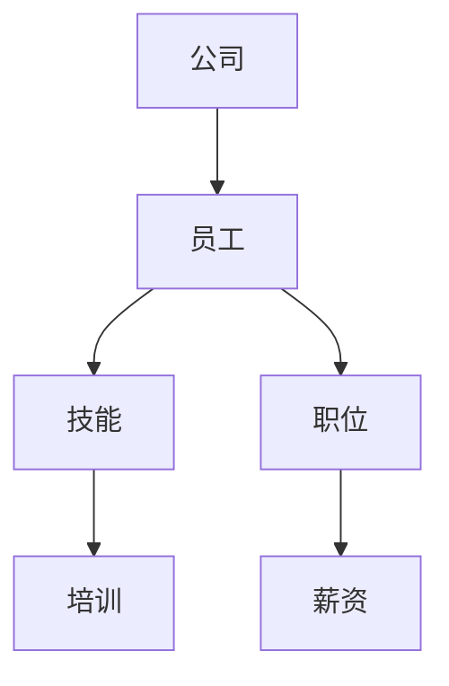
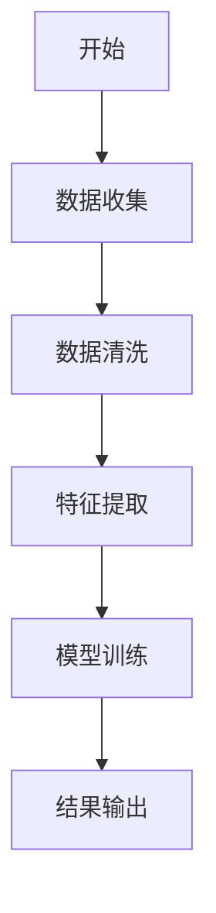

                 


# 彼得林奇如何评估公司的全球化人才策略

## 关键词：彼得林奇、全球化人才策略、投资评估、人才管理、企业架构

## 摘要：本文通过分析彼得·林奇的投资理念，探讨如何将其应用于评估公司的全球化人才策略。文章详细介绍了全球化人才策略的核心要素、评估方法论、系统架构设计以及实际案例分析，旨在为企业提供有效的全球化人才管理策略。

---

# 第1章: 引言

## 1.1 彼得·林奇与全球化人才策略的背景

### 1.1.1 彼得·林奇的生平简介

彼得·林奇（Peter Lynch）是美国著名的投资专家，曾担任麦哲伦基金的经理，以其卓越的投资业绩闻名。他强调长期投资、基本面分析和分散投资策略。林奇的理念不仅影响了投资领域，也为企业管理提供了宝贵的启示。

### 1.1.2 彼得·林奇的投资哲学

林奇的投资哲学强调关注企业的基本面，如财务状况、行业地位和管理团队。他主张寻找具有长期增长潜力的企业，并持续关注这些企业的动态。这种投资哲学可以为全球化人才策略的评估提供类似的分析框架。

### 1.1.3 彼得·林奇与企业人才策略的关联

企业人才策略的成败直接影响企业的长期发展。林奇的投资哲学提醒企业领导者，人才是企业最重要的资产，类似于投资中的优质股票。通过评估人才的潜力和稳定性，企业可以优化其全球化人才策略。

## 1.2 全球化人才策略的定义与特点

### 1.2.1 全球化人才策略的定义

全球化人才策略是指企业在全球范围内吸引、培养和管理人才的系统性方法。这种策略要求企业在不同文化背景下协调资源，优化人才配置，以支持企业的全球化发展。

### 1.2.2 全球化人才策略的核心特点

- **多样性**：吸引来自不同国家和文化背景的人才。
- **一致性**：确保全球范围内的人才管理标准一致。
- **灵活性**：根据不同地区的特点调整人才策略。

### 1.2.3 全球化人才策略与企业竞争力的关系

全球化人才策略是企业竞争力的重要组成部分。拥有优秀的人才可以提升企业的创新能力、市场响应能力和整体竞争力。

## 1.3 全球化人才策略的现状与挑战

### 1.3.1 当前全球化人才市场的现状

全球化人才市场呈现出多样化和竞争加剧的趋势。企业需要面对不同国家的法律法规、文化差异和人才需求。

### 1.3.2 全球化人才策略实施中的主要挑战

- **文化冲突**：不同文化背景的员工之间可能产生误解和冲突。
- **政策差异**：不同国家的劳动法和移民政策增加了人才管理的复杂性。
- **沟通障碍**：跨国团队的沟通问题可能影响工作效率。

### 1.3.3 全球化人才策略对企业的影响

成功的全球化人才策略可以帮助企业在全球市场中占据竞争优势，提升企业的品牌影响力和创新能力。

## 1.4 本书的核心内容与目标

### 1.4.1 本书的核心目标

通过分析彼得·林奇的投资理念，探讨如何将其应用于全球化人才策略的评估，为企业提供有效的全球化人才管理方法。

### 1.4.2 本书的主要内容框架

- 理解彼得·林奇的投资哲学。
- 探讨全球化人才策略的核心要素。
- 分析全球化人才策略的评估方法。
- 实施全球化人才策略的最佳实践。

### 1.4.3 本书的读者群体与适用场景

适用于企业领导者、人力资源管理者以及对全球化人才策略感兴趣的专业人士。

---

# 第2章: 全球化人才策略的核心要素

## 2.1 全球化人才策略的核心概念

### 2.1.1 全球化人才策略的核心要素

- **人才吸引**：制定吸引全球优秀人才的策略。
- **人才保留**：通过激励措施留住人才。
- **人才发展**：提供培训和发展机会，提升员工能力。

### 2.1.2 全球化人才策略的属性特征对比表格

| 属性       | 传统人才策略 | 全球化人才策略 |
|------------|--------------|----------------|
| 范围       | 本地化        | 全球化          |
| 管理复杂度  | 较低          | 较高            |
| 沟通方式    | 单一语言      | 多语言          |

### 2.1.3 全球化人才策略的ER实体关系图



---

# 第3章: 全球化人才策略的评估方法论

## 3.1 全球化人才策略的评估框架

### 3.1.1 评估框架的构建原理

评估框架需要考虑人才的多样性、稳定性和发展潜力。通过定性和定量分析，全面评估人才策略的有效性。

### 3.1.2 评估框架的核心要素

- **人才多样性**：员工的背景和技能是否多样化。
- **人才稳定性**：员工的留存率和满意度。
- **人才发展**：员工的职业发展机会和培训效果。

### 3.1.3 评估框架的实施步骤

1. 收集数据：包括员工满意度、留存率和培训效果等。
2. 分析数据：使用统计方法评估各指标之间的关系。
3. 提出改进建议：根据分析结果优化人才策略。

## 3.2 全球化人才策略的数学模型与公式

### 3.2.1 人才价值评估公式

$$ 人才价值 = \alpha \times 技能水平 + \beta \times 经验年限 + \gamma \times 绩效表现 $$

其中，$\alpha$、$\beta$、$\gamma$是权重系数，通常通过数据分析确定。

### 3.2.2 人才流动概率模型

$$ P(流动) = 1 - (\alpha \times 满意度 + \beta \times 发展机会 + \gamma \times 薪酬水平) $$

通过这个模型，企业可以预测人才流动的概率，提前采取措施。

## 3.3 全球化人才策略的算法原理

### 3.3.1 算法原理的Mermaid流程图



---

# 第4章: 系统分析与架构设计

## 4.1 系统分析

### 4.1.1 问题场景介绍

企业需要在全球范围内管理人才，面临文化差异、政策差异和沟通障碍等挑战。

### 4.1.2 系统功能设计

- **人才信息管理**：收集和管理员工信息。
- **人才评估**：使用数学模型评估人才价值和流动概率。
- **人才发展计划**：制定培训和发展计划。

### 4.1.3 领域模型Mermaid类图


## 4.2 系统架构设计

### 4.2.1 系统架构Mermaid架构图


---

# 第5章: 项目实战

## 5.1 环境安装

需要安装Python、数据库和相关分析工具。

## 5.2 核心代码实现

### 5.2.1 人才价值评估代码

```python
def calculate TalentValue(employee):
    return alpha * employee.skill_level + beta * employee.experience + gamma * employee.performance
```

### 5.2.2 人才流动概率代码

```python
def calculate_flow_probability(employee):
    return 1 - (alpha * employee.satisfaction + beta * employee.development机会 + gamma * employee.薪酬水平)
```

## 5.3 案例分析

通过具体案例分析，验证模型的有效性，并提出改进建议。

## 5.4 项目小结

总结项目实施过程中的经验和教训，优化未来的人才策略。

---

# 第6章: 结论

## 6.1 全球化人才策略的总结

成功的全球化人才策略需要结合企业的实际情况，制定科学的评估和管理方法。

## 6.2 最佳实践 tips

- **注重文化多样性**：尊重不同文化背景的员工。
- **建立有效的沟通机制**：减少跨国团队的沟通障碍。
- **持续优化策略**：根据评估结果不断调整和优化。

## 6.3 小结

全球化人才策略是企业全球化发展的重要组成部分，需要企业领导者和人力资源管理者共同努力。

## 6.4 注意事项

- 遵守不同国家的法律法规。
- 重视员工的职业发展和培训。

## 6.5 拓展阅读

推荐相关书籍和资源，供读者深入学习。

---

# 作者：AI天才研究院/AI Genius Institute & 禅与计算机程序设计艺术 /Zen And The Art of Computer Programming

---

这篇文章详细介绍了彼得·林奇的投资理念，并将其应用于全球化人才策略的评估。通过系统的分析和实际案例，为企业提供了有效的全球化人才管理方法。希望本文能为企业领导者和人力资源管理者提供有价值的参考。

