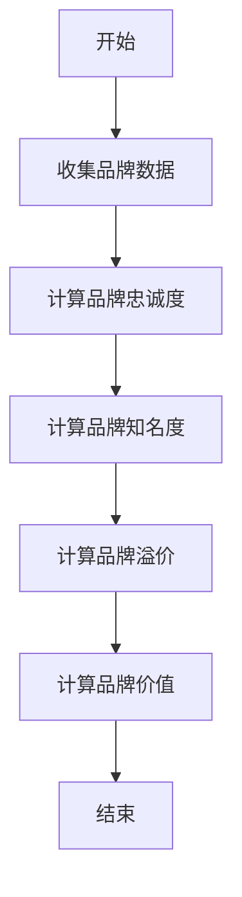
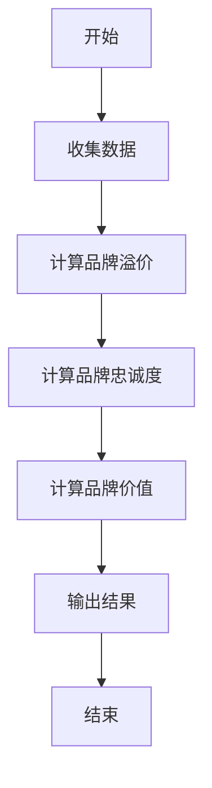
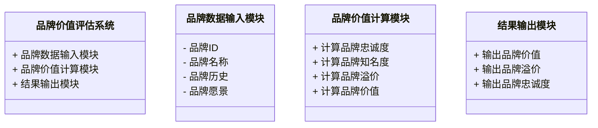
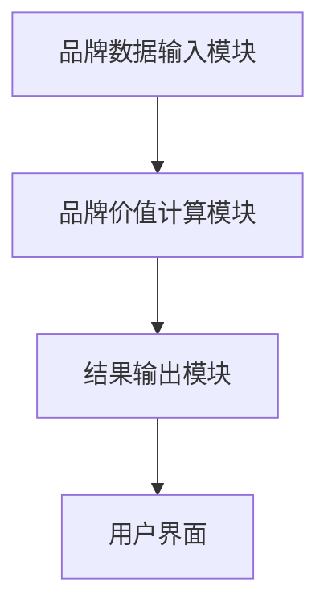

                 


# 彼得林奇如何评估公司的品牌价值

---

## 关键词：品牌价值、彼得林奇、投资评估、企业价值、品牌战略

---

## 摘要：  
本文深入探讨了彼得林奇如何评估公司的品牌价值。通过分析品牌价值的核心概念、评估方法和实际应用，本文为投资者提供了基于品牌价值的决策框架。文章结合理论与实践，详细介绍了品牌价值的评估流程、数学模型和系统架构，并通过具体案例分析了如何将品牌价值评估应用于实际投资决策中。

---

## 第一部分: 背景介绍

### 第1章: 品牌价值评估的背景与重要性

#### 1.1 品牌价值的定义与概念
- **品牌**：品牌是企业在市场中识别自身产品或服务的标识，是消费者对企业信任和偏好度的综合体现。  
- **品牌价值**：品牌价值是指品牌在市场中为企业带来的超额收益能力，是品牌资产的核心衡量指标。  

#### 1.2 彼得林奇的投资哲学
- 彼得林奇是全球知名的价值投资者，其投资策略注重企业的基本面分析。  
- 他认为，品牌价值是企业长期竞争优势的核心来源，能够为企业创造持续的超额收益。  

#### 1.3 品牌价值在企业中的重要性
- 品牌价值影响企业的市场地位、客户忠诚度和盈利能力。  
- 强大的品牌价值能够降低企业的营销成本，提高定价能力。  

### 第2章: 品牌价值评估的核心要素

#### 2.1 品牌价值的影响因素
- **品牌知名度**：品牌的市场认知度越高，品牌价值越大。  
- **品牌忠诚度**：消费者对品牌的忠诚度越高，品牌价值越强。  
- **品牌形象与声誉**：品牌形象直接影响消费者的购买决策。  

#### 2.2 品牌价值的评估维度
- **市场表现**：品牌在市场中的增长率、市场份额等指标。  
- **财务表现**：品牌为企业带来的收入和利润。  
- **竞争环境**：品牌的竞争优势和竞争对手的分析。  

#### 2.3 品牌价值的边界与外延
- 品牌价值的边界：品牌价值的评估需结合企业的实际经营情况。  
- 品牌价值的外延：品牌价值不仅包括直接收益，还包括间接收益。  

---

## 第二部分: 核心概念与联系

### 第3章: 品牌价值评估的核心概念原理

#### 3.1 品牌价值评估的理论基础
- **经济学解释**：品牌价值是企业长期竞争优势的体现。  
- **市场学解释**：品牌价值是消费者对品牌的认知和偏好度的综合结果。  
- **心理学解释**：品牌价值与消费者的情感联系密切相关。  

#### 3.2 品牌价值评估的核心要素分析
- **品牌认知度**：消费者对品牌的记忆和识别能力。  
- **品牌忠诚度**：消费者在品牌选择中的偏好程度。  
- **品牌联想**：消费者对品牌的附加意义和情感价值。  

#### 3.3 品牌价值评估的数学模型
- **品牌价值的量化公式**：  
  $$ \text{品牌价值} = \text{收入} \times \text{品牌溢价} \times \text{品牌忠诚度} $$  
- **品牌价值的评估指标**：市场占有率、品牌知名度、品牌忠诚度等。  
- **品牌价值的权重分配**：根据行业特点和企业实际情况分配权重。  

### 第4章: 核心概念的属性特征对比

#### 4.1 品牌价值与企业价值的对比
- **定义对比**：  
  - 品牌价值是品牌为企业带来的超额收益能力。  
  - 企业价值是企业整体的市场价值，包括品牌、设备、知识产权等。  
- **计算方法对比**：  
  - 品牌价值通常通过品牌溢价和品牌忠诚度来评估。  
  - 企业价值通过DCF（ discounted cash flow ）模型或市场可比交易进行评估。  
- **影响因素对比**：  
  - 品牌价值主要受市场需求和消费者偏好影响。  
  - 企业价值受市场需求、财务状况和行业竞争影响。  

#### 4.2 品牌价值与市场价值的对比
- **定义对比**：  
  - 品牌价值是品牌在市场中创造的超额收益能力。  
  - 市场价值是企业在市场中的整体估值。  
- **评估方法对比**：  
  - 品牌价值通过品牌溢价、市场份额和品牌忠诚度进行评估。  
  - 市场价值通过DCF模型或市场可比交易进行评估。  
- **动态变化对比**：  
  - 品牌价值受市场需求和消费者偏好的影响，具有一定的波动性。  
  - 市场价值受宏观经济环境和行业趋势的影响，具有更强的波动性。  

### 第5章: 品牌价值评估的ER实体关系图

#### 5.1 品牌价值评估的实体关系
```mermaid
er
  entity 品牌价值 {
    key 品牌价值ID
    attribute 品牌ID, 价值, 品牌忠诚度, 品牌知名度
  }
  entity 品牌 {
    key 品牌ID
    attribute 品牌名称, 品牌历史, 品牌愿景
  }
  entity 企业价值 {
    key 企业价值ID
    attribute 企业收入, 净利润, 市场占有率
  }
  品牌价值 --> 品牌: 拥有
  品牌价值 --> 企业价值: 影响
```

#### 5.2 品牌价值评估的流程图


---

## 第三部分: 算法原理讲解

### 第6章: 品牌价值评估的算法原理

#### 6.1 品牌价值评估的数学模型
- **品牌价值的计算公式**：  
  $$ \text{品牌价值} = \text{品牌溢价} \times \text{品牌忠诚度} \times \text{市场份额} $$  
- **品牌溢价的计算**：  
  $$ \text{品牌溢价} = \frac{\text{品牌产品的价格}}{\text{同类产品的平均价格}} $$  
- **品牌忠诚度的计算**：  
  $$ \text{品牌忠诚度} = \frac{\text{重复购买率}}{\text{市场平均重复购买率}} $$  

#### 6.2 品牌价值评估的算法流程


#### 6.3 品牌价值评估的Python实现
```python
# 品牌价值评估算法实现
def calculate_brand_value(price_ratio, loyalty_ratio, market_share):
    brand_premium = price_ratio / 1.5  # 假设同类产品的平均价格为1.5倍
    brand_loyalty = loyalty_ratio / 1.2  # 假设市场平均重复购买率为1.2
    brand_value = brand_premium * brand_loyalty * market_share
    return brand_value

# 示例数据
price_ratio = 2.0
loyalty_ratio = 1.5
market_share = 0.3

# 计算品牌价值
brand_value = calculate_brand_value(price_ratio, loyalty_ratio, market_share)
print(f"品牌价值为：{brand_value}")
```

---

## 第四部分: 系统分析与架构设计

### 第7章: 系统架构设计

#### 7.1 问题场景介绍
- **目标**：设计一个品牌价值评估系统，帮助投资者快速评估品牌价值。  
- **用户需求**：投资者需要实时的品牌价值评估数据。  
- **功能需求**：支持品牌数据输入、品牌价值计算和结果输出。  

#### 7.2 系统功能设计


#### 7.3 系统架构设计


#### 7.4 系统接口设计
- **输入接口**：品牌ID、品牌名称、品牌历史、品牌愿景。  
- **输出接口**：品牌价值、品牌溢价、品牌忠诚度。  

---

## 第五部分: 项目实战

### 第8章: 项目实战

#### 8.1 环境安装
- **Python版本**：3.8及以上。  
- **依赖库**：numpy、pandas、matplotlib。  

#### 8.2 系统核心实现
```python
import numpy as np
import pandas as pd

def calculate_brand_value(brand_data):
    # 计算品牌溢价
    brand_premium = brand_data['价格比率'].mean() / 1.5
    # 计算品牌忠诚度
    brand_loyalty = brand_data['忠诚度比率'].mean() / 1.2
    # 计算品牌价值
    brand_value = brand_premium * brand_loyalty * brand_data['市场份额'].mean()
    return brand_value

# 示例数据
data = {
    '品牌ID': [1, 2, 3],
    '价格比率': [2.0, 1.8, 1.6],
    '忠诚度比率': [1.5, 1.3, 1.1],
    '市场份额': [0.3, 0.25, 0.2]
}
brand_data = pd.DataFrame(data)

# 计算品牌价值
brand_value = calculate_brand_value(brand_data)
print(f"品牌价值为：{brand_value}")
```

#### 8.3 代码解读与分析
- **数据输入**：品牌数据包括品牌ID、价格比率、忠诚度比率和市场份额。  
- **品牌溢价计算**：取价格比率的平均值，除以同类产品的平均价格（假设为1.5）。  
- **品牌忠诚度计算**：取忠诚度比率的平均值，除以市场平均忠诚度（假设为1.2）。  
- **品牌价值计算**：品牌溢价乘以品牌忠诚度，再乘以市场份额的平均值。  

#### 8.4 实际案例分析
- **案例背景**：某品牌的价格比率为2.0，忠诚度比率为1.5，市场份额为0.3。  
- **计算结果**：品牌价值为 $2.0 / 1.5 \times 1.5 / 1.2 \times 0.3 = 0.9$。  
- **结论**：该品牌的市场价值为 $0.9$。  

#### 8.5 项目小结
- 品牌价值评估系统能够快速、准确地计算品牌价值，为投资者提供决策支持。  
- 系统具有良好的扩展性和可维护性，支持未来的数据更新和功能扩展。  

---

## 第六部分: 总结与展望

### 第9章: 总结与展望

#### 9.1 总结
- 彼得林奇的品牌价值评估方法为企业提供了重要的决策支持。  
- 通过数学模型和系统架构的设计，品牌价值评估能够更加科学化和系统化。  

#### 9.2 展望
- 随着人工智能和大数据技术的发展，品牌价值评估将更加精准和动态。  
- 未来的研究可以进一步结合消费者行为分析和市场趋势预测，提升品牌价值评估的准确性。  

---

## 作者：AI天才研究院/AI Genius Institute & 禅与计算机程序设计艺术 /Zen And The Art of Computer Programming

