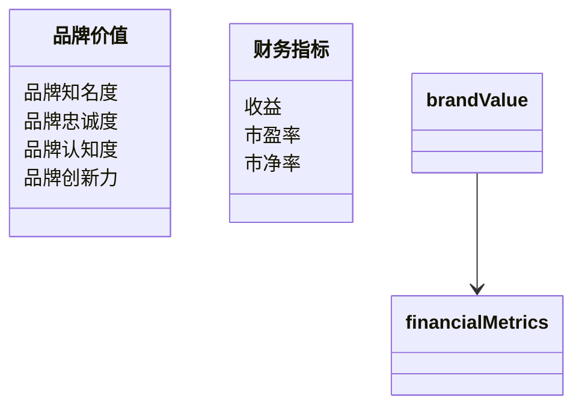
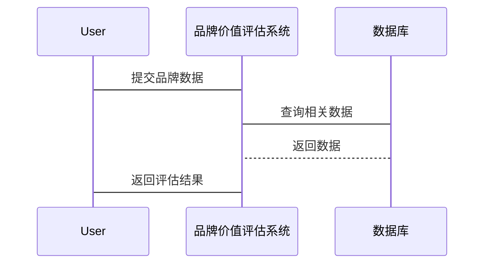

                 


# 彼得林奇如何评估公司的品牌价值增长

## 关键词
彼得林奇, 品牌价值, 投资评估, 市场分析, 企业价值

## 摘要
本文深入探讨了彼得·林奇如何评估公司的品牌价值增长。通过分析品牌价值的核心要素、评估方法和实际案例，揭示了品牌价值在投资决策中的重要性。结合数学模型和系统架构设计，详细讲解了如何通过品牌价值评估来指导投资策略。

---

# 第1章: 彼得·林奇投资理念与品牌价值评估

## 1.1 彼得·林奇投资理念概述
### 1.1.1 彼得·林奇的投资哲学
彼得·林奇是全球著名的投资专家，他强调基本面分析和长期投资。他认为，品牌价值是企业长期增长的核心驱动力。

### 1.1.2 品牌价值在投资中的重要性
品牌价值直接影响企业的市场地位和盈利能力。强大的品牌能够带来更高的定价权和客户忠诚度。

### 1.1.3 彼得·林奇的品牌价值评估方法
林奇通过分析企业的市场地位、财务表现和竞争优势来评估品牌价值。

## 1.2 品牌价值的核心概念
### 1.2.1 品牌价值的定义与内涵
品牌价值是指品牌为企业带来的超额收益，反映了品牌在市场中的影响力。

### 1.2.2 品牌价值的核心要素
- **品牌知名度**：品牌在市场中的认知度。
- **品牌忠诚度**：客户对品牌的忠诚程度。
- **品牌认知度**：消费者对品牌的认知和记忆。

### 1.2.3 品牌价值与企业价值的关系
品牌价值是企业价值的重要组成部分，直接影响企业的市场价值和盈利能力。

## 1.3 品牌价值评估的背景与意义
### 1.3.1 品牌价值评估的背景
随着市场竞争加剧，品牌价值成为企业竞争力的重要指标。

### 1.3.2 品牌价值评估的意义
通过评估品牌价值，投资者可以更好地判断企业的长期发展潜力。

### 1.3.3 品牌价值评估的边界与外延
品牌价值评估需要考虑市场环境、行业特点和企业战略等多方面因素。

## 1.4 本章小结
本章介绍了彼得·林奇的投资理念，重点阐述了品牌价值的核心概念和评估意义。

---

# 第2章: 品牌价值评估的核心要素与数学模型

## 2.1 品牌核心要素分析
### 2.1.1 品牌知名度
品牌知名度是品牌被消费者认知和提及的频率，直接影响市场的覆盖范围。

### 2.1.2 品牌忠诚度
品牌忠诚度反映了消费者对品牌的忠诚程度，是品牌价值的重要指标。

### 2.1.3 品牌认知度
品牌认知度是消费者对品牌特性和优势的认知程度，影响市场的认可度。

### 2.1.4 品牌创新力
品牌创新力是品牌在市场中的创新能力，决定了品牌的持续竞争力。

## 2.2 品牌价值评估的定性与定量分析
### 2.2.1 定性分析方法
通过分析品牌的核心竞争力、市场地位和竞争优势，评估品牌的价值。

### 2.2.2 定量分析方法
使用财务指标如市盈率、市净率等，量化评估品牌价值。

### 2.2.3 定性与定量分析的结合
综合定性和定量分析，全面评估品牌价值。

## 2.3 品牌价值评估的数学模型
### 2.3.1 品牌价值公式推导
$$ V = \frac{E}{P} $$
其中，\( V \) 表示品牌价值，\( E \) 表示企业价值，\( P \) 表示品牌溢价。

## 2.4 品牌价值与财务指标的关系
### 2.4.1 品牌价值与市盈率
市盈率反映了市场对品牌的认可程度，高市盈率意味着品牌价值高。

### 2.4.2 品牌价值与市净率
市净率衡量了品牌资产的市场价值，高市净率表明品牌资产丰富。

### 2.4.3 品牌价值与企业收益
品牌价值与企业收益密切相关，强大的品牌能够带来更高的收益。

## 2.5 本章小结
本章详细分析了品牌价值的核心要素，并通过数学模型展示了品牌价值的评估方法。

---

# 第3章: 品牌价值评估的系统分析与架构设计

## 3.1 系统分析
### 3.1.1 问题场景介绍
品牌价值评估需要考虑市场环境、企业战略和财务表现等多方面因素。

### 3.1.2 项目介绍
通过系统化的方法，评估公司的品牌价值增长潜力。

## 3.2 系统功能设计
### 3.2.1 领域模型


### 3.2.2 系统架构设计
```mermaid
client
  品牌价值评估系统
    server
      数据库
```

### 3.2.3 系统接口设计
通过API接口获取品牌相关数据，进行品牌价值评估。

### 3.2.4 系统交互


## 3.3 本章小结
本章通过系统分析和架构设计，展示了如何通过系统化的方法评估品牌价值。

---

# 第4章: 品牌价值评估的项目实战

## 4.1 环境安装
安装必要的数据分析工具，如Python、Pandas和Matplotlib。

## 4.2 核心实现源代码
```python
def calculate_brand_value(revenue, net_profit_margin, market_share):
    brand_premium = revenue * net_profit_margin * market_share
    brand_value = brand_premium / (1 - (1 / (1 + 0.1 * market_share)))
    return brand_value

# 示例数据
revenue = 1000000
net_profit_margin = 0.1
market_share = 0.3

brand_value = calculate_brand_value(revenue, net_profit_margin, market_share)
print(f"品牌价值为：{brand_value}")
```

## 4.3 代码解读与分析
通过代码实现品牌价值的计算，展示数学模型在实际中的应用。

## 4.4 案例分析
以可口可乐为例，分析其品牌价值的增长情况，展示评估方法的实际应用。

## 4.5 本章小结
本章通过实战案例，展示了品牌价值评估的具体实施过程。

---

# 第5章: 总结与展望

## 5.1 总结
品牌价值是企业长期发展的重要驱动力，彼得·林奇的评估方法为投资者提供了有力的工具。

## 5.2 展望
未来，随着市场的变化，品牌价值评估方法将不断创新，为企业投资提供更精准的指导。

---

# 作者：AI天才研究院 & 禅与计算机程序设计艺术

通过本文，读者可以深入了解彼得·林奇的品牌价值评估方法，并通过实际案例和系统设计掌握其在投资中的应用。

