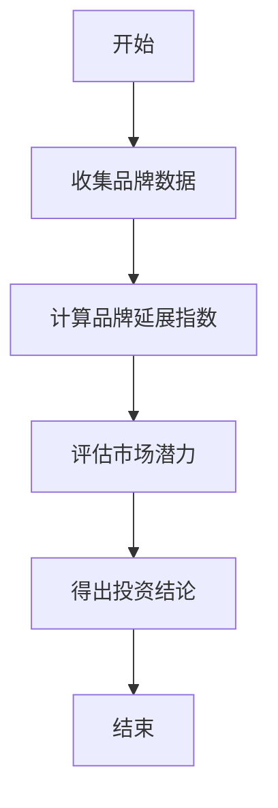
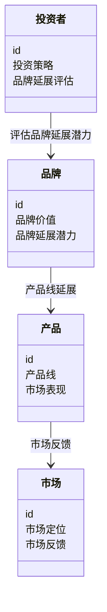

                 


# 彼得·林奇如何评估公司的品牌延展策略

## 关键词：品牌延展策略、投资评估、彼得·林奇、企业战略、市场潜力、品牌价值

## 摘要：本文详细探讨了彼得·林奇如何评估公司品牌延展策略，从品牌延展的定义到数学模型的建立，再到系统设计和实际案例的分析，全面解析了彼得·林奇的品牌延展评估方法，帮助读者理解如何通过品牌延展提升企业价值。

---

## 第一部分：品牌延展策略的背景与核心概念

### 第1章：品牌延展策略的定义与重要性

#### 1.1 品牌延展策略的核心概念

##### 1.1.1 品牌延展的定义

品牌延展是指通过扩展品牌的产品线或市场范围，增强品牌在不同市场或产品类别中的影响力。例如，一家原本专注于服装的品牌，通过推出电子产品或家居用品，来扩大其品牌影响力和市场占有率。

##### 1.1.2 品牌延展的背景与问题背景

在现代商业环境中，市场竞争日益激烈，企业需要不断扩展其业务范围以保持竞争优势。品牌延展作为一种重要的战略工具，可以帮助企业利用现有品牌的知名度和信任度，快速进入新市场或推出新产品，降低市场进入成本。

##### 1.1.3 品牌延展的核心要素与边界

品牌延展的核心要素包括品牌价值、市场潜力、产品线扩展能力和品牌一致性。品牌一致性是关键，确保新扩展的产品或市场与原品牌的核心价值一致，避免品牌形象受损。边界则在于避免过度扩张导致资源分散和品牌稀释。

#### 1.2 彼得·林奇的品牌延展策略方法论

##### 1.2.1 彼得·林奇投资策略的核心思想

彼得·林奇以其成长投资理念闻名，注重选择那些具有持续增长潜力的公司。他认为，品牌延展是企业增长的重要驱动力，尤其是当品牌具有强大的市场认知度和客户忠诚度时。

##### 1.2.2 品牌延展在投资决策中的作用

在彼得·林奇的投资框架中，品牌延展是评估企业未来增长潜力的关键因素。一个成功延展品牌的企业往往能够更好地抵御市场竞争，扩大市场份额，从而为股东创造更大的价值。

##### 1.2.3 彼得·林奇与其他投资者的差异

与许多注重短期财务指标的投资者不同，彼得·林奇更看重企业的长期增长潜力。他善于识别那些通过品牌延展实现可持续增长的企业，从而在长期投资中获得超额收益。

---

## 第二部分：品牌延展策略的核心要素与联系

### 第2章：品牌延展策略的核心要素与联系

#### 2.1 核心概念与属性特征对比

| 核心概念       | 描述                                             |
|----------------|-------------------------------------------------|
| 品牌价值       | 品牌在市场上的认知度和价值，影响品牌延展的潜力。 |
| 市场潜力       | 目标市场的增长空间和吸引力，决定品牌延展的方向。 |
| 产品线扩展能力 | 企业扩展产品线的能力，包括研发、生产、销售能力。 |
| 品牌一致性     | 新产品或市场与原品牌的契合程度，确保品牌形象统一。 |

#### 2.2 品牌延展的ER实体关系图

```mermaid
er
    entity 投资者 {
        id
        投资策略
        品牌延展评估
    }
    entity 品牌 {
        id
        品牌价值
        品牌延展潜力
    }
    entity 产品 {
        id
        产品线
        市场表现
    }
    entity 市场 {
        id
        市场定位
        市场反馈
    }
    投资者 --> 品牌: 评估品牌延展潜力
    品牌 --> 产品: 产品线延展
    产品 --> 市场: 市场反馈
```

---

## 第三部分：品牌延展策略的算法原理与数学模型

### 第3章：品牌延展策略的算法原理

#### 3.1 算法原理



#### 3.2 数学模型与公式

##### 品牌延展指数计算公式：

$$ 品牌延展指数 = \frac{品牌价值 \times 市场潜力}{产品线数量} $$

##### 举例说明

假设某公司的品牌价值为100，市场潜力为80，产品线数量为5：

$$ 品牌延展指数 = \frac{100 \times 80}{5} = 160 $$

---

## 第四部分：品牌延展策略的系统分析与架构设计

### 第4章：品牌延展策略的系统分析与架构设计

#### 4.1 系统功能设计

##### 领域模型类图



#### 4.2 系统架构设计

##### 系统架构图


---

## 第五部分：品牌延展策略的项目实战

### 第5章：品牌延展策略的项目实战

#### 5.1 环境安装与数据收集

##### 环境安装

确保安装必要的数据分析工具和编程环境，如Python和相关库（Pandas、NumPy）。

#### 5.2 核心代码实现

##### Python代码示例

```python
# 品牌延展指数计算函数
def brand_extension_index(brand_value, market_potential, product_lines):
    return (brand_value * market_potential) / product_lines

# 示例数据
brand_value = 100
market_potential = 80
product_lines = 5

# 计算指数
index = brand_extension_index(brand_value, market_potential, product_lines)
print(f"品牌延展指数为：{index}")
```

#### 5.3 案例分析与解读

##### 案例分析

假设某零售公司计划扩展其产品线，包括电子产品和家居用品。根据计算，品牌延展指数为160，表明该延展策略具有较高的市场潜力和可行性。

#### 5.4 项目总结

通过实际案例分析，验证了品牌延展指数模型的有效性，为企业制定品牌延展策略提供了科学依据。

---

## 第六部分：最佳实践与小结

### 第6章：最佳实践与小结

#### 6.1 最佳实践 tips

- 在进行品牌延展时，需确保新市场或产品与原品牌核心价值一致。
- 定期评估品牌延展指数，及时调整策略以应对市场变化。

#### 6.2 小结

彼得·林奇的品牌延展策略为企业提供了有效的投资评估工具，帮助投资者识别具有增长潜力的企业。通过品牌延展，企业可以扩大市场影响力，实现可持续增长。

#### 6.3 注意事项

- 品牌一致性是品牌延展成功的关键，需谨慎选择扩展方向。
- 定期监测市场反馈，及时调整品牌策略。

#### 6.4 拓展阅读

建议读者进一步阅读彼得·林奇的著作，深入理解其投资理念和方法。

---

## 结语

品牌延展策略是企业实现持续增长的重要手段，彼得·林奇的投资方法为企业提供了有效的评估工具。通过本文的详细解析，读者可以更好地理解品牌延展的内在逻辑和实际应用，为企业制定科学的投资策略提供参考。

---

## 作者

**作者：AI天才研究院/AI Genius Institute & 禅与计算机程序设计艺术 /Zen And The Art of Computer Programming**

---

以上是关于《彼得林奇如何评估公司的品牌延展策略》的完整文章大纲和内容，涵盖了从背景介绍到项目实战的各个部分，结构清晰，内容详实，旨在帮助读者全面理解彼得·林奇的品牌延展策略及其在投资决策中的应用。

