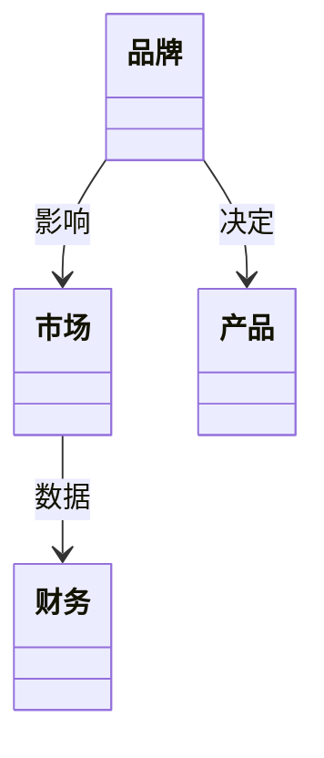
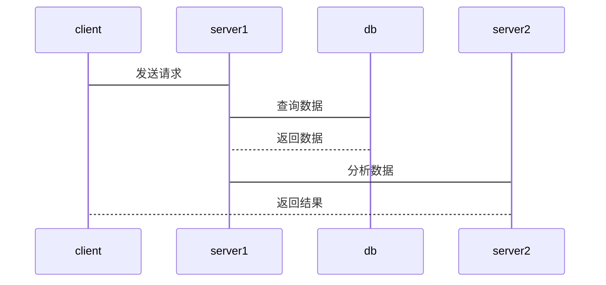

                 


---

# 彼得林奇如何评估公司的品牌扩张策略

> **关键词**：彼得·林奇，品牌扩张，投资策略，市场分析，品牌评估，财务指标  
> **摘要**：本文详细探讨了彼得·林奇在评估公司品牌扩张策略时的方法和思路，从品牌扩张的背景、核心概念、评估模型、系统架构到项目实战，全面解析了品牌扩张的关键因素及其对投资决策的影响。

---

## 第1章 品牌扩张的背景与重要性

### 1.1 品牌扩张的定义与核心要素

#### 1.1.1 品牌扩张的定义
品牌扩张是指企业通过扩展产品线、进入新市场或收购其他品牌等方式，进一步扩大品牌影响力和市场占有率的过程。这一过程通常伴随着品牌的延伸和多元化发展。

#### 1.1.2 品牌扩张的核心要素
1. **品牌定位**：明确品牌在市场中的定位，确定目标客户群体。
2. **市场定位**：分析目标市场的特点，选择适合的品牌扩展方式。
3. **产品定位**：确保新产品或服务与品牌形象一致，满足目标市场需求。

#### 1.1.3 品牌扩张的背景与趋势
随着市场竞争的加剧，品牌扩张已成为企业增长的重要驱动力。通过品牌扩张，企业可以快速进入新市场，提高品牌知名度，增强市场竞争力。

---

### 1.2 品牌扩张的重要性和挑战

#### 1.2.1 品牌扩张的重要性
1. **市场扩展**：通过品牌扩张，企业可以进入新的地理市场或细分市场。
2. **品牌价值提升**：品牌扩张能够增强品牌认知度和客户忠诚度。
3. **增长引擎**：品牌扩张为企业提供了新的收入来源和利润增长点。

#### 1.2.2 品牌扩张的常见挑战
1. **市场风险**：新市场可能存在不确定性和竞争压力。
2. **品牌稀释风险**：过度扩张可能导致品牌形象模糊，影响原有客户群体。
3. **管理复杂性**：跨市场或跨产品的管理需要更高的组织协调能力。

#### 1.2.3 品牌扩张的边界与外延
品牌扩张需要在保持品牌核心价值的基础上，合理扩展产品线或市场范围。核心是平衡创新与稳健，避免偏离品牌初衷。

---

### 1.3 品牌扩张的典型成功案例

#### 1.3.1 国际品牌扩张的成功经验
例如，可口可乐通过全球化战略，成功将品牌扩展到全球市场，成为全球知名的饮料品牌。

#### 1.3.2 国内品牌扩张的成功经验
例如，阿里巴巴通过淘宝、支付宝等多业务线的扩展，成功实现了从电商平台到金融科技的转型。

#### 1.3.3 品牌扩张失败的教训
例如，某些品牌在扩展过程中忽视了市场差异性，导致品牌形象受损，市场表现不佳。

---

## 第2章 品牌扩张策略的核心概念与联系

### 2.1 品牌扩张的核心概念

#### 2.1.1 品牌定位
品牌定位是品牌扩张的核心，决定了品牌在市场中的位置和目标客户群体。

#### 2.1.2 市场定位
市场定位涉及分析目标市场的竞争环境，选择适合品牌扩张的市场和渠道。

#### 2.1.3 产品定位
产品定位确保新产品或服务与品牌形象一致，满足目标市场需求。

---

### 2.2 品牌扩张的核心要素

#### 2.2.1 品牌价值
品牌价值是品牌的核心资产，决定了品牌在市场上的竞争力。

#### 2.2.2 品牌忠诚度
品牌忠诚度反映了客户对品牌的认可和忠诚程度，是品牌扩张的重要保障。

#### 2.2.3 品牌认知度
品牌认知度是品牌在目标市场中的知名度和识别度，直接影响品牌扩张的效果。

---

### 2.3 品牌扩张的核心模型

#### 2.3.1 品牌生命周期模型
品牌生命周期模型帮助企业了解品牌在不同阶段的特点和策略。

#### 2.3.2 品牌扩张模型
品牌扩张模型帮助企业系统地规划和实施品牌扩展策略。

#### 2.3.3 品牌价值评估模型
品牌价值评估模型通过量化指标评估品牌的核心价值和市场潜力。

---

## 第3章 品牌扩张策略的评估模型

### 3.1 品牌扩张评估模型的构建

#### 3.1.1 品牌扩张评估模型的框架
品牌扩张评估模型通常包括市场分析、品牌定位、财务指标等多个维度。

#### 3.1.2 品牌扩张评估模型的指标体系
1. 市场潜力：目标市场的规模、增长潜力和竞争状况。
2. 品牌强度：品牌知名度、品牌忠诚度和品牌美誉度。
3. 财务指标：利润率、投资回报率和成本效益分析。

#### 3.1.3 品牌扩张评估模型的评估流程
1. 确定评估目标和范围。
2. 收集市场数据和品牌信息。
3. 分析和评估关键指标。
4. 得出评估结论并提出建议。

---

### 3.2 品牌扩张评估模型的数学模型

#### 3.2.1 品牌扩张可行性评估公式
$$ \text{可行性评分} = \sum_{i=1}^{n} (w_i \times s_i) $$
其中，\( w_i \) 是指标权重，\( s_i \) 是指标评分。

#### 3.2.2 品牌扩张回报率计算公式
$$ \text{投资回报率} = \frac{\text{净收益}}{\text{投资成本}} \times 100\% $$

---

## 第4章 系统分析与架构设计方案

### 4.1 系统功能设计

#### 4.1.1 领域模型（Mermaid类图）


#### 4.1.2 系统架构设计（Mermaid架构图）
```mermaid
docker
    server1
    server2
    client
    db
    品牌 -> server1: 接收数据
    市场 -> server2: 分析数据
    client --> db: 查询数据
```

#### 4.1.3 系统接口设计
接口设计包括数据输入、处理和输出，确保各模块协同工作。

#### 4.1.4 系统交互流程（Mermaid序列图）


---

## 第5章 项目实战

### 5.1 环境安装与配置

#### 5.1.1 环境要求
- 操作系统：Windows/Linux/MacOS
- 开发工具：Python、Jupyter Notebook
- 数据库：MySQL/PostgreSQL

#### 5.1.2 安装依赖
```bash
pip install numpy pandas matplotlib
```

### 5.2 系统核心实现源代码

#### 5.2.1 品牌扩张评估模型的Python代码实现
```python
import pandas as pd
import numpy as np

# 示例数据
data = {
    '市场潜力': [0.8, 0.6, 0.7],
    '品牌强度': [0.9, 0.5, 0.8],
    '财务指标': [0.7, 0.6, 0.9]
}

df = pd.DataFrame(data)

# 权重分配
weights = {'市场潜力': 0.3, '品牌强度': 0.4, '财务指标': 0.3}

# 计算可行性评分
df['可行性评分'] = df.apply(lambda x: sum(w * x[col] for col, w in weights.items()), axis=1)

print(df)
```

---

### 5.3 实际案例分析与解读

#### 5.3.1 案例背景
假设某品牌计划进入新的市场，需要评估品牌扩张的可行性。

#### 5.3.2 数据分析
使用上述代码计算各市场的可行性评分，选择评分最高的市场进行扩张。

---

## 第6章 最佳实践与小结

### 6.1 投资建议
1. **谨慎评估**：在品牌扩张前，进行充分的市场和财务评估。
2. **风险管理**：制定风险管理策略，降低扩张风险。
3. **持续优化**：根据市场反馈，持续优化品牌策略。

### 6.2 注意事项
- 避免盲目扩张，确保品牌核心价值。
- 注重市场调研，了解目标客户需求。
- 保持灵活性，及时调整扩张策略。

### 6.3 拓展阅读
推荐阅读彼得·林奇的《投资之道》和相关品牌管理书籍，深入理解品牌扩张的策略和方法。

---

## 作者

**作者：AI天才研究院/AI Genius Institute & 禅与计算机程序设计艺术 /Zen And The Art of Computer Programming**

---

希望这篇文章能为您提供有价值的品牌扩张策略评估方法，帮助您在投资决策中做出明智的选择。

