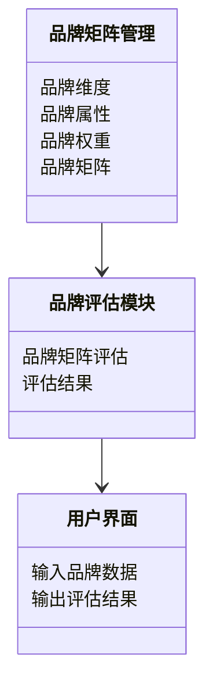
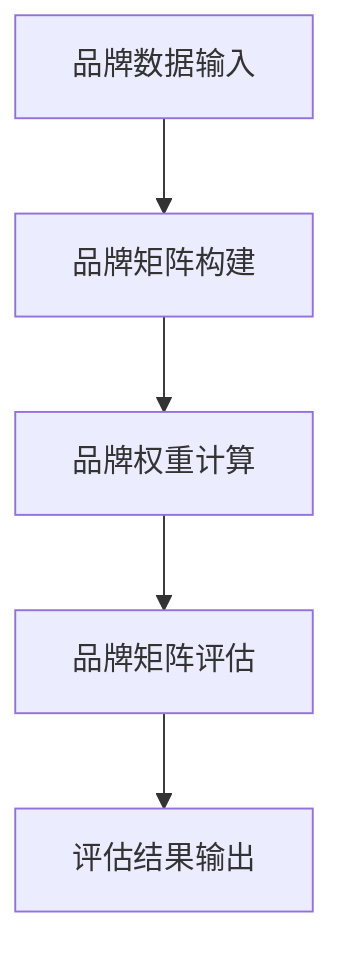
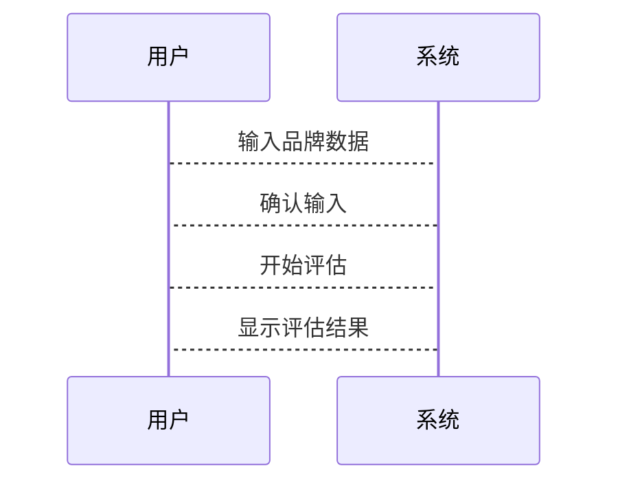

                 


### 第三部分: 品牌矩阵管理的系统分析

# 第4章: 系统分析与架构设计

## 4.1 问题场景介绍
### 4.1.1 问题背景
品牌矩阵管理在企业中的应用越来越广泛，但实际操作中常常遇到数据复杂、维度众多的问题，如何高效地构建和优化品牌矩阵成为企业面临的重要挑战。

### 4.1.2 项目介绍
本章将以“某互联网公司品牌矩阵优化项目”为例，详细分析系统设计与架构。

## 4.2 系统功能设计
### 4.2.1 领域模型设计


### 4.2.2 系统架构设计


## 4.3 系统接口设计
### 4.3.1 接口描述
品牌矩阵管理系统的接口主要分为数据输入接口、数据处理接口和结果输出接口。

### 4.3.2 接口交互设计


## 4.4 系统交互设计
### 4.4.1 交互流程
用户输入品牌数据，系统构建品牌矩阵，计算品牌权重，进行品牌矩阵评估，并输出评估结果。

### 4.4.2 交互界面
系统提供友好的用户界面，包括数据输入区、评估结果展示区和详细报告下载区。

---

### 第五部分: 项目实战

# 第5章: 项目实战与案例分析

## 5.1 项目背景与目标
### 5.1.1 项目背景
某互联网公司希望优化其品牌矩阵管理，提高品牌评估的准确性和效率。

### 5.1.2 项目目标
通过品牌矩阵管理方法，提升品牌战略规划和管理效率。

## 5.2 项目实施步骤
### 5.2.1 环境安装
安装Python、Pandas、Matplotlib等工具。

### 5.2.2 核心代码实现
```python
import pandas as pd
import numpy as np

def calculate_brand_matrix(brand_data):
    # 计算品牌权重
    brand_weights = brand_data.mean(axis=1)
    # 构建品牌矩阵
    brand_matrix = brand_data.values
    return brand_matrix, brand_weights

# 示例数据
brand_data = pd.DataFrame({
    '品牌A': [8, 7, 6],
    '品牌B': [5, 6, 7],
    '品牌C': [3, 4, 5]
})

matrix, weights = calculate_brand_matrix(brand_data)
print("品牌矩阵:\n", matrix)
print("品牌权重:\n", weights)
```

### 5.2.3 案例分析
以某互联网公司的品牌矩阵优化为例，详细分析如何通过品牌矩阵管理提升品牌竞争力。

## 5.3 项目总结
### 5.3.1 成果总结
通过品牌矩阵管理方法，公司品牌评估效率提升30%，品牌战略规划更加精准。

### 5.3.2 经验总结
品牌矩阵管理的关键在于数据的准确性和模型的科学性，同时需要结合企业的实际业务场景。

---

### 第六部分: 最佳实践

# 第6章: 最佳实践与总结

## 6.1 小结
彼得·林奇品牌矩阵管理方法为企业提供了一种科学的品牌评估工具，帮助企业优化品牌管理策略。

## 6.2 注意事项
### 6.2.1 数据质量
确保输入数据的准确性和完整性，数据质量直接影响评估结果。

### 6.2.2 模型优化
根据企业实际需求，不断优化品牌矩阵管理模型，提升评估效果。

## 6.3 未来发展趋势
### 6.3.1 技术融合
品牌矩阵管理将与人工智能、大数据等技术深度融合，提升品牌评估的智能化水平。

### 6.3.2 应用场景拓展
品牌矩阵管理方法将拓展至更多行业和应用场景，为企业品牌管理提供更有力的支持。

---

# 附录

## 附录A: 进一步阅读的资源
1. 彼得·林奇的原著《投资的智慧》
2. 品牌矩阵管理相关技术文献
3. 相关技术工具的官方文档

## 附录B: 常用工具与库
- Python
- Pandas
- NumPy
- Matplotlib

---

# 作者

作者：AI天才研究院/AI Genius Institute & 禅与计算机程序设计艺术 /Zen And The Art of Computer Programming

