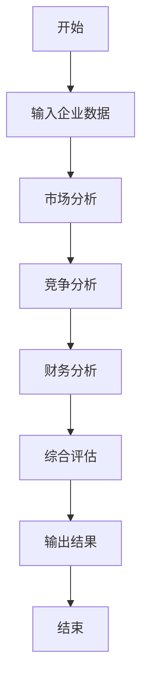
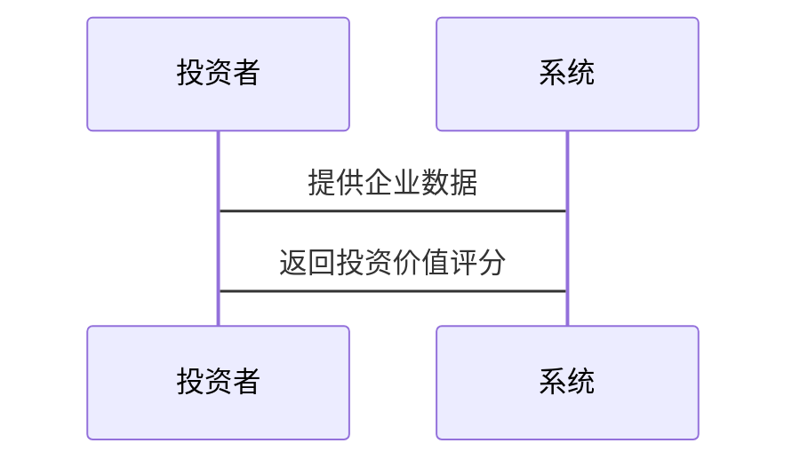

                 


# 彼得林奇如何评估公司的国际化策略

---

## 关键词：
1. 彼得·林奇
2. 国际化策略
3. 投资评估
4. 市场分析
5. 企业战略

---

## 摘要：
本文深入探讨了彼得·林奇如何评估公司的国际化策略。通过分析林奇的投资哲学、评估模型以及实际案例，文章详细阐述了如何从市场定位、竞争优势和财务表现等多维度对国际化策略进行评估。文章结合理论与实践，为读者提供了系统性的评估方法和工具。

---

# 第一部分: 国际化策略的背景与重要性

## 第1章: 国际化策略的背景与重要性

### 1.1 国际化策略的定义与特点
#### 1.1.1 什么是国际化策略
国际化策略是指企业在全球范围内扩展业务，进入新市场，利用全球资源和市场机会，实现增长和利润最大化的战略。它不仅包括产品或服务的出口，还包括在全球范围内建立生产和销售网络。

#### 1.1.2 国际化策略的核心要素
- 市场定位：确定目标市场和客户群体。
- 进入策略：选择进入市场的最佳方式（如直接投资、合资合作、特许经营等）。
- 文化适应：调整产品、营销和服务以适应不同地区的文化和消费者偏好。
- 风险管理：识别和应对全球化带来的政治、经济和市场风险。

#### 1.1.3 国际化策略与本地化策略的区别
国际化策略强调在全球范围内的统一战略，而本地化策略则强调根据不同地区的差异调整产品和服务。

### 1.2 彼得·林奇的投资哲学
#### 1.2.1 彼得·林奇的个人简介
彼得·林奇是美国著名投资经理人，以其在富达投资管理公司的卓越表现而闻名。他强调基本面分析和长期投资，善于发现被低估的股票。

#### 1.2.2 林奇的投资理念与方法
- 价值投资：寻找具有持续增长潜力的公司。
- 市场分析：关注企业的财务健康和管理能力。
- 风险控制：避免过度集中在高风险资产。

#### 1.2.3 林奇对国际化策略的独特见解
林奇认为，国际化是企业扩大规模和增强竞争力的重要途径，但必须谨慎评估市场风险和运营能力。

### 1.3 国际化策略对企业的影响
#### 1.3.1 国际化对企业增长的推动作用
- 扩大市场份额。
- 利用全球资源降低成本。
- 提高品牌知名度。

#### 1.3.2 国际化对企业风险的挑战
- 政治和经济风险。
- 文化差异导致的市场适应问题。
- 管理复杂性和协调成本。

#### 1.3.3 国际化对企业竞争力的提升
- 增强研发能力和创新能力。
- 提高全球供应链管理效率。
- 提升企业的国际化形象和声誉。

### 1.4 本章小结
本章介绍了国际化策略的定义、核心要素及其与本地化策略的区别。同时，阐述了彼得·林奇的投资哲学及其对国际化策略的独特见解。最后，分析了国际化策略对企业增长、风险和竞争力的影响。

---

## 第2章: 国际化策略的核心概念与联系

### 2.1 核心概念原理
#### 2.1.1 市场分析与企业定位
- 市场分析：研究目标市场的市场规模、增长潜力和竞争格局。
- 企业定位：确定企业在目标市场的定位和竞争优势。

#### 2.1.2 竞争分析与竞争优势
- 竞争分析：评估主要竞争对手的优劣势。
- 竞争优势：识别企业在产品、价格、渠道和服务上的独特优势。

#### 2.1.3 财务分析与投资价值
- 财务分析：评估企业的盈利能力、成长性和财务健康状况。
- 投资价值：判断企业在目标市场的长期投资价值。

### 2.2 核心概念对比表格
以下表格对比了国际化策略与本地化策略的核心要素：

| 概念 | 定义 | 特点 | 示例 |
|------|------|------|------|
| 国际化策略 | 全球范围内的业务扩展 | 统一战略，适应性高 | 可口可乐的全球市场策略 |
| 本地化策略 | 地区特定的业务调整 | 高度适应性，本地化强 | 耐克在不同地区的营销策略 |

### 2.3 ER实体关系图
以下是一个简单的ER图，展示了国际化策略的核心要素：

```mermaid
er
  actor(投资者)
  entity(企业)
  entity(市场)
  entity(财务数据)
  entity(竞争优势)
  relation(关联)
  relation(投资决策)
  relation(市场表现)
```

### 2.4 本章小结
本章通过对比分析，阐述了国际化策略的核心概念及其与本地化策略的区别。同时，通过ER图展示了国际化策略的关键要素和它们之间的关系。

---

## 第3章: 国际化策略评估的算法原理

### 3.1 算法原理概述
#### 3.1.1 林奇评估模型的基本原理
林奇评估模型是一种基于基本面分析的投资评估方法，适用于国际化策略的评估。它通过分析企业的财务状况、市场地位和竞争优势，判断其投资价值。

#### 3.1.2 算法的核心步骤
1. 市场分析：确定目标市场的市场规模和增长潜力。
2. 竞争分析：评估主要竞争对手的优劣势。
3. 财务分析：分析企业的盈利能力、成长性和财务健康状况。
4. 综合评估：结合市场、竞争和财务分析，得出企业的投资价值。

#### 3.1.3 算法的输入与输出
- 输入：企业的财务数据、市场信息和竞争数据。
- 输出：企业的投资价值评分和市场表现预测。

### 3.2 算法流程图
以下是一个简化的算法流程图：



### 3.3 算法实现代码
以下是一个简单的Python代码示例，用于实现林奇评估模型的核心步骤：

```python
def analyze_market(market_data):
    # 分析市场数据，返回市场评分
    pass

def analyze_competition(comp_data):
    # 分析竞争数据，返回竞争评分
    pass

def analyze_finance(fin_data):
    # 分析财务数据，返回财务评分
    pass

def lynch_assessment(company_data):
    market_score = analyze_market(company_data['market'])
    competition_score = analyze_competition(company_data['competition'])
    finance_score = analyze_finance(company_data['finance'])
    total_score = (market_score + competition_score + finance_score) / 3
    return total_score

# 示例用法
company_data = {
    'market': '新兴市场',
    'competition': '中等竞争',
    'finance': '良好'
}
result = lynch_assessment(company_data)
print(f'投资价值评分：{result}')
```

### 3.4 本章小结
本章详细介绍了林奇评估模型的算法原理及其实现步骤。通过代码示例，读者可以更好地理解如何将理论应用于实际操作。

---

## 第4章: 国际化策略的系统分析与架构设计

### 4.1 系统分析
#### 4.1.1 问题场景介绍
企业在制定国际化策略时，需要综合考虑市场、竞争和财务等多个方面。

#### 4.1.2 系统功能设计
- 市场分析模块：提供目标市场的详细数据和分析报告。
- 竞争分析模块：评估主要竞争对手的优劣势。
- 财务分析模块：分析企业的财务状况和投资价值。

### 4.2 系统架构设计
以下是一个简化的系统架构图：

```mermaid
graph LR
    A[市场分析模块] --> B[数据输入]
    C[竞争分析模块] --> B
    D[财务分析模块] --> B
    E[综合评估模块] --> B
    F[输出结果] <-- E
```

### 4.3 系统接口设计
- 输入接口：接收企业的财务数据、市场信息和竞争数据。
- 输出接口：输出投资价值评分和市场表现预测。

### 4.4 系统交互序列图
以下是一个简化的系统交互序列图：



### 4.5 本章小结
本章通过系统分析和架构设计，展示了如何将林奇评估模型应用于实际的国际化策略评估中。

---

## 第5章: 国际化策略的项目实战

### 5.1 环境安装
- 安装Python和必要的库（如Pandas、NumPy）。

### 5.2 核心实现源代码
以下是一个完整的Python代码示例：

```python
import pandas as pd
import numpy as np

def analyze_market(market_data):
    # 市场分析
    return pd.DataFrame(market_data).mean()

def analyze_competition(comp_data):
    # 竞争分析
    return pd.DataFrame(comp_data).mean()

def analyze_finance(fin_data):
    # 财务分析
    return pd.DataFrame(fin_data).mean()

def lynch_assessment(company_data):
    # 综合评估
    market_score = analyze_market(company_data['market'])
    competition_score = analyze_competition(company_data['competition'])
    finance_score = analyze_finance(company_data['finance'])
    total_score = (market_score + competition_score + finance_score) / 3
    return total_score

# 示例数据
company_data = {
    'market': {'市场规模': 100, '增长率': 5},
    'competition': {'主要竞争对手': 2, '市场份额': 30},
    'finance': {'净利润率': 15, 'ROE': 20}
}
result = lynch_assessment(company_data)
print(f'投资价值评分：{result}')
```

### 5.3 代码应用解读与分析
- 代码首先导入必要的库。
- 然后定义了市场分析、竞争分析和财务分析的函数。
- 最后，结合分析结果，计算出企业的投资价值评分。

### 5.4 实际案例分析
以某公司为例，展示如何应用林奇评估模型进行国际化策略评估。

### 5.5 本章小结
本章通过实际案例分析和代码实现，帮助读者更好地理解如何将林奇评估模型应用于实际的国际化策略评估中。

---

## 第6章: 总结与展望

### 6.1 本章总结
本文详细介绍了彼得·林奇如何评估公司的国际化策略。通过理论分析和实际案例，展示了如何从市场、竞争和财务等多个维度进行评估。

### 6.2 未来展望
未来，随着全球化的深入发展，国际化策略的评估将更加复杂和多样化。建议进一步研究如何结合大数据和人工智能技术，提高评估的准确性和效率。

---

## 附录

### 附录A: 术语表
- 国际化策略：企业在全球范围内扩展业务的战略。
- 市场分析：研究目标市场的市场规模和增长潜力。
- 竞争分析：评估主要竞争对手的优劣势。

### 附录B: 参考文献
- 彼得·林奇的著作：《彼得·林奇的投资哲学》。
- 其他相关文献：《国际化策略的理论与实践》。

---

## 作者：AI天才研究院 & 禅与计算机程序设计艺术

---

这篇文章详细介绍了彼得·林奇如何评估公司的国际化策略，通过理论分析和实际案例，为读者提供了系统性的评估方法和工具。希望对您有所帮助！

