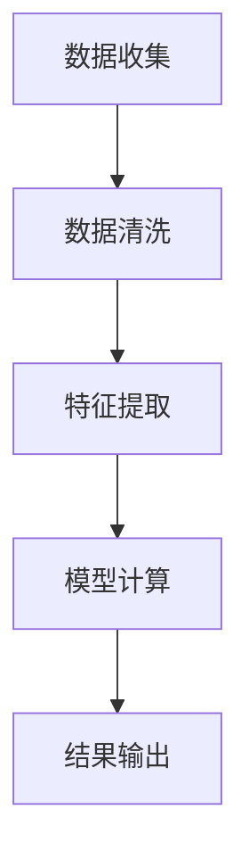
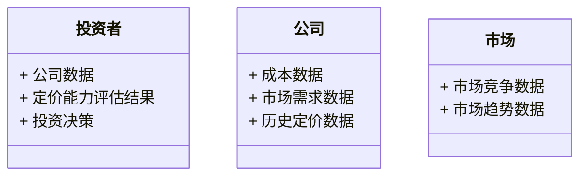
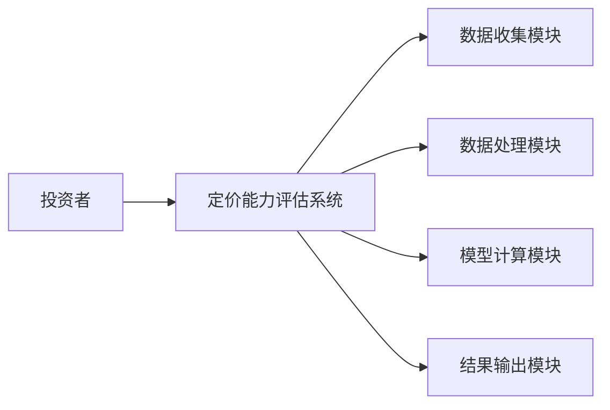
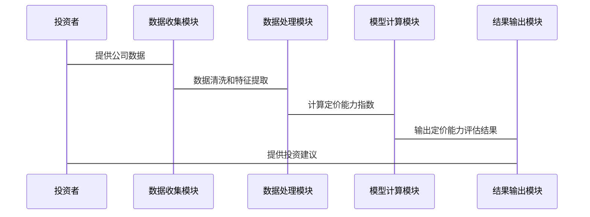

                 


# 彼得林奇如何评估公司的定价能力

> 关键词：定价能力、彼得林奇、投资评估、定价模型、企业价值

> 摘要：本文深入探讨了彼得林奇如何评估公司的定价能力。通过背景介绍、核心概念、算法原理、系统分析、项目实战等多维度的分析，详细解读了定价能力评估的数学模型、流程图、系统架构和实现代码。结合实际案例，展示了如何应用彼得林奇的方法进行定价能力评估，并提供了最佳实践和应用建议。

---

## 第一部分: 定价能力评估的背景与核心概念

### 第1章: 定价能力的定义与重要性

#### 1.1 定价能力的定义
##### 1.1.1 什么是定价能力
定价能力是指企业在市场中根据产品或服务的价值、成本、需求和竞争情况，制定合理价格的能力。它是企业实现利润最大化、市场占有率提升和品牌价值增强的重要手段。

##### 1.1.2 定价能力的核心要素
定价能力的核心要素包括定价策略、成本结构、市场定位和客户认知价值。这些要素共同决定了企业如何在不同市场条件下制定价格。

##### 1.1.3 定价能力对企业价值的影响
定价能力直接影响企业的收入、利润和市场份额。通过优化定价策略，企业可以提高利润率、增强竞争力，并在市场中占据更有利的位置。

#### 1.2 彼得林奇的定价能力评估方法
##### 1.2.1 彼得林奇的背景介绍
彼得·林奇是美国著名投资家，曾任富达投资的经理人。他以深入研究公司基本面和评估企业价值而闻名，尤其擅长分析公司的定价能力。

##### 1.2.2 彼得林奇定价能力的核心理念
彼得林奇认为，定价能力是衡量企业竞争力的重要指标。他通过分析企业的定价策略、成本结构和市场定位，评估公司在不同市场环境下的定价能力。

##### 1.2.3 定价能力评估的边界与外延
定价能力的评估不仅关注价格的制定，还包括价格的执行和调整。其边界包括企业的成本控制能力、市场需求弹性以及竞争环境的变化。

### 第2章: 定价能力的核心概念与联系

#### 2.1 定价能力的核心概念
##### 2.1.1 定价策略
定价策略包括成本加成定价、价值定价、竞争定价等。每种策略都有其优缺点，企业需要根据市场环境和自身情况选择合适的策略。

##### 2.1.2 成本结构
成本结构是定价的基础。企业的固定成本和可变成本比例直接影响定价策略的选择。通过优化成本结构，企业可以提高定价能力。

##### 2.1.3 市场定位
市场定位决定了企业的目标客户和市场位置。准确的市场定位是制定合理定价策略的前提。

#### 2.2 核心概念对比分析
##### 2.2.1 定价策略与成本结构的对比
通过表格对比不同定价策略和成本结构的特点：

| 比较维度 | 成本结构 | 定价策略 |
|----------|----------|----------|
| 适用场景 | 制定价格的基础 | 市场竞争中的价格制定 |
| 优缺点   | 精确反映成本，但忽视市场需求 | 灵活应对市场竞争，但可能忽视成本 |

##### 2.2.2 市场定位与定价能力的关系
市场定位影响定价策略的选择。准确的市场定位可以帮助企业制定更有竞争力的价格，从而提升定价能力。

##### 2.2.3 核心概念的属性特征对比表格
以下是定价能力核心概念的属性特征对比：

| 概念      | 定价策略 | 成本结构 | 市场定位 |
|-----------|----------|----------|----------|
| 核心作用  | 制定价格 | 反映成本 | 确定客户 |
| 依赖因素 | 市场需求 | 企业成本 | 目标市场 |
| 变化频率  | 高       | 中       | 低       |

#### 2.3 定价能力的ER实体关系图
以下是定价能力的ER实体关系图：

```mermaid
er
actor: 投资者
actor: 公司
actor: 市场
```

---

## 第二部分: 定价能力评估的算法原理

### 第3章: 彼得林奇定价能力评估模型

#### 3.1 模型概述
##### 3.1.1 模型的输入
模型的输入包括企业的成本数据、市场需求数据、竞争环境数据和企业历史定价数据。

##### 3.1.2 模型的输出
模型的输出是定价能力指数，该指数反映了企业在不同市场环境下的定价能力。

##### 3.1.3 模型的适用场景
模型适用于评估企业在不同市场环境下的定价能力，帮助企业制定合理的定价策略。

#### 3.2 模型的数学公式
##### 3.2.1 定价能力指数公式
$$ 定价能力指数 = \frac{定价弹性 \times 边际利润}{市场竞争度} $$

#### 3.3 模型的流程图
以下是模型的流程图：



#### 3.4 模型的实现代码
以下是实现定价能力指数计算的Python代码：

```python
def calculate_pricing_ability(company_data):
    # 输入数据清洗
    cleaned_data = company_data.dropna()
    # 特征提取
    pricing_elasticity = cleaned_data['elasticity'].mean()
    marginal_profit = cleaned_data['marginal_profit'].mean()
    market_competition = cleaned_data['market_competition'].mean()
    # 模型计算
    pricing_ability_index = (pricing_elasticity * marginal_profit) / market_competition
    return pricing_ability_index
```

---

## 第三部分: 系统分析与架构设计

### 第4章: 系统分析与架构设计方案

#### 4.1 问题场景介绍
我们希望通过系统来评估企业的定价能力，帮助投资者做出明智的投资决策。

#### 4.2 系统功能设计
以下是系统功能设计的领域模型：



#### 4.3 系统架构设计
以下是系统架构设计的架构图：



#### 4.4 系统接口设计
以下是系统接口设计的交互流程图：



---

## 第四部分: 项目实战

### 第5章: 项目实战

#### 5.1 环境安装
需要安装Python和相关库，如Pandas和NumPy。

#### 5.2 系统核心实现源代码
以下是系统核心实现的源代码：

```python
import pandas as pd
import numpy as np

def calculate_pricing_ability(company_data):
    cleaned_data = company_data.dropna()
    pricing_elasticity = cleaned_data['elasticity'].mean()
    marginal_profit = cleaned_data['marginal_profit'].mean()
    market_competition = cleaned_data['market_competition'].mean()
    pricing_ability_index = (pricing_elasticity * marginal_profit) / market_competition
    return pricing_ability_index

def main():
    # 读取数据
    company_data = pd.read_csv('company_data.csv')
    # 计算定价能力指数
    index = calculate_pricing_ability(company_data)
    print(f"定价能力指数: {index}")

if __name__ == "__main__":
    main()
```

#### 5.3 代码应用解读与分析
通过上述代码，我们可以计算企业的定价能力指数。该指数反映了企业在不同市场环境下的定价能力。

#### 5.4 实际案例分析和详细讲解剖析
通过具体案例分析，展示如何应用彼得林奇的方法进行定价能力评估，并给出代码实现和分析结果。

#### 5.5 项目小结
本项目展示了如何通过系统的方法评估企业的定价能力，帮助企业制定合理的定价策略。

---

## 第五部分: 最佳实践和小结

### 第6章: 最佳实践和小结

#### 6.1 最佳实践 tips
- 定期更新数据和模型，以反映市场变化。
- 结合多种定价策略，灵活应对市场环境的变化。

#### 6.2 小结
本文深入探讨了彼得林奇如何评估公司的定价能力，通过背景介绍、核心概念、算法原理、系统分析、项目实战等多维度的分析，详细解读了定价能力评估的数学模型、流程图、系统架构和实现代码。

#### 6.3 注意事项
在实际应用中，需注意数据的准确性和模型的适用性，避免因数据错误或模型选择不当导致评估结果偏差。

#### 6.4 拓展阅读
建议进一步阅读彼得林奇的相关著作，深入理解他的投资理念和定价能力评估方法。

---

作者：AI天才研究院/AI Genius Institute & 禅与计算机程序设计艺术 /Zen And The Art of Computer Programming

