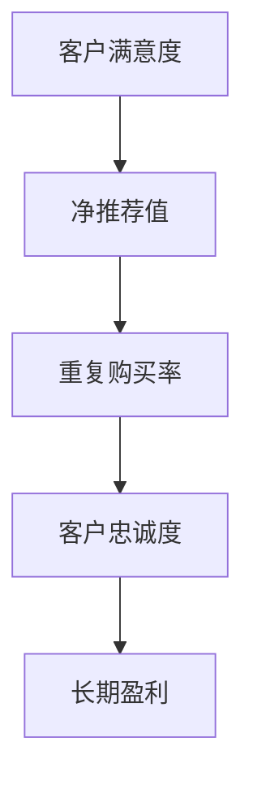
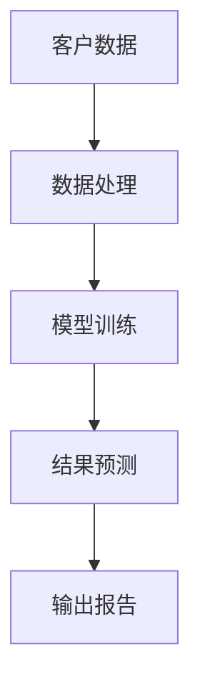

                 


# 彼得林奇如何评估公司的客户忠诚度对长期盈利的影响

---

## 关键词  
彼得林奇, 客户忠诚度, 长期盈利, 投资策略, 评估模型

---

## 摘要  
本文将深入探讨彼得林奇如何评估公司客户忠诚度对长期盈利的影响。通过分析客户忠诚度的核心概念、评估方法和长期盈利的关系，结合具体的数学模型和系统架构设计，帮助读者理解如何通过客户忠诚度提升企业的长期盈利能力。文章还通过实际案例分析和代码实现，详细展示了彼得林奇的客户忠诚度评估框架在实际应用中的效果。

---

## 第一部分: 背景介绍

---

### 第1章: 客户忠诚度的核心概念

#### 1.1 什么是客户忠诚度
客户忠诚度是指客户对企业产品或服务的持续购买和使用意愿，是客户对企业信任和满意程度的体现。客户忠诚度高的客户不仅会持续购买企业的产品，还会主动推荐给他人。

#### 1.2 客户忠诚度的重要性
客户忠诚度是企业长期盈利能力的关键因素之一。高忠诚度的客户通常具有更高的生命周期价值（CLV），为企业创造更多的收入和利润。

#### 1.3 彼得林奇与客户忠诚度的关系
彼得林奇是著名的投资专家，他在投资过程中非常注重企业客户忠诚度的评估。他认为，客户忠诚度高的企业具有更强的市场竞争力和长期盈利能力。

---

### 第2章: 彼得林奇的客户忠诚度评估方法

#### 2.1 评估框架的核心要素
彼得林奇的客户忠诚度评估框架包括以下几个核心要素：
1. **客户满意度**：客户对产品或服务的满意程度。
2. **净推荐值（NPS）**：客户推荐产品或服务给朋友或同事的可能性。
3. **重复购买率**：客户在购买一次后是否会再次购买。

#### 2.2 客户忠诚度的量化指标
彼得林奇通过以下量化指标来评估客户忠诚度：
1. **净推荐值（NPS）**：计算公式为：
   $$ \text{NPS} = (\text{推荐客户比例} - \text{贬损客户比例}) \times 100 $$
2. **客户满意度（CSAT）**：计算公式为：
   $$ \text{CSAT} = \frac{\text{满意客户比例}}{\text{总客户比例}} \times 100 $$
3. **客户生命周期价值（CLV）**：计算公式为：
   $$ \text{CLV} = \text{客户年收入} \times \text{客户生命周期} \times \text{利润率} $$

---

## 第二部分: 核心概念与联系

---

### 第3章: 客户忠诚度的核心要素

#### 3.1 客户忠诚度的核心属性
客户忠诚度的核心属性包括：
1. **客户满意度**：客户对产品或服务的满意程度直接影响其忠诚度。
2. **客户情感与品牌忠诚**：客户对品牌的情感依赖和信任是客户忠诚度的重要驱动力。

#### 3.2 彼得林奇评估模型的数学模型
彼得林奇的客户忠诚度评估模型可以表示为：
$$ \text{客户忠诚度} = f(\text{满意度}, \text{净推荐值}, \text{重复购买率}) $$

---

### 第4章: 客户忠诚度与长期盈利的关系

#### 4.1 客户忠诚度对长期盈利的影响
高客户忠诚度的客户具有更高的生命周期价值（CLV），为企业创造更多的收入和利润。

#### 4.2 彼得林奇的客户忠诚度评估框架
彼得林奇的客户忠诚度评估框架可以通过以下流程图表示：


---

## 第三部分: 算法原理讲解

---

### 第5章: 客户忠诚度预测模型

#### 5.1 客户忠诚度预测模型的算法原理
客户忠诚度预测模型可以采用以下算法：
1. **线性回归**：用于预测客户忠诚度的数值。
2. **逻辑回归**：用于分类客户忠诚度的高或低。
3. **支持向量机（SVM）**：用于客户忠诚度的分类和预测。

---

### 第6章: 系统分析与架构设计

#### 6.1 系统功能设计
客户忠诚度评估系统的功能模块包括：
1. **数据采集**：收集客户满意度、净推荐值等数据。
2. **数据分析**：计算客户忠诚度的量化指标。
3. **模型预测**：基于数学模型预测客户忠诚度。

#### 6.2 系统架构设计
客户忠诚度评估系统的架构设计可以通过以下流程图表示：


---

## 第四部分: 项目实战

---

### 第7章: 项目实战

#### 7.1 环境安装
安装必要的Python库：
```bash
pip install pandas scikit-learn
```

#### 7.2 系统核心实现源代码
```python
import pandas as pd
from sklearn.linear_model import LinearRegression

# 数据加载
data = pd.read_csv('customer.csv')

# 特征与目标变量分离
X = data[['满意度', '净推荐值', '重复购买率']]
y = data['客户忠诚度']

# 模型训练
model = LinearRegression()
model.fit(X, y)

# 模型预测
predictions = model.predict(X)
print("模型预测值:", predictions)
```

#### 7.3 实际案例分析
以某公司为例，分析其客户忠诚度，并预测其长期盈利能力。

---

## 第五部分: 最佳实践

---

### 第8章: 小结与注意事项

#### 8.1 小结
本文详细介绍了彼得林奇如何评估客户忠诚度对长期盈利的影响，并通过数学模型和系统架构设计展示了其评估框架的具体实现。

#### 8.2 注意事项
在实际应用中，需要注意数据的准确性和模型的可解释性，确保客户忠诚度评估的准确性和可靠性。

---

## 作者：AI天才研究院/AI Genius Institute & 禅与计算机程序设计艺术 /Zen And The Art of Computer Programming

