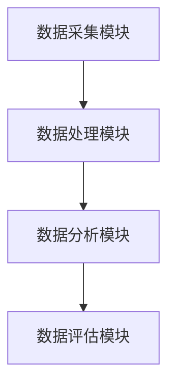

                 


# 彼得林奇如何评估公司的客户数据变现能力

## 关键词：彼得林奇、客户数据、数据变现、投资评估、数据分析、数据价值

## 摘要：本文从彼得·林奇的投资视角出发，详细探讨如何评估客户数据的变现能力，分析数据驱动的经济价值，提供从概念到实践的全面指导，助您掌握数据变现的核心方法。

---

## 第一部分：客户数据变现的背景与概念

### 第1章：客户数据变现的背景与重要性

#### 1.1 客户数据变现的背景

客户数据在当今数字经济中的重要性日益凸显。企业通过收集和分析客户数据，能够洞察消费者行为、优化市场策略，并创造新的收入来源。彼得·林奇，这位著名的投资经理，曾强调数据在投资决策中的关键作用，认为高质量的数据是企业价值的重要组成部分。

#### 1.2 彼得林奇与投资策略

彼得·林奇以其成功的投资策略闻名，他强调基本面分析和对公司前景的深入研究。在数据驱动的决策中，客户数据提供了关键的市场洞察，帮助企业识别高潜力的投资机会和优化运营效率。

#### 1.3 数据变现的经济价值

数据变现不仅限于直接销售数据，还包括通过数据驱动的产品和服务创造价值。企业可以通过分析客户数据，优化定价策略、提升客户体验，并开发新的商业模式。

---

### 第2章：客户数据的核心概念与特征

#### 2.1 客户数据的定义与分类

客户数据是指企业在与客户互动过程中收集的所有信息，包括 demographics、购买行为、偏好等。根据用途，客户数据可以分为结构化数据（如CSV格式）和非结构化数据（如文本评论）。

| 数据类型 | 特征描述 | 示例 |
|----------|----------|------|
| 结构化数据 | 可以用表格形式表示 | 用户ID、购买时间 |
| 非结构化数据 | 文本、图像等形式 | 用户评论、产品图片 |

#### 2.2 数据变现的核心要素

数据变现的关键在于数据的质量和可用性。高质量的数据能够提供准确的市场洞察，从而帮助企业做出明智的商业决策。

| 核心要素 | 描述 |
|----------|------|
| 数据准确性 | 数据反映真实情况 |
| 数据完整性 | 数据包含所有相关信息 |
| 数据可操作性 | 数据能够直接用于决策支持 |

---

## 第二部分：客户数据变现的评估方法与模型

### 第3章：客户数据价值的评估方法

#### 3.1 数据价值的评估维度

评估客户数据价值时，需要考虑以下几个维度：

1. **数据的经济价值**：数据能为企业带来的直接收益。
2. **数据的市场竞争力**：数据在市场上的独特性和稀缺性。
3. **数据的风险评估**：数据的安全性和合规性。

#### 3.2 数据变现的评估模型

客户价值评分模型（CVS）是一种常用的数据评估方法，通过量化客户价值来确定数据的潜在收益。

客户价值评分模型公式：
$$
CVS = \frac{R}{C} \times N
$$

其中：
- \( R \) 是客户的收入贡献
- \( C \) 是获取客户的成本
- \( N \) 是客户数量

---

### 第4章：客户数据变现的系统架构与实现

#### 4.1 系统功能模块

客户数据变现系统通常包括以下几个功能模块：

- 数据采集与处理
- 数据分析与建模
- 数据评估与定价

#### 4.2 系统架构设计

系统架构采用分层设计，各模块协同工作。

mermaid系统架构图：


---

## 第三部分：客户数据变现的项目实战

### 第5章：客户数据变现的实战案例

#### 5.1 项目环境与工具安装

为了进行数据变现分析，需要安装以下工具：

- Python编程语言
- 数据处理库（如Pandas）
- 数据可视化库（如Matplotlib）

安装命令：
```bash
pip install pandas matplotlib
```

#### 5.2 核心代码实现

以下是客户价值评分模型的Python实现示例：

```python
import pandas as pd

# 假设df为包含客户数据的DataFrame
def calculate_cvs(df):
    R = df['收入'].mean()
    C = df['获取成本'].mean()
    N = len(df)
    return (R / C) * N

# 计算CVS
cvs = calculate_cvs(df)
print(f"客户价值评分为：{cvs}")
```

---

### 第6章：最佳实践与投资策略

#### 6.1 投资策略中的数据驱动决策

数据驱动的投资策略有助于识别高潜力的企业。彼得·林奇强调，通过对客户数据的分析，投资者可以更好地评估企业的市场定位和增长潜力。

#### 6.2 数据变现中的风险管理

数据安全和隐私保护是数据变现过程中不可忽视的风险。企业需要确保数据的合规性，并采取适当的安全措施来保护客户数据。

---

## 作者：AI天才研究院/AI Genius Institute & 禅与计算机程序设计艺术 /Zen And The Art of Computer Programming

这篇文章从彼得·林奇的投资视角出发，详细探讨了客户数据的变现能力，提供了从理论到实践的全面指导。通过分析数据的经济价值、评估模型和系统架构，帮助读者掌握数据变现的核心方法，并在实际项目中应用这些知识。希望这篇文章能为企业的数据驱动决策提供有价值的参考。

