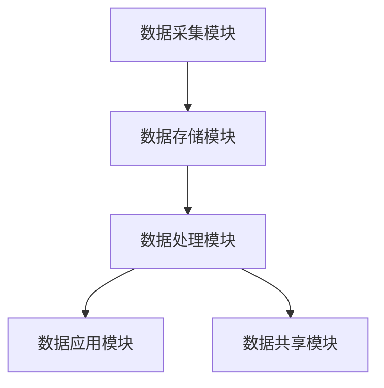
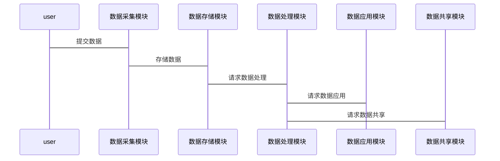

                 


# 彼得林奇如何评估公司的客户数据变现能力与隐私保护平衡

> 关键词：客户数据变现，隐私保护，数据价值评估，彼得·林奇，数据隐私平衡

> 摘要：本文详细探讨了彼得·林奇在评估公司客户数据变现能力与隐私保护平衡方面的策略和方法。通过分析数据价值、隐私保护技术、算法模型以及系统架构，本文提出了实现数据变现与隐私保护平衡的具体步骤和建议。

---

## # 第1章：客户数据变现与隐私保护的背景与挑战

### ## 1.1 客户数据变现的背景与现状

#### ### 1.1.1 数据驱动经济的兴起
在当今数字化时代，数据被视为新的生产资料，客户数据的变现能力成为企业核心竞争力的重要组成部分。企业通过收集和分析客户数据，可以深入了解用户行为、偏好和需求，从而优化产品和服务，提升市场竞争力。数据驱动的经济模式正在改变传统商业模式，数据价值的挖掘成为企业增长的关键驱动力。

#### ### 1.1.2 数字化时代的客户数据价值
客户数据的价值不仅体现在直接销售中，还体现在数据驱动的决策优化和个性化服务上。通过客户数据，企业可以实现精准营销、风险控制和客户关系管理。然而，数据的收集和使用也带来了隐私泄露的风险，这使得隐私保护成为企业必须面对的重要挑战。

#### ### 1.1.3 数据变现的商业模式
数据变现的商业模式主要包括数据销售、数据共享、数据产品和服务等。企业可以通过将数据出售给第三方、提供数据即服务（DaaS）或者开发基于数据的衍生产品来实现数据变现。然而，这些模式往往伴随着隐私风险，如何在数据变现与隐私保护之间找到平衡点，是企业需要解决的关键问题。

### ## 1.2 隐私保护的法律与伦理挑战

#### ### 1.2.1 数据隐私保护的法律框架
近年来，全球范围内关于数据隐私的法律法规不断完善，如欧盟的《通用数据保护条例》（GDPR）和美国的《加州消费者隐私法案》（CCPA）等。这些法律法规对企业如何处理客户数据提出了严格要求，企业必须在合法合规的前提下进行数据收集和使用。

#### ### 1.2.2 隐私保护的伦理困境
隐私保护不仅是一个法律问题，也是一个伦理问题。企业在追求数据变现的同时，必须尊重用户的隐私权，保护用户的个人数据不被滥用。然而，如何在数据利用和隐私保护之间找到平衡点，是一个复杂的伦理挑战。

#### ### 1.2.3 数据泄露的典型案例
近年来，多起数据泄露事件引发了公众对数据隐私的广泛关注。例如，某社交平台的用户数据泄露事件导致数百万用户的个人信息被公开，引发了严重的信任危机。这些案例提醒企业，忽视隐私保护不仅会导致法律风险，还会影响企业的声誉和客户关系。

### ## 1.3 彼得·林奇的评估方法概述

#### ### 1.3.1 投资者视角下的数据价值评估
作为投资者，彼得·林奇关注的是数据的潜在价值和变现能力。他通过分析企业的数据收集能力、数据处理技术、数据应用能力以及数据收益模式，评估企业数据资产的潜力。

#### ### 1.3.2 隐私保护与数据变现的平衡点
彼得·林奇认为，企业在追求数据变现的同时，必须重视隐私保护。他强调，只有在合法合规的前提下，企业才能持续地从数据中获得价值。因此，他建议企业在数据收集和使用过程中，采取严格的隐私保护措施，确保用户数据的安全。

#### ### 1.3.3 评估方法的核心要素
彼得·林奇的评估方法的核心要素包括：数据收集的合法性、数据处理的透明性、数据使用的合规性以及数据收益的可持续性。通过这些要素的评估，企业可以在数据变现和隐私保护之间找到平衡点。

---

## # 第2章：客户数据变现的核心概念与模型

### ## 2.1 数据变现的关键要素

#### ### 2.1.1 数据的生命周期
数据的生命周期包括收集、存储、处理、分析和应用五个阶段。在每个阶段，企业都需要采取相应的措施，确保数据的安全和合规性。

#### ### 2.1.2 数据的分类与价值评估
数据可以根据其敏感性、重要性和可用性进行分类。敏感数据需要更高的保护级别，而低敏感数据可以在合规的前提下进行更广泛的使用。

#### ### 2.1.3 数据的质量与可用性
数据的质量直接影响其价值。高质量的数据可以帮助企业做出更准确的决策，而低质量的数据可能导致错误的结果。因此，企业需要在数据收集和处理过程中，注重数据的清洗和优化。

### ## 2.2 隐私保护的核心概念

#### ### 2.2.1 数据隐私的定义与属性
数据隐私是指个人对自身数据的控制权，包括数据的收集、存储、处理和共享等方面。数据隐私的核心属性包括合法性、透明性和可追溯性。

#### ### 2.2.2 隐私保护的技术手段
隐私保护的技术手段包括数据加密、匿名化处理、访问控制等。这些技术手段可以帮助企业降低数据泄露风险，保护用户隐私。

#### ### 2.2.3 数据隐私与数据利用的平衡
数据隐私与数据利用之间的平衡是隐私保护的核心问题。企业需要在保护隐私的前提下，合理利用数据，实现数据的商业价值。

### ## 2.3 数据变现与隐私保护的关系模型

#### ### 2.3.1 数据价值与隐私风险的权衡
数据价值与隐私风险之间存在权衡关系。高价值的数据往往伴随着较高的隐私风险，因此企业在数据收集和使用过程中需要权衡数据价值与隐私风险。

#### ### 2.3.2 数据利用的边界与限制
数据利用的边界和限制主要取决于法律法规和企业政策。企业需要在法律允许的范围内，合理利用数据，避免触犯隐私保护的红线。

#### ### 2.3.3 数据变现的伦理框架
数据变现的伦理框架要求企业在追求商业利益的同时，尊重用户的隐私权。企业需要通过透明化的数据使用政策和用户同意机制，确保数据的合法合规使用。

---

## # 第3章：客户数据变现的评估模型与算法

### ## 3.1 数据价值评估的数学模型

#### ### 3.1.1 数据价值的量化方法
数据价值的量化方法包括数据的经济价值和数据的潜在价值。经济价值可以通过数据的直接收益来衡量，而潜在价值则需要通过数据的分析结果来评估。

#### ### 3.1.2 数据质量的评分系统
数据质量的评分系统可以根据数据的完整性、准确性、一致性和及时性进行评分。评分系统可以帮助企业识别数据中的问题，优化数据处理流程。

#### ### 3.1.3 数据收益的预测模型
数据收益的预测模型可以通过历史数据和市场趋势，预测数据的未来收益。模型可以基于统计分析或机器学习算法，帮助企业做出更准确的数据收益预测。

#### ### 3.1.4 数据价值评估的数学公式
数据价值的评估公式可以表示为：

$$ \text{数据价值} = \sum_{i=1}^{n} w_i \cdot v_i $$

其中，$w_i$ 是第 $i$ 个数据属性的权重，$v_i$ 是第 $i$ 个数据属性的价值。

### ## 3.2 隐私保护的算法实现

#### ### 3.2.1 数据加密与匿名化技术
数据加密技术包括对称加密和非对称加密，可以保护数据在传输和存储过程中的安全性。匿名化技术通过去除或模糊化数据中的敏感信息，降低数据泄露风险。

#### ### 3.2.2 数据访问控制的实现
数据访问控制可以通过访问控制列表（ACL）和基于角色的访问控制（RBAC）实现。通过严格的访问控制策略，确保只有授权人员可以访问敏感数据。

#### ### 3.2.3 数据共享的安全机制
数据共享的安全机制包括数据脱敏和数据沙盒技术。数据脱敏可以在不泄露真实数据的前提下，提供数据的使用价值；数据沙盒技术可以在隔离的环境中进行数据处理，降低数据泄露风险。

---

## # 第4章：客户数据变现与隐私保护的系统架构设计

### ## 4.1 问题场景介绍
企业需要在数据变现和隐私保护之间找到平衡点，确保数据的合法合规使用，同时最大化数据的商业价值。

### ## 4.2 系统功能设计

#### ### 4.2.1 数据采集模块
数据采集模块负责收集客户数据，包括用户行为数据、交易数据和反馈数据等。数据采集需要遵循隐私保护的法律法规，确保数据收集的合法性。

#### ### 4.2.2 数据存储模块
数据存储模块负责存储收集到的数据。数据存储需要采用安全的技术手段，如加密存储和访问控制，确保数据的安全性。

#### ### 4.2.3 数据处理模块
数据处理模块负责对数据进行清洗、转换和分析。数据处理需要遵循隐私保护的原则，避免泄露用户隐私。

#### ### 4.2.4 数据应用模块
数据应用模块负责将处理后的数据应用于具体业务场景，如精准营销、风险控制和客户画像等。数据应用需要在合法合规的前提下，最大化数据的商业价值。

#### ### 4.2.5 数据共享模块
数据共享模块负责将数据共享给第三方合作伙伴。数据共享需要遵循隐私保护的法律法规，确保数据的合法共享。

### ## 4.3 系统架构设计

#### ### 4.3.1 系统架构图
系统架构图展示了各个模块之间的关系和交互流程。通过架构图，可以清晰地了解系统的整体结构和功能。



#### ### 4.3.2 系统交互序列图
系统交互序列图展示了用户与系统的交互流程。通过序列图，可以了解用户如何与系统进行数据操作和查询。



---

## # 第5章：客户数据变现与隐私保护的项目实战

### ## 5.1 环境安装与配置
为了实现客户数据变现与隐私保护的平衡，企业需要搭建一个安全的数据处理平台。以下是环境安装与配置的步骤：

1. **安装操作系统**：选择一个稳定的操作系统，如Linux或Windows Server。
2. **安装数据库**：选择一个支持数据加密和访问控制的数据库，如MySQL或PostgreSQL。
3. **安装数据处理工具**：安装Python、Jupyter Notebook等工具，用于数据处理和分析。
4. **安装隐私保护技术**：集成数据加密和匿名化处理的工具，如AES加密库和数据脱敏工具。

### ## 5.2 核心代码实现

#### ### 5.2.1 数据加密与解密
```python
# 数据加密
import hashlib

def encrypt_data(data):
    return hashlib.sha256(data.encode()).hexdigest()

# 数据解密
def decrypt_data(encrypted_data):
    # 假设加密算法为SHA-256，此处仅为示例
    return hashlib.sha256(encrypted_data.encode()).hexdigest()
```

#### ### 5.2.2 数据访问控制
```python
# 数据访问控制
def access_control(user_role, data_type):
    if user_role in ['admin', 'moderator']:
        return True
    elif user_role == 'user' and data_type == 'public':
        return True
    else:
        return False
```

#### ### 5.2.3 数据共享模块
```python
# 数据共享模块
def share_data(user_id, data):
    if is Authorized(user_id):
        return anonymize_data(data)
    else:
        return None
```

### ## 5.3 案例分析与项目小结

#### ### 5.3.1 案例分析
以某电商平台为例，企业通过收集用户的行为数据和交易数据，进行精准营销和客户画像。在数据处理过程中，企业采用了数据加密和匿名化处理技术，确保用户隐私的安全。同时，企业通过访问控制策略，限制了数据的访问权限，确保数据的合法使用。

#### ### 5.3.2 项目小结
通过本项目的实施，企业实现了客户数据的高效利用和隐私保护的平衡。数据的商业价值得到了最大化，同时用户隐私得到了有效保护。企业的市场竞争力得到了显著提升。

---

## # 第6章：最佳实践与总结

### ## 6.1 最佳实践 tips
1. **数据收集合法化**：确保数据收集符合相关法律法规，避免触犯隐私保护的红线。
2. **数据处理透明化**：通过透明化的数据处理流程，增强用户对数据使用的信任。
3. **数据使用合规化**：在数据使用过程中，严格遵守隐私保护的法律法规，确保数据的合法合规使用。

### ## 6.2 小结
通过本文的探讨，我们可以看到，客户数据变现与隐私保护的平衡是一个复杂但重要的问题。企业需要在数据利用和隐私保护之间找到平衡点，确保数据的合法合规使用，同时最大化数据的商业价值。

### ## 6.3 注意事项
1. **数据隐私保护的重要性**：企业必须重视数据隐私保护，避免因数据泄露导致的法律风险和信任危机。
2. **数据利用的边界**：企业在数据利用过程中，必须明确数据的使用边界和限制，避免触犯隐私保护的红线。
3. **持续优化与改进**：数据隐私保护是一个动态的过程，企业需要根据法律法规的变化和市场需求，持续优化数据处理和使用策略。

### ## 6.4 拓展阅读
1. 《数据隐私保护的法律框架》
2. 《数据驱动经济的商业模式创新》
3. 《彼得·林奇投资策略的应用与实践》

---

## 作者：AI天才研究院/AI Genius Institute & 禅与计算机程序设计艺术 /Zen And The Art of Computer Programming

