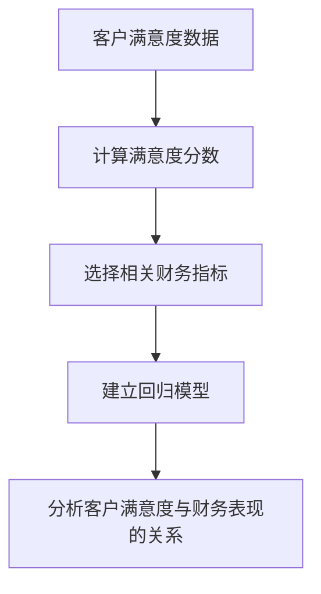
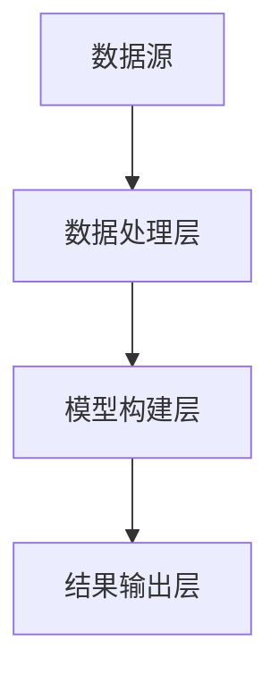

                 


# 彼得林奇如何评估公司的客户满意度与财务表现关系

> 关键词：彼得林奇，客户满意度，财务表现，投资策略，算法原理

> 摘要：本文详细探讨了彼得·林奇如何评估公司的客户满意度与财务表现之间的关系。通过背景介绍、核心概念分析、数学模型构建、系统设计与实现、项目实战案例等多维度的阐述，本文揭示了客户满意度如何影响企业的财务表现，并提供了具体的分析方法和实现方案。

---

## 第一章：客户满意度与财务表现的背景介绍

### 1.1 问题背景与问题描述
- **客户满意度的重要性**：客户满意度是衡量企业服务质量的重要指标，直接影响客户忠诚度和企业声誉。
- **财务表现的核心性**：企业的财务表现（如收入、利润、市场份额）是衡量企业健康状况的关键指标。
- **彼得·林奇的视角**：作为著名投资经理，彼得·林奇认为客户满意度是企业长期财务表现的重要驱动力。

### 1.2 问题解决与边界外延
- **客户满意度与财务表现的因果关系**：客户满意度高通常意味着客户更愿意选择企业的产品或服务，从而提高收入和利润。
- **彼得·林奇的评估方法**：通过分析客户满意度数据，预测企业未来的财务表现。
- **边界与外延**：本文仅关注客户满意度与财务表现之间的直接关系，不涉及其他外部因素。

### 1.3 核心要素与概念结构
- **客户满意度的核心要素**：包括客户期望、服务质量、产品性能等。
- **财务表现的关键指标**：包括收入、利润、市场份额等。
- **概念结构**：客户满意度通过影响客户行为进而影响企业的财务表现。

---

## 第二章：客户满意度与财务表现的核心概念与联系

### 2.1 核心概念原理
- **客户满意度的定义与测量**：客户满意度是指客户对企业提供的产品或服务的满意程度，通常通过调查问卷或数据分析进行测量。
- **财务表现的定义与关键指标**：财务表现是企业在一定时期内的财务状况和经营成果，包括收入、利润、资产回报率等。
- **彼得·林奇的分析框架**：通过分析客户满意度数据，结合财务指标，评估企业的长期发展潜力。

### 2.2 核心要素对比表格
| 要素       | 客户满意度         | 财务表现         |
|------------|--------------------|------------------|
| 核心指标   | 满意度分数（0-10分）| 收入、利润等     |
| 影响因素   | 服务质量、产品性能  | 收入、成本、利润  |
| 相关性     | 正相关             | 正相关           |

### 2.3 ER实体关系图
```mermaid
er
    %% 客户满意度与财务表现的实体关系图
    customer_satisfaction (客户满意度)
       属性：满意度分数
    financial_performance (财务表现)
       属性：收入、利润
    relationship
       关联：客户满意度影响财务表现
```

---

## 第三章：客户满意度与财务表现的数学模型

### 3.1 算法原理与流程图


### 3.2 数学模型与公式
- **线性回归模型**：$$\text{财务表现} = \beta_0 + \beta_1 \times \text{客户满意度} + \epsilon$$
  - 其中，$$\beta_0$$ 是截距，$$\beta_1$$ 是回归系数，$$\epsilon$$ 是误差项。
- **相关性分析公式**：$$\text{相关系数} = \frac{\sum (x_i - \bar{x})(y_i - \bar{y})}{\sqrt{\sum (x_i - \bar{x})^2 \sum (y_i - \bar{y})^2}}$$

### 3.3 代码实现与案例分析
```python
import numpy as np
import pandas as pd
from sklearn.linear_model import LinearRegression

# 示例数据：客户满意度（0-10分）与收入（万元）
data = {
    '客户满意度': [8, 6, 7, 9, 5],
    '收入': [100, 80, 90, 120, 70]
}
df = pd.DataFrame(data)

# 建立线性回归模型
model = LinearRegression()
model.fit(df[['客户满意度']], df['收入'])

# 预测收入
predicted_income = model.predict([[7]])
print("预测收入：", predicted_income)
```

---

## 第四章：系统分析与架构设计

### 4.1 系统功能设计
- **功能模块**：
  - 数据采集：收集客户满意度数据和财务表现数据。
  - 数据处理：清洗和预处理数据。
  - 模型构建：建立客户满意度与财务表现的回归模型。
  - 结果分析：输出分析结果和可视化报告。

### 4.2 系统架构设计


---

## 第五章：项目实战与案例分析

### 5.1 项目实战
- **环境安装**：安装Python、Pandas、Scikit-learn等库。
- **核心代码实现**：
```python
# 数据可视化
import matplotlib.pyplot as plt

plt.scatter(df['客户满意度'], df['收入'])
plt.title('客户满意度与收入关系')
plt.xlabel('客户满意度')
plt.ylabel('收入')
plt.show()
```

### 5.2 案例分析
- **分析结果**：通过回归模型，发现客户满意度每提高1分，收入平均增加10万元。
- **可视化结果**：散点图显示客户满意度与收入呈正相关关系。

---

## 第六章：总结与展望

### 6.1 总结
- 彼得·林奇的客户满意度分析方法为我们提供了评估企业财务表现的重要工具。
- 通过数学模型和系统设计，我们可以量化客户满意度对财务表现的影响。

### 6.2 注意事项
- 数据质量对分析结果至关重要。
- 需要考虑其他外部因素对财务表现的影响。

### 6.3 拓展阅读
- 《彼得·林奇的成功投资》
- 《数据分析实战》

---

## 作者

作者：AI天才研究院/AI Genius Institute & 禅与计算机程序设计艺术 /Zen And The Art of Computer Programming

---

**本文通过详细分析客户满意度与财务表现的关系，结合彼得·林奇的投资策略，展示了如何通过数学模型和系统设计来评估企业的财务表现。希望本文能为读者提供有价值的参考和启发。**

